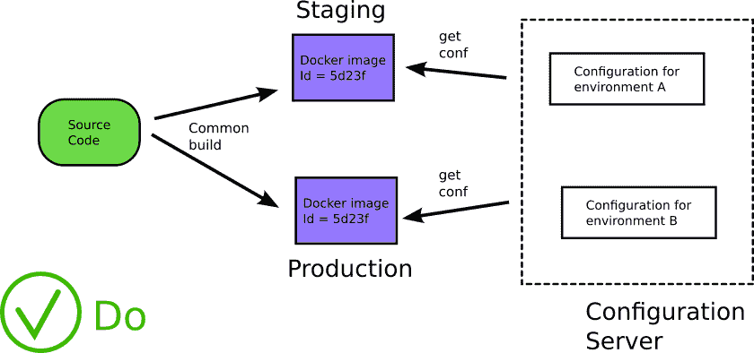
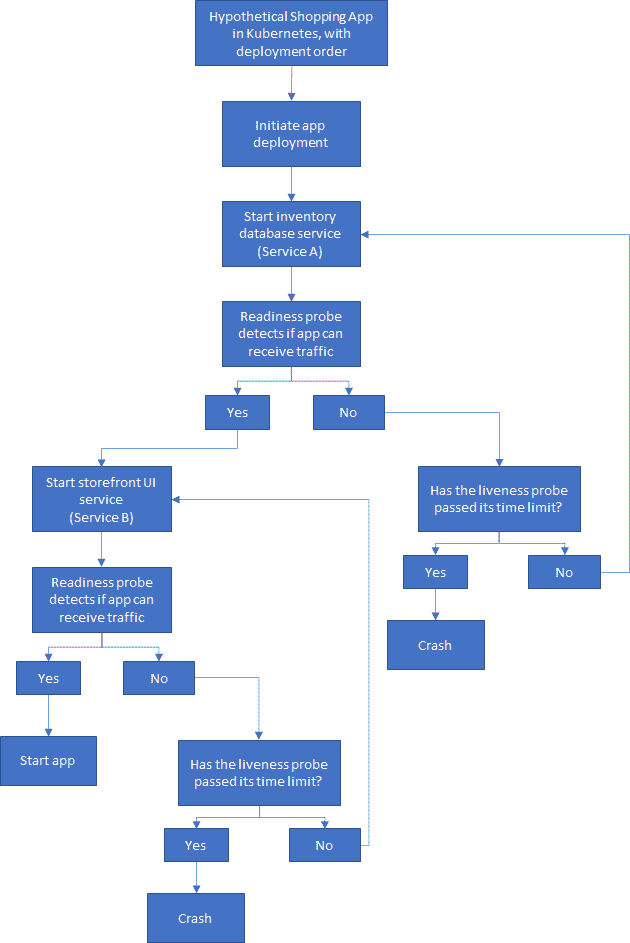
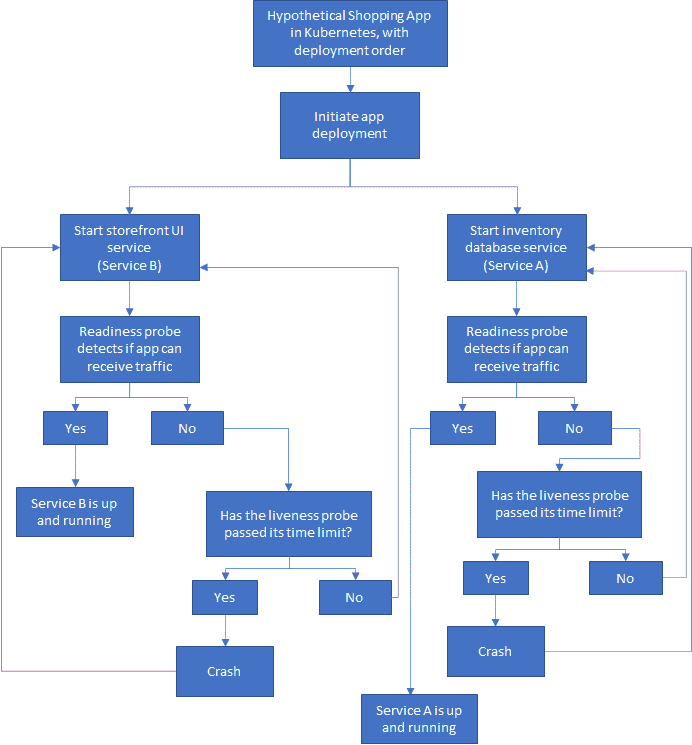
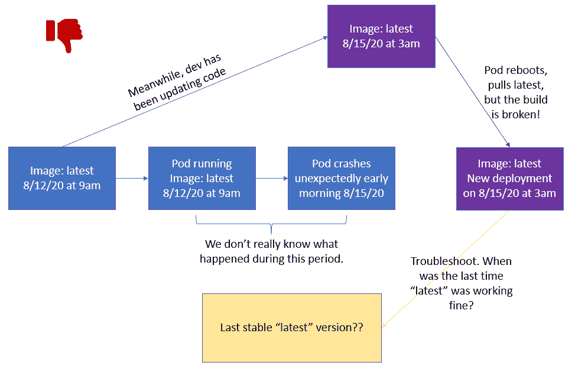
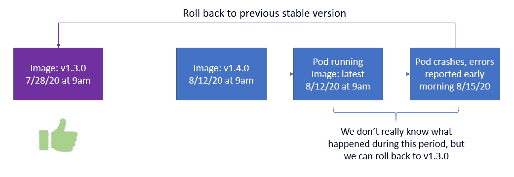
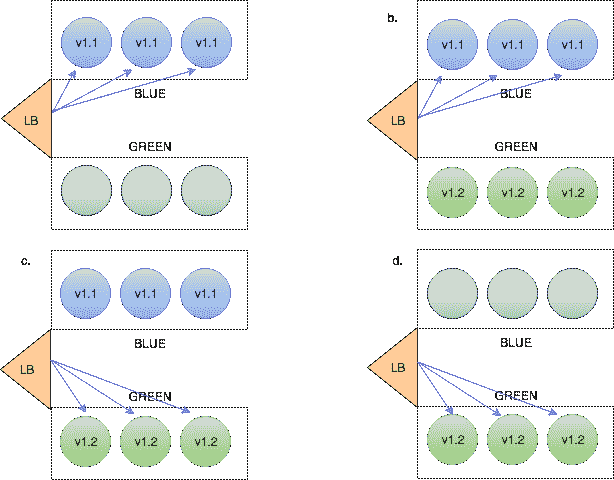

# Kubernetes 部署的 10 个反模式

> 原文：<https://betterprogramming.pub/10-antipatterns-for-kubernetes-deployments-e97ce1199f2d>

## Kubernetes 部署中有更好解决方案的常见实践


乔恩·泰森在 [Unsplash](https://unsplash.com?utm_source=medium&utm_medium=referral) 上的照片

随着容器的采用和使用不断增加， [Kubernetes](https://kubernetes.io/) (K8s)已经成为容器编排的领先平台。这是一个开源项目，有来自超过 315 家公司的数万名贡献者，旨在保持[可扩展性和云无关性](https://kubernetes.io/blog/2019/04/17/the-future-of-cloud-providers-in-kubernetes/)，它是每个主要云提供商的基础。

当您在生产中运行容器时，您希望您的生产环境尽可能稳定和有弹性，以避免灾难(想想每一次在线黑色星期五购物经历)。当一个容器倒下时，另一个容器需要旋转起来取代它的位置，无论是在一天中的什么时候——或者是深夜——都是如此。Kubernetes 提供了一个灵活运行分布式系统的框架，从伸缩到故障转移到负载平衡等等。有许多工具可以与 Kubernetes 集成，以帮助满足您的需求。

最佳实践会随着时间的推移而发展，所以不断研究和试验 Kubernetes 开发的更好方法总是好的。由于它仍然是一项年轻的技术，我们一直在寻求提高我们对它的理解和使用。

在本文中，我们将研究 Kubernetes 部署中的十个常见实践，它们在较高层次上提供了更好的解决方案。我不会深入探讨最佳实践，因为自定义实现可能因用户而异。

1.  将配置文件放在 Docker 映像内部/旁边
2.  不使用头盔或其他类型的模板
3.  以特定的顺序部署事物。(应用程序不应该因为依赖关系没有准备好而崩溃。)
4.  部署没有设置内存和/或 CPU 限制的 pod
5.  将`latest`标签拉进生产中的容器
6.  通过杀死 pod 来部署新的更新/修复，以便它们在重启过程中获取新的 Docker 映像
7.  在同一个群集中混合生产和非生产工作负载。
8.  不使用蓝/绿或金丝雀进行任务关键型部署。(Kubernetes 默认的滚动更新并不总是足够的。)
9.  没有适当的指标来了解部署是否成功。(您的健康检查需要应用程序支持。)
10.  云供应商锁定:将自己锁定在 IaaS 提供商的 Kubernetes 或无服务器计算服务上

# 十个 Kubernetes 反模式

## **1。将配置文件放在 Docker 映像内/旁边**

这个 Kubernetes 反模式与 Docker 反模式相关(参见本文[中的反模式 5 和 8)。容器为开发人员提供了一种在整个软件生命周期(从开发/质量保证到生产)中使用单一映像的方式，主要是在生产环境中。](https://codefresh.io/containers/docker-anti-patterns/)

然而，一种常见的做法是为生命周期中的每个阶段提供自己的映像，每个阶段都用特定于其环境的不同工件构建(QA、staging 或 production)。但是现在你不再部署你测试过的东西了。


【https://codefresh.io/containers/docker-anti-patterns/*)*

这里的最佳实践是在 [ConfigMaps](https://kubernetes.io/docs/tasks/configure-pod-container/configure-pod-configmap/) 中外部化通用配置，而敏感信息(如 API 密钥和秘密)可以存储在 secrets 资源中(它具有 Base64 编码，但在其他方面与 ConfigMaps 相同)。配置映射可以作为卷挂载[或者作为](https://kubernetes.io/docs/tasks/configure-pod-container/configure-pod-configmap/)[环境变量](https://kubernetes.io/docs/tasks/configure-pod-container/configure-pod-configmap/)传入，但是[机密](https://kubernetes.io/docs/tasks/configure-pod-container/configure-pod-configmap/)应该作为卷挂载。我提到 ConfigMaps 和 Secrets 是因为它们是原生的 Kubernetes 资源，不需要集成，但是它们可能有局限性。还有其他可用的解决方案，比如针对配置地图的 HashiCorp 的[动物园管理员](https://zookeeper.apache.org/)和 [Consul，或者针对秘密的 hashi corp](https://www.consul.io/)[键盘手](https://square.github.io/keywhiz/)[知己](https://lyft.github.io/confidant/)的 [Vault 等，可能更符合您的需求。](https://www.vaultproject.io/)

当您将配置从应用程序中分离出来后，当您需要更新配置时，您不再需要重新编译应用程序，它可以在应用程序运行时更新。您的应用程序在运行时而不是在构建时获取配置。更重要的是，您在软件生命周期的所有阶段都使用相同的源代码。



*运行时的负载配置(从*[*【https://codefresh.io/containers/docker-anti-patterns/】*](https://codefresh.io/containers/docker-anti-patterns/)*)*

## **2。不使用头盔或其他类型的模板**

您可以通过直接[更新 YAML](https://stackoverflow.com/questions/48191853/how-to-update-a-deployment-via-editing-yml-file) 来管理 Kubernetes 部署。推出新版本的代码时，您可能需要更新以下一项或多项内容:

*   Docker 图像名称
*   Docker 图像标签
*   副本数量
*   服务标签
*   分离舱
*   配置图等

如果您管理多个集群并在开发、试运行和生产环境中应用相同的更新，这可能会变得很乏味。您基本上是在修改所有部署中的相同文件，只做了微小的修改。这需要大量的复制和粘贴，或者搜索和替换，同时还要了解您的部署 YAML 所针对的环境。在这个过程中有很多出错的机会:

*   错别字(错误的版本号，拼写错误的图像名称等。)
*   用错误的更新修改 YAML(例如，连接到错误的数据库)
*   缺少要更新的资源等。

在 YAML，您可能需要改变许多事情，如果您没有密切关注，一个 YAML 很容易被误认为另一个部署的 YAML。

[模板](https://codefresh.io/docs/docs/deploy-to-kubernetes/kubernetes-templating/)有助于简化 Kubernetes 应用程序的安装和管理。由于 Kubernetes 没有提供本地模板机制，我们不得不在别处寻找这种类型的管理。

[赫尔姆](https://helm.sh/)是第一个可用的包经理(2015)。它被宣称为“Kubernetes 的自制程序”,并发展到包括模板功能。Helm 通过 [*图表*](https://v2.helm.sh/docs/developing_charts/) 打包其资源，其中图表是描述一组相关 Kubernetes 资源的文件集合。在[图表库](https://hub.helm.sh/)(你也可以使用`[helm search hub](https://helm.sh/docs/helm/helm_search_hub/) [keyword] [flags]`)中有 1400 多个公开可用的图表，基本上是可重复使用的在 Kubernetes 上安装、升级和卸载的方法。使用 Helm charts，您可以修改`[values.yaml](https://helm.sh/docs/chart_template_guide/values_files/)`文件来设置您的 Kubernetes 部署所需的修改，并且您可以为每个环境拥有不同的 Helm charts。因此，如果您有一个 QA、试运行和生产环境，您只需管理三个掌舵图，而不必修改每个环境中每个部署中的每个 YAML。

Helm 的另一个优势是，如果出现以下问题，使用 [Helm rollbacks](https://helm.sh/docs/helm/helm_rollback/) 可以轻松回滚到之前的版本:

`helm rollback <RELEASE> [REVISION] [flags]`。

如果您想回滚到前一版本，可以使用:

`helm rollback <RELEASE> 0`。

所以我们会看到这样的情况:

```
$ helm upgrade — install — wait — timeout 20 demo demo/
$ helm upgrade — install — wait — timeout 20 — set
readinessPath=/fail demo demo/
$ helm rollback — wait — timeout 20 demo 1Rollback was a success.
```

掌舵图表的历史很好地记录了这一点:

```
$ helm history demo
REVISION STATUS DESCRIPTION
1 SUPERSEDED Install complete
2 SUPERSEDED Upgrade “demo” failed: timed out waiting for the condition
3 DEPLOYED Rollback to 1
```

谷歌的 [Kustomize](https://kustomize.io/) 是一个受欢迎的选择，除了头盔之外还可以[使用。](https://helm.sh/docs/topics/advanced/)

## **3。按特定顺序部署物品**

应用程序不应该因为依赖关系没有准备好而崩溃。在传统开发中，启动应用程序时，启动和停止任务有特定的顺序。重要的是不要将这种思维模式带入容器编排。与 Kubernetes，Docker 等。，这些组件同时启动，因此无法定义启动顺序。即使当应用程序启动并运行时，它的依赖项也可能失败或被迁移，从而导致进一步的问题。Kubernetes 的现实也充满了无数潜在的通信失败点，依赖关系无法达到，在此期间，pod 可能会崩溃或服务可能变得不可用。网络延迟就像微弱的信号或中断的网络连接一样，是通信失败的常见原因。

为了简单起见，让我们检查一个假设的购物应用程序，它有两个服务:一个库存数据库和一个店面 UI。在应用程序启动之前，后端服务必须启动，通过所有检查，并开始运行。然后前端服务可以启动，满足它的检查，并开始运行。

假设我们用`[kubectl wait](https://kubernetes.io/docs/reference/generated/kubectl/kubectl-commands)` 命令强制部署顺序，类似于:

`kubectl wait — for=condition=Ready pod/serviceA`

但是当条件从未满足时，下一次部署无法进行，流程中断。

这是一个简单的部署订单流程:



*只有前一步完成后，该流程才能继续进行*

既然 Kubernetes 是[自愈](https://kubernetes.io/docs/concepts/workloads/pods/pod-lifecycle/#restart-policy)。标准方法是让应用程序中的所有服务同时启动，让容器崩溃并重启，直到它们都启动并运行。我让服务 A 和 B 独立启动(正如一个解耦的、无状态的云原生应用程序应该做的那样)，但是为了用户体验，也许我可以告诉 UI(服务 B)显示一个漂亮的加载消息，直到服务 A 准备好，但是服务 B 的实际启动不应该受到服务 A 的影响。



现在，当 pod 崩溃时，Kubernetes 会重新启动服务，直到一切正常运行。如果您陷入了 CrashLoopBackOff，那么有必要检查一下您的代码、配置或资源争用情况。

当然，我们需要做的不仅仅是简单地依靠自我修复。我们需要实现能够处理失败的解决方案，失败是不可避免的，也是会发生的。我们应该预见到它们会发生，并制定框架以帮助我们避免停机和/或数据丢失。

在我假设的购物应用程序中，为了给用户完整的体验，我的店面 UI(服务 B)需要库存(服务 A)。因此，当出现部分故障时，比如服务 A 短时间不可用或崩溃等。，系统应该仍然能够从问题中恢复。

像这样的瞬时故障是一直存在的可能性，所以为了最小化它们的影响，我们可以实现一个[重试模式](https://docs.microsoft.com/en-us/azure/architecture/patterns/retry)。重试模式通过以下策略帮助提高应用程序的稳定性:

*   **取消
    无效的凭证不应该工作！**
*   **重试** 如果故障异常或罕见，则可能是由于异常情况(如网络数据包损坏)。应用程序应该立即重试请求，因为同样的失败不太可能再次发生。
*   **延迟后重试** 如果故障是由连通性或繁忙故障等常见情况引起的，最好在重试之前清除任何积压的工作或流量。应用程序应该在重试请求之前等待。
*   您还可以使用[指数补偿](https://docs.microsoft.com/en-us/dotnet/architecture/microservices/implement-resilient-applications/implement-retries-exponential-backoff)来实现您的重试模式(指数增加等待时间并设置最大重试次数)。

在创建弹性微服务应用时，实现[断路模式](https://istio.io/latest/docs/tasks/traffic-management/circuit-breaking/)也是一个重要策略。就像您家中的断路器如何自动切换以保护您免受过大电流或短路造成的大范围损坏一样，断路模式为您提供了一种编写应用程序的方法，同时限制了可能需要更长时间才能修复的意外故障的影响，如部分连接丢失或服务完全失败。在这些重试不起作用的情况下，应用程序应该能够接受失败已经发生并做出相应的响应。

## **4。部署没有设置内存和/或 CPU 限制的 pod**

资源分配因服务而异，如果不测试实现，很难预测容器可能需要哪些资源来获得最佳性能。一个服务可能需要固定的 CPU 和内存消耗配置文件，而另一个服务的消耗配置文件可能是动态的。

当您在没有仔细考虑内存和 CPU 限制的情况下部署 pod 时，这可能会导致资源争用和环境不稳定的情况。如果容器没有内存或 CPU 限制，那么调度程序会将其内存利用率(和 CPU 利用率)视为零，因此可以在任何节点上调度无限数量的 pod。这可能导致资源的过量使用，并可能导致节点和 kubelet 崩溃。

当没有为容器指定内存限制时，有几种情况适用(这些也适用于 CPU):

1.  容器可以使用的内存量没有上限。因此，容器可以使用其节点上的所有可用内存，可能会调用 OOM(内存不足)黑仔。对于没有资源限制的容器来说，OOM 杀死情况更有可能发生。
2.  命名空间(容器在其中运行)的默认内存限制被分配给容器。集群管理员可以使用 [LimitRange](https://kubernetes.io/docs/reference/generated/kubernetes-api/v1.18/#limitrange-v1-core) 来指定内存限制的默认值。

为集群中的容器声明内存和 CPU 限制允许您有效地利用集群节点上的可用资源。这有助于 kube-scheduler 确定 pod 应该驻留在哪个节点上，以便最有效地利用硬件。

为容器设置内存和 CPU 限制时，应该注意不要请求超过限制的资源。对于具有多个容器的单元，资源请求总数不得超过设置的限制，否则，单元将永远不会被调度。


*资源请求不得超过限制*

将内存和 CPU 请求设置为低于其限制可以实现两件事:

1.  pod 可以利用可用的内存/CPU，从而导致突发活动。
2.  在突发期间，pod 被限制在合理的内存/CPU 数量。

最佳实践是将 CPU 请求保持在一个内核或以下，然后使用 [ReplicaSets](https://kubernetes.io/docs/concepts/workloads/controllers/replicaset/) 将其扩展，这为系统提供了灵活性和可靠性。

在同一个集群中部署容器时，如果不同的团队竞争资源，会发生什么情况？如果进程超过内存限制，那么它将被终止，而如果它超过 CPU 限制，那么进程将被节流(导致更差的性能)。

您可以通过[名称空间](https://kubernetes.io/docs/concepts/overview/working-with-objects/namespaces/)设置中的[资源配额](https://kubernetes.io/docs/concepts/policy/resource-quotas/)和[限制范围](https://kubernetes.io/docs/concepts/policy/limit-range/)来控制资源限制。这些设置有助于解决没有限制或具有高资源请求的容器部署。

设置硬性资源限制可能不是满足您需求的最佳选择。另一个选项是使用[垂直窗格自动缩放器](https://cloud.google.com/kubernetes-engine/docs/concepts/verticalpodautoscaler)资源中的推荐模式。

## **5。生产中拉动容器中的'** `**latest'**` **标签**

[使用](https://kubernetes.io/docs/concepts/containers/images/#image-names) `[latest](https://kubernetes.io/docs/concepts/containers/images/#image-names)` [标签](https://kubernetes.io/docs/concepts/containers/images/#image-names)被认为是不好的做法，尤其是在生产中。豆荚因为各种原因意外崩溃，所以随时可以拉下图像。不幸的是，在确定构建何时崩溃时，`latest` 标签不是非常具有描述性。运行的是哪个版本的映像？它最后一次工作是什么时候？这在生产中尤其糟糕，因为您需要能够在最短的停机时间内恢复正常运行。



*你不应该在生产中使用* `*latest*` *标签。*

默认情况下，`[imagePullPolicy](https://kubernetes.io/docs/concepts/containers/images/)`设置为`Always`，重启时会一直下拉图像。如果不指定标签，Kubernetes 将默认为`latest`。但是，只有在崩溃的情况下(当 pod 在重启时拉下映像时)或者如果部署 pod 的模板(`.spec.template`)被[更改](https://kubernetes.io/docs/concepts/workloads/controllers/deployment/#updating-a-deployment)，部署才会被更新。参见[本论坛讨论](https://discuss.kubernetes.io/t/use-latest-image-tag-to-update-a-deployment/2929)中`latest`在开发中未按预期工作的示例。

即使您已经将`imagePullPolicy`更改为不同于`Always`的另一个值，如果需要重启(无论是因为崩溃还是故意重启)，您的 pod 仍会提取图像。如果您使用版本控制并用一个有意义的标签来设置`imagePullPolicy`，比如 v1.4.0，那么您可以[回滚到最近的稳定版本](https://kubernetes.io/docs/concepts/workloads/controllers/deployment/#rolling-back-to-a-previous-revision),并且更容易地在代码出错的时间和位置进行故障诊断。你可以在[语义版本化规范](https://semver.org/)和 [GCP 最佳实践](https://semver.org/)中阅读更多关于版本化的最佳实践。

除了使用特定的和有意义的 Docker 标签，你还应该记住容器是无状态的和不可变的。它们也意味着是短暂的(并且您应该将容器之外的任何数据存储在持久存储中)。一旦您启动了一个容器，您就不应该修改它:没有补丁，没有更新，没有配置更改。当您需要更新配置时，您应该使用更新后的配置部署一个新的容器。


[*Docker 不变性，摘自*](https://cloud.google.com/solutions/best-practices-for-operating-containers) *集装箱操作最佳实践。*

这种不变性允许更安全和可重复的部署。如果需要重新部署旧映像，您也可以更轻松地回滚。通过保持 Docker 映像和容器不变，您可以在每个环境中部署相同的容器映像。请参阅反模式 1，了解如何将配置数据外部化以保持图像不变。



*我们可以在排除故障时回滚到之前的稳定版本。*

## **6。通过杀死 pod 来部署新的更新/修复，以便它们在重启过程中获取新的 Docker 映像**

就像依靠最新的标签来获取更新一样，依靠 killing pods 来推出新的更新是一种糟糕的做法，因为你没有对你的代码进行版本控制。如果你是为了在生产中获取更新的 Docker 映像而杀死 pods，那就不要这样做。一旦某个版本在生产中发布，就不应该被覆盖。如果出了问题，那么在进行故障诊断时，当您需要回滚代码时，您将不知道哪里或什么时候出了问题，也不知道要返回多远。

另一个问题是重启容器来拉一个新的 Docker 映像并不总是有效的。当且仅当部署的 Pod 模板(即`.spec.template`)发生更改时，才会触发部署的首次展示，例如，模板的标签或容器图像发生更新。其他更新，如扩展部署，不会触发部署。”

您必须修改`.spec.template`来触发部署。

更新 pods 以获取新的 Docker 映像的正确方法是将代码升级到[版本](https://semver.org/)(或增量修复/补丁),然后修改部署规范以反映有意义的标签(不是`latest`,请参见反模式 5 以了解更多相关讨论，而是类似于新版本的 v1.4.0 或补丁的 v1.4.1)。然后，Kubernetes 将触发零停机升级。

1.  Kubernetes 用新的图像开始一个新的 pod。
2.  等待健康检查通过。
3.  删除旧的 pod。

## **7。在同一集群中混合生产和非生产工作负载**

Kubernetes 支持一个[名称空间](https://kubernetes.io/docs/concepts/overview/working-with-objects/namespaces/)特性，这使得用户能够在同一个物理集群中管理不同的环境(虚拟集群)。名称空间可以被视为在单个物理集群上管理不同环境的一种经济有效的方式。例如，您可以在同一个群集中运行试运行和生产环境，从而节省资源和资金。然而，在开发中运行 Kubernetes 和在生产中运行 Kubernetes 之间有很大的差距。

在同一个集群上混合生产和非生产工作负载时，有许多因素需要考虑。首先，您必须考虑资源限制，以确保您的生产环境的性能不会受到影响(一种常见的做法是在生产命名空间上不设置配额，而在任何非生产命名空间上设置配额)。

你还需要考虑隔离。开发人员需要比生产环境更多的访问和权限，这是您希望尽可能锁定的。虽然名称空间相互隐藏，但默认情况下它们并不完全隔离。这意味着您在 dev 命名空间中的应用程序可以调用测试、试运行或生产中的应用程序(反之亦然)，这被认为不是好的做法。当然，您可以使用网络策略来设置隔离名称空间的规则。

但是，彻底测试资源限制、性能、安全性和可靠性非常耗时，因此不建议在非生产工作负载所在的群集中运行生产工作负载。不要在同一个集群中混合生产和非生产工作负载，而是使用独立的集群进行开发/测试/生产，这样您将获得更好的隔离和安全性。您还应该尽可能自动化 CI/CD 和促销，以减少人为错误的机会。您的生产环境需要尽可能稳固。

## **8。不使用蓝/绿或金丝雀进行关键任务部署**

许多现代应用程序都有频繁的部署，从一个月内的几次更改到一天内的多次部署。这当然可以通过微服务架构实现，因为不同的组件可以在不同的周期开发、管理和发布，只要它们能够无缝地协同工作。当然，在推出更新时，保持应用程序全天候运行显然非常重要。

Kubernetes 的默认滚动更新并不总是足够的。执行更新的一个常见策略是使用默认的 Kubernetes [滚动更新](https://kubernetes.io/docs/concepts/workloads/controllers/deployment/#rolling-update-deployment)特性:

`.spec.strategy.type==RollingUpdate`

在这里您可以设置`maxUnavailable`(不可用的 pod 的百分比或数量)和`maxSurge`字段(可选)来控制滚动更新过程。当正确实施时，滚动更新允许在 pod 增量更新时零停机时间的逐步更新。这里有一个[示例](https://medium.com/platformer-blog/enable-rolling-updates-in-kubernetes-with-zero-downtime-31d7ec388c81)，展示了一个团队如何通过滚动更新实现零停机更新他们的应用程序。

然而，一旦您将部署更新到下一个版本，返回就不容易了。您应该有一个回滚计划，以防它在生产中中断。当您的 pod 更新到下一个版本时，部署将创建一个新的副本集。而 Kubernetes 将存储以前的副本集(默认情况下，它是 10 个，但您可以用`spec.revisionHistoryLimit`更改它)。副本集以随机顺序保存在诸如`app6ff34b8374`的名称下，在部署应用程序 YAML 中你不会找到副本集的引用。您可以通过以下方式找到它:

`ReplicaSet.metatada.annotation`

并使用以下工具检查修订版:

`kubectl get replicaset app-6ff88c4474 -o yaml`

查找修订号。这变得很复杂，因为首次展示历史不会保留日志，除非您在 YAML 资源中留下注释(您可以使用`— record`标志:

```
$kubectl rollout history deployment/appREVISION CHANGE-CAUSE1 kubectl create — filename=deployment.yaml — record=true
2 kubectl apply — filename=deployment.yaml — record=true
```

当您有数十个、数百个甚至数千个部署同时进行更新时，很难同时跟踪它们。如果您存储的修订都包含相同的回归，那么您的生产环境将不会处于良好的状态！你可以在本文中阅读更多关于使用滚动更新[的细节。](https://learnk8s.io/kubernetes-rollbacks#:~:text=In%20Kubernetes%2C%20rolling%20updates%20are,bring%20newer%20Pod%20in%20incrementally.&text=You%20have%20a%20Service%20and,three%20replicas%20on%20version%201.0.)

其他一些问题是:

*   并非所有的应用程序都能够同时运行多个版本。
*   您的集群可能在更新过程中耗尽资源，这可能会中断整个过程。

在生产环境中，这些都是非常令人沮丧和紧张的问题。

更可靠地更新部署的替代方法包括:

**蓝/绿(红/黑)部署**
用蓝/绿，全套新旧实例同时存在。蓝色是活动版本，新版本部署到绿色副本。当绿色环境通过测试和验证后，负载平衡器只需将流量切换到绿色环境，这就变成了蓝色环境，旧版本变成了绿色版本。因为我们维护两个完整版本，所以执行回滚很简单——您需要做的就是切换回负载平衡器。



*负载平衡器在蓝色和绿色之间翻转，以设置活动版本。从* [*到【Kubernetes】*](https://codefresh.io/kubernetes-tutorial/continuous-deployment-strategies-kubernetes-2/)*的连续部署策略。*

其他优势包括:

*   由于我们从未直接部署到生产中，所以当我们将绿色改为蓝色时，压力很小。
*   流量重定向会立即发生，因此不会停机。
*   在转换之前，可以进行大量测试来反映实际生产情况。(如前所述，开发环境与生产环境非常不同。)

Kubernetes 没有将蓝/绿部署作为其本机工具之一。在本教程中，你可以阅读更多关于如何在 CI/CD 自动化[中实现蓝/绿的信息。](https://codefresh.io/kubernetes-tutorial/fully-automated-blue-green-deployments-kubernetes-codefresh/)

**金丝雀发布** 金丝雀发布允许我们在影响整个生产系统/用户群之前测试潜在问题并满足关键指标。我们通过直接部署到生产环境中来进行“生产测试”，但是只针对一小部分用户。您可以选择基于百分比或由地区/用户位置、客户端类型和计费属性驱动的路由。即使部署到很小的子集，仔细监控应用程序性能和度量错误也很重要——这些指标定义了一个质量阈值。如果应用程序按预期运行，我们开始传输更多的新版本实例来支持更多的流量。


*负载平衡器逐渐将新版本发布到生产中。从* [*到【Kubernetes】*](https://codefresh.io/kubernetes-tutorial/continuous-deployment-strategies-kubernetes-2/)*的连续部署策略。*

其他优势包括:

*   可观察性
*   在生产流量上进行测试的能力(在开发中获得真正的类似生产的体验是困难的)
*   能够向一小部分用户发布一个版本，并在大规模发布之前获得真实的反馈
*   快速失败。由于我们直接部署到生产环境中，如果它崩溃了，我们会很快失败(即，立即恢复)，并且它只影响一个子集而不是整个社区。

## **9。没有了解部署是否成功的标准**

您的健康检查需要应用程序支持。

您可以利用 Kubernetes 来完成容器编排中的许多任务:

*   控制应用程序或团队的资源消耗(名称空间、CPU/mem、限制),防止应用程序消耗过多资源
*   跨不同应用程序实例的负载平衡，如果资源短缺或主机停止运行，将应用程序实例从一个主机移动到另一个主机
*   自我修复—在容器崩溃时重启容器
*   如果向群集中添加了新主机，则自动利用额外的资源
*   更多

因此，有时很容易忘记指标和监控。但是，成功的部署并不是您的运营工作的结束。不如积极主动，做好意外惊喜的准备。仍然有很多层需要监控，K8s 的动态特性使其很难排除故障。例如，如果您没有密切关注您的可用资源，pods 的自动重新计划可能会导致容量问题，您的应用程序可能会崩溃或永远不会部署。这在生产中尤其不幸，因为除非有人提交了错误报告或者您碰巧查看了报告，否则您不会知道。Eep！

监控提出了自己的一系列挑战:有许多层要观察，并且需要"[保持工程师合理的低维护负担](https://landing.google.com/sre/sre-book/chapters/practical-alerting/)"当运行在 Kubernetes 上的应用遇到障碍时，有许多日志、数据和组件需要调查，特别是当问题涉及多个微服务时，而在传统的整体架构中，所有内容都输出到几个日志中。

对您的应用程序行为的洞察，例如应用程序如何执行，有助于您持续改进。您还需要容器、pod、服务和集群作为一个整体的整体视图。如果您能够识别应用程序是如何使用其资源的，那么您就可以使用 Kubernetes 来更好地检测和消除瓶颈。为了全面了解应用程序，您需要使用应用程序性能监控解决方案，如 [Prometheus](https://prometheus.io/) 、 [Grafana](https://grafana.com/) 、 [New Relic](https://newrelic.com/) 或 [Cisco AppDynamics](https://www.appdynamics.com/appd-campaigns/?utm_source=adwords&utm_medium=ppc&utm_campaign=brand&gclid=CjwKCAjwydP5BRBREiwA-qrCGo92C606PzpGx6nOZdhkIs8WcxHadyb-gYDCeUfofm3hBSgeTTAW8BoC7DQQAvD_BwE) 等等。

无论您是否决定使用监控解决方案，Kubernetes 文档都建议您密切跟踪以下关键指标:

*   运行 pod 及其部署
*   资源指标:CPU、内存使用、磁盘 I/O
*   容器本机指标
*   应用指标

## **10。云供应商锁定:将自己锁定在 IaaS 提供商的 Kubernetes 或无服务器计算服务上**

有多种类型的锁定(Martin Fowler 写了一篇很棒的[文章](https://martinfowler.com/articles/oss-lockin.html)，如果你想阅读更多)，但是供应商锁定否定了部署到云的主要价值:容器灵活性。的确，选择合适的云提供商并不是一个容易的决定。每个提供商都有自己的接口、开放 API 和专有规范和标准。此外，某个提供商可能比其他提供商更适合您的需求，只是因为您的业务需求会发生意外变化。

幸运的是，容器是平台无关的和可移植的，所有主要的提供商都有一个 Kubernetes 基金会，它是云无关的。当您需要在云之间移动工作负载时，您不必重新架构或重写您的应用程序代码，因此您不应该因为不能“搬来搬去”而将自己锁定在云提供商身上

下面是您应该考虑的一些事情，以确保您可以灵活地防止或最大限度地减少供应商锁定。

**第一，**[看家](https://www.techrepublic.com/article/5-ways-to-avoid-vendor-lock-in/) **:阅读小字**

协商进入和退出策略。许多供应商让您轻松开始，并让您着迷。这可能包括免费试用或信用等激励措施，但随着规模的扩大，这些成本可能会迅速增加。

检查自动续订、提前终止费用等事项，以及在迁移到另一家供应商时，提供商是否会帮助解除转换，以及与退出相关的 SLA。

**架构/设计您的应用程序，使它们可以在任何云上运行**

如果您已经在为云进行开发，并且使用了云原生原则，那么您的应用程序代码很可能应该易于移植。围绕代码的东西可能会将您锁定在云供应商中。例如，您可以:

*   检查您的应用程序所使用的服务和特性(如数据库、API 等)是否是可移植的。
*   检查您的部署和配置脚本是否是特定于云的。一些云有自己的本地或推荐的自动化工具，可能不容易翻译给其他提供商。有许多工具可以用来帮助实现云基础设施自动化，并且与许多主要的云提供商兼容，例如 [Puppet](https://puppet.com/) 、 [Ansible](https://www.ansible.com/) 和 [Chef](https://www.chef.io/) 等等。这个[博客](https://www.ibm.com/cloud/blog/chef-ansible-puppet-terraform)有一个方便的图表，比较了常用工具的特性。
*   检查您的 DevOps 环境(通常包括 Git 和 CI/CD)是否可以在任何云中运行。例如，许多云都有自己特定的 CI/CD 工具，如[IBM Cloud Continuous Delivery](https://cloud.ibm.com/docs/ContinuousDelivery/pipeline_about.html#deliverypipeline_about)、 [Azure CI/CD](https://docs.microsoft.com/en-us/azure/architecture/solution-ideas/articles/azure-devops-continuous-integration-and-continuous-deployment-for-azure-web-apps) 或 [AWS Pipelines](https://aws.amazon.com/getting-started/projects/set-up-ci-cd-pipeline/) ，这可能需要额外的工作来移植到另一个云供应商。相反，你可以使用类似于 [Codefresh](https://codefresh.io/?utm_source=google&utm_medium=cpc&utm_campaign=brand-search&utm_term=codefresh&gclid=CjwKCAjwmrn5BRB2EiwAZgL9ogt93s-yRXqtsuBb65KqDJftz-6biYdFJ1LPdwMlV6y9pLPlRy4yxhoCr10QAvD_BwE) 的完整 CI/CD 解决方案，它对 Docker 和 Kubernetes 有很好的支持，并与许多其他流行工具集成。还有无数其他的解决方案，有的 CI 或者 CD，或者两者兼而有之，像 [GitLab](https://about.gitlab.com/blog/2019/07/15/finding-the-right-ci-cd/) 、[竹子](https://www.atlassian.com/software/bamboo)、[詹金斯](https://www.jenkins.io/)、[特拉维斯](https://www.jenkins.io/)等等。
*   检查您的测试过程是否需要在提供商之间进行更改。

**你也可以选择跟随一个** [**的多云策略**](https://www.techrepublic.com/article/multicloud-the-smart-persons-guide/)

借助多云策略，您可以从不同的云提供商那里挑选最适合您希望交付的应用类型的服务。当您计划一个多云部署时，您应该仔细考虑互操作性。

# 摘要

Kubernetes 确实很受欢迎，但是很难上手，而且传统开发中有很多做法并不能转化为云原生开发。

在本文中，我们了解了:

1.  将配置文件放在 Docker 映像中/旁边:**将您的配置数据外部化。您可以使用配置映射和机密或类似的东西。**
2.  不使用 Helm 或其他类型的模板:**使用 Helm 或 Kustomize 来简化容器编排，减少人为错误。**
3.  按照特定的顺序部署:**应用程序不应该因为依赖项没有准备好而崩溃。利用 Kubernetes 的自愈机制，实现重试和断路器。**
4.  在没有设置内存和/或 CPU 限制的情况下部署 pod:**您应该考虑设置内存和 CPU 限制，以降低资源争用的风险，尤其是在与他人共享集群时。**
5.  生产中拉动容器中的`latest`标签:**不要使用** `**latest**` **。总是使用一些有意义的东西，像 v 1 . 4 . 0/根据** [**语义版本化规范**](https://semver.org/) **，并采用不可变的 Docker 图像。**
6.  通过杀死 pods 来部署新的更新/修复，以便它们在重启过程中提取新的 Docker 映像:**版本化您的代码，以便您可以更好地管理您的发布。**
7.  在同一个集群中混合生产和非生产工作负载:**如果可以的话，在不同的集群中运行生产和非生产工作负载。这降低了资源争用和意外环境交叉给生产环境带来的风险。**
8.  不使用蓝/绿或金丝雀进行任务关键型部署(Kubernetes 的默认滚动更新并不总是足够):**您应该考虑蓝/绿部署或金丝雀版本，以减少生产压力并获得更有意义的生产结果。**
9.  没有适当的指标来了解部署是否成功(您的运行状况检查需要应用程序支持):**您应该确保监控您的部署以避免任何意外。您可以使用 Prometheus、Grafana、New Relic 或 Cisco AppDynamics 等工具来帮助您更好地了解您的部署。**
10.  云供应商锁定:将自己锁定在 IaaS 提供商的 Kubernetes 或无服务器计算服务上:**你的业务需求随时可能发生变化。你不应该无意中把自己锁定在云提供商，因为你可以轻松地提升和转移云原生应用。**

感谢阅读！