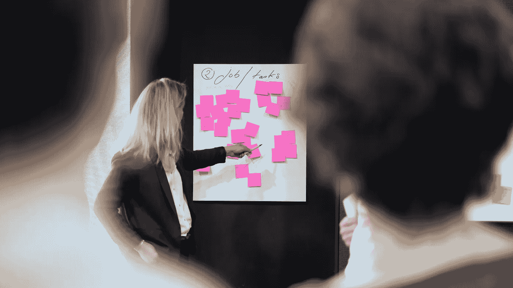

# 提高日常单口相声水平的 11 件事

> 原文：<https://betterprogramming.pub/10-best-practices-for-your-daily-stand-up-bfc1c1dd9c69>

## 每个 Scrum 团队都可以采用。

邦内瓦尔·塞巴斯蒂安在 [Unsplash](https://unsplash.com/s/photos/agile?utm_source=unsplash&utm_medium=referral&utm_content=creditCopyText) 上拍摄的照片

> “从昨天学习，为今天而活，对明天充满希望。重要的是不要停止质疑。”[人名]阿尔伯特·爱因斯坦(犹太裔理论物理学家)

每个软件都是技能和人的合作成果。每日站立是一种实践，其中团队共享进展，并且整个团队可以可视化项目前进的轨迹。

下面是团队应该遵循的一些实践，以使会议更有意义。

# 保持站立，避开椅子

听起来像个噱头，对吧？这是必要的，而不是形式。站着让团队集中注意力，减少散漫。不要安逸，也不要让别人安逸。每日站立会议之所以这样叫是有原因的——所以，站起来！如果每个人都坐着，变得太放松，会议可能会超时，团队成员可能会开始分心。

> "坐得太久，身体很快就会变得不健康，头脑也会变得不健康."—亨利·沃兹沃斯·朗费罗

想淘汰保姆？把会议室里所有的椅子都搬走。

避免这种类型的房间站立。照片由[在](https://unsplash.com/@drew_beamer?utm_source=unsplash&utm_medium=referral&utm_content=creditCopyText) [Unsplash](https://unsplash.com/s/photos/meeting?utm_source=unsplash&utm_medium=referral&utm_content=creditCopyText) 上绘制的光束器

长时间站立的不适也是为了缩短会议时间。

# 三个简单的问题

回答以下三个简单的问题:

1.  自从上次会议以来，你完成了什么？
2.  下一次会议之前你在做什么？
3.  是什么阻碍了你的工作？

图片来自[知识小屋](https://www.knowledgehut.com/blog/agile/how-not-to-be-agile)

仅此而已。没多也没少。

# 少说话，提供信息

尽可能直截了当。步入正轨，说出团队需要知道的事情。

> 不要把单口相声当成技术讨论的地方。

少花点时间，给别人说话的机会，让单口相声持续时间短一些。

> “越聪明越少说话。”—古老的阿拉伯谚语

有时团队成员太专注于轮到他们说话，他们不会听他们的对手在说什么。想象一下，在一次脱口秀中，一位 QA 专家清楚地陈述了障碍——她需要的一台服务器无法工作；一些开发工具许可出现了问题，这使得她无法完成当天的任务。当他结束时，每个人继续回答问题，会议似乎休会。

# 团队胜过个人

在站立时，团队成员应该向团队成员更新，而不是 scrum master、敏捷教练或团队成员。

scrum 团队应该在会议中分享彼此的进展。没有上级角色或最高指挥。

> “天赋赢得比赛，但团队合作和智慧赢得冠军。”— *迈克尔·乔丹*

Scrum 单口相声是团队的，也是团队的。

# 保持简短

不要把 scrum 会议开得太长，最好在 10 到 15 分钟之间。冗长的会议既无聊又无益。

> “保持小规模，继续前进。”—杰森·阿尔迪恩

scrum 单口相声应该像一个激励会议，而不是一个冗长的炫耀会议。

如果你每天都举行每日站立会议，尽量不要跳过一天(除非有紧急情况或问题)。错过一次会议可能会让你的团队脱离常规，扰乱 Scrum 过程，最终可能会伤害正在进行的项目。

常规对于在结构化敏捷方法中工作的团队来说是非常好的，因为坚持过程会给你的产品或项目带来理想的结果。如果会议在每天或每周不同的时间召开，会影响整个团队。

# 提出一个阻碍，跳过解决方案

不要在站着开会的时候想办法解决。如果你有一个想法，稍后再安排一次会议。

> “问题包含解决方案。”迈克尔·比鲁特

通常，当一个拦截器问题被提出时，人们开始讨论可能的解决方案，并从其他人的更新中转移注意力。因此，在单口相声中，告知团队关于阻断器的信息，并暂时跳过解决方案。

# 准时

单口相声要准时，不能早一分钟，也不能晚一分钟。在单口相声之前建立一种准时的文化。

由 [Ales Krivec](https://unsplash.com/@aleskrivec?utm_source=unsplash&utm_medium=referral&utm_content=creditCopyText) 在 [Unsplash](https://unsplash.com/s/photos/on-time?utm_source=unsplash&utm_medium=referral&utm_content=creditCopyText) 上拍摄的照片

> "守时是时间的窃贼。"—奥斯卡·王尔德，道林·格雷的画像

如果有些人缺席也没关系，但是要确保你准时开始和结束会议。

# 温柔善良

这是人类天性的一部分，当我们完成某件事时，我们都喜欢大声说出来，这一点也不坏。欣赏成就是保持团队动力的必要条件。

但是你应该确保用它来提高其他成员的动力，而不是打击他们。如果有人夸大了他们的成就，团队有责任缓和这种情况，并建议他们简明扼要地交流，这是什么，因为它是什么。

> “没有什么比温柔更强大，也没有什么比真正的力量更温柔。”圣弗朗西斯·德塞尔斯

试着将成就转化为团队成就，不要忘记欣赏在单口相声中的努力。

# 坚持团队

站立会议是为了让团队了解最新情况，如果你要邀请其他人，尝试安排一次单独的会议，同时明确会议的目的，并为讨论点制定适当的议程。

有时候，可能会有这样的情况，你的交付主管、常务董事或者内部人员(但是团队之外的)可能会加入进来，但是作为 scrum 团队，有必要确保 scrum 主管在每天 10 到 15 分钟的站立会议中主持会议。

# 避免一遍又一遍地重复同样的障碍

好吧，同样的日常问题可以归结为 scrum master 的职责。scrum 主管应该负责解决这个问题。

如果他们已经尝试了所有可能的方法，如果这是一个会持续一段时间的障碍，那么 scrum masters 再次有责任发起一个行动来解决这个问题。

scrum master 的职责包括研究阻塞问题，确定责任方，进行讨论，列出可能的解决措施和持续时间。

他们应该向团队传达可用选项的解决方案，同时根据渣滓团队的意见主动选择并执行最佳行动。

如果没有任何事情有利于解决它，最好在站立会议期间沟通，将它从 sprint backlog 中删除，直到得到整个团队的同意才能解决。

# 不要忘记你的远程伙伴

即使站立会议是短暂的会议，远程工作的团队成员仍然可以带来有价值的输入，即使他们不在同一个房间。建立语音或视频通话可能非常耗时，因此使用数字工作空间让远程员工参与进来是这类会议的最佳选择。

不要忘了让你的远程伙伴加入到单口相声中来。Daria Nepriakhina 在 [Unsplash](https://unsplash.com/s/photos/remote-work?utm_source=unsplash&utm_medium=referral&utm_content=creditCopyText) 上拍摄的照片

厌倦了看一些严肃的东西？让我们来复习一下。

## [32+搞笑代码评论人家居然写的](/javascript-in-plain-english/30-funny-code-comments-that-will-make-you-laugh-1c1b54d4ab00)。

# 感谢阅读。干杯🥂