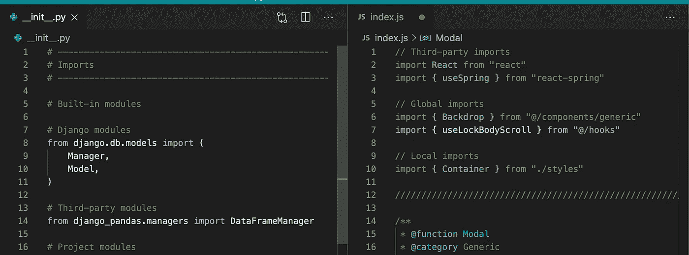

# 我从 Python 中借鉴的 10 个习惯在 JavaScript 中使用(第 2 部分)

> 原文：<https://betterprogramming.pub/10-habits-i-borrowed-from-python-that-i-use-in-javascript-part-ii-53b405d31f1b>

## 我认为最好的实践应该从 Python 延续到 JavaScript，尤其是在 React 中

你看到我的 Python 代码和我的 JavaScript 代码之间的相似之处了吗？(图片来源:作者)

如果你没有看过《T4》的第一部分，你绝对应该从那里开始。如果你已经读过了，继续读下去！下面是我从 Python 学习经验中借鉴的另外五个习惯，我每天都把它们带到我的 React 代码中。

# 一周后阅读你的代码

你能一眼看出它是如何工作的吗？疏比密好。可读性很重要。

让你的代码非常，非常易读的一个方法是拥有许多功能非常清晰的小部分。这就是所谓的*单一责任原则*。如果你的代码库很大，将会有很多逻辑要写。那么什么更容易使用呢？许多结构良好但功能很小的代码，或者一段很长的代码做很多事情？如果你从编程中学到了什么，你会知道第一选择是你的朋友。

原因是代码不是永远静态的。你想要添加新的特性，修改一些行为，修复一些错误，测试你的代码，改变设计，等等。因此，如果职责定义明确，尽可能将功能隔离开来，可以很容易地替换掉不需要的部分，或者找出不同部分需要改变的行为。最重要的是，它使调试变得轻而易举，因为您可以更容易地查明代码中的问题部分。

在 Python 中，您可以通过将数据结构包装在类中，并为它们分配最简单的职责，然后为这些类提供执行任务所需的方法来实现这一点。在 React 中，同样的原理也适用。将大而笨重的组件分解成较小的部分，让这些部分负责呈现 DOM 的特定部分。或者重构逻辑，以便自定义钩子处理组件逻辑的特定部分(例如，状态的特定子集+与操作该状态相关的记忆化回调)。这使得你的组件更容易阅读，如果一个任务需要重新设计或以不同的方式执行，读者确切地知道在哪里看。

这种小型构建模块的一个很好的例子是编写一个管理布尔状态的钩子，用三个内存化的回调分别将布尔设置为`true`、`false`，并切换值。这是我在第一部分展示的`useBoolean`钩子！(我是它的忠实粉丝。我想要更多！)

与之相反的叫做*意大利面代码*。这是一段代码，其中一个组件需要 300 多行代码，定义样式，声明钩子，管理两三个`useEffect`钩子，操纵道具，可能有一个`useRef`用法来管理不触发重新渲染的状态，只是为了迷惑大家。尝试在那里改变一个小特性，而不必再次仔细阅读和测试整个组件。祝你在编写单元测试时好运。

# 设定编码指南并坚持执行

让你的代码遵循一个结构。特例不足以特殊到打破规则。

花一些时间去思考那些可以加速、阐明或者简化你的开发的模式，或者甚至消除一些偶然的问号。你最好 100%遵守你的规则，而不是到处允许例外。我是说，这是编程语言，不是法语。坚持你的规则，你的重构时刻会像微风一样过去。不要前后矛盾，在每一个例外情况下，你都会疑惑，“哦，好吧。我又用这个做了什么*。保持一致可以让你避免质疑自己，并且可以使用基于规则的方法来修改你的代码，而不是单独处理每一种情况，这会大大降低你的速度。*

# 抛出错误！

错误永远不会无声无息地过去。

有多少次你在调试结束时，得到一个一般性的错误消息，说某个属性没有定义？如果你知道为什么它没有被定义就好了。一个很好的例子就是定义一个依赖于 React 上下文的钩子。如果在上下文之外使用，让它抛出一个错误，并写一个相关的错误消息。另一个很好的例子是使用`PropTypes`，当你的道具不是正确的类型时，它会抛出运行时错误。我已经听到读者在想，“TypeScript 怎么样”。我过去讨厌打字稿，但随着时间的推移，我越来越喜欢它。如果不太纠结配置文件，比使用 PropTypes 稍微好一点。您选择的技术有优点也有缺点，但是主要的收获是键入您的代码对避免和调试错误有积极的作用。

# 只允许以一种方式执行任务

软件中的自由是邪恶的！应该有一种——最好只有一种——显而易见的方法来做这件事。

我喜欢采用一些小规则来防止我在编写 React 代码时不得不思考。这里有一个简短的列表，但是为了保持“Pythonic 式的”，您可以自由地修改这个列表。重要的是要有一个对你有意义的清单。

*   将文件顶部的导入按类别分开。我通常的分类是第三方导入、绝对导入(这对于移动文件而不造成混乱非常有用)和本地导入(这是相对导入，即导入路径从文件开始的导入)。这有助于你一眼就看出模块的依赖关系。
*   每个文件只允许一个组件(样式化组件除外)。这可以防止您在一个文件中打包太多的逻辑，并使文件更容易阅读。这也使得通过一个组件进行搜索和替换变得更加简单。
*   每个组件都应该有自己的文件夹。该文件夹应该以您的组件命名(比如，`ComponentName`)，并包含一些文件，包括:

1.  `index.js`，专供出口
2.  `ComponentName.js`，包含定义组件的功能
3.  一个名为`styles.js`的模块，包含了你所有的样式组件(基本上是样式组件，相当于一个`.css`文件，但是在 JS 中)
4.  一个包含你的单元测试的文件

*   除非绝对必要，否则只使用 React 钩子。在 2020 年，几乎没有理由再依赖基于类的组件，除非你正在处理遗留代码。
*   每个组件(除了样式化组件)都应该在它的定义前包含一个 JSDoc 注释。
*   钩子首先出现在一个组件中(这来自钩子的规则)，然后你定义变量、回调等等。
*   在组件的末尾，只允许组件中有一个 return 语句。(如果需要条件渲染，使用按位运算符`&&`和`||`。)
*   这个对我来说有点挑剔，但是自从我采用了这个实践，我对我的组件结构有了更好的了解。如果 return 语句中的 JSX 组件包含不止一个 prop，就在包含 props 的 return 语句之前创建一个`const`对象，并在 JSX 中析构该组件。这将 JS 从 JSX 中分离出来，使 return 语句看起来更接近 XML，同时保持 JavaScript 逻辑的完整性。
*   不要在 React 中使用`let`语句。永远不会。(如果你认为你绝对需要一个`let`语句，如果你稍微重写一下代码，你实际上并不需要。)有一个很好的理由不使用它:用`let`声明的变量是可变的，React 中的可变值是通过有状态变量和`useState`钩子管理的。如果不以有状态的方式管理它们，这些变量会变得非常不可预测。更重要的是，因为它们是可变的，为了理解一个组件的行为，如果一个变量是用`let`声明的，你需要阅读整个组件，看看变量在哪里被使用，在哪里可能被重定义。使用`const`节省读取时间。
*   等等。等。等。

实现上面列出的所有规则的示例按钮组件。你能说出儿童道具放在哪里吗？

我有很多这样的规则来避免和自己争论如何写代码。不问自己如何写作大大加快了我的写作速度；我可以专注于组件的内容，同时不必担心代码设计。设计在规则中，你应用规则。

# 如果你想做点什么，现在就去做吧！

现在总比没有好。当其他事情发生时，很容易忘记去做一些事情。如果你现在没有时间做某件事，至少可以把它安排在以后，那么就使用基于卡片的软件，比如 Trello 或吉拉。如果你认为你以后会做某事，但你没有，大多数时候，你最终没有做！

我希望这些建议能启发你。让我知道你对我为用 React 编写代码而开发的受 Python 启发的这些技巧的看法——我非常乐意回答。