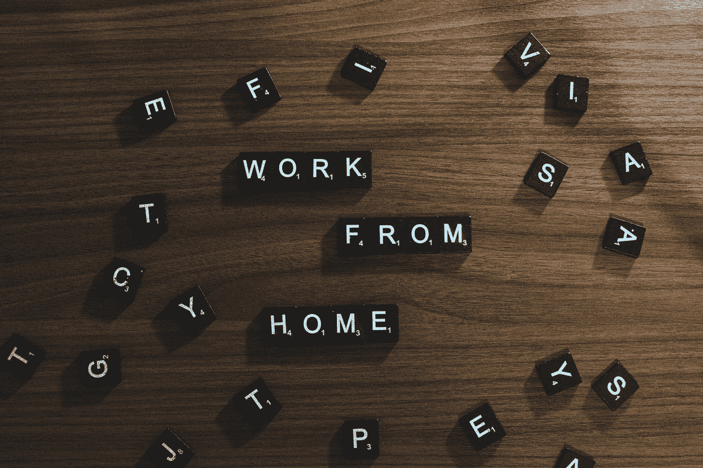

# 提高远程工作效率的 10 个习惯

> 原文：<https://betterprogramming.pub/10-habits-to-increase-your-productivity-while-working-remotely-5c21f7a466be>

## 即使你在家，你也应该有固定的工作时间、明确的工作空间和每日的例行公事

在 [Unsplash](https://unsplash.com?utm_source=medium&utm_medium=referral) 上由 [Nelly Antoniadou](https://unsplash.com/@nelly13?utm_source=medium&utm_medium=referral) 拍摄的照片

自从开始在家工作以来，我的工作效率时好时坏，直到我找到了正确的方法。此后一直处于高位不变。在最初的日子里，我们所有人的心情一定是复杂的。我最初认为在第一次会议前五分钟醒来，然后穿着睡衣度过一整天会很有趣。我认为避免交通堵塞和旅行是发生在我身上最好的事情。

但是后来，当倦怠狠狠地踢了我一脚，我决定不让它影响我。我以为只有我会这样，但后来，当我和那些和父母住在一起的同事，或者那些家里有孩子的同事，或者一个爱大喊大叫的吵闹的邻居交谈时，我意识到真正的问题是什么。此外，容易分心或拖延也变得非常普遍，因为我们都在自己的空间里。我们现在是我们时间的主人，因为我们周围没有人担心会对我们评头论足。

我决定找出到底哪里出了问题。遵循这几个简单的习惯会给你足够的注意力和集中的时间去工作。我以艰难的方式反复灌输这些习惯，因为老实说，如果远程工作没有计划好，至少有一千种方式会严重出错，耗尽你的时间和精力。

# 1.有具体的工作时间

根据你的舒适程度来计划你的工作时间，并严格遵守。确保选择一个你肯定会投入工作的时间范围，当你周围没有干扰的时候。建议你早点开始工作，早点下班，因为在早上，我们有一个安静的环境，分心的可能性相当低。

此外，确保一旦你注销，你不工作，直到你的工作时间开始的第二天。与你的团队成员交流你的工作时间，并确保你与他们有共同的时间进行协作。

# 2.有规律可循

鉴于新冠肺炎造成的混乱和不确定性，有一个给我们稳定感的惯例总是好的。日常生活让我们思维敏锐，情绪健康，精力充沛。所有这些反过来会提高生产力。例行公事会让我们觉得有所期待。

相信我，我真的很欣赏我曾经的单调生活，因为那比被关在家里有趣多了。

# 3.有明确的工作空间

用桌子和椅子建立一个合适的工作空间，最好是符合人体工程学的椅子，以确保你的身体健康不会受到影响。强烈建议不要在床上或沙发上工作。拥有一个合适的工作空间还会让我们的大脑做好准备，只有当我们在工作的时候才会想到工作，这会给我们一种去办公室的感觉。它还会帮助你保持适当的工作时间，最重要的是，它不会给你带来臀部或肩膀疼痛，如果你没有以正确的姿势坐着和工作，你就会产生这种疼痛。

试着站着工作，因为长时间坐着也不健康。我看过一篇文章，说坐得太久也会上瘾，就像吸烟一样，而且它也有自己的问题。给这篇有趣的[文章](https://www.betterhealth.vic.gov.au/health/healthyliving/the-dangers-of-sitting)读一读，了解久坐的副作用。

# 4.当你开始一天的工作时，创建一个严格遵循的清单

记下你想在一天结束前完成的事情清单。起草的时候要实际，确保你的清单不会让你加班。当你不能在给定的时间内完成某件事时，记下为什么事情不顺利，尽量不要重复。这一过程也有助于你审视自己，你会倾向于理解能帮助你更有效率的不同事物。

# 5.消除噪音的音乐

如果你有吵闹的邻居，如果你住在交通繁忙的附近，或者如果你家里有孩子，噪音消除耳机可能是你的救命稻草。当你需要在嘈杂的环境中快速集中注意力时，戴上耳机，听上你最喜欢的曲子，我向你保证，你会被带到高度集中的世界。这个技巧几乎一直对我很有效。

# 6.过度沟通是新的沟通方式

在和队友交流的时候会造成数据丢失的因素涉及太多了，所以请不要在字里行间留下任何可以解读的东西。如果你试图沟通一些复杂的事情，随时打电话给对方。由于我们所有人都在自己的空间里，遗忘的机会也减少了，因为他们会不断地想起那些交流过多的事情。

# 7.做一些让你自我感觉良好的事情

现在，在家比以往任何时候都有助于我们有足够的时间去做工作以外的事情。利用这段时间学习新的东西，培养新的爱好，读更多的书，写一些东西，变得更健康，或者基本上只是做任何能让你感到快乐的事情。现在外面很混乱，我们有充足的时间，所以要保持理智，照顾好自己很重要。

# 8.休息足够的时间

短暂的休息有助于你变得更有效率，对你的精神健康也有好处。有必要离开你的办公桌和显示器，给自己的精神和身体充电。短暂的休息也能提高一个人的创造力。有些人抱怨说，如果他们休息，他们会有负罪感——请不要。

永远记住，没有人可以一起工作几个小时，休息足够的时间对你和你的工作都有好处。没有理由为此感到内疚。

# 9.喝足够的水

保持水分很重要。因为我们在家里，我们可能很容易被工作冲昏头脑，一连几个小时不喝水。所以有意识地提醒自己喝水，如果你做不到，有很多应用程序会提醒你。

# 10.花足够的时间和你爱的人在一起

生活不仅仅是工作:一个人必须在工作和生活之间找到恰当的平衡。保持这种状态的最重要的方法就是花足够的时间和你爱的人在一起。现在，我们在一个更平静的环境中，远离了匆忙上班和在车流中奔跑的烦恼，是时候补偿那些真正关心我们的人，那些我们没有给予足够时间和关注的人了。这会给我们幸福和安宁。就像治疗一样。

# 结论

如果你不刻意选择合理安排时间并遵循这些简单的习惯，在家工作很容易变得有压力。如果你计划得当，你甚至可以选择远程工作来度过余生，因为它真的有可能帮助你以最高的效率工作。要积极，要善良:)

感谢阅读！