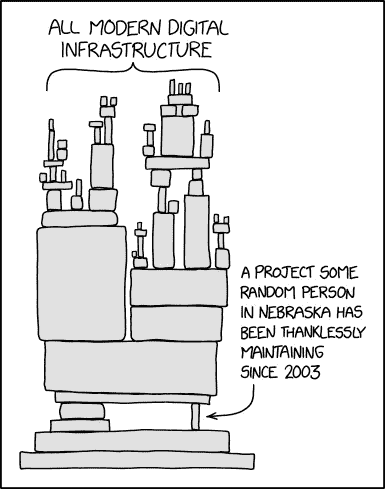

# 避免软件项目过于复杂的 10 个提示

> 原文：<https://betterprogramming.pub/10-hints-to-avoid-over-complexity-in-software-projects-51a25bf51853>

## 代码库过于复杂会降低开发团队的速度和进度；从而增加挫折感和压力。在本指南中，我整理了一个提示和态度列表，以对抗软件开发中不必要的复杂性。


马丁·鲍登在 [Unsplash](https://unsplash.com/?utm_source=unsplash&utm_medium=referral&utm_content=creditCopyText) 上拍摄的照片

## 介绍

在做了 20 多年的软件开发人员后，我阅读和编写了许多编程语言的代码，比如 C++、C、C#、R、Python、GO、LISP、Java、Kotlin 等等。我看到项目成功，也看到一些失败。有些变得停滞不前，在不破坏其他东西的情况下添加新功能变得越来越困难。其他一些项目进入了可以扩展和修复的状态。我永远不敢给出终极建议；这些年来我学到的是

> 谦虚点，起来继续！

现在好好享受这个小小的反复杂性指南吧！

# 1.一点建筑/规划会有帮助

先思考，再编码。这似乎是显而易见的。编码前至少做一点架构设计。想盖房子的人通常不会在没有计划的情况下就把石头一个接一个地垒起来。软件开发也是如此。然而，与房子相比，这个软件要“软”得多。因此，开发软件的一部分所需的计划通常不需要像房子那样精确和复杂。参见例如[1]。类之间有循环依赖吗(多亏了 C++中的预声明，这实际上是可能的),或者它们是有序的吗？阅读代码味道和重构[2]。

# 2.小心过度抽象，不要过度工程化

设计模式和抽象是一件好事。但是不要过度！过度工程化没有帮助；它模糊了商业逻辑。不要像“哦，酷，一个 lambda 函数返回一个为创建对象层次结构而创建工厂的函数——没有人会理解这一点”那样聪明地编码。团队中的其他或未来的开发人员(或者 6 个月后偶然发现自己的代码的您)会很乐意理解这个函数的作用。态度一定是写代码，人类能理解。

例如，参见 Reddit 上的[几年后…](https://www.reddit.com/r/ProgrammerHumor/comments/suzlph/some_years_later/?utm_source=share&utm_medium=web2x&context=3) 。

# 3.不要过早优化

源代码的可读性和可维护性很重要。所以，当某一部分代码没有优化的迹象时，那就不要做！当然，当你的部分代码太慢而不能满足需求时，你需要优化它们。但是，用一个分析器找到性能瓶颈，并且只触及那些真正有影响的部分。人类大部分时间都不善于猜测性能真正的漏洞在哪里。

# 4.保持简单——做一个代码极简主义者

关于衣柜和家居的“极简主义”有很多宣传(约书亚·贝克尔 a.o .)。然而，我喜欢成为代码极简主义者的想法。您没有编写或删除的每一行源代码都不需要测试、维护、编译和阅读。所以在编写代码或添加类时要稍微节俭一点。如果没有必要，就把它扔掉(即使很疼——见我的另一篇文章[4])。到此为止，有像 [git](https://git-scm.com/) 这样的源代码版本控制系统。如果你认为有一天你会需要它，那就把它放在一根树枝上(过一会儿把树枝扔掉)。

最漂亮、最易维护的代码看起来简单干净[5]。这就是问题的关键:编写看起来简单的代码是一项艰巨的工作。但是维护一个成熟的、强耦合的代码库可能更加困难。

通常，将接口、类或 API 的功能减少到最低限度是有好处的；不要给有很多方便功能的酒加水。即使对于非地鼠来说，通过查看 Go base 库也可以学到很多东西。例如，看看总的减少的 [io。编写器](https://pkg.go.dev/io#Writer)界面。简单干净；不需要大量阅读文档。添加实现这个接口的代码很简单。

```
type Writer interface {
    Write(p []byte) (n int, err error)
}
```

如果有可能选择更简单的语言原语来支持更复杂的原语，为什么不使用它呢？选择更复杂的有什么原因吗(除了酷或者好奇)？

## 例子

单线程同步做；如果没有必要，不要引入具有难以理解的交互的多线程！

现在用 C++说话；当目的只是保存数据时，为什么不使用简单的`struct`而使用`class`。为什么不创建一个简单的`enum (class)`来代替使用类继承。为什么不创建一个纯普通的函数来支持类，甚至模板。具体点。

# 5.小心使用代码生成器

当然，有很好的代码生成器可以提供很多帮助，比如创建或使用 REST API(比如 swag)。但是有时会引入更多的复杂性，并可能混淆代码的行为。一个简单的状态机可以在不使用代码生成器的情况下实现。不是每个人都会拥有该工具(比如企业架构师)，并且可能无法理解基本思想是什么。

# 6.不要重新发明轮子，而是保持平衡

从头开始创建功能需要付出努力。理解和使用外部库也需要努力。在一些编程语言(C++)中，“仅仅”包含一个新的库(引入许多依赖项)甚至可能是一场噩梦。因此，您需要在决策、“购买”和推广之间找到平衡。请注意不要将“不要重复(DRY)”原则推向极端。当您只需要一次时，它可能会导致整个模板库。

# 7.学习和使用基础库

在 C++中有 STL(结构化模板库)，在 Go 中有基本库等。这些库都经过了很好的测试，通常都比你所能写的要好。理解这些基本库的逻辑以及如何使用它们需要一些努力。试着承受让外部框架支配和污染你所有的基本逻辑和实体的冲动！只是因为已经用在项目中了，比如 Qt。当然，您将需要外部库。但不仅仅是一个线程、哈希映射、列表或字符串。



xkcd 依赖[https://xkcd.com/2347/](https://xkcd.com/2347/)

# 8.记录您的代码

```
// no comment
```

“很明显，告诉我一些新的东西”，我听到你说。但现实多次向我表明，这一点经常被忽略——“我们现在没有时间，我们以后再做吧”！后来，现实告诉我，永远不会到来。没有以后。每当你定义一个接口，类，函数的时候，试着明确表达它的用途(如[doxigen](https://www.doxygen.nl/)、 [godoc](https://go.dev/blog/godoc) 等)。取决于您使用的语言/工具集)。在实现之前，在注释中明确写下接口/类/函数的关注点可能会有所帮助。如果很难为一个类命名一个关注点——你的设计可能有缺陷。

写评论的时候，记住其他可怜的家伙，他们需要理解一段代码的作用。想象一下，如果你不在了，这个项目会发生什么。或者当你过一会儿回到你自己的源代码时想想你自己。所以不要做 ASCII 艺术，或者只写多余的信息。告诉我那段代码的本质和意义！

# 9.牢记可测试性

当然，有测试驱动开发(TDD)。每个人都知道应该编写测试。然而，为了能够为代码编写单元测试，必须对代码进行结构化和解耦。如果你的代码中有你目前不想测试的部分，试着把它们组织起来，**就像你想测试的**。没有脱钩的担忧，这是行不通的。如果所有的业务逻辑都分散在直接与用户交互的前端类中，这几乎是不可能的。使用单元测试库来帮助你使测试**变得简单**(例如 C++中的 [Catch2](https://github.com/catchorg/Catch2) )，而不会引入过多的复杂性。

# 10.避免过度完美主义

软件开发从来都不是一件偷懒的事情。但是，过于强烈的完美主义也可能导致过于复杂和难以理解的代码。我看到使用**强类型**引入了很多复杂性，而一个简单的`int`或`double`就可以完成这项工作。我看到了“实现指针”( **pimpl** )习语在 C++中的使用被推向了极致。将代码膨胀到数百行，而简单的 10 行代码`struct`就可以做到。我看到了复杂的类层次和继承，以及没有任何需求的工厂。所以:尽量把重点放在效果上！

# 结论

我希望您喜欢我收集的关于您日常软件开发的提示和态度。保持简单，并享受它！

# 参考

[1] R. C. Martin， [*干净的架构:软件结构和设计的工匠指南*](http://www.vlebooks.com/vleweb/product/openreader?id=LeedsUni&isbn=9780134494333) 。波士顿:普伦蒂斯霍尔，2018。

[2] M. Fowler，*重构:改进现有代码的设计*。艾迪森-卫斯理专业，2018。

[3] E. Gamma，R. Helm，R. E. Johnson 和 J. Vlissides，*设计模式。可重用面向对象软件的要素。*，第 1 版。，再版版。马萨诸塞州雷丁出版社，1997 年。

[4] A. Müller，“源代码删除焦虑”，2020 年 8 月 27 日。[https://level up . git connected . com/source-code-deletion-anxiety-origin-side-effects-and-cure-a9 a 9f 2c 57 DCD](https://levelup.gitconnected.com/source-code-deletion-anxiety-origin-side-effects-and-cure-a9a9f2c57dcd)(2022 年 2 月 19 日访问)。

[5] R. C. Martin，*干净的代码:敏捷软件技术手册*。培生教育，2009 年。