# 开始面试前的 10 个 JavaScript 承诺挑战

> 原文：<https://betterprogramming.pub/10-javascript-promise-challenges-before-you-start-an-interview-c9af8d4144ec>

## 用图表解释

承诺是 JavaScript 异步编程的关键特性。不管你是爱它还是恨它，你都得理解它。

这里我提供了 10 个关于承诺的代码挑战，从基础到高级。您应该猜猜这些代码片段的输出。

你准备好了吗？挑战者们！

# 挑战 1:承诺构建者

这段代码的输出是什么？

## 分析

第一个挑战非常简单。

我们知道:

*   同步代码块总是从上到下顺序执行。
*   当我们调用`new Promise(callback)`时，回调函数会立即执行。

## 结果

所以这段代码是要依次输出`start`、`1`、`end`。

# 挑战 2:。然后()

这段代码的输出是什么？

## 分析

在这个代码片段中，出现了一段异步代码。也就是`.then()`中的回调函数。

记住，JavaScript 引擎总是先执行同步代码，然后执行异步代码。

遇到这个问题，我们只需要区分同步代码和异步代码。

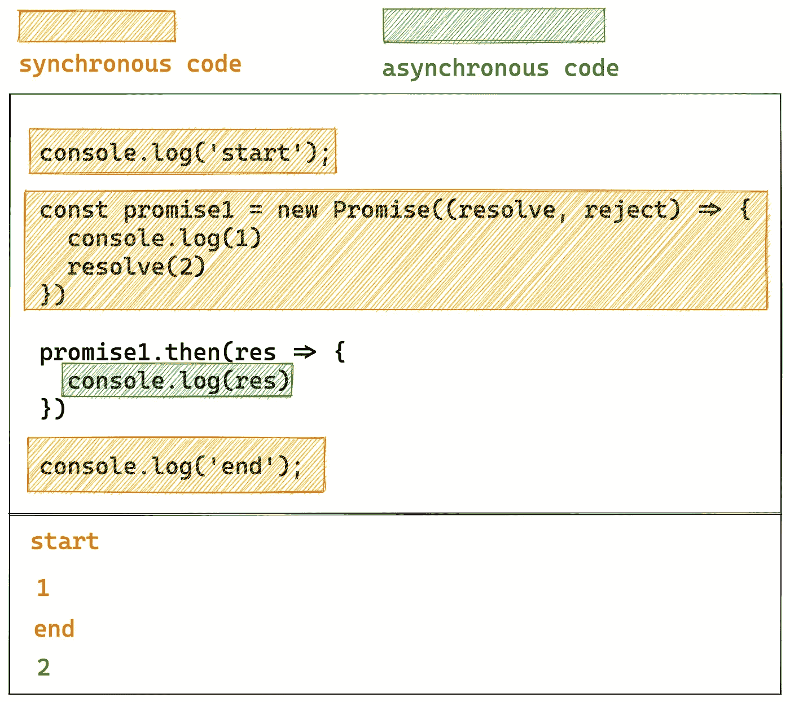

## 结果

所以输出是`start`、`1`、`end`和`2`。

# 挑战 3:解决()

这段代码的输出是什么？

## 分析

这段代码和前面的代码几乎一样；唯一不同的是`resolve(2)`后面有一个`console.log(3)`。

请记住，resolve 方法不会中断函数的执行。其背后的代码仍将继续执行。

## 结果

所以输出结果是`start`、`1`、`3`、`end`和`2`。

因为我遇到过一些认为`resolve`会中断函数执行的家伙，所以我在这里强调一下。

# 挑战 4:未调用 resolve()

这段代码的输出是什么？

## 分析

在这段代码中，resolve 方法从未被调用过，所以`promise1`总是处于挂起状态。所以`promise1.then(…)`从来没有执行过。`2`不在控制台中打印出来。

## 结果

所以输出结果是`start`、`1`、`end`。

# 挑战 5:让你困惑的问题

这段代码的输出是什么？

## 分析

这段代码故意增加了一个函数来迷惑挑战者，那就是`fn`。

但是请记住，无论函数调用有多少层，我们的基本原则都是一样的:

*   首先执行同步代码，然后执行异步代码
*   同步代码按照它被调用的顺序执行

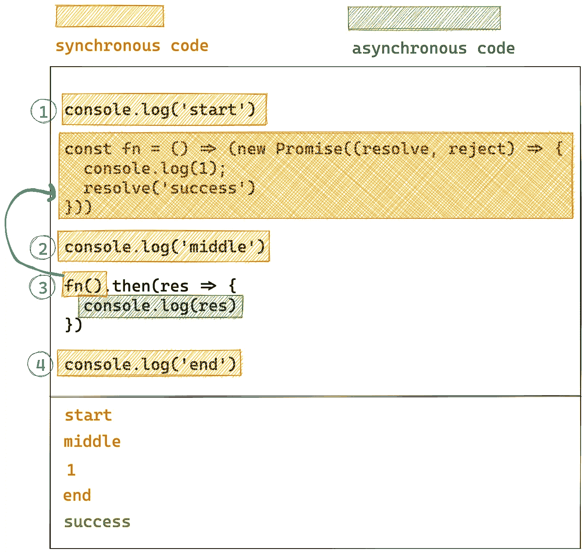

## 结果

所以输出结果是`start`、`middle`、`1`、`end`和`success`。

# 挑战 6:有实现承诺的人

这段代码的输出是什么？

## 分析

这里`Promise.resolve(1)`会返回一个状态为`fulfilled`结果为`1`的 Promise 对象。它是同步代码。

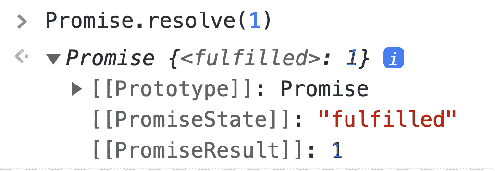

所以输出结果是`start`、`end`、`1`和`2`。

好的，你觉得这些挑战容易吗？

其实这些只是开胃菜。承诺的难处在于，它是随着`setTimeout`出现的。接下来，我们的挑战将更加艰难。

你准备好了吗？挑战者们！

# 挑战 7:超时与承诺

这段代码的输出是什么？

## 分析

注意了！

这是一个很难的问题。如果你能正确回答这个问题并解释原因，那么你对 JavaScript 异步编程的理解已经达到了中级水平。

在解释这个问题之前，我们先讨论一下相关的理论基础。

我们之前说过同步代码是按照调用的顺序执行的，那么这些异步回调函数是按照什么顺序执行的呢？

有人可能会说，谁先完成，谁就先执行。嗯，这是真的，但是如果两个异步任务同时完成呢？

比如上面的代码中，`setTimeout`的定时器是 0 秒，`Promise.resolve()`也会在执行后立即返回一个兑现的承诺对象。

两个异步任务都是立即完成的，那么先执行谁的回调函数呢？

有的学弟可能会说`setTimeout`在前面，先打印`setTimeout`，再打印`resolve`。其实这种说法是错误的。

我们知道很多事情是按照先入先出的顺序**而不是**执行的，比如流量。

## 优先

我们通常将车辆分为两类:

*   普通车辆
*   执行紧急任务的车辆。例如消防车和救护车。

通过拥挤的路口时，我们会让消防车和救护车先行通过。急救车辆比其他车辆有更多的**优先权**。关键词:**优先级**。

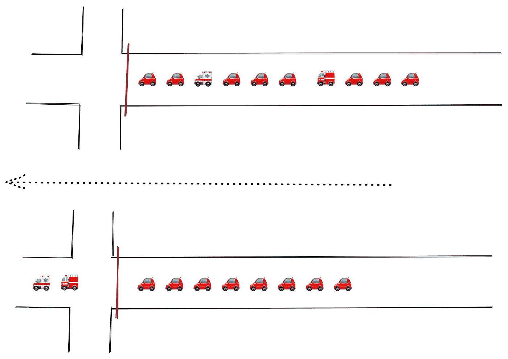

在 JavaScript EventLoop 中，还有优先级的概念。

*   优先级较高的任务称为微任务。包括:`Promise`、`ObjectObserver`、`MutationObserver`、`process.nextTick`、`async/await`。
*   优先级较低的任务称为宏任务。包括:`setTimeout`、`setInterval`和`XHR`。

虽然`setTimeout`和`Promise.resolve()`是同时完成的，甚至`setTimeout`的代码还在前面，但是因为它的优先级低，属于它的回调函数执行的比较晚。

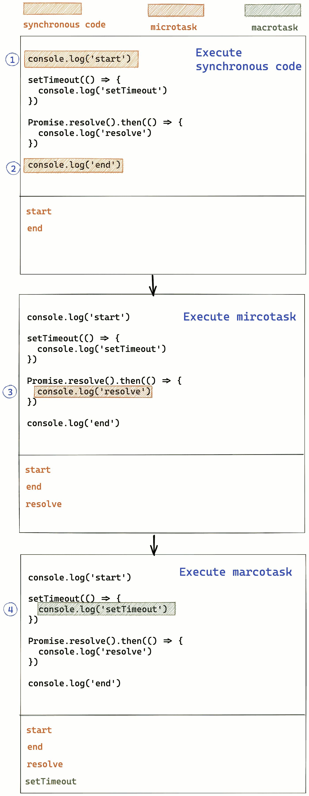

## 结果

所以输出结果是`start`、`end`、`resolve`和`setTimeout`。

# 挑战 8:微任务混合宏任务

这段代码的输出是什么？

## 分析

如果您已经理解了前面的代码挑战，那么这个挑战很容易完成。

我们只需要做三步:

1.  找到同步代码。
2.  找到微任务代码
3.  找到宏任务代码

首先，执行同步代码:

输出`1`、`2`和`4`。

然后执行微任务:

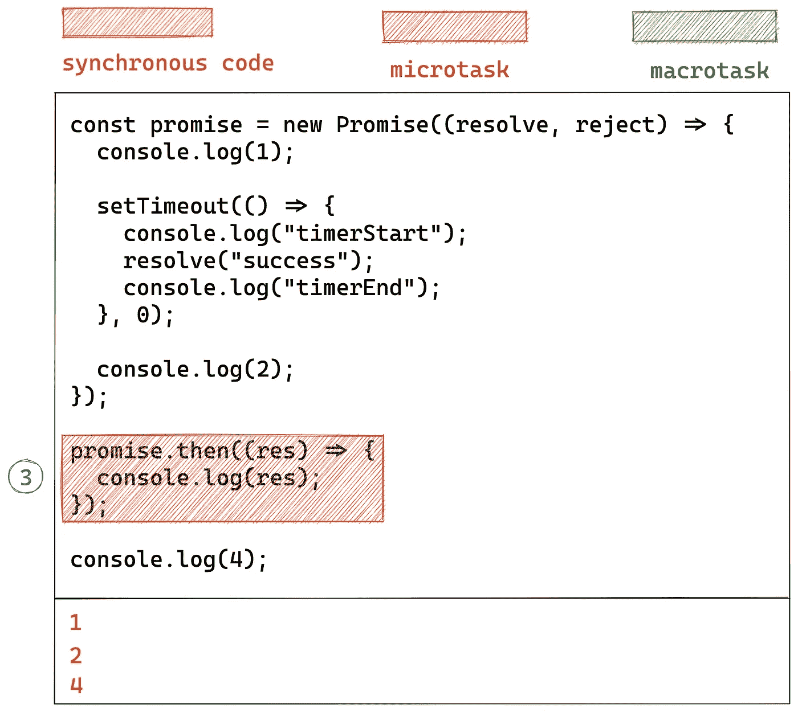

但是这里有一个陷阱:由于当前的承诺仍然处于 **pending** 状态，这里的代码目前不会被执行。

然后执行宏任务:

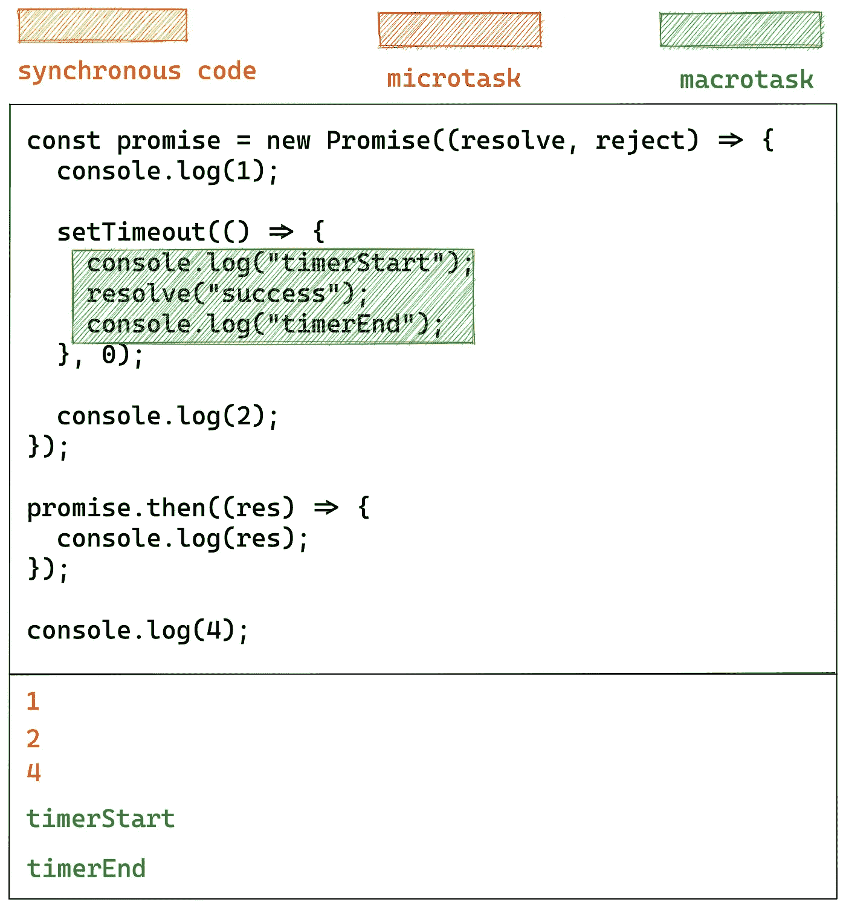

并且`promise`的状态变为`fulfilled`。

然后，通过事件循环，再次执行微任务:

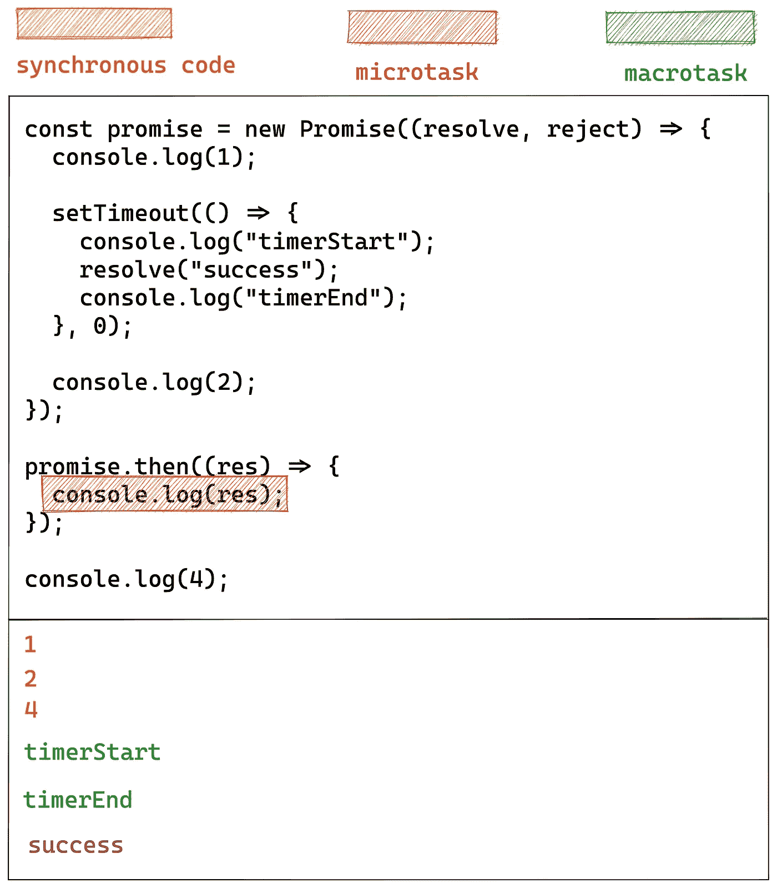

# 挑战 9:区分微任务和宏任务的优先级

在我们介绍微任务和宏任务之间的优先级之前，我们先来看看微任务和宏任务交替执行的情况。

这段代码的输出是什么？

## 分析

有些朋友可能认为微任务和宏任务是这样执行的:

1.  首先执行所有微任务
2.  执行所有宏任务
3.  再次执行所有微任务
4.  循环通过

但是上面的说法是**错**。

正确的理解是:

1.  首先执行所有微任务
2.  执行一个宏任务
3.  再次执行所有(新添加的)微任务
4.  执行下一个宏任务
5.  循环通过

就像这样:

或者像这样:

所以在上面的代码中，`Promise.then`的回调函数会在第二个`setTimeout`的回调函数之前执行，因为是微任务，已经插队了。

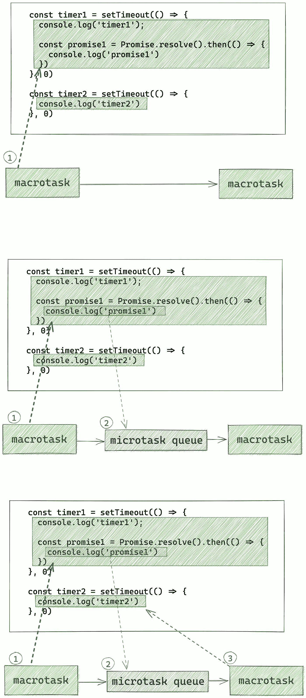

## 结果

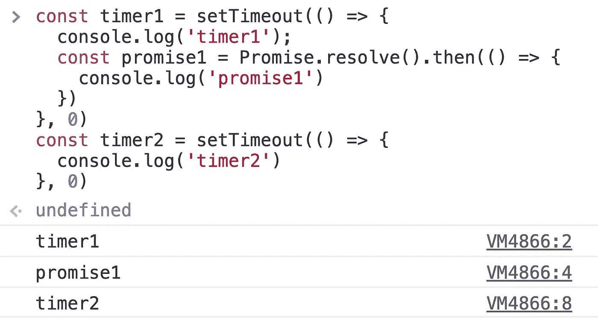

# 挑战 10:典型的面试问题

这是我们最后的挑战。如果你能正确说出这段代码的输出，那么你对 Promise 的理解已经很强了。而且同类型的面试问题不会对你有任何困扰。

这段代码的输出是什么？

## 分析

这个挑战是上一个挑战的升级版，但核心原理不变。

记住我们之前学到的内容:

1.  同步代码
2.  所有微任务
3.  第一个宏任务
4.  所有新添加的微任务
5.  下一个宏任务
6.  …

所以:

1.  执行所有同步代码:

2.执行所有微任务

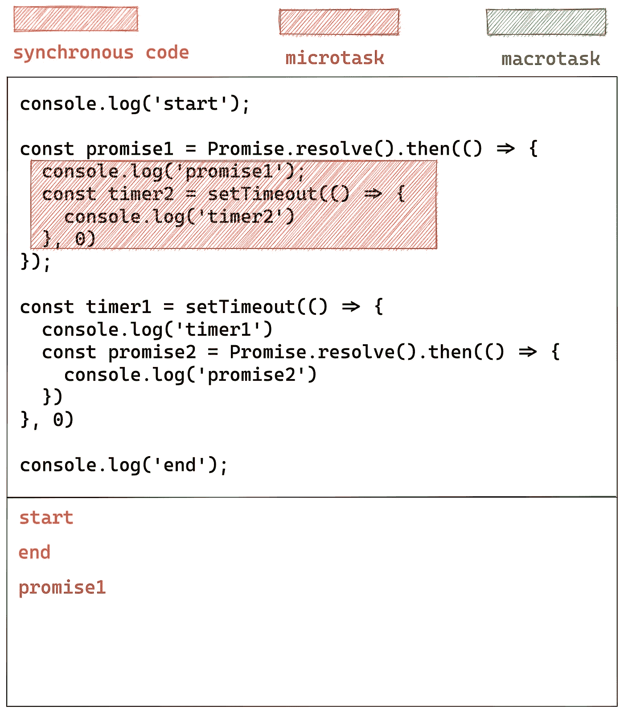

3.执行第一个宏任务

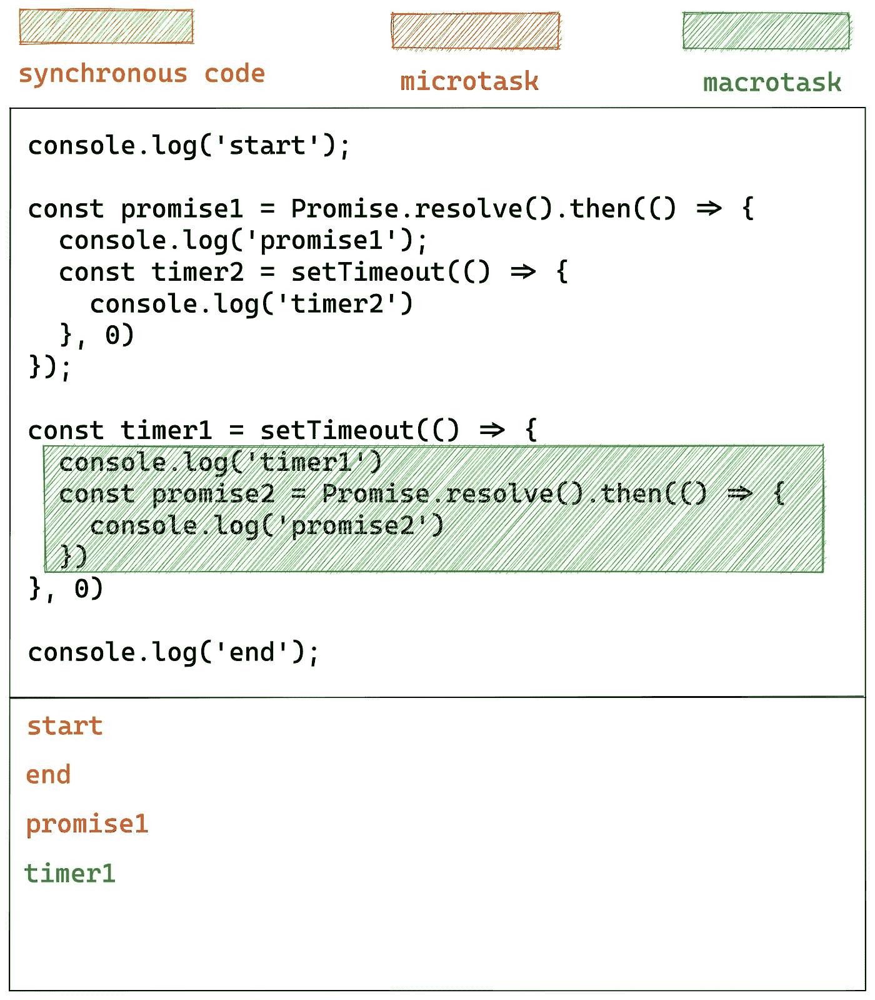

注意:在这一步中，宏任务向任务队列添加一个新的微任务。

4.执行所有新添加的微任务

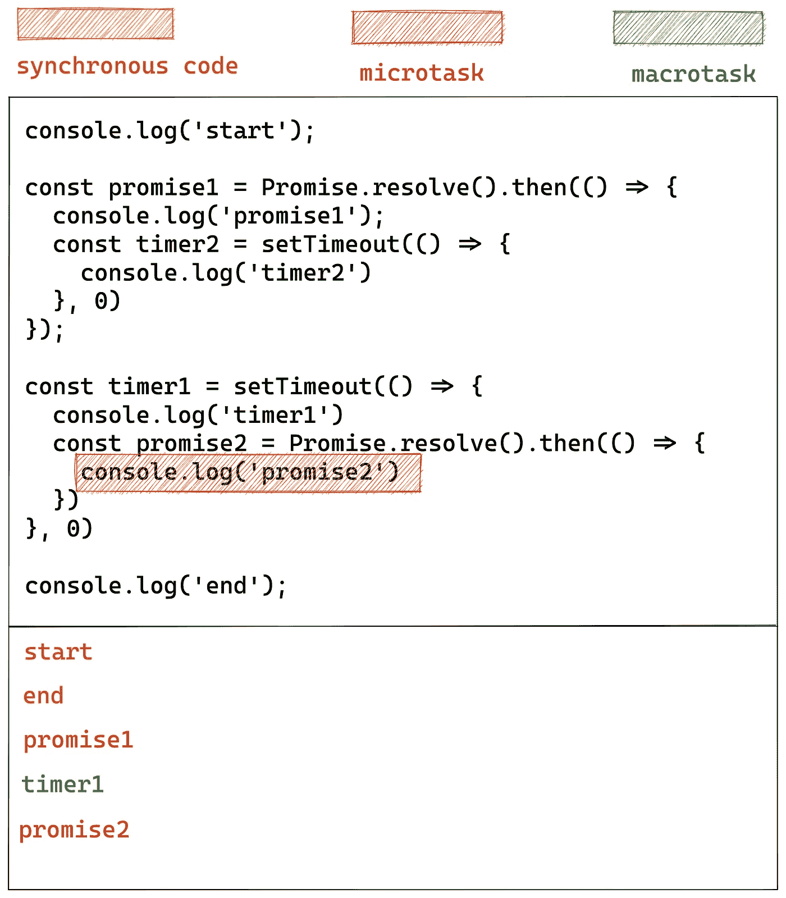

5.执行下一个宏任务

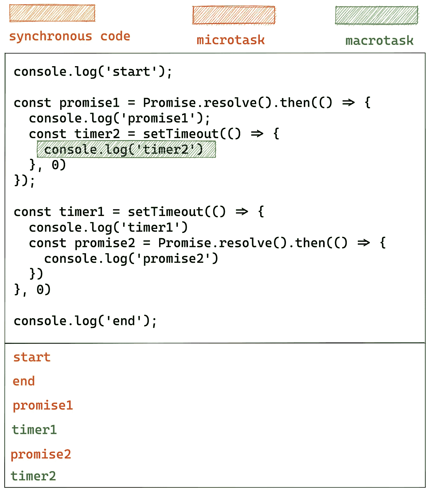

## 结果

所以输出是这样的。

# 结论

对于所有类似的问题，你只需要记住三条规则:

1.  JavaScript 引擎总是先执行同步代码，然后执行异步代码。
2.  微任务比宏任务具有更高的优先级。

3.微任务可以在事件循环中插入行。

*   [你可以用 7 张图掌握异步/等待](https://medium.com/frontend-canteen/you-can-master-async-await-with-7-diagrams-ac96a97abe92)
*   [掌握 Promise.then 和 Promise.catch 的 10 个代码挑战](https://medium.com/frontend-canteen/10-code-challenges-to-master-promise-then-and-promise-catch-3da2bdea1d97)
*   [用图表解释 10 个 JavaScript 闭包挑战](/10-javascript-closure-challenges-explained-with-diagrams-c964110805e7)

[字节鱼](https://bytefish.medium.com/?source=post_page-----c9af8d4144ec--------------------------------)

## 代码挑战

[View list](https://bytefish.medium.com/list/code-chanllenge-0b76b6b40281?source=post_page-----c9af8d4144ec--------------------------------)6 stories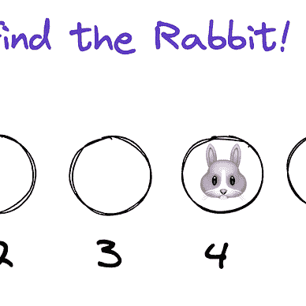