# 让你成为更好的反应者的 10 个技巧和诀窍

> 原文：<https://betterprogramming.pub/10-tips-and-tricks-that-will-make-you-a-better-reactjs-dev-95f66cc18087>

## 写出更好的代码，擅长编码面试

这篇文章最初发表在智能编码器上。

好了，伙计们——是时候用另一篇文章来帮助你们改进 React 游戏，成为更好的 React 开发人员，编写更好的代码，并擅长编码面试了。

# 在功能组件中使用 React 挂钩

钩子是在 React v16.8 中引入的，对 React 中的函数式编程是一个巨大的推动。有了钩子，你可以也应该利用功能组件而不是类组件。但是等等…功能组件和状态？生命周期方法是什么？

不要害怕——React Hooks 已经为你做好了准备。让我们看一些例子:

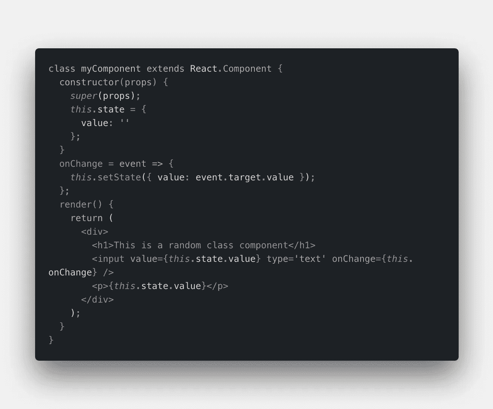

这是使用类的传统方式。有了钩子，我们现在可以使用`useState`钩子，像这样:

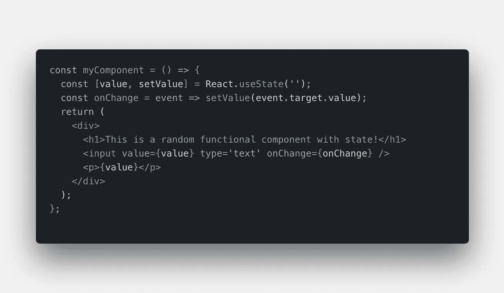

看起来更容易？确实是！我们使用`useState`钩子将初始状态设置为一个空字符串(“”)，它返回一个具有当前状态的数组(`value`)和一个改变该状态的方法(`setValue`)。我们也使用数组析构来访问`value`和`setValue`。

默认情况下，功能组件不能访问生命周期方法。但是现在我们有了钩子，而`useEffect`钩子来拯救我们了。首先，传统的方式，使用一个类:

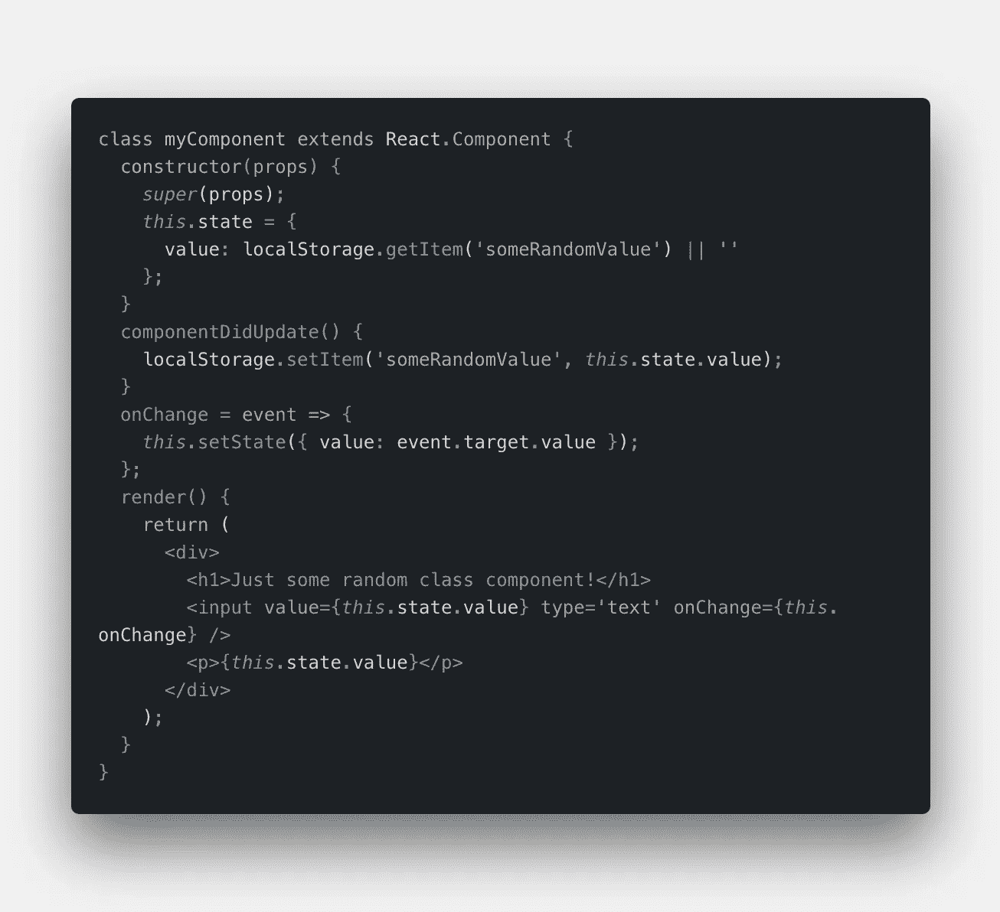

下面是利用`useEffect`钩子的同一个例子:

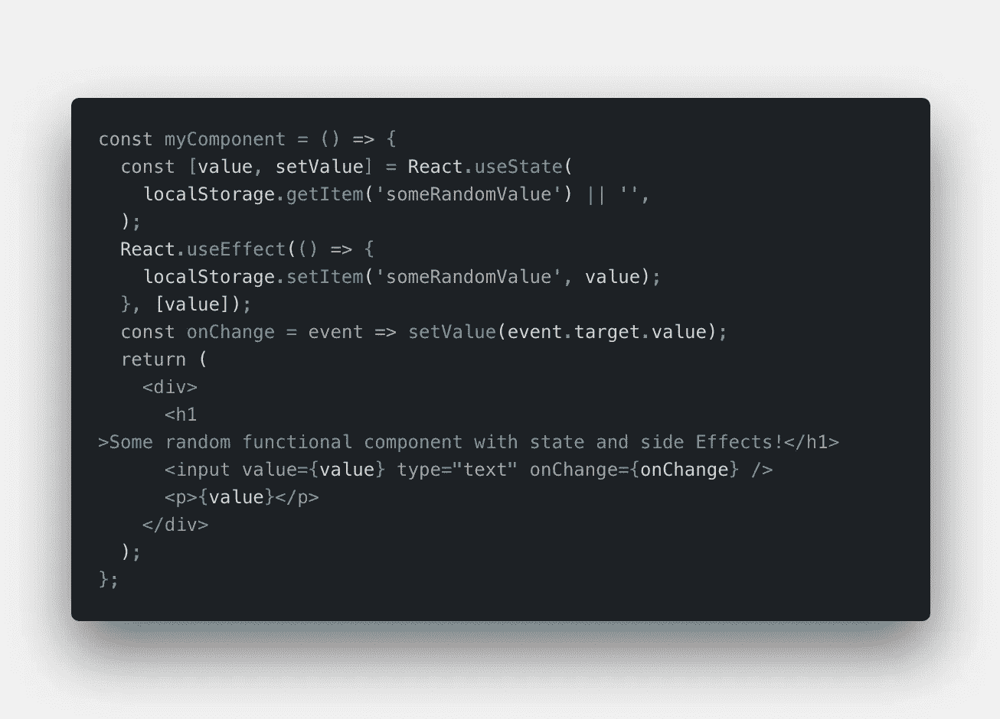

多棒啊。`useEffect`当传递的数组(`value`)中的一个值改变时，将总是运行。

这只是使用 React 钩子的两个例子——还有更多例子。你甚至可以创建自己的定制挂钩。在我看来，每个 ReactJS Dev 都应该学习这个概念！

# 使用 React 上下文 API 传递属性

也许你经历过这样的情况:你有嵌套很深的组件，并且需要将道具从较高层传递到较低层，一些组件位于中间，只是让那些道具通过。您可以利用 React 上下文 API，而不是编辑链中的每个组件。

在本例中，我们在一个单独的文件中创建新的上下文，如下所示:

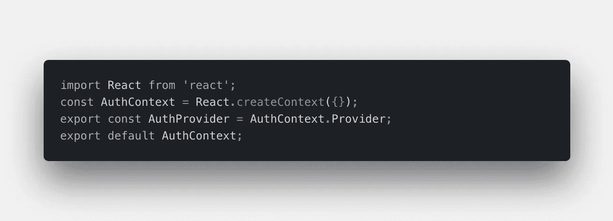

然后我们需要包装父元素，也就是我们希望通过我们创建的提供者分发道具的最高层:

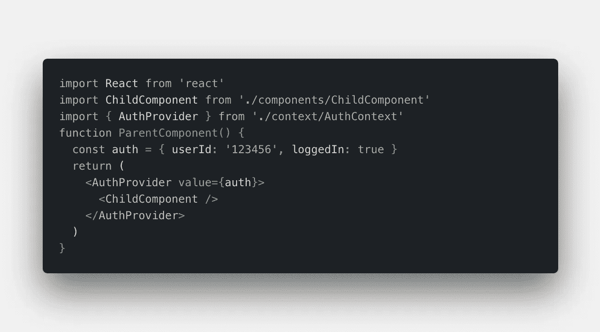

现在，`ParentComponent`的所有孩子都可以使用 auth 作为道具。多酷啊。

现在，我们要做的就是在子组件中使用上下文。我将利用功能组件和`useContext`钩子来实现:

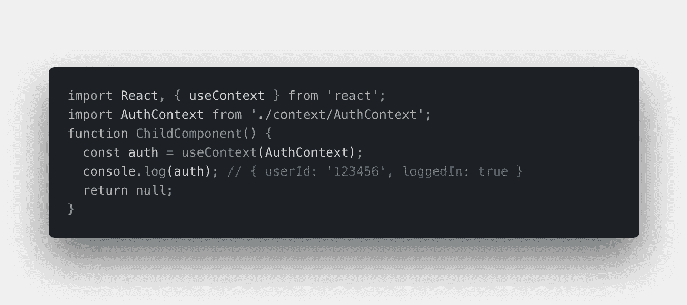

如果嵌套了更多的子组件，它们也可以访问上下文。厉害！

# 样式组件

Styled-Components 实际上属于 CSS-in-JS 库，该库将 CSS 抽象为组件级别，仅使用 JavaScript 来描述样式。它们可以通过 ES6 模板文字符号使用反勾号创建，如下所示:

现在您有了一个定制样式的按钮组件，可以在整个应用程序中使用，而不是普通的 HTML 按钮。所有的样式都被封装，不会干扰 DOM 中的其他样式。很恶心，对吧？

# 反应碎片

很长一段时间，您必须将 return 语句中的所有内容包装到一个 div 中，以便 react 在 DOM 中正确地呈现它，或者使用数组符号。

例如:

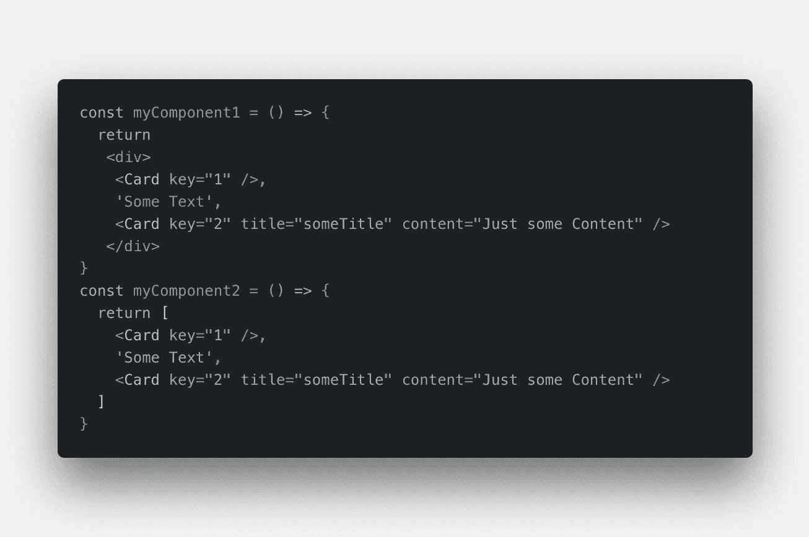

随着 React 片段的引入，您不再需要使用这两种方法。相反，您可以这样做:

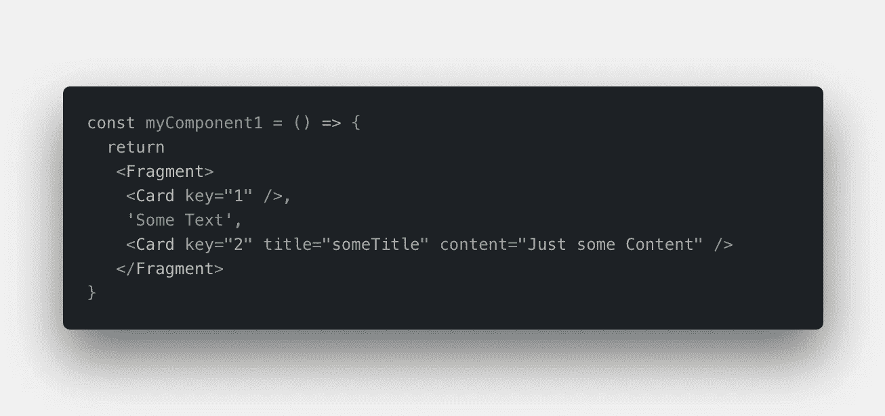

或者，从巴别塔 7 开始，甚至还有这样的东西:

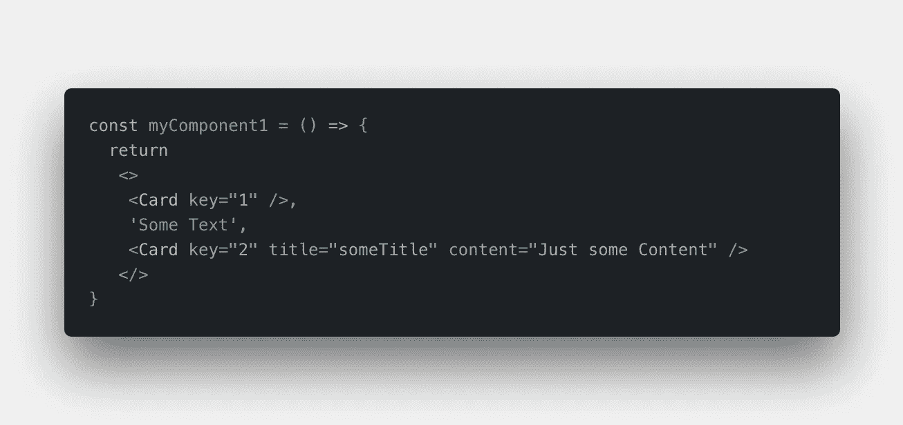

# 使用误差边界

应用程序中有错误是一回事，但是如果它们出现在视图中，至少不会破坏整个应用程序。对于这种情况，React 中已经实现了“错误边界”。这些基本上是可以用来包装其他组件的组件。它们在渲染期间和树的生命周期方法中捕捉错误。通过`componentDidCatch`方法(注意这里还没有 React 钩子，所以你必须使用一个基于类的组件),你可以对错误做出反应，并呈现一个回退或者记录错误。这里有一个简短的例子:

您现在可以像这样使用`ErrorBoundary`组件:

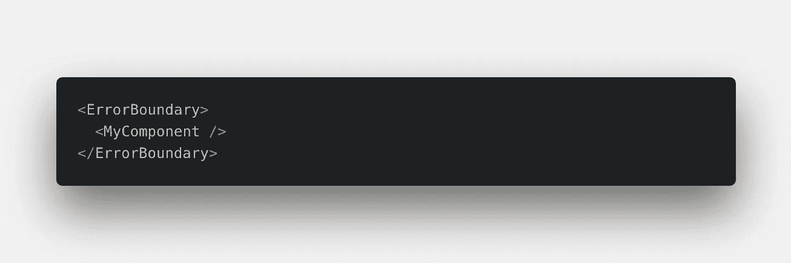

# 反应和打字稿

Typescript 是一个非常热门的话题，也是开发人员近期学习的首选之一。在新版 create-react-app (CRA)中，它内置了对 Typescript 的支持。你只需要在用 CRA 创建一个新项目时添加 typescript 标志，就像这样:

将 Typescript 与 React 一起使用的主要好处是:

*   可用的最新 JavaScript 特性
*   复杂类型定义的接口
*   VS 代码是为 TypeScript 编写的
*   可读性和有效性，以避免开发过程中的错误

下面是在函数式 React 组件中使用 TypeScript 的一个简单示例:

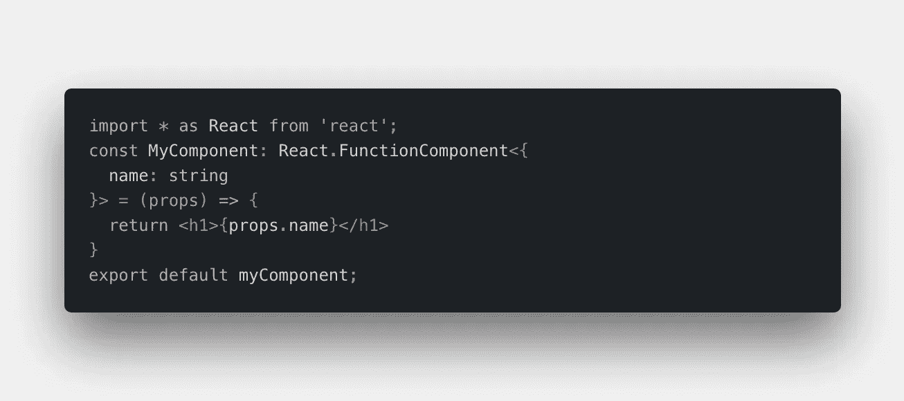

通过界面:

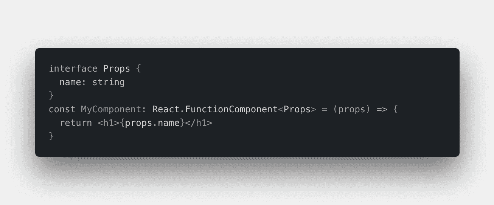

如果你想在 2020 年学到新的东西，一定要试试 TypeScript！

# 测试用 Jest 和酶

每个开发人员都应该测试他们的应用程序——这在许多公司中是强制性的。使用正确的设置测试 React 应用程序会非常酷。一个广泛使用的设置由 Jest 和 Enzyme 组成。看一看！

Jest 默认与 create-react-app 捆绑在一起，是一个测试运行器、断言库和嘲讽库。它还提供快照测试，基本上是创建一个组件的渲染快照，该快照将自动与以前的快照进行比较。如果这两个不匹配，测试将失败。对于单元和集成测试来说，这真的很酷，但是 React 应用程序的真实组件呢？Enzyme 是由 Airbnb 开发和维护的 React 组件测试库，也是 Jest 的理想合作伙伴。

有了这些库，我们可以像这样进行简单的测试:

这测试了我们的一个组件的基本渲染行为。但是我们可以做得更多。例如，测试道具:

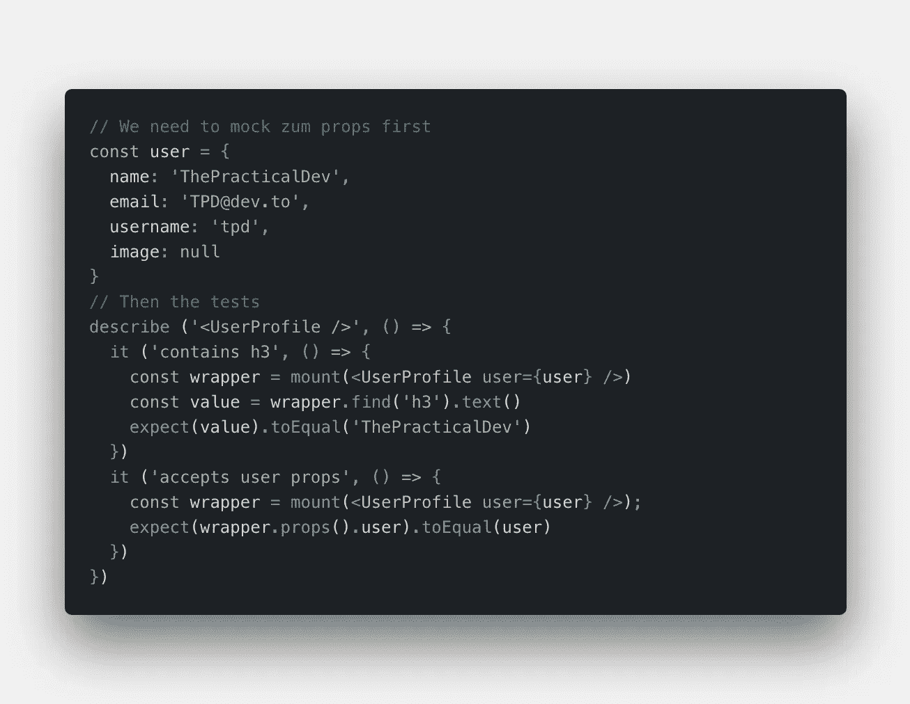

这看起来真棒，对不对？你可以用这个设置做更多的事情，比如模拟 API 调用或者测试生命周期方法…

# JSX 的条件句

编写 JSX 真的很酷，也是 React 的主要特性之一。为了提高你的能力，你可以利用下面的技巧。

不使用这个:

你可以这样做一个短路评估:

# 高阶组件

高阶组件(Higher-Order Components，HOC)是一个高级的 React 概念，用于抽象共享代码，使其在需要时可以访问。这个概念类似于 JavaScript 中的高阶函数——hoc 接受组件并返回组件，但它们本身不是组件；它们是函数。从抽象的角度看，它是这样的:

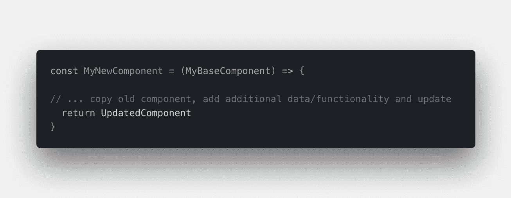

Redux 的“连接”就是一个很好的例子。更实际的例子可能是这样的:

首先，我们用一个元素创建了 HOC ( `colorizeElement`)，这个元素保留了它的所有道具，并为颜色(蓝色)获得了一个新的道具。然后，我们可以使用该链接创建一个新的蓝色按钮，如下所示:

看起来很酷，不是吗？

# React 开发工具

React DevTools 是一个很酷的浏览器扩展，适用于 Chrome 和 Firefox，由脸书 React 核心团队维护。版本 4 于 2019 年 8 月发布——这个扩展对于任何 React 开发人员来说都非常有用。

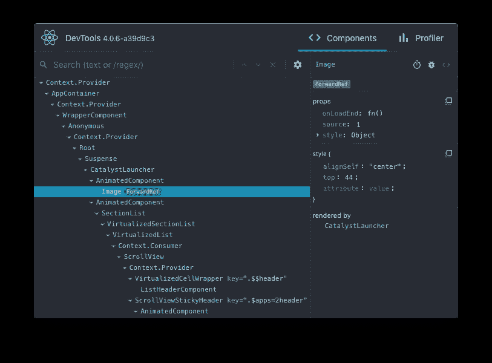

它与 React 和 React Native 配合得很好，并真正帮助您了解 React 应用程序内部发生了什么。

真正酷的是，你可能没有意识到，一些像 Airbnb 和网飞这样的大公司正在使用 React。如果您访问他们的网站，如果您安装了 React DevTools，您可以在浏览器控制台中找到有关他们网站的信息:

看到大玩家在做什么总是很好。同样的事情也可以适用于 Redux DevTools！

# 额外收获:React 开发人员必备的 VS 代码扩展

好了，你已经一路走到这一步了，现在是时候拿点奖金了！我已经为 React Devs 确定了一些最好的 VS 代码扩展。

## ES7 React/Redux/graph QL/React-本机代码片段

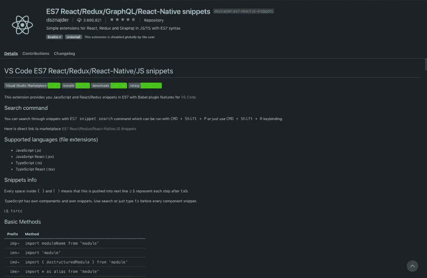

一个非常酷的扩展，有将近 400 万次下载。它给你带来了大量的 React、Redux 和 GraphQL 的代码片段。

## 笑话和笑话片段

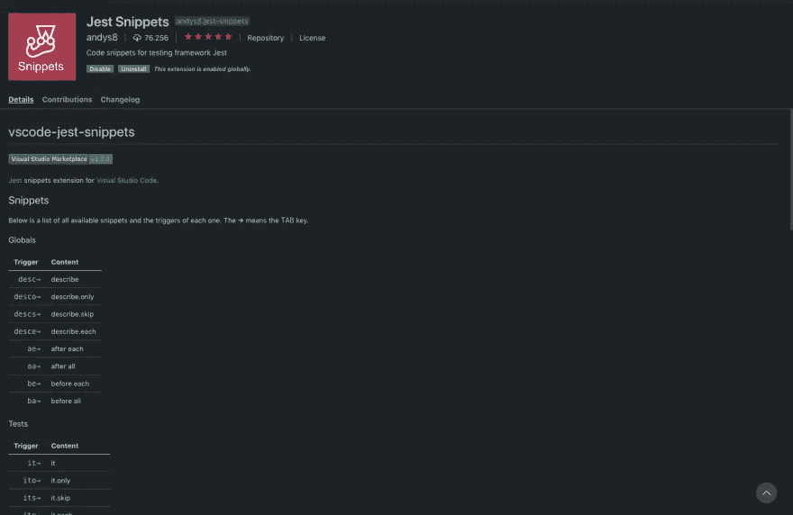

两个扩展与 Jest 完美协调，并为您提供更好的测试片段

## Typescript React 代码片段

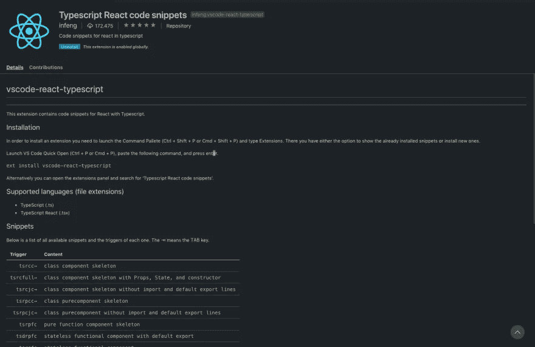

如果您使用 Typescript 和 React，这是一个非常有用的扩展。

虽然这些是专门针对 React 开发的扩展，但是您也应该使用更通用的扩展。我已经写了一篇关于 2020 年前端开发人员的 [10 个最佳 VS 代码扩展的文章，一定要看看这些！](https://medium.com/better-programming/10-visual-studio-code-extensions-for-frontend-developers-in-2020-2700986dba2e)

# 结论

好吧，一切都要结束，这是这件作品的结局。我希望我能给你一些见解，帮助你成为更好的反应开发者，无论你是刚刚起步还是已经是一个有经验的开发者。我很想听听你的意见，所以请随意发表评论。