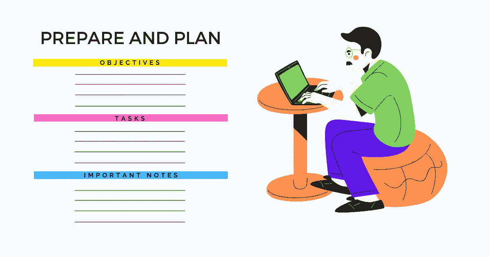
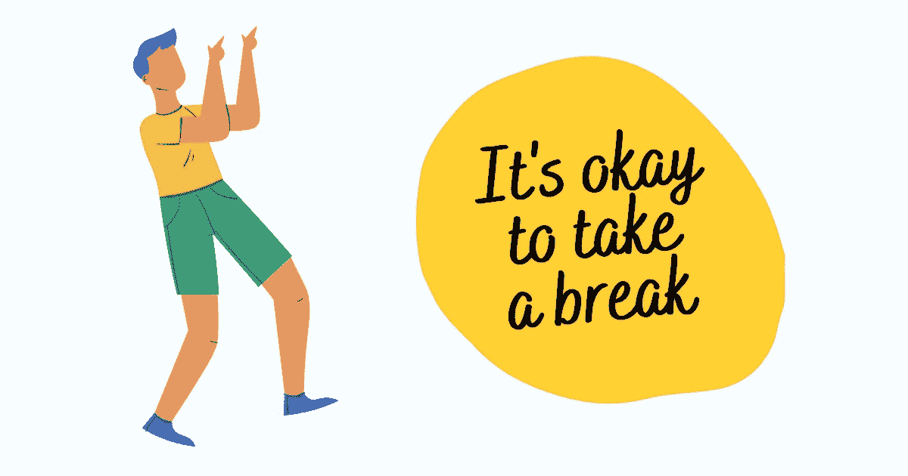
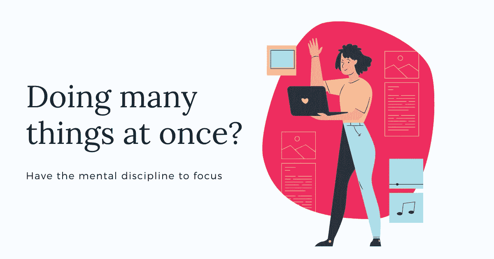
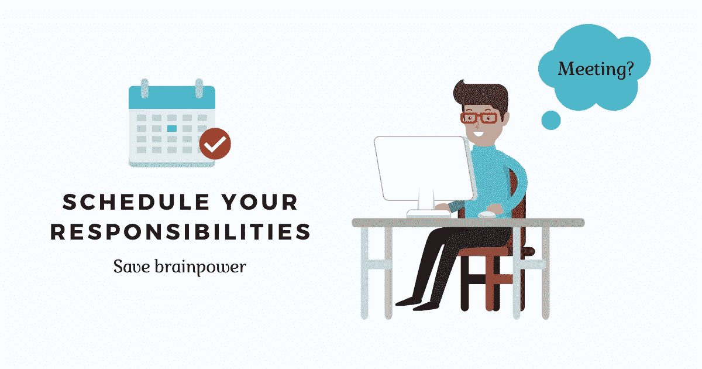

# 每天提高工作效率的 14 种简单方法

> 原文：<https://betterprogramming.pub/14-steps-to-productivity-66bd4f4e0c93>

## 从结果到系统的转变

作者照片。

在我职业生涯的早期，我非常注重用更少的时间做更多的事情。我以为我很有效率。事实上，我只是从一个任务跳到下一个任务，不清楚我的工作是否有效，也不知道如何做得更好。我专注于最终目标，我想要达到的结果，而不是真正关心达到目的的过程。

我没有刻意去做有效的工作，也没有制定有效的工作流程，我实现了一些短期目标。然而，我努力寻找可以帮助我实现长期生产力的有意义的模式。

随着时间、耐心和一路走来的大量学习，我意识到通过专注于重要的事情并对实现预期结果的过程进行可靠的控制，做得更多实际上是做得更少。

就在那时，我发现了什么是生产力。

# 高效意味着什么？

简而言之，生产力是开发一个一致且可重复的过程，帮助我们更高效地完成有效的工作，其中[有效性](https://techtello.com/effectiveness-vs-efficiency/)是做正确的事情。与我们的目标和效率相一致的工作是用更少的资源、时间和精力正确地完成它。

生产力要求我们将注意力从对结果的痴迷转移到系统，即实现结果的过程。一旦我们学会控制自己的系统，使用正确的系统就会产生正确的结果。

以下是我多年来制定的提高工作效率的 14 个步骤，我非常关注这个过程。

# 如何用 14 个简单的步骤掌握生产力

为了提高生产力和工作效率，记住“关注过程”这也意味着花时间在你能控制的领域上，而不是担心超出你控制的事情的影响。

这 14 个步骤虽然是独立的，但却是相辅相成的。他们的力量来自于一段时间内持续不断的小改进。通过应用以前的知识和探索新的更好的做事方法，它们的好处会随着时间的推移而增加，释放出更多的精力来用更少的努力做有意义的工作。

它通过在重要的工作中做和看到微小的进步来启动动力飞轮。

## 1.养成前一天晚上做准备的简单习惯

作者照片。

每天结束的时候花几分钟来确定你第二天想要完成的事情的优先顺序。将工作分成不同的活动块，并列出每个块中你想要实现的目标，这也是非常有用的。

写下事情这一简单的行为不仅会让我们感觉一切尽在掌握，从而增强信心，还会解放我们的思想，让我们真正完成工作，避免对紧急工作做出反应，而不是做重要的工作。

在对任务进行优先排序时，选择那些能让你朝着目标前进的任务，同时避免浪费时间和没有价值的活动。运用帕累托原则，即 80/20 法则，即 80%的成果来自我们 20%的工作，是实现最佳优先顺序的好方法。

采用[艾森豪威尔决策矩阵](https://www.techtello.com/eisenhower-productivity-matrix/)以四象限视图组织任务也很有用，便于参考和优先排序。

这回答了什么。我们还需要确定一天中每项活动的最佳时间，这将我们带到下一步来确定时间。

## 2.用你最精力充沛的时间来做好你的工作

每个工作单位需要不同的体力和脑力资源。了解什么样的任务需要什么样的能量，并通过将能量与工作的身体和精神需求相匹配来优化利用。

利用你的生产力高峰期去做一些你最重要的工作。可以是早上、下午、晚上或晚上——只要你觉得合适就行。不同的人在一天的不同时间工作效率最高。

我是一个早起的人，醒来后的几个小时是做深度工作的最佳时间。随着时间的推移，了解深度工作复合物，它最好用于做重要的工作。

现在我们知道了什么和什么时候，我们已经建立了一个清晰的意图。实现工作效率和生产力需要将其转化为行动，从创造最佳工作条件开始。但是为什么呢？

## 3.创造一个适合你个人需求的舒适工作空间

很多人没有意识到糟糕的工作环境(简单到杂乱的办公桌)可能是压力的巨大来源和生产力杀手。设计一个舒适的工作空间并不直观，也很少被探索，因为我们学会了适应它。

我知道不是每个人都有特权获得自己选择的最佳工作环境，但有意识地努力改善它——即使是很小的方面——可以极大地提高你的工作质量。

问自己这些问题:

*   你有舒适的座位吗？
*   你用对耳机了吗？
*   温度适合你吗？
*   工作的时候有没有补水？
*   你是驼背坐着还是直着坐着？
*   你的桌子太乱了吗？
*   你穿着舒适的衣服吗？

在不理想的工作条件下，我们的思维很容易分心和烦躁，从而影响工作效率，降低我们的注意力。通过有意识的努力观察你周围的什么分散了你的精力或让你在工作时感到不舒服，来控制你的周围环境。然后想办法摆脱。

一旦你有了合适的工作条件，你如何达到合适的思维水平？

## 4.你可能不需要休息，但是你的大脑和身体需要

作者照片。

当我们陷入僵局时，我们会不知所措，焦虑不安。这种状态将我们的思维局限于现有的解决方案，不寻求新的想法，导致我们停止进步或花太长时间来完成一项任务。

当我们达到这种状态时，我们做什么？我们大多数人继续工作，同时感到沮丧、烦恼，甚至因为没有找到正确的答案而生自己的气。在处理思维障碍时继续工作不仅效率低下，而且可能会导致糟糕的决策，并在未来带来严重后果。

当我们不积极思考的时候，我们会体验到新的想法或更好的做事方式。给我们的大脑留出形成新联系的空间，对于发现新的解决方案和克服障碍至关重要。

站起来，去吃点零食，呼吸点新鲜空气，简单地四处走走，不去主动思考问题。伟大的想法会源源不断，不需要你付出努力。

作为一种实践，在每一次深度工作(例如 60 分钟、90 分钟)后，用一个小休息来恢复和补充我们的大脑和身体是非常有用的，以重新激发和发展更好的思维水平来提高生产力。

发展更好的思维方式是提高工作效率的一个很好的方法，但除非我们也学会控制自己的思想，否则我们可能会浪费大量时间在自动走神和分散注意力的思维上，这会打断我们的工作流程。怎样才能学会控制自己的思想？

## 5.不要让你的思想控制你

大卫·洛克在他的书《你的大脑在工作》中对此做了精彩的总结:

> “我决定对自己的精神状态负责，而不是环境的受害者。在我做出这个决定的瞬间，我开始看到我周围更多的信息，我可以察觉到感到更快乐的机会。这是一次寻找选择并做出选择的经历，它改变了我在那一刻的感知。”

最重要的是要意识到，我们都有被思想冲昏头脑的倾向，虽然看起来它们超出了我们的控制，但我们可以通过实践来学习管理它们。

有意识地努力让自己行动起来，把注意力重新放在工作上。我们的头脑不会停止在我们的头脑中运行这个持续不断的流，除非我们学会识别它并控制它。

学会对自己的想法说不，感觉自己很强大，这很好。但是对别人说不呢？对每件事都说“是”不是很没效率吗？

## 6.学会对没有附加值的事情说不

富有成效需要对与你的目标和使命不一致的工作说不。拒绝并不容易，但这是专注于真正重要的工作的唯一方法。记住，生产力不仅仅是把事情做对。这也是做正确的事情。

一旦你克服了对说“不”的恐惧或渴望被人喜欢，你就不会再担心你的“不”会让某些人感到不安或他们会有什么反应。精心设计的“不”可以让双方进行更有成效的讨论，并就结果达成一致。

还有一些其他的事情会让你偏离你的计划。电子邮件？

## 7.只有当你抑制住打开邮件的冲动时，你的邮件才能等待

作者照片。

如果管理不善，电子邮件会影响工作效率。即使是很小的一瞥也会分散我们做重要工作的注意力。快速浏览从来都不是真正的快速，因为我们脑海中那些电子邮件的图像留给我们做有意义工作的空间更少。

中午之前最好不要打开邮件。在午餐前安排 30 分钟或 1 小时的时间，然后在晚上或一天结束时再安排一次。对你最合适的。做你前一天晚上计划好的事情，防止虚假的紧迫感接管你的一天，确实需要很强的自制力。

如果事情真的很紧急，组织中的人会找到更好的方式来联系你。

管理的电子邮件。还有哪些干扰会影响你的工作效率？

## 8.如果你无法抗拒诱惑，排除杂念

专注的工作需要远离干扰的时间。查看社交媒体、查看你的通知、浏览手机都是浪费时间的活动，会阻碍你实现目标。

意识到你的分心是消除它们的第一步。如果你是我这样的人，增加摩擦可能是阻止他们的有力方法。在做重要工作时，我会注销所有的社交媒体账户。必须提供登录信息这一简单的障碍阻止了我过于频繁地查看它们。

另一个对我很有效的策略是安排时间做这些活动，作为我日常计划的一部分。知道我阻塞了时间让我更能容忍在我其他计划好的工作中不检查它们的想法。

一旦我们设法排除一切干扰，真正开始工作，开始的最好方式是什么？

## 9.制定简单的常规来开始你的活动

对未知任务的焦虑可能会阻止我们开始。“如果我不能按时完成，该怎么办？我会做好吗？我有能力吗？别人不喜欢我的作品怎么办？”甚至在我们开始之前，我们头脑中不断的喋喋不休会阻止我们取得任何进展。

打破入门的障碍需要动力。它不是来自等待合适的时间或合适的想法来点击。动力来自于推动我们朝着目标前进的微小行动。

建立常规可以激活我们大脑中的模式，克服开始时的精神障碍。对于我的写作，我总是从概述一篇新文章的要点或阅读我前一天写的东西开始。这个简单的行为激发了继续做更多事情的动力。

确定哪些惯例对你有用，并把它们作为开始的诀窍。

一旦你真的开始工作，你能在多项任务之间转换，并且仍然有效率吗？

## 10.同时做许多事情和什么都不做一样好

作者照片。

对于需要深入思考的重要活动，我们需要有专注于这项任务的精神训练。同时做很多事情会让我们的大脑被太多的信息搞得晕头转向，阻止它产生有用的见解来完成工作。

不断地在不同任务之间穿梭可能是领导者和管理者保持忙碌的一个很好的借口，但如果不学会管理时间，他们就无法做那些能促进组织和员工发展的工作。

提高效率的一个有用的技巧是一个接一个地安排类似的活动。它使得进步更快，因为从先前活动中获得的学习和输入直接输入到新的任务中，而不需要额外的精神努力来形成新的联系。

例如，如果我必须写职位描述并为招聘策略做宣传，我更喜欢在制定招聘策略后马上安排职位描述。从招聘策略中得到的信息可以直接用于撰写职位描述。

一旦我们学会训练我们的大脑一次专注于一项任务，我们也需要训练我们的大脑放弃自己做所有事情的冲动。

## 11.多做就是自己少做

授权有多种好处:扩大规模、建立信任和授权他人。生产力恰好是正确选择授权的副作用。专注于你能做得最好的事情，把其他事情委托给别人。

委派并不容易，只有当你设定了明确的期望并与结果一致时，委派才会有效。最初，这可能看起来像是很多工作，你的头脑可能会诱惑你自己去做，但你可以学会放弃诱惑，以实现长期的生产力。

随着你学会更多地授权，你会有足够的空闲时间去做重要的事情。

让人类从事可以通过自动化实现的工作也是不明智的。科技带来了一些美丽的解决方案。确定你重复性工作的哪一部分可以自动化，并充分利用技术来实现自动化。

建立你自己的生产程序是很棒的，但是没有别人的合作它会起作用吗？

## 12.建立沟通指南

如果你的工作需要与他人沟通和协作，除非你与他们建立沟通准则，否则你不会有成效。在不知道联系你的最佳方式或何时联系你的情况下，别人可能会在你最有效率的时候继续打断你。

定义用于不同类型问题(电子邮件、电话、聊天)的媒介，并广播你有时间回答询问、帮助同事或工作需要的任何其他事情的时间段。

有意识地每天花几个小时来计划计划外的工作，以避免每次有人提出要求时都做出反应。

你可能有很好的记忆力，但试图记住一切并不是对你精神资源的最好利用。

## 13.不要把你的脑力浪费在记忆事情上

作者照片。

我们的大脑无法同时容纳太多的信息。让大脑腾出时间来处理需要的信息是提高生产力最简单的方法。

让自己有条理并在正确的时间做正确的事情的最好方法是安排好你的职责。发送日历邀请，设置提醒。

调度还通过从过程中去除决策来节省能量。一旦它出现在你的日程表上，你就不需要再做决定了。

这是释放你全部潜力的开始。

## 14.好习惯播下生产力的种子

好习惯是释放你最大潜能的关键。检查哪些习惯让你充满活力，哪些习惯让你效率低下。除非你学会改变你的习惯，否则你可能会完成工作，但这将远远低于你的能力。

多了解自己。健康的饮食、良好的睡眠、不断的学习是健康身心的一些最基本的需求。此外，做你真正喜欢的事情——即使每天只有很短的时间——也能让你重新集中注意力，释放创造力。

# 结论

一旦你改变心态，把注意力放在过程而不是结果上，你会发现新的和创造性的方法，每天都更有效率。

记住三个 P:生产率，重点放在要改进的 T2 过程和 T4 持久性上。