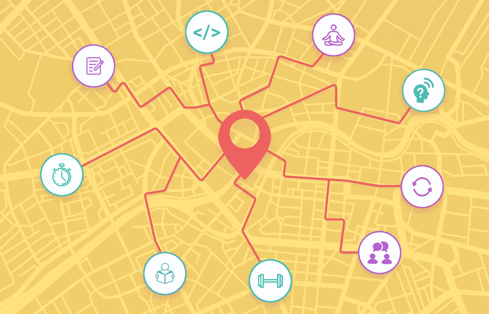

# 提高编程能力的 18 种方法

> 原文：<https://betterprogramming.pub/18-ways-to-improve-your-programming-3fd1bfcd556>

## 在过去的五年里，我艰难地学会了许多小技巧

玛格达·瓦克斯伯格拍摄的图片。

# 1.学会如何有效地学习

这是你一生中最重要的技能。说真的。软件开发人员一直在学习。而且即使编程对你来说只是一个爱好，你还是需要高效的学习。

基本原理很简单。为了有效地学习，你必须养成一种习惯——最好是每天学习。此外，使用这三种技术:

*   主动回忆——试着从记忆中检索信息，而不是重读。你可以使用抽认卡或类似的工具。
*   间隔重复——从长远来看，死记硬背不起作用。你需要有规律地学习，在几周或几个月内重复几次材料，直到你理解为止。
*   测试——我们在学校进行测试是有原因的。当我们准备考试时，我们会集中注意力。寻找在线测试来巩固你的学习。它会大大加快你的进步。

# 2.找点乐子

你会挣扎。编程很难。你会经常失败。无论是一些晦涩难懂的 bug，还是你无法把握的概念，挑战都会出现。面对逆境保持动力的最好方法是什么？通过玩乐！

从你的任务中休息一下，在编程中找到一些乐趣。你可以解决算法难题，看看创造性的编码，或者创建一些愚蠢的应用程序——只要能让你微笑。

编程不是一件苦差事。你需要享受一段美好的时光，找到能激发你好奇心的东西，所以要寻找机会让自己开心。

# 3.学会搜索信息

你会花很多时间搜索信息。你需要学会如何熟练地做这件事。

Google、Stack Overflow、GitHub 问题会成为你的天然栖息地，所以要确保你能有效地利用它们。当你需要寻找一些琐碎的事情时，不要害羞——我们都会这样做。

# 4.不要拖延(太多)

熟能生巧。就这么简单。再多的教程、课程和训练营都无法替代它。你会很想报读另一门课。不要这样做。

你不需要其他视频反复解释这些相同的主题。你需要自己建造东西。你做的每一个 app，都抵得上几十个教程。创造、失败、探索——这就是你成长的方式。

# 5.了解调试基础知识

没有什么比一个你找不到的 bug 更烦人的了。有时项目会因为一个讨厌的 bug 缠着你而停止几个星期。不幸的是，调试是编程的一大部分，你必须掌握它。

学习调试技术，学会高效地使用日志和调试器。作为一个快速提示，我推荐通过分治法进行调试。这是一种技术，你把可疑的代码分成两半，看看哪一半看起来有问题。在越来越小的代码部分上重复，直到找到罪魁祸首。

# 6.做体力工作

通常你会遇到一个问题，却不知道如何解决。从头开始创建一个巨大的应用程序似乎是一个不可能的冒险。不要想怎么做，去做。分离出一些小部分，开始编码。

你不需要创造完美的代码。你需要拥有一些东西，尝试一些想法。这会让你更好地理解你的问题。

编程前的思考是必要的，但是只有当你动手的时候，你才会知道你的计划是否可行。

# 7.考虑周到——编写可读的代码

> 任何傻瓜都能写出计算机能理解的代码。优秀的程序员会写出人类能理解的代码。”——[*马丁福勒*](https://en.wikiquote.org/wiki/Martin_Fowler)

这句话应该成为你的口头禅。构建应用程序是一项团队运动，你必须通过你的代码与其他团队成员交流。即使你独自完成一个个人项目，你也是在和别人交流——你未来的自己。

要体贴。想想那些会阅读你的代码的人。研究代码的可读性和可维护性。你将很快获得收益。

[潘晓珍](https://unsplash.com/@zhenhappy?utm_source=unsplash&utm_medium=referral&utm_content=creditCopyText)在 [Unsplash](https://unsplash.com/s/photos/clean?utm_source=unsplash&utm_medium=referral&utm_content=creditCopyText) 上拍照

# 8.自己收拾干净

我敢保证，你会把你的代码弄得一团糟。应用程序倾向于向不可预测的方向发展，代码不可避免地变得越来越混乱。一段时间后，它会变得笨拙，每个微小的变化可能需要几十次调整。

为了避免这种情况，每次接触文件时都要清理一下。去掉那些妨碍代码理解的不必要的东西。移除未使用的变量，更改其他变量的名称。删除过时的评论，简化你的抽象。让代码处于比遇到时更好的状态。

# 9.阅读代码

你知道你如何成为一个伟大的作家吗？通过阅读伟大的作家，并试图模仿他们，直到你找到自己的声音。程序员也是一样。

寻找代码质量很好的开源项目，并努力理解它们。如果你的公司有一些熟练的开发人员，看看他们的承诺。研究大师的代码，并尝试从中学习。阅读他们的代码就像阅读他们的思想——利用这一点。

# 10.博客

你应该有个博客。句号。它可以有多种用途。你可以把它作为你进步和成长的日记。你可以从写作中学到很多你正在学习的东西。这个过程会巩固和组织你的知识。你可以帮助其他面临同样问题的人。也许你甚至会找到一份工作或者建立一个社区。只写博客。

直到我开始编程之旅的第五年，我才开始写博客。是我最大的学习遗憾。

# 11.理解你为什么写代码

你的工作是解决问题，而不是写代码。学会如何识别你试图解决的问题:你的客户或老板的要求。

作为程序员，我们倾向于在不重要的事情上浪费时间。我们像打磨一辆价值连城的汽车一样打磨我们的代码。但是代码只是一个工具。产品才是最重要的。富有成效和忙碌是不同的。富有成效不同于完美主义者。高效就是提供价值。提供值的代码。

# 12.每日编码

每天安排一些最小的编码时间。你可以休息一两天，但是养成编程的习惯是必不可少的。

尼尔·盖曼[曾经](https://www.youtube.com/watch?v=ikAb-NYkseI)说过:

> 做只有你能做得最好的事情:创作好的艺术。在不景气的时候创作，在好的时候也创作。

也许你的代码还不是艺术，但你应该听听尼尔的。作为一名开发人员，一致性是成功的关键。

由 [Adolfo Félix](https://unsplash.com/@adolfofelix?utm_source=unsplash&utm_medium=referral&utm_content=creditCopyText) 在 [Unsplash](https://unsplash.com/s/photos/notes?utm_source=unsplash&utm_medium=referral&utm_content=creditCopyText) 上拍摄

# 13.做笔记

你会忘记今天所读的几乎所有东西。不要相信你的记忆，记录下所有的事情——你遇到的问题和你是如何解决的。算法，函数，学习资料。一切。

你可以把你的博客作为一个空间来记录你的笔记或者其他无数可用的工具。你觉得怎样都行。但是请做好笔记。建立自己的知识数据库。

# 14.详细说明

你不能成为万事通。编程太庞大，你永远学不会所有的东西。此外，专家往往会得到丰厚的回报。

尤其是如果你是一个初级开发人员，你需要选择你的技术堆栈。没人指望你什么都懂，但你应该对*某事*有深入的了解。

# 15.拥抱失败

编程很难。你失败的次数会比你想象的多得多。这很好。只要你遇到新的失败方式，你就在进步。

秘诀就是不要对自己太苛刻。拥抱失败，认识到这是过程中必不可少的一部分。超越你的极限。让失败成为你的朋友。

# 16.懒惰

到处找优化。尽可能自动化每一件平凡而无聊的事情。在你的工作中寻找模式，重复的代码，或者类似的特征。然后将它们自动化。

每一行代码的编写和维护都很昂贵。寻找写更少代码的方法，你会发现你有更少的错误和更好的质量。使用经过良好测试的库，而不是从头开始编写一切。

利用您所掌握的工具，用最少的时间和代码创造最大的价值。

# 17.休息

照顾好自己的健康是你能为自己的职业生涯做的最好的事情之一。还有你的生活。我不会深入讨论所有的过度工作的缺点，只是列举其中的几个:压力水平上升，精力下降，睡眠问题，感觉心烦意乱，情绪变化。你会干得更糟。

过度劳累不值得，真的。设定一些界限。对一些人来说，一周工作 40 小时是最长的了。其他人可以工作五六十年。你的极限在哪里并不重要。重要的是不要超过它。

# 18.好奇

当我招聘初级开发人员时，好奇心是我所寻求的。一个好奇的人总是想了解更多，理解事物是如何工作的以及为什么工作。对我的公司来说，你的长期贡献比你目前的技能更重要。

感兴趣。这将有利于你的成长和求职。也会让你的生活更加有趣。

# 结论

这是一个很大的提示，但还有更多。也许你有什么要补充的？