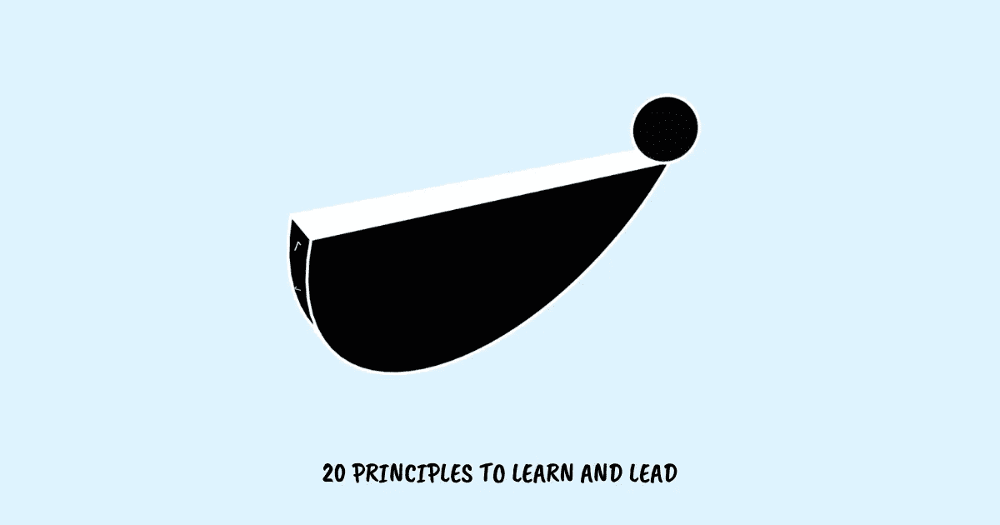

# 学习和领导的 20 条原则

> 原文：<https://betterprogramming.pub/20-principles-to-learn-and-lead-8367191e94a8>

## 你的成长离你的舒适区只有一步之遥

作者图片

做一名经理并不容易，任何告诉你不容易的人都不是在做他们的工作。

等式中有太多的因素——你、你的直接下属、你的老板、跨职能团队、利益相关者、你的组织文化、外部市场、行业、竞争——他们都在你作为一名经理的成功中发挥着至关重要的作用。

你不能期望等式中的每件事都是正确的，并按照你预期的方式工作。肯定会有这样或那样的事情出现。不止一件事会出错。在任何一天都会有你无法应付的惊喜。

那只是一个管理者的生活。这并不美好，但是很有成就感。所有的不确定性和困惑要么会让你迷失方向，因缺乏控制而不知所措，要么你可以拥抱它，并把它作为前进的动力。

作为一名管理者，你可以超越所有的随机性和混乱，采取一种没有任何事情可以把你拖垮的心态。通过实践这 20 条原则，你可以领导并取得成功。

# 从信任开始

没有信任，你就无法有效地领导，而信任是通过首先放弃来形成的。

传达出你对他人的技能有信心，你重视他们的判断，你关心他们的意见。让他们感受到被重视和尊重。

当你这样做时，好事就会发生在你身上，因为自然法则规定“你做的一切都会回到你身上。”当你从信任开始，其他人会以同样的方式回报你。

# 尽全力倾听

真诚地倾听他人需要很多力量和精力。我们大多数人听的目的是回答，而不是理解。

[真正的倾听](https://www.techtello.com/effective-listening-makes-better-leaders/)包括同情他人的需求，识别他们关心的事情，理解他们的挣扎，了解他们的优点和缺点。

当你听的时候，你就明白了。当你理解了，你就联系了。一旦你们联系起来，你们就能一起创造美好的事物。你会变得不可阻挡。

多练习听，少练习说。你会找到别人甚至不知道的解决方案。

# 直面你最大的恐惧

你最害怕的是什么——别人可能不喜欢你？你可能会辜负他们的期望？你可能无法兑现你的承诺？人们会发现你是个骗子？

不管是什么？意识到，接受你的恐惧，否认它们控制你行动的力量。不要让他们诱使你选择更安全的选择或坚持流行的观点。也不要让你的恐惧成为不作为的借口或理由。

真正的成长往往隐藏在你最大的恐惧背后。

# 拥抱新的思维方式

不要让你今天所知道的限制了你的想象。挑战传统智慧；愿意坚持大胆的行动。

有勇气做出艰难的决定，有信心独挡一面。你不能取悦你的成功之路。你不能让每个人都开心。

从人群中脱颖而出的唯一方法是代表不同的东西。

# 改变你衡量成功的标准

作为一名经理，你如何衡量自己的成功？它不再是一个孤独的游戏。如果你的团队做得好，你也做得好。当他们成功时，你也成功了。优化您的决策和思维，最大化您的[团队的产出](https://techtello.com/how-to-delegate-work-effectively/)。

成功不是个人的成就。这是对你的团队集体成果的衡量。

# 优先考虑人员

大多数战略计划不会因为糟糕而失败。他们失败是因为参与其中的人。

一个伟大的商业战略，一个优秀的产品开发路线图，一个强大的营销活动，如果没有创造一个环境，让人们可以释放他们的才华，利用他们的技能，并无所畏惧地运作，是没有用的。

你最好的资产是你的员工。优先考虑他们的学习和成长。

# 向内看这个过程

当事情出错时——它们会出错——不要担心结果。关注过程。

你不能控制结果，但你肯定可以控制过程。当你纠结于结果时，你无法解决问题。然而，当你关注这个过程时，你肯定会找到解决办法。

花时间和精力优化你的投入。你的输出会自动调整。

# 远离有害的积极情绪

不要摆出一副不要担心，要开心的表情。不要把不好的结果或不好的经历往好的方面想。出了问题不要活在否认中。

如果事情很糟糕，就说出来。当有问题时，承认它。你可以在没有破坏性积极性的情况下激励和疏通人们。

乐观是强大的。毒性阳性不是。

# 练习好奇心

无论发生什么，好的或坏的，保持好奇。好奇心将使你能够区分噪音和信号，好的和坏的，可能的和不可能的，正确的和错误的。

提问。向他人学习。花时间获取广泛的多学科知识，因为这将使你能够将多个领域的想法联系起来，并找到以前似乎不可能的解决方案。

当你好奇的时候，一切似乎都有可能。当你不是的时候，即使是显而易见的答案似乎也是不可能的。

# 对失败有很高的容忍度

你可以稳扎稳打，坐在自己的舒适区接受平庸，或者你可以走出去，承担风险，拥抱失败，创造卓越。

当失败被认为是破坏性的时候，它会使人变得虚弱；当它被付诸建设性的行动时，它会使人变得强大。

你会失败的。把你的失败变成成功的[教训](https://www.techtello.com/failing-to-succeed/)。

# 建立情感灵活性

情绪敏捷比情商领先两步。情商是一种与他人相处并以同情心领导他人的能力。情绪流畅性，情商之后的下一步是理解你的感受，并使用特定的语言来很好地交流这种感受的能力。

第三步是情感敏捷，这不仅需要理解情感并拥有描述情感的语言，还需要知道何时以及如何交流这些情感。

在界限内表达你的脆弱。它会让你真实可信。

# 过度沟通

不要传达不需要说的东西。过度传达需要执行的内容。

有需要交流的愿景吗？需要澄清的策略？需要确认的计划？表达清晰，沟通有力。一次都没有。直到需要这些信息的人很好地记住它。

使用过度沟通作为传播关键信息的策略。

# 设定标准

作为经理，你的行动胜于雄辩。你告诉别人的远没有你所容忍的重要。

你如何处理团队中的不良行为？当有人表现不好时你会怎么做？容忍糟糕的表现和不良行为会将它们转化为团队可以接受的标准。

设定并传达标准。通过让人们对更高的标准负责，你可以将他们推向模范的表现。

# 站起来说话

不要让任何人拖垮你的团队。在工作中卷入玩世不恭和指责游戏可能会在道德上打击士气，令人沮丧，并且毫无成效。

当情况需要时，不要羞于站出来为你的团队说话。让他们远离有毒物质和工作中的[政治](https://www.techtello.com/office-politics/)，它们会妨碍他们的表现。

保护你的团队远离消极。这会影响生产力。

# 守护你的优先事项

知道什么不该做和知道什么该做一样重要。前进不是做很多事情。就是做几件事，把它们做好。

保护你的优先事项可能会让一些人不安。作为经理，你的工作不是保护他们的感受。而是做正确的事情。

作为一名经理，说“不”是你最好的策略，以保护那些需要强烈“是”的事情。

# 管理你的时间

忙碌的状态是经理最大的敌人。这是一个很好的借口，努力工作却没有增加价值。

让别人决定你如何度过工作时间不会让你成功。通过仔细计划你的一天来管理它。

每个人一天都有同样的 24 小时。好好利用它们，不要把它们都用在工作上。

# 学会简化

很容易复杂化。简单需要努力。

作为一名管理者，你有能力消除疑虑、复杂性和困惑，找到每个人都能理解的解决方案。

学会用基本原则和其他有用的心智模型战胜复杂性。

# 关注优势

你不会因为缺乏任何弱点而鹤立鸡群。你将会基于你明显的优势脱颖而出。这也适用于你的团队。

当有疑问时，关注优势。

# 不舒服也要舒服

你不能坐在自己的舒适区里，期待伟大的事情发生。

承担风险，迎接挑战，坚持完成困难的任务可能会让你暂时感到不适，但从长远来看，这会让你成长很多。

不舒服也要舒服。你的成长离你的舒适区只有一步之遥。

# 别忘了玩得开心

最后，当工作感觉有趣时，它就容易了。不要对自己太苛刻。做一个好经理不是一天的工作。这需要一生的经历。

给自己空间和时间。当你对过程有耐心时，好事就会发生。

# 摘要

1.  有了正确的原则，成为一名经理会是一次有益的经历。
2.  先相信别人。当你这样做时，其他人也会以同样的方式回报你。
3.  多听，少说。你会发现真正的问题并找到更好的解决方案。
4.  不要试图摆脱你的恐惧。但也不要让它们成为无所作为的理由。勇敢面对你的恐惧。
5.  如果你想脱颖而出，挑战传统的思维方式和做事方式。
6.  拥抱团队的力量。用他们的工作成果来衡量你的成功。
7.  不把人放在第一位，你所做的一切只能导致不合标准的表现。
8.  不要忘记你的目的地，但要始终关注到达目的地的道路。当你专注于过程时，任何目的地都可以达到。
9.  积极是好的，只要它是现实的。没有人喜欢虚假的希望感，或者对糟糕情况的积极看法。
10.  好奇心会打开你的思维，让你发现以前看起来不可能的可能性。
11.  把你的失败作为接近成功的媒介。
12.  只要你学会如何交流情绪以及何时该表达情绪，在工作中表达情绪是件好事。
13.  你不能说一次就指望人们记住。对于任何重要的事情，过度沟通。
14.  你的容忍为你的团队设定了标准。如果你想要高标准，那就用行动来证明。
15.  保护你的团队免受工作中负面力量的影响，这些负面力量可能会损害他们的表现和生产力。
16.  分清轻重缓急。更多的工作不一定会带来更好的结果。
17.  学会管理好你的时间是你工作中最重要的部分。不要让别人决定你怎么花。
18.  分解复杂性，用简单性来呈现它，这将是你作为管理者的超能力。经常用。
19.  充分了解自己的优势。当面对不确定或怀疑时，记得利用你的优势。
20.  真正的成长发生在你不舒服的时候。当你有感觉的时候，知道你在正确的轨道上。
21.  最后，一路走好。记住，随着时间的推移，一切都会变好。你只需要对这个过程有耐心。

在 Twitter 上关注我，了解更多故事。

*这个故事最初发表于*[*【https://www.techtello.com】*](https://www.techtello.com/becoming-a-manager/)*。*