# 我不能没有的 20+ VS 代码快捷方式

> 原文：<https://betterprogramming.pub/20-vs-code-shortcuts-i-cant-live-without-ee2026a64f14>

## 不是最花哨的快捷方式，而是我每天大量使用的


克里斯汀·威尔逊在 [Unsplash](https://unsplash.com?utm_source=medium&utm_medium=referral) 上拍摄的照片

当谈到软件开发时，我渴望生产力，而 VS Code 提供了很多。

在`keybindings.json`的 753 个动作中，我想和你分享我经常使用的动作。这些不是最漂亮的，但是我真的不能没有它们。

# 1.命令选项板

你在 VS 代码里能做的每一个动作都在这里。这是一个探索提高生产力的好地方。

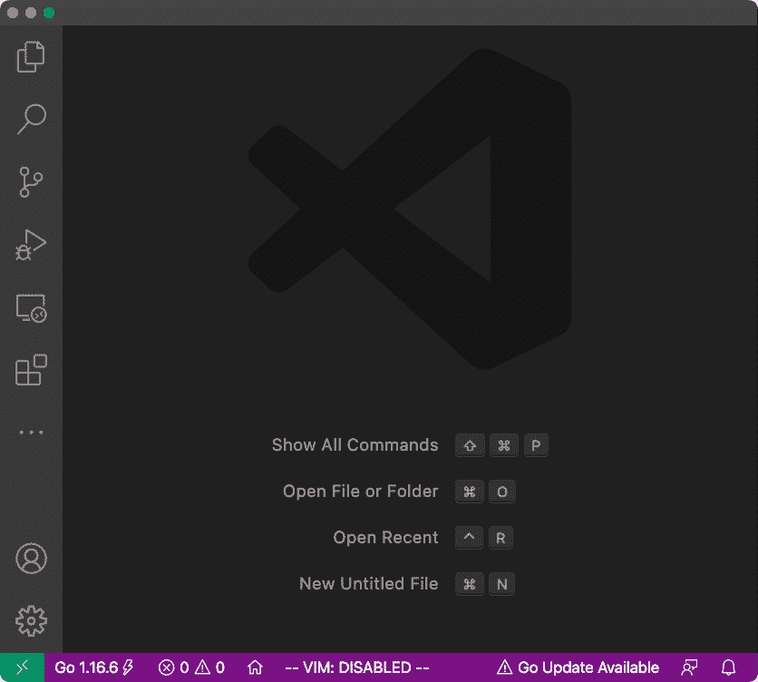

⇧⌘P (macOS)，⇧^P (Windows)

# 2.编辑

## 删除行

在许多情况下，一行可以是一个语句，这是删除的基本单位。当你在一行的中间，你突然后悔写了它，点击`⇧⌘K`去掉整个，而不是走到行尾，点击一千次 backspace。

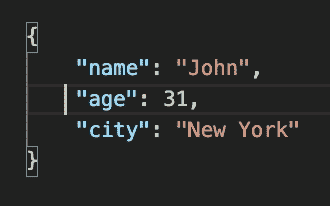

⇧⌘K (macOS)，⇧^K (Windows)

## 切换注释

大多数语言都有一个块注释`/* like this */`来注释掉多行代码。但是，添加块注释需要过多的光标移动:

*   移动到目标块的头部
*   类型`/*`
*   移动到目标块的末尾
*   类型`*/`

为什么不选择一个，然后点击`⌘/`把它们都注释掉呢？


⌘/ (macOS)，^/ (Windows)

此外，您不能在块注释的“外部”添加块注释。如下例所示:

```
line1
/*
line2
*/
line3
```

给`line1`加一个块注释到`line3`很痛苦，因为中间有一个块注释。

`⌘/`优雅地解决了这个问题。它不使用块注释，所以你可以在任何你想要的地方切换注释，甚至是在注释代码块的中间。

## 选择下一个事件

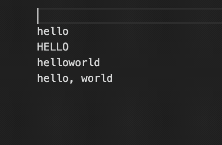

⌘D (macOS)，^D (Windows)


选择文本→ ⌘D (macOS)，^D (Windows)

使用此选项高亮显示并导航到您能想到的变量、函数或文本的附近出现处。例子包括:

*   突出显示`#<space>`并按下`⌘D`以在减价中跳过所有`h1`标题(可能会有一些误报，但当您只是想四处看看时，这没问题)
*   突出显示 JSON 文件中的`"name": "Henry`,并按`⌘D`跳过以 Henry 开头的名字

一旦你使用它，你会发现自己使用`⌘F`或`⇧⌘F`的频率减少了，因为`⌘D`不仅为你搜索文本，而且它还会立即将你的光标带到下一个出现的地方，再次按下它会将你带到下一个。

额外收获:利用这种细微差别

*   选择文本→ `⌘D` →不区分大小写匹配(regex: `/word/i`)
*   没有选择文本→ `⌘D` →完全匹配(regex: `/\bword\b/i`)

## 选择所有事件

当你决定替换文本文件中所有出现的`hello`时，我总是使用`⇧⌘L`而不是`⌘F`中的替换特性。

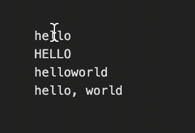

⇧⌘L (macOS)，⇧^L (Windows)

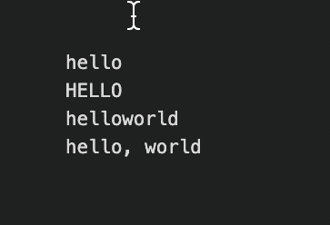

⇧⌘L (macOS)，⇧^L (Windows)

## 添加多个光标

当您想要对多行执行相同的操作时，只需将多个光标添加到感兴趣的位置并开始编辑。示例用例:在下面 3 行中添加一个逗号。

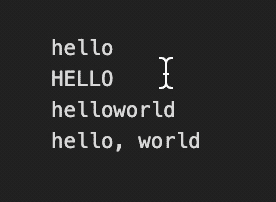

点按时按住⌥

## 框选择

有两种方法可以做到这一点:

*   中键单击+拖动选择
*   `⇧⌥` +拖动选择

我们的代码经常被 ide 或者像`go fmt`这样的工具格式化。因此，许多相同性质的代码块是对齐的，有时我们希望将它们作为一个整体来编辑。

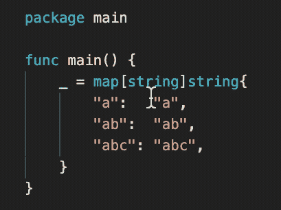

示例用例:删除键值映射文本中的所有值。

这种情况比您想象的要多得多，这就是 iTerm 具有相同功能的原因。(使用不同的快捷键:`⌘⌥` +拖动选择)

## 退出多光标

上述选择方法将我们带入多光标模式，下面是退出的方法:

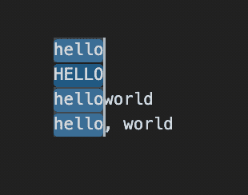

退出多光标:

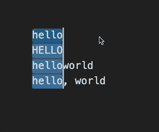

退出多光标:单击任意位置

## 将以上内容放在一起:多光标编辑

现在，让我们结合以上来释放超能力。

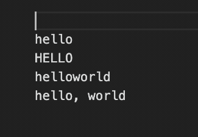

删除带有“hello”的行

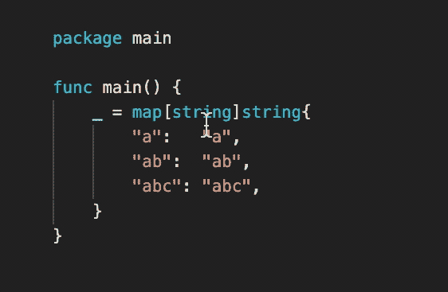

编辑重复的模式

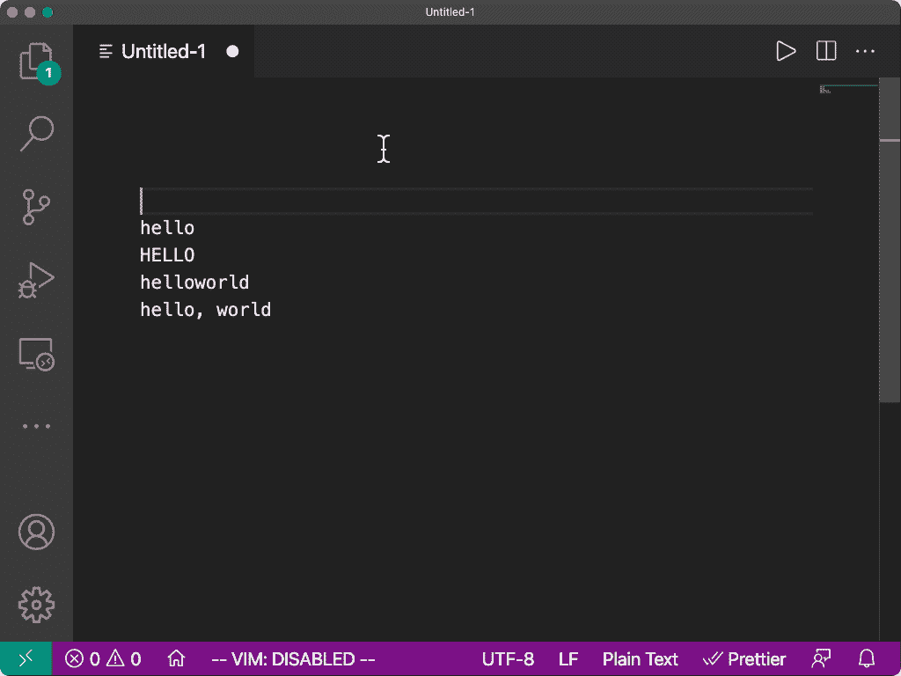

所有出现的“hello”都大写

思维模式:做出选择(例如`⌘D` ) →执行操作(例如删除行)

*   如果你知道 10 个动作→多学 1 个选择方法=口袋里多 10 个组合
*   这也是 Vim 如此强大的原因之一。(用 Vim 的行话叫运动+动作)

## 重命名或重构

虽然`⌘D`是我们查找/编辑事件的热键，但在编辑编程语言时，我们可能更喜欢用 F2 来编辑事件(而不是像 markdown 这样的文本文件)。在这些情况下，F2 会重命名所有文件中的所有匹配项。这非常有用，尤其是当我们重构代码时:

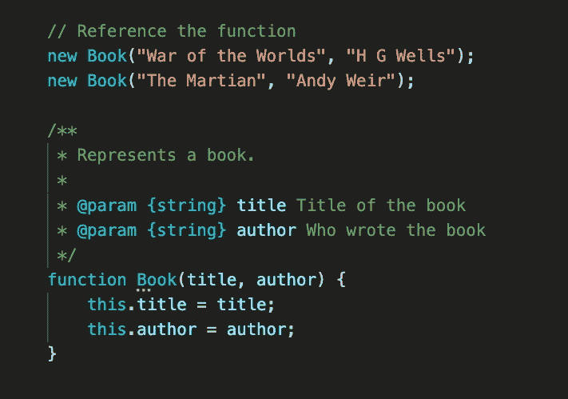

重命名变量/函数/类:F2

## 触发智能感知(代码建议)

当您遇到语句中的某些点时，Intellisense 会为您提供代码建议。例如，当您在`context.`中键入“点”时，VS 代码将为您启动智能感知。

然而，有时我们输入了`context.XXX`，我们意识到我们实际上想要别的东西(除了`XXX`)。那么当您删除`XXX`时，您将会丢失那个代码建议。现在你可以点击^Space 再次启动智能感知。


空间

# 3.航行

## 转到文件

不动鼠标快速打开一个文件！

*   模糊搜索:`sec.md`匹配`SECURITY.md` ( `user/reg`匹配`user/apis/register.py`)

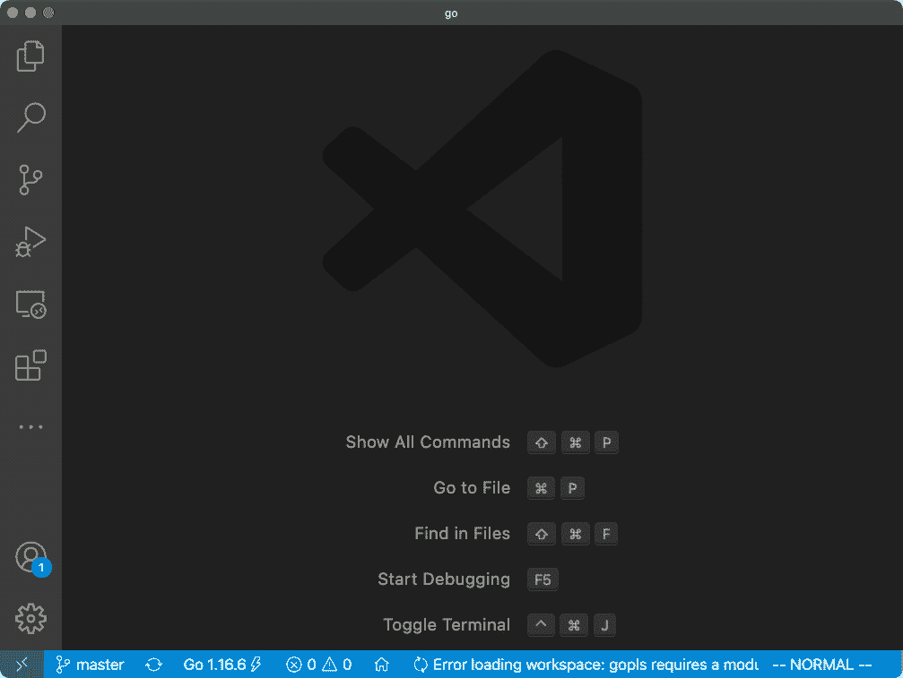

⌘P (macOS)，^P (Windows)

下面这个提示其实很厉害。键入`?`查看可用命令:

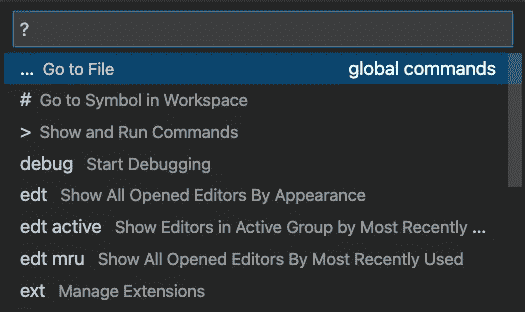

## 转到定义

在编程语言中，我们经常需要查找函数原型、类和结构的定义。这使我们能够快速熟悉一个类的 API 或可用方法。毕竟我们大部分时间都是用来读代码的，而不是用来写的。加快普通案例的速度是一个巨大的性能提升！

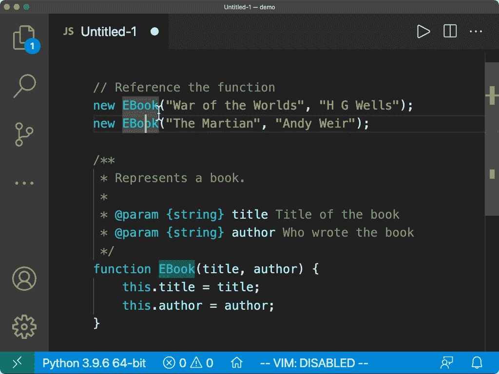

⌘Click (macOS)，^Click (Windows)


⌘⌥Click (macOS)，^⌥Click (Windows)

## 在定义或引用中迭代

F12 将您带到

*   这个定义，如果你在一个参考
*   参考文献，如果你对它的定义

这有助于我们快速识别变量或函数的范围，特别是在重构、查找 bug 或只是阅读代码时，这是非常有用的。


在定义和引用之间跳转:F12

## 后退/前进(光标位置)

所以你跳到了一个定义，现在你想回去。VS 代码覆盖了你！

回去:`^-`

前进:`⇧^-`

好连击:`⌘ + click`(转到定义)→ `^-`(返回)

F12，后退/前进是非常有用的，尤其是在阅读代码的时候。你可能想将这些操作配置到 [BetterTouchTool](https://folivora.ai/) 或你的 Logitech 鼠标中，如果你正在使用的话。

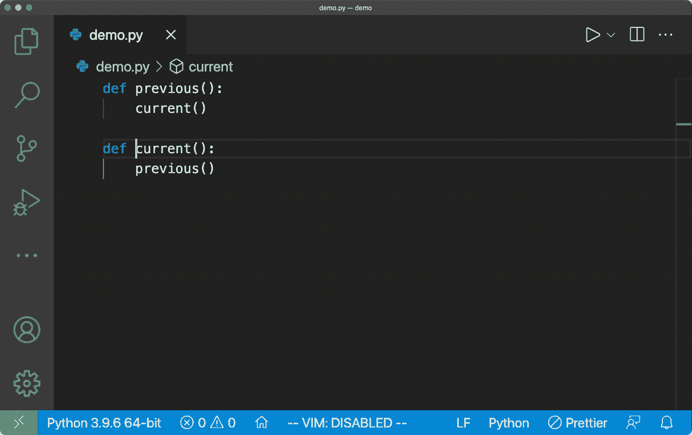

回去:^-

## 转到上一个文件

在写代码的时候，我们的大脑经常需要维护一个文件栈。你知道你现在改变的函数原型将会影响到其他一些函数。

你把当前的文件推到你的心理堆栈中，然后出去编辑那些受影响的文件，然后你需要弹出那个堆栈来“返回”到你正在编辑的前一个文件，以完成或检查更改。

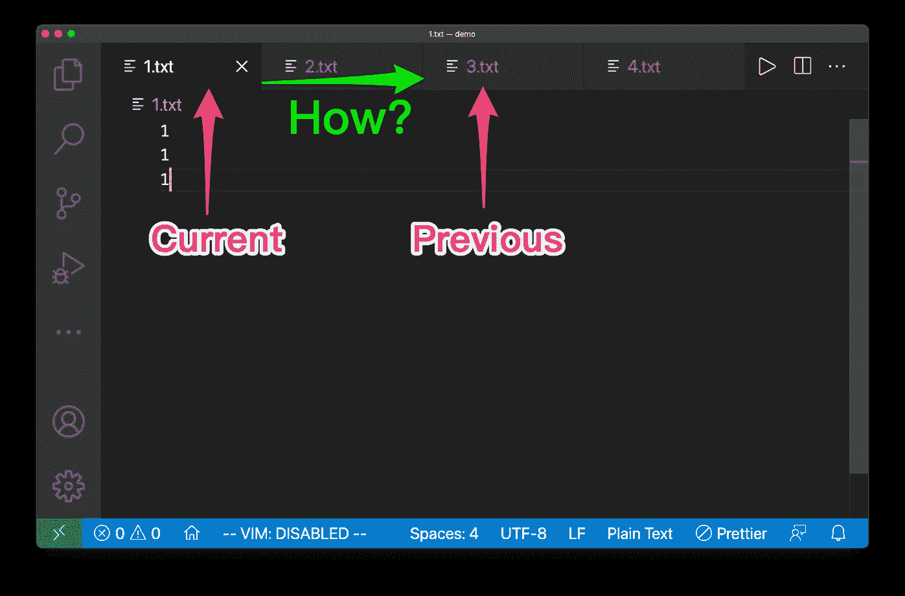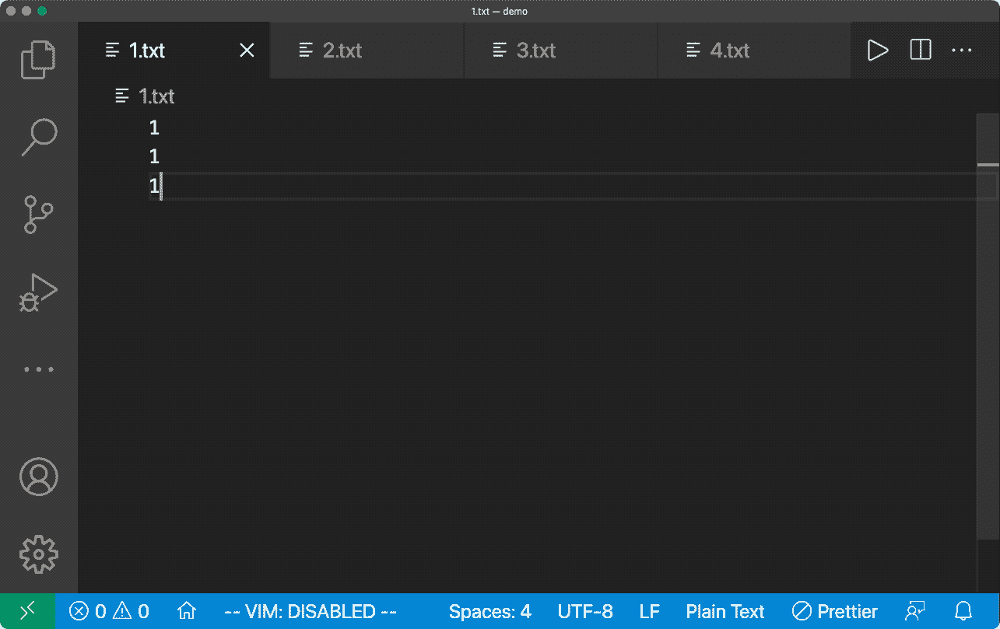

转到上一个文件:^Tab

额外收获:按住 tab 键的同时按住 control 键可以查看更多以前的文件。

## 转到选项卡中的第 N 个文件

您可以使用`⌘1`转到浏览器的第一个(最左边的)标签。VS 代码也有这个，但是有不同的快捷方式。

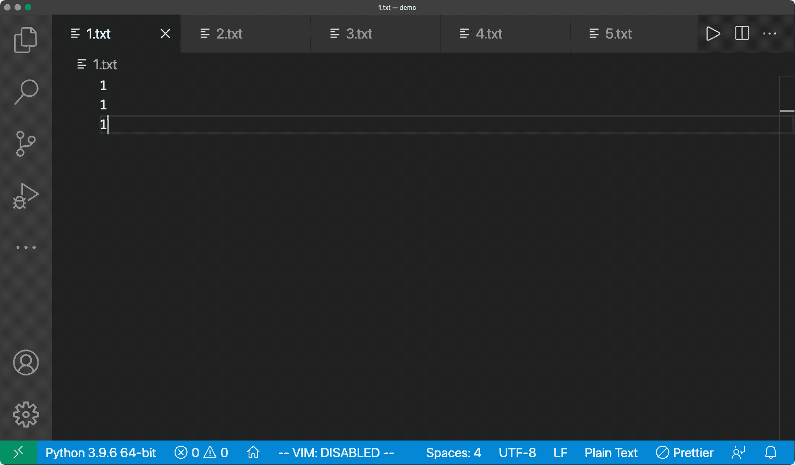

转到第四个标签:^4 (macOS)，⌥4 (Windows)

不使用鼠标的导航只是快速和上瘾。此外，相关的文件通常打开的时间很近，所以它们在选项卡中很可能是相邻的。这使我们能够快速跳过它们并做出相关的改变。

# 4.显示

## 关闭编辑器

尽量不要用鼠标。只需设置一个计时器，自己看看将鼠标准确地放在那个微小的 x 上需要多少时间。

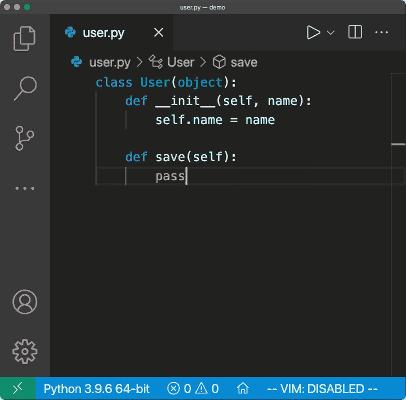

⌘W (macOS)，^W (Windows)

## 拆分编辑器

拆分→编辑→关闭是一个很好的组合，在以下情况下很有用:

*   想在文件顶部快速添加一个全局变量
*   写代码的时候想看看某个代码块做参考

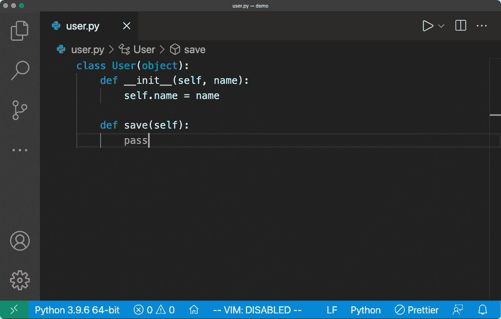

⌘\ (macOS)，^\ (Windows)

## 显示特定的边栏

这些是最常用的边栏，所以它们的快捷方式值得记住。

注意:再次按快捷键不会隐藏它，使用下一个来切换。

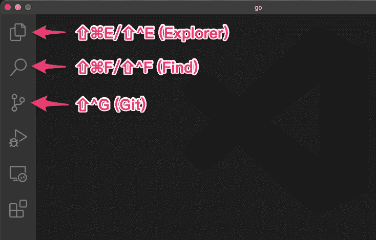

## 切换边栏

边栏占据了我们宝贵屏幕的很大一部分。关闭它们可以提高生产率，因为我们可以同时看到更多的代码。因此，让我们使用`⌘B`更频繁、更快速地做这件事。

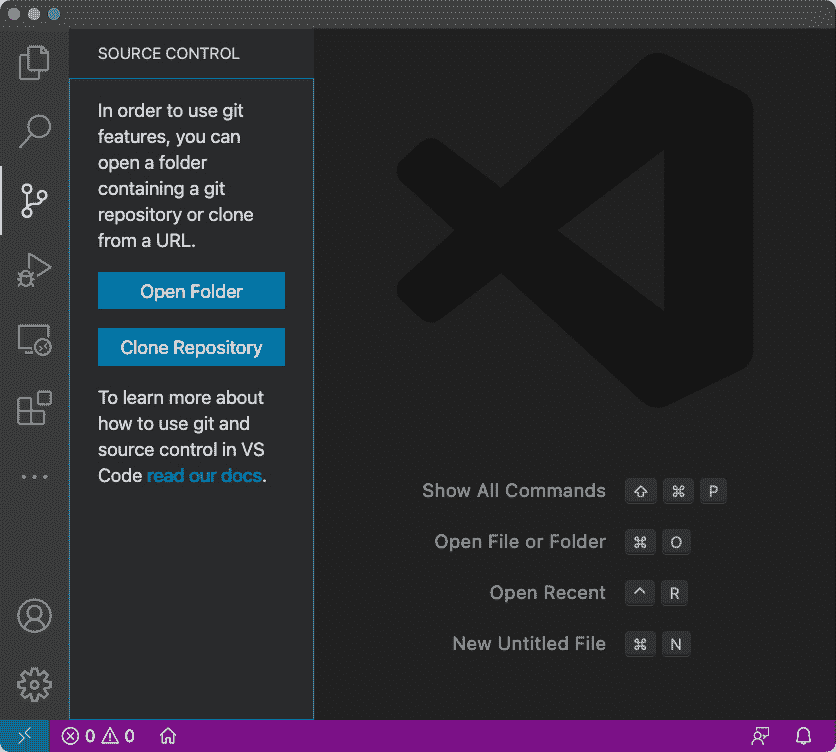

⌘B 切换侧边栏

## 切换集成终端

当您需要快速安装 pip/npm 或运行脚本时，这个快捷方式非常方便。

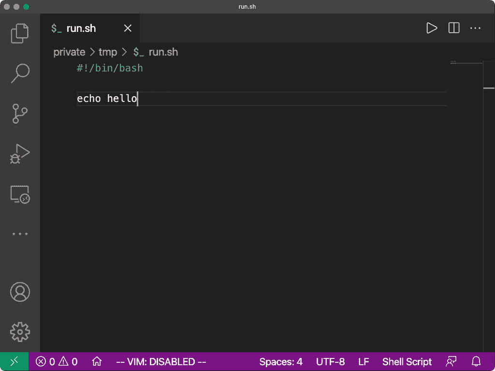

切换集成终端:^`

# 探索更多

以上列出了对我最有用的小技巧，但每个人都不一样。您可能需要查看以下设置，以找到最适合您的设置。

## 键盘快捷键(设置)

你可以随时像购物一样访问这个页面，你可能会发现一些有趣的新宝石。


⌘K ⌘S (macOS)，^K ^S (Windows)

# 结论

生产力实际上就是快速执行高层次的行动。编辑器/ide 只是帮助我们实现这一目标的工具。

如果你不得不担心变量在哪里被引用，或者类在哪个文件中被声明，那么你很难有所作为，因为你经常会分心。你的思想应该集中在以下这些事情上，让工具去做剩下的事情:

*   快速添加一个字段到类中，这样我就可以在这个方法中使用它(F12 →编辑类→ `^-`返回)
*   打开`services`目录下某处的用户注册文件(`⌘P` →模糊搜索:`services/userreg` → `services/users/registration.go`)

你的思维水平越高，你就可能越有效率。想想你的老板，我敢打赌他是你公司里效率最高的人。你写了几千行代码，因为你的老板写了一封电子邮件告诉你这么做。电子邮件比你使用的任何一种编程语言都要高级，因此也提高了你老板的工作效率。

现在你知道了 VS 代码的真正力量，你可以把你的思维提升一个层次，成为 VS 代码的老板，让它为你工作！

编码快乐！

# 进一步阅读

*   [https://code . visual studio . com/docs/get started/tips-and-tricks](https://code.visualstudio.com/docs/getstarted/tips-and-tricks)
*   【for macOS 的代码键盘快捷键
*   [VS Windows 的代码键盘快捷键](https://code.visualstudio.com/shortcuts/keyboard-shortcuts-windows.pdf)