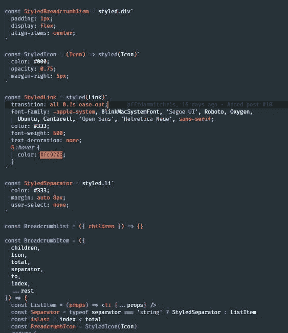
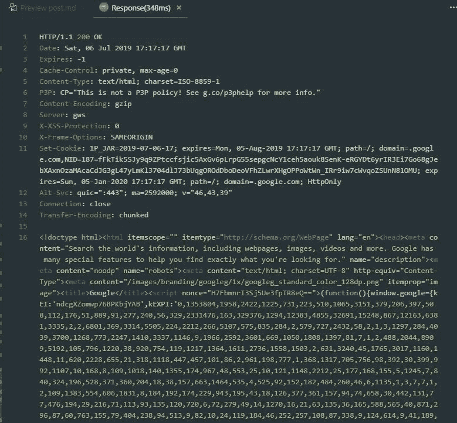

# 2019 年面向 JavaScript 开发者的 26 款神奇 VSCode 工具

> 原文：<https://betterprogramming.pub/26-miraculous-vscode-tools-for-javascript-developers-in-2019-e184131d75af>

## 编码应该很有趣

## 增强和授权您的开发流程


由[阿里·佐尔加德](https://unsplash.com/@noobogami?utm_source=unsplash&utm_medium=referral&utm_content=creditCopyText)在 [Unsplash](https://unsplash.com/search/photos/programmer?utm_source=unsplash&utm_medium=referral&utm_content=creditCopyText) 上拍摄的照片

[Visual Studio Code](https://code.visualstudio.com/) (也称为 *VSCode* )是一个轻量级但功能强大的跨平台源代码编辑器，可以在你的桌面上运行。由于内置了对开发工具的支持，比如 [TypeScript](https://www.typescriptlang.org/) 和 [Chrome debugger](https://developers.google.com/web/tools/chrome-devtools/) ，当我用它来构建我的项目时，我很快就爱上了它。

谁不喜欢 bajillion 开源扩展供公众使用和贡献呢？

如果您正在寻找更多的工具来添加到您的开发工具包中，我希望这篇文章能帮助您找到一个可以采用的新工具。

并非所有这些工具都是专门针对 JavaScript 语言的，但它们是面向像你我这样有着共同兴趣的 JavaScript 开发人员的工具。作为一名 JavaScript 开发人员，我将分享什么增强了我的开发流程。

以下是 2019 年 JavaScript 开发者的 26 款神奇的 VSCode 工具。

# 1.项目片段

第一个是我一直最喜欢的，[项目片段](https://marketplace.visualstudio.com/items?itemName=rebornix.project-snippets)——源自 VSCode 中内置的原始[用户片段](https://code.visualstudio.com/docs/editor/userdefinedsnippets)。

如果您不熟悉用户代码片段，这个特性允许您创建自己的代码片段，以便在整个项目中重用。

但是“重用”它们到底是什么意思呢？

好吧，如果你经常发现自己在写任何类型的样板文件，比如下面的:

您实际上可以直接将它放入您的用户代码片段中，因此您不必写出(或复制并粘贴)整个内容，您只需要键入一个自定义的*前缀*来生成您配置的代码片段。

如果您转到`File > Preferences > User Snippets`，您可以通过点击`New Global Snippets File`创建一个新的全局代码片段。

例如，要为 TypeScript [React](https://reactjs.org/) 项目创建您自己的 snippets 文件，您可以单击`New Global Snippets File`，键入`typescriptreact.json`，它将引导您到一个新创建的`.json`文件，您可以使用该文件构建使用 TypeScript 的 React 应用程序。

例如，要从上面的代码示例中创建一个用户片段，您应该这样做:

准备好之后，您可以创建一个新的以`.tsx`结尾的 TypeScript 文件，键入前缀`rsr`，将会出现一个生成代码片段的建议。

在弹出窗口上按下`tab`将生成以下代码片段:

这个问题是，这将持续到你的所有项目中(在某些情况下，这对于一般的片段来说可能是强大的)。

有些项目会有不同的配置，当您需要区分特定的用例时，配置代码片段的全局文件开始成为一个问题。

例如，当每个项目的项目结构不同时:

对于具有特定文件/文件夹结构的项目来说，这可能已经足够了，但是如果您正在处理另一个项目，其中的`Link`组件具有类似于`components/Link`的路径呢？

注意三个`border tests`如何用单引号将它们的值括起来:`border: '1px solid red'`。

这在 JavaScript 中完全有效，但是如果您使用[样式化组件](https://www.styled-components.com/docs)作为项目的样式化解决方案会怎么样呢？该语法不再适用于该工作区，因为样式化组件使用普通的 CSS 语法！

这就是[项目片段](https://marketplace.visualstudio.com/items?itemName=rebornix.project-snippets)的亮点。

项目片段使您能够声明项目/工作区级别的片段，这样您的片段就不会冲突和污染其他项目。非常有用！

# 2.更好的评论

如果你喜欢在代码中写注释，那么你可能有时会发现搜索你过去写的特定注释的位置是令人沮丧的，因为代码会变得有点拥挤。

使用[更好的注释](https://marketplace.visualstudio.com/items?itemName=aaron-bond.better-comments)，您可以通过引入彩色注释使您的注释更加明显:


现在，用`!`或`?`来提醒你的团队成员注意某件事情变得更加容易。

# 3.括号对着色机

第一次看到[括号对上色器](https://marketplace.visualstudio.com/items?itemName=CoenraadS.bracket-pair-colorizer)的截图，我就知道我必须采纳并把它引入我的开发工具包。

编码是我的热情所在，这个扩展无疑让我更加喜欢编码。


# 4.材料主题

[素材主题](https://marketplace.visualstudio.com/items?itemName=Equinusocio.vsc-material-theme)是一个史诗主题，你可以直接安装到 VSCode 中，让你的代码看起来像这样:



这是有史以来最好的主题之一— [现在就安装](https://marketplace.visualstudio.com/items?itemName=Equinusocio.vsc-material-theme)！

# 5.@typescript-eslint/parser

如果您是 TypeScript 用户，您可能应该开始考虑将您的 TSLint 配置迁移到 ESLint+TypeScript——TSLint 背后的[支持者宣布计划在今年的某个时候弃用 TSLint](https://github.com/typescript-eslint/typescript-eslint#what-about-tslint) 。

项目正逐步转向采用@typescript-eslint/parser 和相关的包，以确保他们的项目具有面向未来的设置。

使用新的设置，你仍然可以利用 ESLint 的大部分规则以及与更漂亮的[的兼容性。](https://prettier.io/)

# 6.Stylelint

对我来说， [stylelint](https://marketplace.visualstudio.com/items?itemName=shinnn.stylelint) 是我所有项目中必不可少的，原因如下:

1.  它有助于避免错误。
2.  它强制 CSS 中的样式约定。
3.  它与更漂亮的支撑物携手并进。
4.  它支持 CSS/SCSS/ [萨斯](https://sass-lang.com/) / [少](http://lesscss.org/)。
5.  它支持社区编写的插件。

# 7.Markdownlint + docsify

我不知道你或其他开发人员在头脑风暴项目时喜欢如何记笔记，但我喜欢以 [Markdown](https://daringfireball.net/projects/markdown/) 格式记笔记。

这很容易理解，而且有大量的工具可以帮助简化编写降价文本的过程，包括 [markdownlint](https://github.com/DavidAnson/vscode-markdownlint) 。

Markdownlint 是一个 VSCode 扩展链接器，它有助于对你的`.md`文件进行样式检查。并且支持更漂亮的格式！

我个人也喜欢在我所有的项目上安装 [docsify](https://docsify.js.org/#/) ，因为它支持每个项目的降价和其他增强功能。

# 8.待办事项突出显示

我习惯在应用程序代码中写待办事项，所以像 [TODO Highlight](https://marketplace.visualstudio.com/items?itemName=wayou.vscode-todo-highlight) 这样的扩展对于突出显示我在整个项目中设置的待办事项非常有用。

# 9.进口成本

[导入成本](https://marketplace.visualstudio.com/items?itemName=wix.vscode-import-cost)是那些第一次尝试就变得非常有用的工具之一。然而，使用一段时间后，你可能不再需要它，因为它告诉你你已经知道的东西。尽管如此，尝试一下这个工具——你可能会发现它很有用。

# 10.突出显示匹配的标签

有时，试图匹配标签的另一端会令人沮丧。这就是[高亮匹配标签](https://marketplace.visualstudio.com/items?itemName=vincaslt.highlight-matching-tag)的用武之地:


# 11.vscode-spotify

有时，不得不回到音乐播放器中切换音乐，然后回到 VSCode 继续做您正在做的事情，这令人沮丧。

这就是 [vscode-spotify](https://marketplace.visualstudio.com/items?itemName=shyykoserhiy.vscode-spotify) 的用武之地，因为它允许你在 vscode 中使用 spotify！

通过这个扩展，你可以在状态栏中看到当前正在播放的歌曲，你可以通过按热键在歌曲之间切换，你可以点击按钮来控制 Spotify，等等。

# 11.VSCode 的 GraphQL

GraphQL 一直在增长，我们开始在 JavaScript 社区中看到它的身影。出于这个原因，开始考虑将用于 VSCode 的 GraphQL 安装到您的 VSCode 中可能是个好主意。

在处理 GraphQL 语法时，您将受益于语法突出显示、林挺和自动完成功能。

我经常使用 [Gatsby](https://www.gatsbyjs.org/) ，所以我的日常编码生活包括阅读一些 GraphQL 语法。

# 12.缩进-彩虹

与上面高亮匹配标签的原因类似。如果你在寻找压痕时有困难，那么[缩进-彩虹](https://marketplace.visualstudio.com/items?itemName=oderwat.indent-rainbow)可以帮助你更容易地阅读这些压痕。

这里有一个例子:


# 13.彩色高光

这是其中一个扩展，每个人都问我:“你从哪里得到的？”基本上，[颜色突出显示](https://marketplace.visualstudio.com/items?itemName=naumovs.color-highlight)有助于突出显示代码中的颜色，如下所示:


# 14.颜色选择器

[颜色选择器](https://marketplace.visualstudio.com/items?itemName=anseki.vscode-color)是一个 VSCode 扩展，它给你一个图形用户界面，帮助你选择和生成颜色代码，比如 CSS 颜色符号。

# 15.REST 客户端

我第一次读到 [REST 客户端](https://marketplace.visualstudio.com/items?itemName=humao.rest-client)并尝试它的时候，与像 [Postman](https://www.getpostman.com/) 这样的成熟软件相比，它似乎不是一个非常有用的工具。

然而，我使用 REST 客户端扩展越多，我就越意识到它对我的开发工具的影响有多大，尤其是在测试 API 的时候。

您可以创建一个新文件，其中有这样一行:

```
[https:*//google.com*](https://google.com)
```

要创建一个`HTTP GET`请求，你需要做的就是突出显示那一行，进入命令面板(`CTRL + SHIFT + P`)，点击`Rest Client: Send Request`，它会在一瞬间弹出一个新的选项卡，显示请求响应的详细信息。

非常有用:



您甚至可以传入参数，或者向一个`POST`请求请求主体数据，下面只需几行额外的代码:

这将使用身体参数`{ "email": "someemail@gmail.com", "password": 1 }`发出`POST`请求。

这仅仅是这种扩展的可能性的皮毛。[阅读](https://marketplace.visualstudio.com/items?itemName=humao.rest-client)了解更多信息。

# 16.设置同步

我讨厌手动写下我在开发工具中使用的扩展的注释列表，并将其保存在像 [Evernote](https://evernote.com/) 这样的注释服务中。这就是[设置同步](https://marketplace.visualstudio.com/items?itemName=Shan.code-settings-sync)来拯救的地方。

你所需要的只是一个 [gist/GitHub](https://gist.github.com/) 账户，每次你想要保存你的设置(这包括按键绑定、代码片段、扩展等)，你只需按`SHIFT + ALT + U`就可以将*私有*设置上传到你的 gist 账户。然后，下次您登录或重新格式化到另一台计算机时，您可以通过按`SHIFT + ALT + D`立即下载您的设置。

# 17.待办事项树

[待办事项树](https://marketplace.visualstudio.com/items?itemName=Gruntfuggly.todo-tree)将帮助您找到您在整个应用程序代码中创建的所有待办事项。它会将它们放入一个单独的树中，您可以在面板的左侧同时查看它们:


# 18.切换报价

[切换引号](https://marketplace.visualstudio.com/items?itemName=BriteSnow.vscode-toggle-quotes)是一个有趣的工具扩展，可以让你在引号之间切换。当您要使用字符串插值时，如果您需要切换到反斜杠，它会很方便，尤其是在 Prettier 习惯于将字符串修饰为单引号的情况下。


# 19.更好地对齐

使用[更好地对齐](https://marketplace.visualstudio.com/items?itemName=wwm.better-align)，您可以对齐您的代码，而无需首先选择它们。

要使用它，把你的光标放在你想要对齐的代码上，用`CTRL + SHIFT + P`弹出打开你的命令面板(或者任何你定制的打开命令面板的快捷方式)，然后调用`Align`命令。

# 20.自动关闭标签

从我开始使用 VSCode 的那一天起，自动关闭标签就对我很有用。它允许您键入类似于`<div`的内容，后跟一个斜杠`/`，它将为您完成最后一个箭头。

这是默认情况下不在 VSCode 中的东西，对我来说非常有用。

# 21.排序行

当我的数组没有按字母顺序排列时，我有一种沮丧的习惯。幸运的是，像[分拣线](https://marketplace.visualstudio.com/items?itemName=Tyriar.sort-lines)这样的工具的存在让我的生活变得更容易。

如果你同样感到沮丧，你可能会发现这也很有帮助。

# 22.VSCode 谷歌翻译

我可能是唯一一个发现这个有用的人，但是 [VSCode Google Translate](https://marketplace.visualstudio.com/items?itemName=funkyremi.vscode-google-translate) 在我的项目中帮助了我，因为我参与了一个多语言的项目。

如果你不想离开你的编辑器，它是有用的。

# 23.较美丽

漂亮的是 VSCode 的一个扩展，可以自动格式化你的 JavaScript/TypeScript/等等。代码使用更漂亮。

# 24.材料图标主题

比起其他图标主题，我更喜欢[材质图标主题](https://marketplace.visualstudio.com/items?itemName=PKief.material-icon-theme)，因为它更容易区分文件类型，尤其是当你使用深色主题时。

# 25.HTML 中 CSS 类名的智能感知

[HTML 中 CSS 类名的智能感知](https://marketplace.visualstudio.com/items?itemName=Zignd.html-css-class-completion)根据工作区中的定义，为 HTML `class`属性提供 CSS 类名完成。

# 26.路径智能感知

[Path Intellisense](https://marketplace.visualstudio.com/items?itemName=christian-kohler.path-intellisense) 是一个 VSCode 扩展，它为您自动完成文件名。

# 结论

我希望这能帮助您找到新的东西添加到您的开发工具包中。

请留意我未来的帖子。