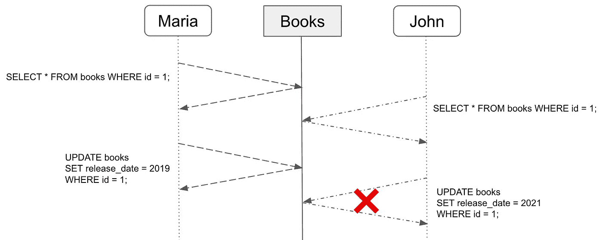

# 提高软件质量的 3 个工程概念

> 原文：<https://betterprogramming.pub/3-engineering-concepts-to-boost-software-quality-bf8d673d3ed8>

## 解决复杂的挑战并节省数小时的工作时间


来自 [Pexels](https://www.pexels.com/photo/photo-of-woman-standing-in-front-of-blackboard-5212320/?utm_content=attributionCopyText&utm_medium=referral&utm_source=pexels) 的 [Max Fischer](https://www.pexels.com/@max-fischer?utm_content=attributionCopyText&utm_medium=referral&utm_source=pexels) 摄影

每个软件工程师在他们的职业生涯中都有一条共同的道路。他们在大学学习，对技术很好奇。在遭到无数次拒绝后，他们很高兴得到了第一份工作。他们在造成生产系统中断后感到尴尬。然而，所有这些活动都与编程有关。

如果我告诉你现在的编程和 20 年前不一样了，会怎么样？框架和库的数量是巨大的。很难想象一个不利用开源项目的解决方案。它们简化了工程师的生活，同时也带来了一些危害。某些编程概念由于在现代工程世界中的无足轻重而失去了它们的重要性。然而，它们是下一步发展的支柱。

# 并发问题

软件工程师不必直接处理线程和并发问题。可用的框架有所有必要的能力来做这件事。而且有些框架甚至没有合适的多线程，所有的操作都以异步的方式在单线程中执行。所有这些都是成功的，这是行业的普遍趋势。


线程同步

在上面的例子中，我们可以看到一个线程同步的方案。这是我正在开发的应用程序的一个真实例子。应用程序必须通过蓝牙与硬件建立连接，并获取当前位置。这些操作应该并行执行，一旦都完成，就开始与服务器通信。

所有的交流都是用线来组织的。我们必须同步线程，并确保当两个线程都成功完成时，下一个操作才开始。如果其中一个完成得更早，它应该等待另一个。你能想象我们有多少 bug，解决方案有多脆弱吗？

谢天谢地，我们不用再重复这些了。许多现代框架都有负责线程的调度管理器。异步任务和观察者模式的采用简化了许多事情。我们必须定义实际的任务，但是不应该真的担心它们的同步性。当计划的作业完成时，应用程序会得到通知。开发人员有更少的并发问题，如竞争条件或死锁，从而导致更少的错误。

# 一致的数据访问

数据库从一开始就受到开发人员的密切关注。它们不仅被工程界广泛使用，还被业务分析师、产品经理和数据工程师广泛使用。因此，所有潜在的问题都很快得到了解决。各种引擎之间的竞争甚至加速了最佳实践的采用。

例如，一致读写的问题很久以前就已经解决了。



一致读/写的示例

在上面的例子中，我们可以看到数据不一致的可能情况。多个用户试图在短时间内修改同一属性。可能会发生这样的情况，一个人会无意中覆盖其他人的改变。这是一个恼人的情况，需要调试和修复。幸运的是，不同的数据库引擎已经提供了现成的工具来避免这个问题。

数据库事务也是如此。数据库获得的流量越多，就需要处理越多的流量。极高数量的请求可能会导致性能下降。但是事务的概念很有帮助。很难想象现在有一个不利用事务的真正的生产数据库。正因为如此，工程师不需要担心数据库中的底层性能优化，因为它是在引擎盖下平稳处理的。

# 没有更多的基本算法

让我们诚实地面对自己:上一次我们必须实现一个函数来寻找集合中的最大元素是什么时候？你如何实现一个函数来过滤一个字符串数组？或者确保数组包含唯一的元素？

可能很难直接回答这些问题。下面你可以看到在数组中寻找最大元素的函数的实现:

```
def find_max(array):
    max_item = -sys.maxsize - 1
    for item in array:
        if item > max_item:
            max_item = item
    return max_item
```

在大学期间，我每个月至少要写一次这样的代码。直到它永远留在我的脑海里。但是在我职业生涯的最后十年里，我根本没有写过这样的代码。如果 Python 和其他编程语言提供了开箱即用的函数`max()`,我为什么要这么做呢？

我们不需要跨项目复制粘贴相同的代码或者构建一个公共库。很多功能可供使用:`find()`、`filter()`、`min()`、`max()`、`sort()`，应有尽有。一些框架还允许以函数的方式将它们链接在一起。

我们可能会因为得到的简单而错过一件重要的事情。这些功能的实际成本是什么？有哪些时空复杂度？我们几乎不去想它，因为我们到处都有强大的 CPU。代码看起来很闪亮，我们不必考虑另一个`find()`函数的实现。但是当系统缺乏足够的资源或者数据输入量巨大时，开发者就会看到意想不到的问题。

# 结论

我记得在我们学校学生和老师之间的对话。学生问:

如果我们在 C++中有一些像 STL 这样的库，为什么我们需要学习所有这些算法？人们已经很好地为他人节省了时间。

老师微微笑了笑，平静地回答道:

你们中的大多数人将构建常规软件。让我们把它比作住在房子里的建筑。人们需要房子，而且需求很高。但是有时候，有些项目是为了创造新的非凡的东西。例如，建造一座城堡。所以我们学习算法要有扎实的知识基础。这样我们就可以建造一个普通的房子和一个宏伟的城堡。

让我们不要忘记我们整合到项目中的每个现有概念背后的含义，以使生活更简单。