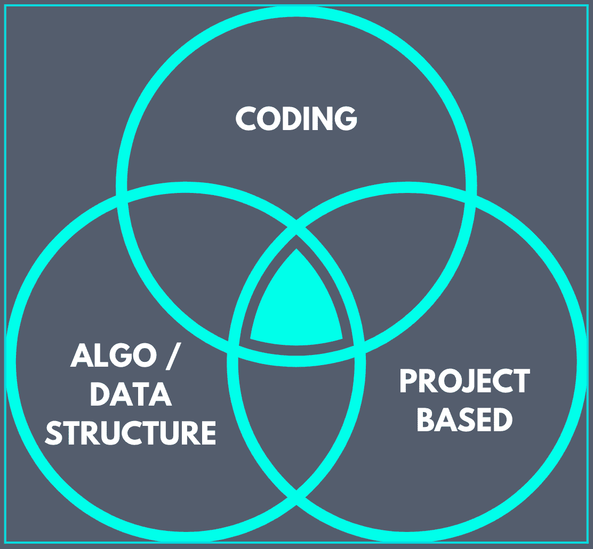
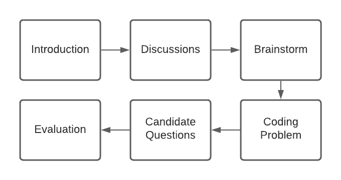

# 面试软件工程师的 3 个基本技巧

> 原文：<https://betterprogramming.pub/3-essential-tips-for-interviewing-software-engineers-12c57903f026>

## 来自一个进行了 100 多次采访的人

克里斯蒂娜@ wocintechchat.com 在 [Unsplash](https://unsplash.com?utm_source=medium&utm_medium=referral) 上的照片

成为一名优秀的面试官是一项有用的技能，这使得有趣的是，关于如何赢得面试的资源比如何给出面试的资源要多得多。当我刚开始面试时，我的主要经历是跟随一位同事参加面试。从那以后，我就只能靠自己了。从那以后，我参加了数百场面试，也经历了几十家科技公司的面试过程。

回想我最早参加的面试，我仍然会感到害怕:我是如何根据无关紧要的标准评估候选人的，这些标准无助于决定他们是否能在日常工作中取得成功。从这些经历中，我收集了一些有用的信息，告诉你如何成为一名有效的面试官，并雇佣到成功的工程师。我们将涵盖如何选择一个好问题，面试的结构，以及评估。

# 问题选择

找到一个好的面试问题或者创造自己的问题是一个独特的挑战。问题的重点不是让候选人以特定的方式回答或欺骗他们，而是让他们在一段时间内编写代码，并允许他们展示他们的能力，以便你可以评估他们。好的问题是可扩展的，有多种解决方案，并且与工作相关。让我们更深入地了解这些特性及其含义。

## 问题特征

选择面试问题时要寻找的问题特征

我在问题中寻找的第一个特征是**可扩展性**。这是指一个问题有一个基本的解决方法，但随后可以问一些额外的问题来扩展原来的问题，这取决于你想测试候选人的什么。使用井字游戏的一个例子是，基本版本是对一块 3 乘 3 的棋盘进行编码，以便在上面进行游戏。然后，游戏可以以多种方式扩展，如制作 N 乘 N 板，添加重新启动按钮，跟踪玩家统计数据，或创建一个自我游戏机器人。

同样，重点可能不是让他们完成扩展，而是让他们闪光，更好地理解他们如何思考和解决问题。衡量一个问题要花多长时间是很难的，我发现程序员之间以及他们完成一个技术问题要花多长时间有很大的差异——即使是我已经测试过多次的问题。如果一个候选人很快完成了一个问题，而你有很多时间，你会感谢你选择了一个可以扩展的问题！我还发现，许多候选人已经解决了问题的基本版本，但没有解决问题的扩展版本。

在真正的软件工程中，总是有多个解决方案来完成一个项目。当然，你可能认为有一个最好的方法，但真正重要的是你能够识别不同的解决方案，并权衡它们之间的利弊。这就是为什么我会寻找那些有**个多解**并在它们之间进行权衡的问题。以井字游戏为例，有几种方法可以编写网格的 UI 部分，比如使用 CSS grid、flexbox 或 HTML 表。这个问题可以用普通的 JS 或者你选择的框架来解决,`player state`可以存储在 HTML、1D 数组或者 2D 数组中。

另一个多解问题的例子是创建一个斐波纳契数列，可以使用递归或缓存来回答；这个问题的缺点是它不太具有可扩展性。看到候选人选择更新的技术或具有最佳性能的解决方案是很棒的，但实际上我的目标是让他们思考不同的解决方案，并解释它们之间的权衡。

作为一个以前经历过多次面试的人，我个人认为我被问到的许多问题与我面试的工作无关，也不会帮助公司了解我是否胜任某个角色。这就是为什么我尽量问与工作相关的问题，这样我们就可以评估他们是否适合这个角色。我尝试使用他们所面临的问题是他们在工作中实际会看到的问题。

如果你有一个庞大的 React 代码库，并且你想让这个人马上投入工作，那么就测试他们的 React 技能吧！当然，过于具体地测试什么技术也是有代价的，比如可能会忽略一个伟大的工程师，仅仅因为他们不知道某项具体的技术。我会考虑候选人需要什么技能才能在工作中取得成功，并确保他们在编码时展示了这些技能。当然，有许多非技术技能可能是极其重要的，比如沟通或调试。请记住，我们不是想问他们一些棘手的问题或陷阱，而是想看看他们是否会在工作中取得成功。

## 问题类别

问题类别

我把问题分成三大类。每一个都有其优点，大多数问题在类别之间有重叠。在一天中进行多次面试时，问多种类型的问题来评估候选人的不同技能是有意义的。

我最喜欢的题型是基于**项目的**题型。这些往往使用多种技术来创建一个工作应用程序。例如，在前端，这可能是创建一个有效的井字游戏、其他基于网格的游戏，或者使用 API 将数据呈现到表格或其他组件中。在后端，这可能是创建一个工作 API 并存储数据，或者创建一个数据管道，从多个来源加载数据并对其进行处理。

重要的是，多个系统、技术和库需要协同工作来创建一个可行的解决方案。这些问题的伟大之处在于它们是开放式的，这使得它们很容易扩展，因为您正在构建一个工作应用程序或服务。这些问题最接近候选人在日常工作中实际要做的事情，让他们能够做出非常真实的决定和权衡。

**算法和基于数据结构的**题没有错，它们做一件事真的很好——测试你是否知道算法和数据结构。实际上，我建议任何编程人员解决这些问题，因为它们具有教育意义，并且是学习计算机科学(CS)基础知识的好方法。一些例子是:

*   在`n log n`中排序
*   赋权图上的最短路径
*   使用堆对总数为`K`的`n`排序数组执行`n`路合并

最好的基于算法的问题是有多个答案并且在它们之间有明确的权衡的问题，比如快速排序和合并排序。话虽如此，但就其本身而言，我不认为它们是很好的面试问题，因为它们很难延伸，而且与候选人的日常工作也不是特别相关。仅仅因为有人知道算法问题，并不意味着这些技能将转移到处理软件工程师每天面临的许多问题，例如维护大型应用程序或处理测试和部署管道。

我将不属于其他类别的问题归入**编码**，测试候选人是否能用特定的语言编码。我一直在争论这个问题是否应该被归为一类，因为它看起来太明显了，但是我决定暂时把它放在一边，因为很多人问的问题我认为都属于这一类。所有软件工程师的问题都有一些重叠到编码类别中，但有些可能是纯粹的编码。属于这一类别的一些问题的例子是处理异步调用的多个流(多线程或承诺),或者采用一个开源项目并复制它的一些功能。我认为这些问题是考生在解决问题的同时，用特定语言展示自己知识的绝佳方式。

我们的目标是选择一个问题，允许候选人在给定的时间内编写代码并展示他们的能力，这样我们就可以评估他们在给定的角色中是否会成功。为了做到这一点，寻找可以延伸的、有多种解决方案的、与工作相关的问题。还有不同类别的问题，旨在测试不同的技能。

当选择一个新问题时，一个很好的起点是思考你喜欢解决的面试问题，以及它们如何符合这些不同的标准和类别。只要有一点点创意，通常很容易就能提出一个面试问题，并为其赋予独特的含义。我最喜欢的一个面试问题是从头开始写井字游戏。我意识到有太多其他基于网格的游戏(战舰，连接四，等等。)这是我在面试中从未见过的问题，可以很容易地转化为编码问题，我就是这样做的。

无论你选择哪个问题——确保做好准备并对其有所了解——并能够就此进行详细的讨论。如果你自己用和候选人一样的方法解决了这个问题(不仅仅是基本案例，还有扩展和多重解决方案),面试会顺利得多。这将允许你测试这个问题，并确保它为实际的面试做好准备，我们将在接下来讨论。

# 面试

典型面试时间表

在这一部分，我们将讨论如何实施面试，让你和候选人都有一次更愉快、更深刻的经历。你会惊讶于有多少人有过糟糕的面试经历——我知道我有过。

我遵循的正常时间表是:

*   简介:5 分钟
*   讨论:10 分钟
*   头脑风暴:5 分钟
*   编码问题:35 分钟
*   候选问题:5 分钟

这是一个总的时间表，但是你应该决定面试的哪些方面最有助于你决定候选人是否适合这个角色。如果沟通将是他们工作的一大部分，那么花更多的时间进行讨论可能比花所有的时间做技术编码问题更好地利用你的时间。

在面试开始之前，我总是确保候选人准备好开始。我有过一些残酷的一整天的面试经历，一旦一个面试官离开，另一个会神奇地出现在房间里。他们就不能给我两分钟去洗手间或者吃点零食吗？他们没有，但是如果你正在采访某人，给他们这种礼貌。

我不是唯一一个说面试会有压力的人。很难把自己放在那里，在别人面前表演，对梦想工作的可能性产生兴奋感，对自己会搞砸感到紧张。因此，我不直接进入技术问题，我喜欢以介绍开始我的采访，这样我们可以互相了解，打破僵局。我告诉他们我目前的角色以及我在公司从事的工作，然后让他们分享他们目前的工作经验。我发现这是一个很好的起点，可以了解他们正在做什么，并且通常会引出后续的讨论问题。

例如，如果他们告诉我他们正在使用 X framework 开发一个应用程序，我可以问他们是否喜欢使用 X framework，它的利弊是什么，或者他们如何将其与其他可比框架进行比较。我总是让候选人告诉我他们最近面临的一个技术挑战。这促使他们谈论项目的具体细节，比如他们使用了什么库，或者他们如何测试和调试问题。同样，这也是对话的起点。

面试的核心当然是解决问题。这个问题应该写出来，并且用基本的测试用例清晰地呈现出来。在候选人开始编码之前，我确保我们头脑风暴如何解决问题，并让他们向我介绍他们将如何解决问题的大致思路。如果他们需要就如何解决这个问题做出任何重大决定，我会让他们与我讨论取舍，我会确保他们不会走上一条没有出路的道路。

候选人应该在他们最舒适的环境中编码，并且尽可能接近他们在你的公司被雇佣和编码的体验。我必须永远记住，面试实际上是为了看候选人是否会在他们面试的职位上取得成功。你上一次去工作并决定在白板上写代码或使用新的 IDE 或电脑只是为了好玩是什么时候？可能已经有一段时间了——相反，你已经尽你所能掌握了一些工具，并且知道所有的键盘快捷键。

如果他们喜欢在笔记本电脑上编码或使用特定的 IDE，那么这就是他们应该使用的。我扩展了这个原则，允许候选人谷歌提问和使用公开文档，因为这是每个软件工程师经常做的事情。这不是让他们寻找问题的解决方案，而是接受记住一门语言的所有功能是困难的。如果候选人不记得如何排序列表的细节，我会告诉他们去查一下。我知道我以前有的是时间。

看到候选人快速解决一个问题是很棒的，但大多数时候，他们开始，取得一些进展，退回，陷入一个 bug，然后开始备份，并有希望解决这个问题。在我看来，只要候选人清楚地解释了他们脑子里在想什么，以及他们想如何进行下一步，解决问题的两种方式都没问题。

确保给候选人定期反馈，让他们知道他们是否在正确的轨道上。让候选人探索解决问题的不同方法，但是如果他们原地打转太久，或者正在寻找一个行不通的解决方案，不要害怕把他们推向一个更好的方向。很多时候，让候选人大声谈论这个问题就足以让他们改正错误。

在候选人解决了问题之后，我喜欢通过询问他们如何生产代码来跟进。即使你选择了一个基于项目的问题，这个问题与他们被雇佣后可能从事的真实项目相似，但它仍然与真实项目相差甚远。这个问题给了候选人时间来谈论测试、代码质量、部署系统以及其他不能用 40 分钟编码问题来完成的工作。

我也会尽量给应聘者一些建设性的反馈，帮助他们在下次面试中做得更好。我经历了很多我认为很顺利的面试，但是没有任何解释就没有得到这份工作，我希望他们能给我一些建议，让我下次做得更好。尽管给出反馈可能很难，但我知道大多数人都很欣赏它，尤其是当它是他们可以在编码或工作机会方面做得更好的具体步骤时。老实说，如果有人想在任何事情上做得更好，他们应该学会如何把反馈当作学习的机会——而不是轻视。以下是一个如何给出不会显得苛刻或带有批判性的反馈的例子:

> 我认为你在面试中做得很好，但是我注意到你用了很多单字符变量名。尽管变量命名可能很困难，尤其是在时间压力下，但我建议使用描述性的名称来表示它们所保存的数据，因为这将有助于您跟踪代码并使其更具可读性。

给出反馈时，我的主要建议是以积极的方式开始，陈述观察结果，与他们联系，提供他们可以采取的具体改进措施，并说明为什么反馈是有帮助的。

在面试结束时留出时间让应聘者提问。如果是全明星候选人，他们可能会收到多家公司的邀请，所以这是一个告诉他们关于你的公司和你正在从事的一些项目的最好的事情的时候。

# 评估候选人

当评估一个候选人时，我试图弄清楚他们是否能胜任他们面试的职位。当然，与某人进行一小时的会谈只是他们在工作中表现如何的一般表现，但这是我们必须面对的。我找到的最好的候选人是我会很乐意与之共事的人，不是因为我认为我们会成为朋友，而是因为我认为他们会推动我的项目和团队向前发展。正如你将会看到的，我讨论的大多数话题实际上是我认为包含了一个好的软件工程师。为此，我对他们的沟通、解决问题、代码质量和技术技能进行了评估。

众所周知，总的来说，技术社区在多样性方面有很大的问题，所以我想承认面试过程中隐含的偏见。首先:意识到你的偏见，理解某人与你的相似之处是如何无意识地让他们看起来更可爱的。有一个标准的问题和评估过程将有助于消除过程中的主观性，使其更加公平。

面试充满了候选人展示其沟通技巧的时刻。一些例子是在面试开始时讨论他们做了什么，用白板演示他们解决问题的方法，或者讨论如何解决一个棘手的 bug。

他们应该能够在不太费力的情况下进行对话，讨论技术细节。如果候选人说不出他们脑子里在想什么，那么如果他们卡住了，你就很难给予指导。我发现自己损失了几天的时间，因为我不想和同事进行 15 分钟的谈话。如果候选人不能在面试中交流，这对他们以后的交流不是好兆头。

我评估候选人的**解决问题**的能力，方法是确定他们是否编写了一个*可行的*解决方案，然后确定他们是否提出了一个*好的*解决方案。您应该有一些简单的测试用例通过，以确保解决方案正在工作。问题应该有多个解决方案或扩展来解决问题，让您能够区分可行的解决方案和良好的解决方案。

例如，如果你让候选人对一个列表进行排序，使用蛮力的工作解决方案将是快速排序，而更好的解决方案将是使用合并排序或任何其他`N log N`解决方案。对于其他问题，我希望看到他们能够扩展解决方案，例如，如果他们正在处理一个 3 乘 3 矩阵，他们可以将其抽象为一个 N 乘 N 矩阵。在解决问题时，他们应该能够交流不同解决方案之间的权衡，以及为什么他们以某种方式解决了问题。

当我第一次开始面试时，我主要关注评估候选人解决问题的能力，但随着时间的推移，我倾向于越来越关心他们的代码质量。我遇到过很多面试，应聘者会很快解决问题，因为他们以前见过类似的问题，但忽略了他们的代码，所以几乎难以辨认。一想到要和他们一起做代码评审或者在一年内完成他们的一些代码，我就害怕。这种评价当然是主观的，所以代码不需要是世界上最漂亮的，但我确实希望看到代码是可读的、可测试的和结构良好的。

比如说，只要他们给变量起的名字能在某种程度上描述它们所代表的东西，并且不使用单字符变量名，我就很高兴。看到他们谈论关注点分离(SOC)和将一个大问题分解成可以测试的小功能，而不是一个大的意大利面条脚本，这也很棒。最棒的是，我发现考虑代码质量的候选人最终会更容易推理问题和调试问题。调试所有名字都是单音节的代码真的很难！

根据候选人面试的角色，你可能需要评估候选人的特定**技能**(如 React 上的前端开发人员)或 web 框架上的后端开发人员(如 express.js)。我相信，如果一个候选人是一个优秀的开发人员和快速的学习者，那么他们的大部分知识可以从一种语言或框架转移到另一种语言或框架。

也就是说，如果一个候选人正在面试一个必须开发大型 React 应用程序的职位，那么至少对自己的 React 知识有所了解是很好的。如果您确实需要评估他们的某项技能，请确保您选择的问题允许他们展示自己的知识，并且他们能够讨论使用该技能的利弊和原因。我真的很喜欢与候选人交谈，我觉得我在我们的交谈中学到了一些新的东西。

我喜欢在候选人身上看到的一个更难以捉摸的特质是他们有勇气。我的意思是，他们能够坚持不懈地解决棘手的问题。在这一点上评估候选人可能很困难，因为有时他们会顺利地解决一个问题，而其他时候他们会被一个问题难住，就放弃了。我见过的候选人展示勇气的一些最佳方式是研究他们不熟悉的技术或解决一个 bug。

任何评估过程都应该是可重复的，并且允许你比较多个候选人。比较候选人时最好使用相同的问题，但也可以使用测试相似技能的不同问题。为了使我的评估过程更加一致，我确保写下对我到目前为止讨论的所有主题的反馈:交流、解决问题、代码质量和技术技能。有一个一致的方法来评估候选人和写下反馈，让你成为一个更公平的法官，并为你的团队雇用最好的人。