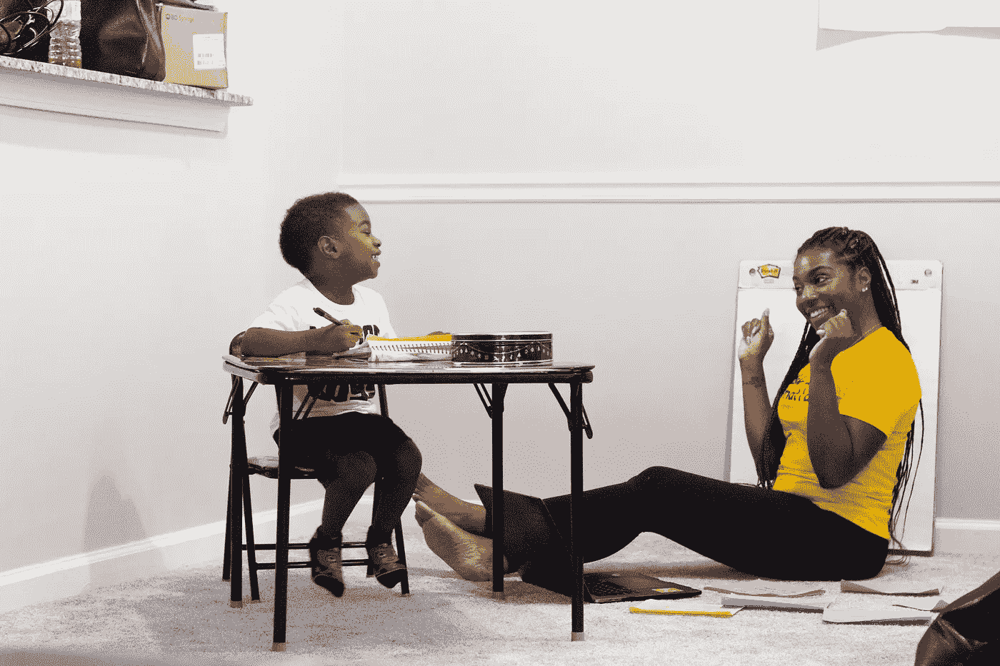

# 为人父母教给我的关于成为领导者的 3 个教训

> 原文：<https://betterprogramming.pub/3-lessons-about-being-a-leader-that-being-a-parent-has-taught-me-2e7d202b2160>

## 有时你会从最意想不到的来源学到东西

照片由[娜塔莎·霍尔](https://unsplash.com/@ideanaire?utm_source=unsplash&utm_medium=referral&utm_content=creditCopyText)在 [Unsplash](https://unsplash.com/s/photos/kids-teacher?utm_source=unsplash&utm_medium=referral&utm_content=creditCopyText) 拍摄

每个人都告诉你，有了孩子，你的生活再也不会像从前一样了。这是真的，以最美妙的方式。你会体验到一些你无法通过其他方式体验到的东西，你会从那些时刻中获得你意想不到的教训。

就我而言，我的孩子教会了我——以及其他许多事情——如何成为一名更好的领导者。它不像一门好的课程，有一个深思熟虑的教学计划，好的演讲者和点心时间。不，我是在制作我的第一个主角时从抚养他们的经历中幸存下来的。

换句话说，他们向我展示了一个视角，否则我不会看到，我想与你分享。

# 在我们继续之前，先说一下我的孩子

仅供参考，我爱我的孩子去月球然后回来，在我写这篇文章的时候，他们分别是 9 岁和 6 岁。我将要谈到的这些教训是几年前“传授”给我的，但我想我刚刚开始意识到所有这些智慧来自哪里。

# 项目中问题的重要性

无论你是领导一个团队，一个项目，甚至是整个项目，问题总是会出现。要成为一名领导者而不与他们打交道是不可能的，这是工作的一部分(有时是很大的一部分)。

然而问题是，当我们让这些问题困扰我们，并在个人层面上影响我们的时候。如果我们希望过正常的生活，个人世界和职业世界之间的墙就不能消失。这就是为什么不让职业问题影响我们是所有领导者都必须学习的关键技能。

当然，说起来容易做起来难，然而，有两个孩子并处理他们的问题、病假和事故的经历给了我一个新的视角。

几乎没有什么比半夜因为你不知道你的孩子得了什么病而不得不匆忙送他去急诊室更重要或更容易引起压力的了。一旦你意识到这一点，相比之下，你项目中的任何问题都将变得次要。

不要误会我的意思，我并不是想说生产问题不重要，然而，它们并不是世界末日。因此，他们产生的压力水平应该是有限度的。

不管问题看起来有多糟糕，不管有多少钱(可能不是你的)，总会有更糟糕的事情发生，光是这个想法就足以帮助你保持冷静，解决你可能面临的任何问题。

换句话说，通过向你展示他们有问题的恐惧，作为一个家长，你学会了用一种可以与达赖喇嘛匹敌的内心来处理工作中的问题。

# 处理你的团队的问题

每个项目都有问题，我知道我没有告诉你任何新的东西。有时这些问题不是技术性的，也不是组织性的，而是与你的团队有关。也许有人将错误的代码提交到产品中，重写了另一个队友的工作，或者也许有人只是不喜欢同事与他们交互的方式。

不管是什么原因，你都必须处理它，你必须找到一种让每个人都满意的方法。经过几年处理我的两个孩子之间的争吵和误解，我可以向你保证，两个世界之间有很多相似之处。

作为一名领导者(也是一名家长),你不能在个人纠纷中偏袒任何一方，你团队中的每个人都需要感觉到你会在必要时支持他们。只有当他们都相信你无论如何都会保持公正时，你才能做到这一点。

我不想说谎，有时这并不容易，因为你也有自己的观点，你自己的想法，谁可能是对的，谁不是。斗争是真实的，所以在你做出任何判断之前，听听来自各方的事实，这是关键。

个人冲突的另一个大问题是，即使你成功了，没有偏袒任何一方，即使你设法找到了大家都赢的中间立场，有时这还不够。在这种情况下，一旦实际问题解决了，其他人都回到了他们的日常生活中，你可能会想和那些对结果不是 100%满意的人私下谈谈，并试图私下了解他们的看法。试着站在他们的角度，努力理解为什么这对他们来说是个大问题。这种做法会显示出你的同理心，也会向那个人表明你真的把他们当人看待。

对他们生活的额外了解并不意味着你必须改变主意，也不意味着从现在开始你会优先考虑他们的需求。这只是意味着你有更多的工具向他们解释你的决定，让他们知道这是出于正义，而不是对他们的人身攻击。

# 多重任务的幻觉

你曾经听两个孩子同时向你讲述他们的生活吗？这样的壮举不仅是不可能的，而且如果你尝试的话，还会让你非常头疼。

这是因为多任务处理并不真实，你的大脑无法处理它。作为领导者，你应该接受这个事实。

你可能会被分配到多个项目中，或者你可能不得不在一个项目中处理多个火灾，无论你的情况如何，你完成所有任务并帮助每个需要它的人的最好方法是停止试图一心多用，开始拼接你的日子。

时间拼接意味着将你的一天分割成一个个小窗口，在这些小窗口中你的注意力不会改变。你有三个问题要同时处理吗？把你的 8 个小时分成 3 部分，花 2.5 个小时解决每个问题。几天后，你会看起来像是在一心多用。至少从外面看起来是这样。当然，你会从一个问题切换到下一个问题，中间有足够的时间来单独推进每个问题。

诚然，每个问题本身需要更长的时间来解决，但另一种选择是，你筋疲力尽，认为这些问题可以神奇地自行解决。

理想情况下，您希望在任何给定的时间只有一个问题需要解决，但是让我们面对它，对于一个项目领导来说，什么时候生活是公平或理想的呢？

无论是通过帮助你理解上周五的失败部署并不是世界末日，还是通过教你——我可以补充一下，通过真实世界的经验——如何处理队友之间的个人冲突，孩子们都有能力让你从一个非常不同的角度看待生活。

孩子们可以成为伟大的老师，只要在那里和你互动，他们就可以把你置于你从未想过的境地。我们都是这样成长的，被迫离开我们的舒适区。

你和你自己的孩子有过类似的经历吗？或者也许你是通过其他经历获得了这些洞察力？留下你的评论，分享你自己的经历，我很乐意阅读它们！