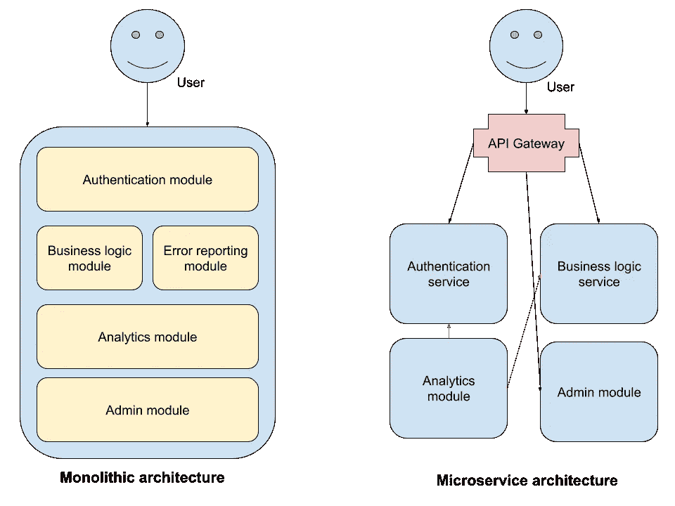
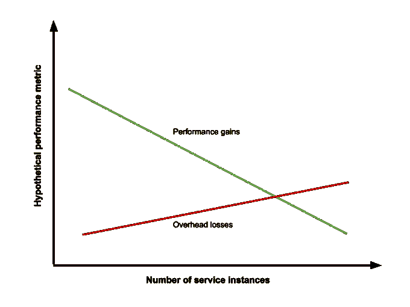

# 微服务不值得使用的 3 个原因

> 原文：<https://betterprogramming.pub/3-reasons-why-microservices-isnt-worth-using-7ca09c7f0142>

## 它们有好处——但是它们不是糟糕的开发实践的万灵药

普里西拉·杜·普里兹在 [Unsplash](https://unsplash.com?utm_source=medium&utm_medium=referral) 上的照片

微服务架构在过去几年中获得了很多好评。可伸缩性、故障隔离和更简单的代码库是微服务旨在提供的一些优势。在本文中，我将讨论微服务如何未能提供一些优势，以及它们给项目带来了什么样的开销。

# 什么是微服务架构？

与整体架构相反，微服务架构将应用程序分解为几个独立的服务，每个服务提供一项特定的功能。在单块应用中，所有代码库作为一个单元一起编写和发布，而在基于微服务的架构中，不同的服务可能负责应用的不同部分。比如认证，计算 AI，处理图像，用户之间发送消息。

该图强调了整体式应用程序和基于微服务的应用程序之间的主要区别。在整体架构中，整个应用程序被视为一个实体，并使用其内部工作来处理请求。在微服务架构中，app 被分解成单独的服务，分别开发和部署。因此，需要一个 API 网关来确定处理请求并将其转发给服务实例所需的服务。这些服务还可以直接相互通信，不需要用户，例如，分析服务可以从所有其他服务中提取数据(用红色箭头显示)。

> *整体架构与微服务架构的争论并不局限于最终用户的软件。操作系统设计中使用了相同的范例。据说 Windows、macOS 和 Linux 有单片内核，而 QNX、Minix 和 Symbian 有微内核。后者用于嵌入式设备，因为它们的 CPU 占用空间小。*

# 微服务的优势

在探讨微服务架构的缺点之前，我认为了解微服务承诺提供的优势非常重要:

*   **可扩展性** —由于该应用由许多不同的独立服务组成，因此很容易按需扩展特定的服务。例如，如果您注意到图像处理需要更多资源，而身份验证服务处于空闲状态，您可以将服务器电源转移到该服务。
*   **容错—** 在整体架构中，如果一个应用出现故障，它就完全失败了。对于微服务，如果单个微服务死亡，其他微服务(大部分时间)不会受到影响。
*   **简单性**——由于每个微服务只负责一小部分功能，人们相信它们更容易开发。
*   **团队独立性**——由于微服务是分离的，它们可以由不同的团队使用不同的语言和框架来开发。

这些是大型组织支持微服务的主要原因。我现在将解释微服务如何无法提供这些功能，甚至给系统带来更多的复杂性。

# 不太容易扩展

虽然可扩展性是微服务的一个明显优势，但它并不总是免费的。虽然微服务确实是相互分离的，但是它们仍然需要可靠的基础设施来相互通信。随着应用程序的增长，错综复杂的服务间通信越来越成为一种开销。

微服务通过 HTTP(最常见)或 AMQP(不太常见)等异步协议进行通信。虽然这些协议非常健壮，速度也很快，但在速度和可靠性方面，它们无法与单片应用程序的进程内通信相媲美。此外，它们需要复杂的网络基础设施设置，这给服务器带来了额外的压力。在某种程度上，随着规模的扩大，添加另一个服务来处理负载会产生越来越少的结果。对于许多服务来说，添加一个额外的服务实例甚至可能会降低整个系统的速度。

该图显示，随着服务实例数量的增加，其边际性能收益下降，而基础设施开销增加。在整体式环境中，这些损失被最小化，因为涉及的基础设施更少，不包括偶尔出现的负载平衡器。

# 意外故障行为

在微服务架构的 app 中，服务可能会独立失效。因为每一个都是独立的单元，所以一个单元的故障不会影响其他单元。或者他们有吗？

即使微服务是分离的，它们仍然相互依赖，就像软件模块中的类一样。如果其中一个停止响应，可能会影响其他服务的能力。如果认证服务失败，你的应用对你的用户有什么用？他们永远也不会走到这一步来与其他部门合作。

在整体式结构中，可能会出现故障。由于您可以直接访问所有系统，因此可能会以微服务无法使用的方式从错误中恢复。当应用程序崩溃时，在新环境中重启会更容易，因为基础架构要简单得多。

# 代码混乱

微服务被认为是通过基于功能将代码分成不同的服务来促进干净和可读的代码库。凭直觉，这似乎是显而易见的:更少的功能=更简单的代码。然而，在实践中，情况很少如此。

虽然这些特性本身是独立的，但是您必须记住，您现在必须为服务间通信编写所有代码，这在单一应用程序中是不存在的。每当你向你的产品线添加一项新的服务时，这种努力就会成倍增加。额外的约束也适用于这种服务间的连接:它们必须是无错的和即时的，就像一个单一应用程序的进程内通信一样。考虑到这些条件，想象一下在编写这些通信层上花费的精力，以及在没有约束的情况下可以完成多少工作。

另一个导致微服务应用代码混乱的因素是团队间的交流。因为每个团队负责自己的服务，所以它必须不断地与其他团队沟通，以便将所有的服务整合到一个大画面中。鉴于不同的服务可能用不同的语言和框架编写，其他团队很难理解代码库。最重要的是，您现在需要每个服务的大量文档，以便其他团队可以使用您的服务，反之亦然。

在一个单一的应用程序中，这样的复杂层次是不存在的。由于所有团队都在相同的代码库上工作，维护标准和让每个人都保持最新将会容易得多。

# 需求灵活性

这是微服务架构最大的敌人之一。最初，微服务是按照功能来划分的。现在，经过一段时间和客户反馈后，您意识到现有功能有了新的功能和变化，以至于您的微服务布局不再有效。您面临着要么完全重写系统(直到下一个需求变化)，要么创建伞式服务来组合多个现有的服务以产生这样一个特性。第一个选择不会受到管理层的欢迎，而第二个选择会让你陷入长期的科技债务。

这种问题在整体结构中不存在，在这种结构中，所有模块从一开始就可以相互使用。

# 结束语

我并不主张完全取消微服务架构。当然，它也有用例，从嵌入式设备中的微内核到用微服务编写的大型 web 平台。但是人们必须仔细评估项目、需求和潜在的未来变化，这些可能更容易使用微服务，也可能不容易。微服务不是万能的良药，如果你的代码混乱，或者不能很好地扩展，这里的问题就不仅仅是架构决策了。