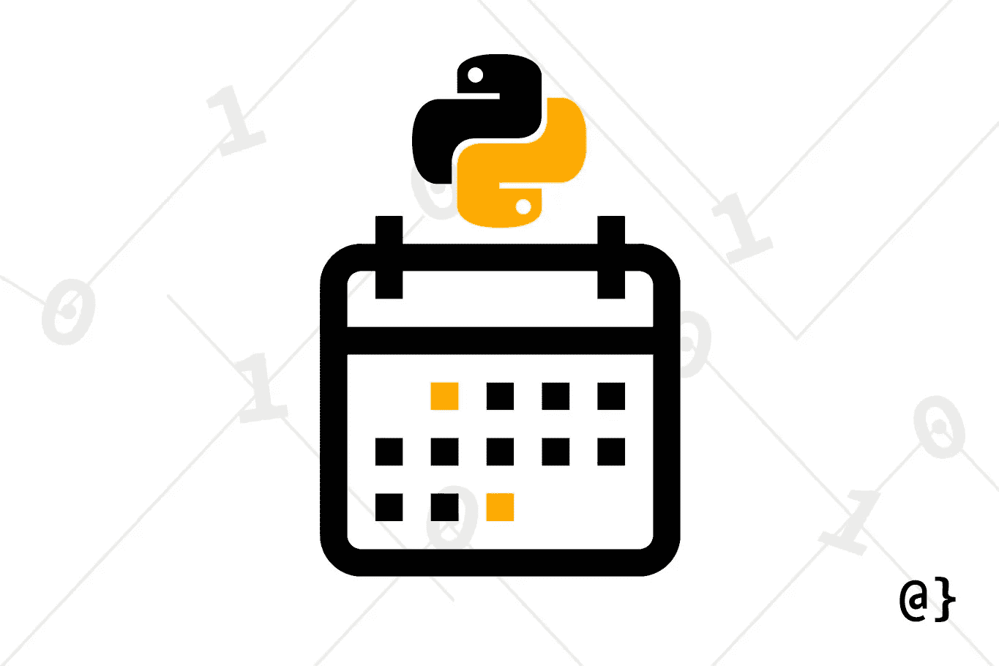

# 用 Python 获得英文工作日名称的 3 种简单方法

> 原文：<https://betterprogramming.pub/3-simple-ways-to-get-an-english-weekday-name-in-python-3ce2c7da8f55>

## 用 Python 获取日期是一项简单的任务。然而，获取工作日名称(用简单的英语)并不简单。幸运的是，有一些简单的方法可以返回用户友好的日期名称。

*照片来自* [*过度编码*](https://www.overcoded.net/python-datetime-weekday-name-482616/) *。*

# 获取日期和工作日

在我们了解如何获取工作日名称之前，让我们考虑一下 Python 的`datetime`类是如何获取日期并随后确定该日期是星期几的。这没什么特别的，但是知道你从哪里开始是值得的。

这段代码说明了在你必须开始变得有创造性之前，`datetime`类将带你走多远。在我们继续之前，有两件事值得注意:

*   `weekday`方法将值`0`赋给星期一。
*   另一种方法是`isoweekday`，将值`1`赋给周日。

查看官方`[datetime.weekday](https://docs.python.org/3/library/datetime.html#datetime.datetime.weekday)`文档了解更多信息。既然我们知道了如何获取给定的`datetime`对象的星期几的整数表示，我们可以开始计划如何生成一个简单的英文版本。下面是三种方法[，按照依赖关系的顺序](https://www.overcoded.net/most-popular-programming-languages-184015/)排列。

# 1.手动操作

这种方法提供了动态调整工作日命名和排序的灵活性。需要截断日期名称吗？只需编辑列表。需要从周日开始？只是重新安排一下。因为某种奇怪的原因需要倒榜？就`reverse`吧！

## 赞成的意见

*   没有添加依赖项
*   没有需要记住的附加方法
*   变化的灵活性
*   代码中的显式表示

## 骗局

*   更多打字
*   不能立即抵制复制问题(即在整个项目中使用它)
*   对错别字的恐惧

# 2.使用 Strftime

这种方法可以说是最简洁的。这是一个*合理的*一行程序，不会偏离`datetime`类，并且一旦您熟悉了`[strftime](https://docs.python.org/3/library/datetime.html#strftime-strptime-behavior)` [文档](https://docs.python.org/3/library/datetime.html#strftime-strptime-behavior)，它会提供一些灵活性。

## **优点**

*   没有额外的依赖
*   可能是一行程序
*   半柔性的
*   不怕错别字
*   易于在项目范围内集成

## **Con**

*   需要熟悉`strftime`才能改变格式

# 3.日历模块

这实际上只是一种迂回的方式，以达到与第一种方法相同的结果。这里的额外好处是其他人管理工作日列表(在这种情况下，这并不是真正的负担。)这个`calender.day_name`对象只是一个所有工作日名称的奇特列表。索引到该对象与索引到手动列表是一样的。

## 赞成的意见

*   内置模块
*   轻量级依赖
*   使用本机 Python 语法进行索引

## 骗局

*   额外依赖性
*   语法可以更简单

# 最后的想法

当我第一次学习编码时，最让我吃惊的是管理时间和日期是多么复杂。月份、闰年的细微长度差异，将`strings`转换为`datetimes`——这看起来像是为了这样一个外围任务而涉入深水区。

将计算机友好的日期表示(如纪元时间戳)转换为用户友好的表示是另一项令人烦恼的艰巨任务。在这种情况下，Python 的`datetime`类使得以整数值形式获取工作日变得很简单。之后就全是句法糖了！就我个人而言，我更喜欢第二种方法，因为它让一切都与`DateTime`模块紧密耦合。

*本文原载于***，经许可在此转载。**