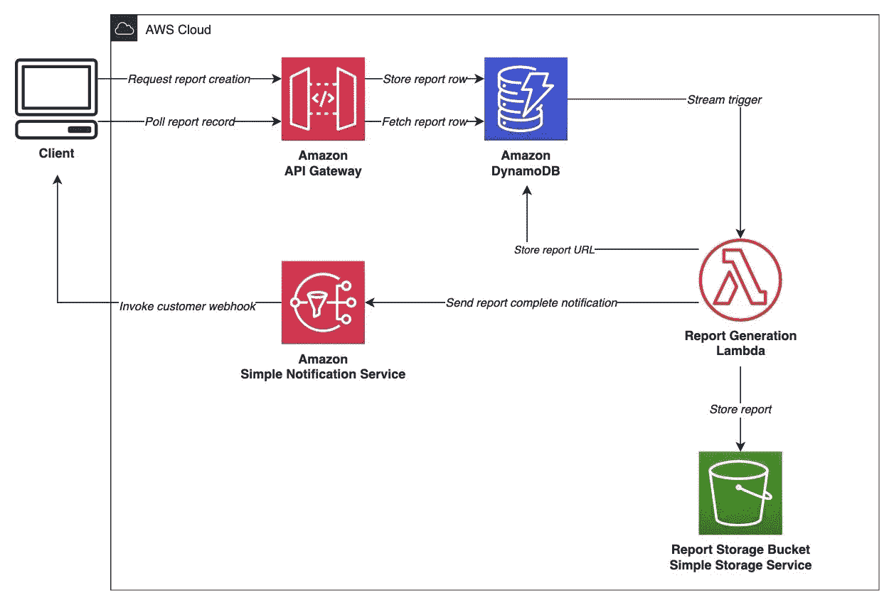

# 3 分布式系统的系统设计概念

> 原文：<https://betterprogramming.pub/3-system-design-concepts-for-distributed-systems-5f5a84d52ca7>

## 当在大规模分布式系统中工作时，有一些想法将帮助您使它们更加可靠和可维护


由[斯科特·韦伯](https://www.pexels.com/photo/computer-graphics-wallpaper-1544947/)拍摄

# 幂等设计

分布式系统最大的复杂性之一是网络不可靠的原则。这意味着当两个服务接口时，不能保证响应会被发送回请求者。

为了防止这种情况，我们可以使用幂等运算。任何时候我们提出一个请求，当多次应用时产生相同的结果被认为是幂等的。

考虑一个 express API 端点，它获取一个名称，将其插入到数据库中，并向客户端返回一个用户标识符。代码如下:

```
router.post("/api/v1/user", (req, res) => {
    const id = db.insert({
        name: req.body.name
    });
    res.send({userId: id});
});
```

我们可以看到，对于每个请求，我们都创建了一个新用户。这有许多问题。首先，如果客户端在创建用户后失去了与服务器的连接，那么客户端将不知道操作成功，并将重试，从而导致创建重复的用户。

我们想解决的另一个问题是数据库标识符不应该暴露给客户端。如果我们有一个数据库集群，该标识符对于该数据库服务器是唯一的，但对于该集群不是唯一的。如果两个标识符相同，这可能会给客户端带来问题。

这两个问题都可以通过创建幂等端点来解决。POST 是惟一一个默认情况下不是幂等的 REST API，但是可以实现成幂等的。

```
router.post("/api/v1/user/:id", (req, res) => {
    const id = db.insert({
        id: req.params.id,
        name: req.body.name
    });
    res.send(201);
});
```

注意，端点现在需要`id`(通常以 GUID 的形式)作为由客户端创建的参数，并用于在数据库中创建用户。如果客户端没有收到 201 响应，它可以重试，而不会创建重复的记录。后端服务必须验证所有输入，并确保`id`是预期的格式。

这还通过将后端和客户端从数据库中分离出来，解决了特定于数据库的 ID 问题。客户端生成可用于引用记录的唯一标识符，允许我们的数据库进行扩展，而不用担心重复记录。

# 异步处理

在高负载分布式系统中，处理时间可能是一个巨大的瓶颈，这可能是由于高流量或者当大量处理需要在系统的一部分中发生时。对分布式系统可伸缩性的需求意味着我们需要保持一致性，因为服务器应该是无状态的。

有多种方法可以减少延迟并提高一致性，但使用消息传递系统是最常用的方法。消息传递系统或消息队列是一种获取请求并将其传递给另一个服务的方式，该服务可以在消息可用时处理该消息。这样，后端系统就不会过载，并且可以在不丢弃请求的情况下进行扩展。另一种选择是在数据库记录中包含触发器。

异步请求意味着工作将在没有请求等待完成的情况下完成。缺点是客户机失去了请求结果的上下文，基本上被告知请求已被接收和处理。

这就是决定通知客户所请求的结果的时候了。客户端等待资源的最常见方式之一是长轮询。长轮询是指客户端每隔一段时间检查一次，以检索所请求的值。指数回退是一种有助于减少资源紧张的方法，因为系统需要等待的时间越长，就会改变时间间隔。这是最简单的选择，但是在服务器上非常耗费资源，并且会给客户端和服务器都带来额外的工作。

如果您使用的是服务对服务的通信(两个后端系统)，那么更好的选择是使用 webhook。webhook 是一个概念，其中请求者可以提供一个 URL 到它所托管的端点，以便服务发送工作已经完成的通知。URL 可以在请求中传递，也可以在服务可以访问并知道如何响应的地方配置。下面是使用 AWS 及其简单的通知系统实现 webhooks 的示意图。



图由[斯科特·格林](https://aws.amazon.com/blogs/architecture/managing-asynchronous-workflows-with-a-rest-api/)绘制

# 不可变数据

不可变数据背后的基本思想是通过从不修改或删除来保存它，以便将来可以使用。不可变数据允许增加调试能力，并且当您收到无法重现的问题报告时，审计日志可以让您快速了解一段时间内发生了什么。通过消除在给定时间对单个资源进行多次更新的需要，这也是处理并发性的一种有价值的方式。

假设我们有一个 SQL 数据库跟踪订单状态。最简单的架构是为单个订单创建一行，并根据订单的当前状态更新订单。但是，这样我们就失去了回过头来分析订单变化以寻找可能的优化或跟踪订单变化的能力。

这就是不可变数据发挥作用的地方。对订单的每次更新都成为一个新行，保存以前的元数据供将来使用。这也意味着无论哪个服务器在访问数据，都不会有并发问题。即使数据由于新的状态更新而变得陈旧，两台服务器也不会试图同时修改同一个资源。获取数据库中的最新记录以访问当前数据。

不可变数据的缺点是我们为数据增加了更多的存储空间。但是，如今的存储相对便宜，而且根据系统的要求，数据可以在给定的时间框架后被清除。查询现在变得更加复杂，因为我们需要过滤数据，并且需要根据需要进行优化。

总的来说，不可变数据将在将来当您需要应用程序的可见性时省去许多麻烦，如果没有它，这是不可能发生的。