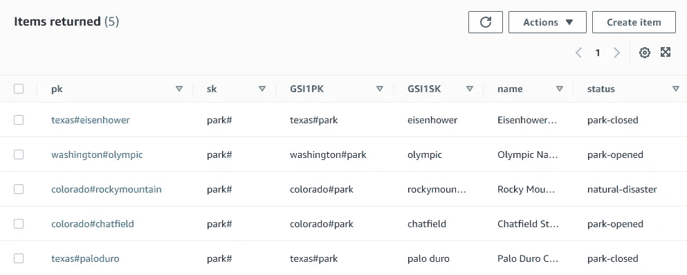

# 构建多租户无服务器应用程序之前要知道的 3 件事

> 原文：<https://betterprogramming.pub/3-things-to-know-before-building-a-multi-tenant-serverless-app-a19e21470b56>

## 多租户应用程序是一个复杂的软件，如果构建时没有考虑到这些因素，可能会导致灾难性的后果


由 [pch.vector](https://www.freepik.com/vectors/neighbor) 创建的邻居向量

几年前，我有幸带领一个工程师团队，“去弄清楚如何在云中构建。”(大部分)没有指导方针，只有一个模糊的想法，我们应该建立什么样的应用程序。听起来像是开发者的梦想，对吧？

的确是。

但是，从企业的角度来看，弄清楚如何在云中构建比听起来要困难得多。我们必须弄清楚云到底是什么，CI/CD 到底是什么，了解无服务器的来龙去脉，了解如何设计 NoSQL 数据模型，就如何构建微服务做出决策，了解云成本分析和预测，最重要的是，了解多租户是什么，以及如何构建一个可以处理它的应用程序。

我们必须解决的事情不胜枚举，其中肯定有被低估的细微差别。但是我们喜欢它。

在我们经历的所有思想、概念、架构、框架和设计模式中，可能我们经历的最困难的事情之一是多租户。从理论上来说，这不是一个新概念，但是把它付诸实践是令人疲惫的。

# 什么是多租户？

在讨论多租户时，我总是会得到同一个问题:“什么是租户？”

老实说，这个问题没有唯一正确的答案。对我们来说，租户就是付费客户。对其他人来说，这可能是完全不同的东西。

这不是因为我们的多租户实现是独一无二的；这就是我们选择在应用中添加细分的方式。

> *租户是共享对一组数据的公共访问的一组用户。*

在多租户环境中，您的系统中有许多(可能是无限的)用户组共享软件的同一个实例。这些用户组可以访问彼此相同的数据集，但不能访问其他组的数据。

这种模式对于大型应用程序来说非常好，因为它降低了发布管理的复杂性。共享实例意味着您没有针对每个客户的部署。

相反，您可能部署了一个每个人都使用的软件实例。这增加了灾难的风险，因为只有一次释放。因此，如果一个租户发现了问题，所有人都会发现。

多租户环境的无服务器实现与传统的软件部署没有太大区别。然而，当我们谈论伸缩、我们如何授权用户以及我们如何构建数据时，必须考虑一些因素。

# 无服务器实现

为了帮助说明这些概念，我有一个 GitHub repo，它是一个[全功能多租户应用](https://github.com/allenheltondev/serverless-multi-tenancy)的一部分，我们将一一介绍。这个 repo 部署了一个基于角色的无服务器应用程序来管理州立公园。

应用程序中每个系统定义的角色都允许访问各种端点。可以为最终用户分配多个角色，以扩展他们对新功能的访问权限。

用户可以属于多个租户，但一次只能有一个“活动”租户。这降低了 auth 的整体复杂性，同时也有助于保持每个租户的数据边界。通过更改租户，用户实际上是在更改他们有权访问的数据。

使用我们的参考应用程序，可以根据租户为用户分配不同的角色。这允许各种访问控制，其中用户可能在一个租户中拥有提升的权限，但在另一个租户中没有。

## 批准

虽然 [Amazon Cognito](https://aws.amazon.com/cognito) 有[的多租户选项](https://docs.aws.amazon.com/cognito/latest/developerguide/multi-tenant-application-best-practices.html)，但我们今天的例子将集中在一个基于请求的 Lambda 授权器上，以评估呼叫者的身份并确定他们的活动租户。Lambda 授权器位于 API 网关的前面，评估提供的 auth 令牌，并为用户返回 IAM 策略。


*λ授权器流程。来源:* [*AWS*](https://docs.aws.amazon.com/apigateway/latest/developerguide/apigateway-use-lambda-authorizer.html)

在我们的示例中，我们将使用授权者上下文，它是作为授权者策略的一部分传递给下游服务的丰富数据。该数据可以是您想要的任何数据，我们的示例包括了关于发出呼叫的用户的详细信息。

以下是我们的授权人返回的请求上下文数据的示例:

```
{ 
  "userId": "testuserid",
  "tenantId": "texas",
  "email": "testuser@mailinator.com",
  "roles": "[\"admin\"]",
  "firstName": "Test",
  "lastName": "User" 
}
```

我们的 Lambda 授权人遵循的业务流程如下图所示:


1.  验证 JWT —工作流中的身份验证机制验证授权头中提供的 [JWT](https://jwt.io/introduction) 。
2.  从 DynamoDB 加载用户详细信息—解析来自 JWT 的用户 id 后，从数据库加载完整的用户数据。这包含用户的活动租户、角色和人口统计信息。
3.  确定访问策略—基于活动租户的角色，构建用户可以调用的允许终端的 IAM 策略。
4.  构建授权者上下文—构建包含用户信息的数据对象，以提供给下游服务，如 Lambda、DynamoDB 和 Step 函数。
5.  返回策略和上下文—将访问策略传递回 API Gateway，以评估和确定调用者是否有权访问他们正在调用的端点

一旦授权者完成并且 API Gateway 评估了 IAM 策略，就调用端点背后的支持服务，并且提供关于调用者的信息。

> 使用授权者上下文在多租户环境中提供了额外的安全层。它可以防止恶意用户提供无效的租户信息并获取不属于他们的数据。

由于租户 id 来自授权者，我们保护了我们的 API 免受某些恶意攻击，在这些攻击中，用户试图通过在其访问令牌中传递它来欺骗他们的租户。我们构建的授权器从数据库中加载租户信息，因此任何提升的尝试都会被放弃。

基于下游服务，对授权者上下文的访问是不同的。使用 Lambda 函数，我们可以通过事件中的`requestContext`对象访问丰富的信息。

```
exports.handler = async (event) => { 
  const tenantId = event.requestContext.authorizer.tenantId; 
}
```

然而，在 VTL，当我们将 API Gateway 直接连接到 DynamoDB 和 Step 函数之类的服务时，它的访问路径略有不同。

```
#set($tenantId = $context.authorizer.tenantId)
```

现在我们已经可以访问调用者的租户 id，让我们讨论如何使用它。

## 数据访问控制

多租户最重要的方面是防止一个租户中的用户看到属于另一个租户的数据。另一种说法是拥有强大的数据隔离。

当某个租户的数据被正确隔离时，攻击者无法操纵 API 调用来跨租户返回数据。当涉及到结构化数据时，这意味着我们用租户 id 作为所有索引的前缀。

以下面的数据集为例:



*跨多个租户的州立公园数据集*

在这个数据集中，有来自三个不同租户的公园:`texas`、`washington`和`colorado`。主键的分区键和 GSI 的 pk 都在数据前添加了租户 id。

> *在多租户应用程序中，始终将租户 id 作为主键和索引的分区键的前缀。*

这种模式迫使我们在执行`GetItem`或`Query`操作时提供租户 id。通过要求调用包括租户 id，您保证您将只从单个租户接收数据。您还可以保证获得正确租户的数据，因为您使用的 id 来自 Lambda 授权器，而不是调用者伪造的。

***注*** *:这种模式在台面扫描中分崩离析。进行扫描时，您无法保证能够访问单个租户的数据。这是你应该尽可能不频繁地进行扫描的另一个原因。*

## 基础设施扩展和服务限制

随着您接纳更多租户，您的基础架构自然会在无服务器环境中扩展。但是，在进行初始设计时，您需要考虑一些组件。

在之前一篇关于[避免无服务器服务限制](/solutions-architect-tips-how-to-design-around-serverless-service-limits-15e12b5c4235)的文章中，我谈到了在你的 AWS 账户中 SNS 主题的数量与 SNS 订阅过滤器的数量之间存在奇怪的差异。您可以创建 100，000 个 SNS 主题，但只能创建 200 个订阅过滤器。两者都是软限制，但是对于多租户应用程序来说，考虑这一点很重要。

一个更安全的解决方案是为每个事件类型的每个租户动态创建 SNS 主题，而不是拥有一组静态 SNS 主题来允许用户使用租户过滤器进行订阅。您会得到一个稍微复杂一点的解决方案，但是您可以无忧无虑地自由扩展。


*注册特定于租户的 webhook 事件的工作流程图*

这些主题是在订阅到来时按需创建的，因此您可能永远不需要为某些事件/租户组合创建主题。该模式在示例存储库中的 [subscribe-webhook 工作流](https://github.com/allenheltondev/serverless-multi-tenancy/blob/main/workflows/subscribe-webhook.asl.json)中进行了说明。

将事件发布到动态主题时，如果主题存在，将执行简单的查找来查找主题。如果它存在，我们就发布到它，如果它不存在，就跳过发布。


*发布到动态创建的 webhook 事件的工作流程图*

当我们谈到为了更高的流量而扩展基础设施时，[你的架构会发生相当大的变化](/building-serverless-applications-that-scale-the-perfect-amount-ca6f75ae94a5)。在大范围内，您的应用程序更多的是关于批处理、缓存和队列，而不是其他任何东西。

当您进行批处理和排队时，您会失去标准 REST API 请求/响应范例的同步特性。这是一个重要的考虑因素，因为您的租户 id 是从 Lambda 授权器注入到系统中的。别弄丢了！

当将消息保存在队列中以便以后成批处理时，您必须跟踪哪些请求来自哪些租户。如果您允许最终用户自行切换租户，那么在处理时查找活动租户就不是一个选项。

在请求和处理之间，用户可能已经更改了租户。因此，您的选择是在收到请求时保存租户 ID 和请求。

从多租户的角度来看，大规模工作与小规模工作没有太大区别。只要在请求的入口点注入租户 id，其他方面就不会有太大变化。

# 结论

在您的应用程序中实现多租户肯定会有所取舍。只支持应用程序的单个实例会降低复杂性和可维护性。但是将租用逻辑添加到应用程序中会增加复杂性。

数据安全性也是多租户的一个问题。您必须保证没有意外的“失误”将数据返回给错误的租户。但是，通过在所有查找中添加租户 id 前缀，并不惜一切代价避免表扫描，我们可以减轻很多风险。

还要注意服务限制。随着您的应用程序随着更多的租户而扩展，很容易达到一些鲜为人知的限制。在开始构建之前，查看您将消费的服务的所有服务限制始终是一个好的做法。

租户是一个逻辑结构。怎么实现完全看你自己。只要你保持数据隔离，并以一种可扩展的方式构建你的应用程序，这样做没有错。您可以使用 Amazon Cognito 及其令人难以置信的特性集，或者像我一样自己承担细粒度的访问控制。

设计一个多租户应用程序需要大量的前期规划，但是结果证明方法是正确的。希望所提供的参考架构将有助于为您的实施激发一些灵感。

编码快乐！