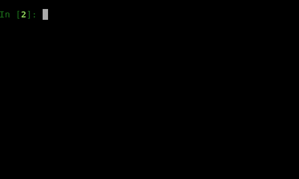

# 编写更好 Python 的 4 个工具

> 原文：<https://betterprogramming.pub/3-tools-for-writing-better-python-155b159faad8>

## PEP8、Pylint、IPython 和 isort


Rachael Gorjestani 在 [Unsplash](https://unsplash.com/s/photos/tools?utm_source=unsplash&utm_medium=referral&utm_content=creditCopyText) 上拍摄的照片

当我第一次开始写 Python 的时候，我犯了*太多*错误。令人沮丧。我第一次学习用 Ruby 编程，虽然熟练地使用 Python 并不是什么惊天动地的事情，但还是有点烦人。

我反对语言的常规和“Python 的禅宗”。每一个语法错误都会让我说:“多么愚蠢的规则。为什么？”

缩进作为语法感觉怪怪的。这使得代码看起来很难看，并且向右移动。我过去习惯的速记方法和巧妙的单句俏皮话现在已经无效了，必须用一种看起来陌生的方式重写。

然后…一切都变了。

嗯，算是吧。不是一下子，而是慢慢地事情发生了变化。语法开始变得不那么陌生，我开始有点喜欢写 Python 了。让我恼火的事情最终都退居幕后了。

像语法缩进这样令人厌恶的东西仍然存在。我仍然不欣赏一些整体的语法决策，但是编写 Python 已经变得不那么令人沮丧了。

通过明智地应用工具，可以减轻习惯一门新语言的考验和磨难。学习风格指南。Lint 你的代码。变得舒适。

我整理了一个工具列表，这些工具帮助我成为一名更好的 Python 开发人员。希望像这样的工具能够减轻痛苦，并尽早指出需要改进的地方。

# 1.PEP8

首先也是最重要的是 [Python 风格指南](https://www.python.org/dev/peps/pep-0008/)。这不一定是你运行的工具，而是你引用的工具。在开发过程中，你肯定会遇到这样的场景，你会想:“我应该怎么写呢？”

你的第一反应应该是查看风格指南。参考样式指南首先巩固了你头脑中的最佳设计选择，并使得下次编写类似的方法或函数更快。

还有两个额外的步骤可以让你尽早真正理解这种风格:

*   遇到问题不要只参考，读一读。研究该语言期望某些数据结构如何格式化，或者函数应该如何正确声明。
*   将风格指南与下一个工具( [Pylint](https://www.pylint.org/) )结合使用，作为更密切关注的领域的指示器。如果你每次都违反某些规则，那就再看一遍风格指南的那个部分。

# 2.皮林特

接下来是一个方便的工具，可以显示你在代码中犯的所有错误和违反的约定。Pylint 是一个林挺 Python 文件的命令行工具。

如果你对林挺一点都不熟悉，那么 Colby Fayock 有一篇很棒的文章叫做“[林挺是什么？](https://medium.com/better-programming/what-is-linting-66e7876708f3)”

林挺归结为检查你的代码的错误，并根据风格指南进行检查。在这种情况下，安装 Pylint 并对 Python 文件运行它会产生一系列需要解决的问题。这包括行长度、函数格式、变量命名等。

每次编写新的 Python 文件或更新现有文件时，都应该运行 Pylint 并检查问题。这可以由其他第三方工具自动完成，或者通过插件简单地内置到您现有的 IDE 中。

随着时间的推移，您会发现在编写一些代码后，您产生的问题更少，需要修复的东西也更少。

# 3.IPython

IPython 是现有 Python [REPL](https://en.wikipedia.org/wiki/Read%E2%80%93eval%E2%80%93print_loop) 的替代产品，有一个重要的改进——语法高亮！

与 Ruby 的 [Pry](https://github.com/pry/pry) gem 非常相似，IPython 为您提供了彩色输出、自动缩进和交互式语法高亮显示。



用 IPython 突出显示内联语法。

使用 IPython 也非常简单，你需要做的就是安装并运行`ipython`,就像你使用普通的 Python REPL 一样:

```
sudo apt-get install ipython
ipython
```

当您测试代码和开发简短的代码片段时，使用这个插件可以为您提供更好的反馈。

当你键入时，你将能够更清楚地看到语法，并且你将得到像自动缩进这样有用的调整，以避免当你错过一个制表符时不得不重新键入代码。

# 4.伊索特

起初，这并不是这个星球上最有用的工具，但它可以将你从一次又一次的单调工作中拯救出来。

代表“导入排序”,它确实如其名。该工具将接受一个 Python 文件，并按字母顺序对其中的所有`import`语句进行排序。

乍一看，如果您只处理几个文件和一小组导入语句，这似乎没有必要。当代码库增长和引入更多的导入时，按字母顺序保存它们会很快变得很烦人。

你可以在列表的底部加入一个 import 语句来测试一些东西。结果是你测试的东西工作得很好，你想提交代码。接下来，您会发现您的 Pylint 失败了，因为您的导入不是按字母顺序的。

使用`isort`，再也不用手动按字母顺序排列了。

这可以通过`pip`或`apt`安装，具体取决于您的经销商:

```
pip install isortsudo apt install isort
```

还有一种简便的方法是将`isort`添加为 Git 挂钩，这样它就可以在你提交任何东西之前自动运行。有关配置的更多信息，请查看[官方文档](https://timothycrosley.github.io/isort/)。

# 结论

感谢阅读！我希望其中的一些工具能够增强您使用 Python 的开发体验，并让您更容易习惯这种语法和风格。