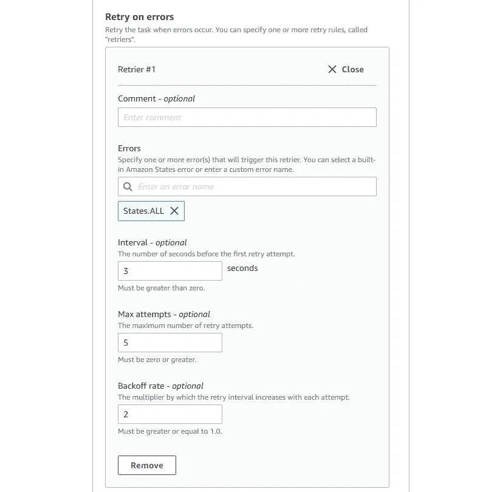

# 在无服务器应用程序中重试失败的 3 种方法

> 原文：<https://betterprogramming.pub/3-ways-to-retry-failures-in-your-serverless-application-84b5102f620>

## 了解如何从低级、中级和高级别处理事件驱动的工作流中的错误。


图片由 [jburson](https://pixabay.com/users/jburson-9333362/?utm_source=link-attribution&amp;utm_medium=referral&amp;utm_campaign=image&amp;utm_content=3613618) 来自 [Pixabay](https://pixabay.com/?utm_source=link-attribution&amp;utm_medium=referral&amp;utm_campaign=image&amp;utm_content=3613618)

几年前，当我进入无服务器开发和事件驱动架构时，有太多的神秘感和惊奇。我不知道事件总线的用途，我无法理解异步进程，我也不明白为什么你需要在应用程序中构建重试功能。

由于来自严格同步的背景，重试毫无意义。如果*不起作用，只需再次点击*按钮。虽然这对于同步 API 调用可能是正确的，但在许多无服务器环境中却不是这样。

无服务器大量使用事件，这些事件本质上是异步的。这意味着打电话的人在回电之前不会等着听到回应。当设计在负载下自动伸缩的松散耦合系统时，这是一种非常有效的方法。更不用说，当 Lambda 函数不必等待进程结束时，它会为您节省大量资金。

当异步流程中出现问题时，您不希望它失败并永远丢失。进程失败可能是因为[暂时性错误](https://www.serverless360.com/blog/transient-fault-handling)，如网络故障或节流事件。这些类型的事件可以安全地重试，并有望通过(假设网络问题已经解决或者您的速率低于限制)。

如果你的程序举手说“我退出”，那么你会有不必要的数据丢失。我们不想那样。

这在无服务器应用中非常重要，以至于 AWS 明确地将其包含在[良好架构框架](https://docs.aws.amazon.com/wellarchitected/latest/serverless-applications-lens/failure-management.html)的无服务器应用透镜的可靠性支柱中。

今天，我们将讨论你可以添加到你的应用程序中的三种重试能力，以及每种能力的优缺点。

# 低级别的重试

当您[间接调用函数](https://docs.aws.amazon.com/lambda/latest/dg/invocation-retries.html)时，AWS 已经为您处理了各种故障。它通过不同类型的重试来处理不同的调用类型。

然而，当您运行同步调用时，您只能靠自己。

## λ函数

我相信我们都同意大多数 Lambda 函数至少调用 AWS SDK 一次(但希望[不超过两次](/how-to-build-lightning-fast-apis-with-aws-step-functions-d1725624aaaa))。SDK 会自动为你重试失败的次数，但是如果你想自己解决问题，你可以配置它重试的次数以及如何退出。

> *重试失败时，标准做法是使用抖动* *对每次重试进行* [*指数回退。抖动是一种随机延迟，用于在多个执行同时失败时防止连续冲突。*](https://aws.amazon.com/blogs/architecture/exponential-backoff-and-jitter/)

如果使用 javascript SDK，可以为函数中实例化的每个客户端配置重试次数。

```
const { DynamoDBClient, PutItemCommand } = require('@aws-sdk/client-dynamodb'); 
const ddb = new DynamoDBClient({ maxAttempts: 5 });
```

当客户端遇到问题时，它会在函数代码中抛出异常之前重试命令 5 次。如果没有明确设置该值，SDK 将[重试三次](https://docs.aws.amazon.com/sdkref/latest/guide/feature-retry-behavior.html)。

如果您的函数在最大尝试次数后仍然出错，强烈建议将该事件放入[死信队列(DLQ)](https://docs.aws.amazon.com/AWSSimpleQueueService/latest/SQSDeveloperGuide/sqs-dead-letter-queues.html) 进行中级重试。

## 阶跃函数

如果你是一个[阶跃函数](https://aws.amazon.com/step-functions/)用户，你很幸运。谈到重试，这项服务已经涵盖了你。您有能力[单独捕捉、回退和重试每个状态](https://docs.aws.amazon.com/step-functions/latest/dg/concepts-error-handling.html)。

与 AWS SDK 相反，这不会自动发生。您必须手动配置它。幸运的是，这是一个简单的配置，甚至在[工作流工作室](https://docs.aws.amazon.com/step-functions/latest/dg/workflow-studio.html)中也得到支持。



*步骤功能 Workflow Studio 重试配置*

或者，如果你更喜欢看美国手语(亚马逊州语言):

```
"Retry": [ 
  { 
    "ErrorEquals": [ "States.ALL" ], 
    "BackoffRate": 2, 
    "IntervalSeconds": 3, 
    "MaxAttempts": 5 
  } 
]
```

在您已经用尽所有重试次数的情况下，您将再次希望在死信队列中丢弃事件或输入执行。死信队列将存储输入，并允许您通过中级或高级机制重试，或者允许您手动做出反应。

**优点** —低级重试的主要好处是感觉无缝。您不必提供额外的基础设施来处理错误，并且执行并不表明出现了问题。他们已经为你处理好了，正在他们快乐的路上。

**缺点** —取决于你如何配置补偿率，这种方法可能会累积一大笔计算费用。如果一个 Lambda 函数正在等待一个指数回退完成，你将为它等待的运行时间付费。

# 中级重试

我们在重试阶梯中每上升一级，就增加一个抽象级别。中级重试包括重试死信队列中的事件。这些重试不在函数的代码级运行，就像我们的低级重试一样。相反，它们特定于一个函数或状态机以及一个特定的死信队列。

中级重试机制可以是执行以下操作的 Lambda 函数或状态机:

*   从死信队列中弹出项目
*   评估事件是否可以重试或需要手动干预
*   执行任何转换或验证
*   将事件重新提交给将它添加到 DLQ 的函数或状态机

这种类型的重试特别注意将项目放入 DLQ 的函数或状态机。它为计算资源提供一对一的错误处理。这意味着每个 Lambda 函数或状态机都有一个死信队列和一个错误管理函数。

这也意味着您有集中的、范围狭窄的资源，在错误发生时处理它们。


*简单中级重试数据流*

**优点** —重试功能具有最低权限。它们应该能够从单个队列中读取和删除消息，并调用单个状态机或 Lambda 函数。您还可以针对失败的 Lambda 函数/状态机做出智能决策或在 retrier 中转换数据。

缺点**—需要跟踪和维护的资源要多得多。如果你不小心，你可能会让自己陷入一个无限循环的重试逻辑，如果你不跟踪尝试。**

# **高级别重试**

**将重试过程抽象得更高，我们就可以看到一般的高级重试。这些机制并不明确知道它正在重试哪个状态机或 Lambda 函数。相反，它接受来自死信队列的结构化输入，并重新提交输入，而不执行任何转换或业务逻辑。**

**一个通用的高级重试机制可以是一个状态机或一组状态机，它查看一个帐户中的所有死信队列，验证是否有要重试的消息，并处理它们。在下面的示例中，状态机由事件桥规则在 30 分钟计时器上触发。**

**死信队列预计以相同的前缀*开始，即重试-* ，以便正确识别并与用于其他目的的队列分开。**

****

***高级重试状态机***

**当状态机处理单个消息时，它必须确定将要调用的资源类型以及已经重试的次数。理想情况下，这些信息来自最初传递到死信队列的结构化消息。**

****

***重试来自死信队列的消息***

****优点** —随着应用程序的增长，这种方法会在错误被放入 dlq 时自动拾取并重试错误(只要您命名了 dlq 并适当地组织了消息)。您的资源数量将保持较低水平，因为您没有特定的 Lambda 函数错误处理程序来选取项目。它还以结构化 DLQ 日志记录的方式强制进行一定程度的治理。具有一致的消息传递对于排除错误非常有用。**

****缺点** —这个状态机需要通配符来访问 SQS 队列、Lambda 函数和状态机。现在，它不需要完全管理，但它需要读取和删除消息，并调用状态机和函数。这不符合[最小特权](https://aws.amazon.com/blogs/security/techniques-for-writing-least-privilege-iam-policies/)原则，并且打开了不应该打开的门。在重试时，您也无法获得添加业务逻辑和转换的好处。最后，如果您的最大尝试逻辑中有一个 bug，您也可能会陷入无限循环。**

# **关于幂等性的一句话**

**当处理分布式系统时，你[不能保证恰好一次交付](/understand-distributed-computing-through-ducks-d4d11b93f8e0)。您也不能保证您的重试机制将在原始的实体上运行，这意味着操作第一次可能会部分成功。**

**幂等性是指应用程序多次运行相同的 API 调用或函数的能力，它对系统有相同的影响。因此，如果我重试相同的帖子 3 次，将导致创建一个实体，而不是三个。**

**这不是为您现成处理的。这是你需要自己[承担的事情](https://aws.amazon.com/premiumsupport/knowledge-center/lambda-function-idempotent/)，尤其是当你开始自己实现重试逻辑的时候。**

**幂等模式是[明确定义和建立的](https://aws.amazon.com/builders-library/making-retries-safe-with-idempotent-APIs/)。如果你是一个 python 用户，它甚至包含在 [python Lambda powertools](https://awslabs.github.io/aws-lambda-powertools-python/latest/utilities/idempotency/) 中，可以快速使你的函数可重试。**

**重试和幂等性携手并进，是 [aws 无服务器设计原则](/7-aws-serverless-design-principles-for-solutions-architects-2be22717713b#a4fe)的一部分。虽然你可以离开一个做另一个，但是你不应该。**

# **结论**

**在任何规模下操作时，能够重试错误将为您节省大量开发时间。他们不会把时间花在挖掘日志或不必要的根本原因分析上。如果一个问题可以通过“关机再开机”来解决，那么你的无服务器应用程序将会为你做到这一点。**

**如果您的应用程序每天有 5，000 个事务，平均 1%的失败率，那么您将有 50 次失败。如果其中 80%是由于暂时性的问题，这意味着你每天会自动解决 40 个问题。想象一下，如果工程和支持团队不用定期查看这些，他们会有多高兴。**

**你有多层次的重试抽象。低级别的重试在代码级别处理错误。中级重试处理函数或状态机死信队列。高级重试通常适用于所有情况。**

> ***我的建议是坚持生产软件的低级和中级重试。***

**高级别重试的完全开放权限所冒的风险太高了。无服务器是关于狭义的权限范围。拥有一个可以从任何队列中读取和删除消息或者调用任何函数或状态机的状态机只是自找麻烦。**

**如果您已经在 Lambda 函数中使用了 AWS SDK，那么您已经在进行低级别的重试了。如果您使用阶跃函数，请确保在每个状态都包含重试逻辑。**

**中级重试非常有效。他们可以在重新提交之前查看下游或验证数据完整性。养成在你的异步工作流中包含一个处理程序来处理和识别错误的习惯。**

**自我修复应用程序将为您节省时间和金钱。尽可能自动化。它消除了人为错误，并尽快解决问题。**

**编码快乐！**