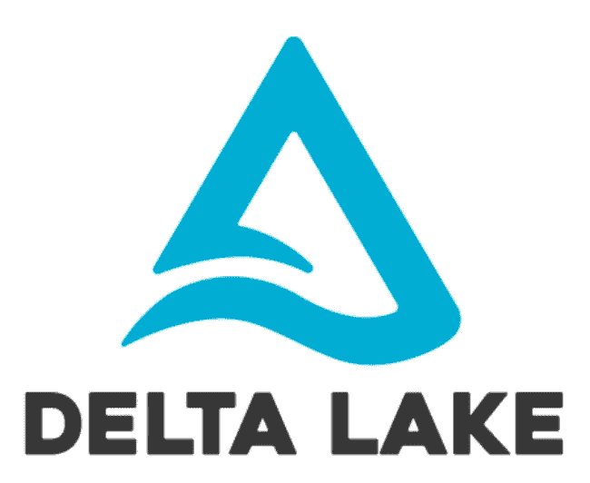

# 你应该知道的 4 个三角洲湖元数据查询

> 原文：<https://betterprogramming.pub/4-delta-lake-metadata-queries-you-should-know-ca7489c13483>

## 获得所有你想要的关于你的湖边小屋的元数据



来自 [GitHub](https://github.com/delta-io/delta) 的三角洲湖标志

本文的主题都集中在 Delta Lake 表的高级元数据查询上。如果您是 Delta 表的新手，我强烈建议您浏览一下开源社区提供的关于 Delta Lake 的文档。

在本文中，我将展示一些高级元数据查询，我发现这些查询在实现数据湖库时非常有用。

本文的所有代码都可以在[这里](https://github.com/sjrusso8/delta-tables-metadata-queries)找到。我使用 Databricks Workspace 和运行 DBR 11.1 的集群。

## 设置

本文的数据可以在大多数 Databricks 工作区的目录`/databricks-datasets/nyctaxi/sample/json/`下找到。

加载数据

我正在加载纽约市出租车数据集的样本，并将其作为托管增量表保存在我的 Databricks 工作区中。

## 描述历史

关于增量表，您应该知道的最重要的操作是检查表的变化历史的能力。对于审计操作、监控随时间的变化和数据版本控制来说，历史记录更安全。每次修改增量表都会创建一个新的表版本，并且更新`delta_log`。

新创建的增量表总是以 0 的`delta_log`版本开始。语句`DESCRIBE HISTORY`将给出一个表上所有更改的输出。

在新创建的表上描述历史

在运行插入新数据和删除数据的两条语句后，您将看到两个新版本被添加到了`delta_log`历史中，现在表版本是 2。

查看版本历史

如果遇到对数据执行了不正确修改的情况，可以使用`RESTORE TABLE`快速将整个增量表恢复到以前的版本。

将增量表恢复到以前的版本

## 描述表格

由于增量表在其日志中保留了所有的元数据，所以您可以使用`DESCRIBE TABLE`查询大多数元数据信息。该操作中包含的信息与列名、类型和注释、表属性以及分区规范有关。

使用描述表查看表元数据

一个有用的选项是`DESCRIBE TABLE EXTENDED`，它提供了更多的元数据信息。

使用扩展的描述表查看更多表元数据

## 描述细节

该查询提供了一条记录，其中包含关于增量表的所有最新元数据。单行包括以下详细信息:

*   文件的数量
*   桌子的位置
*   创建和上次修改日期
*   数据量
*   表格属性

更多信息可以在[文档](https://docs.delta.io/latest/delta-utility.html#detail-schema)中找到。

我经常使用这个查询来收集关于数据大小的信息，而不需要跳转到 AWS S3 存储桶或 ADLS 存储帐户。

## 显示创建表格

我发现自己需要与其他团队共享 DDL 语句来重新创建表模式或记录已经创建的增量表的细节。查询`SHOW CREATE TABLE`生成这些需求所需的精确 DDL 语句。

它也适用于视图！如果您在一个视图上运行相同的查询，它将返回用于创建它的 SQL 语句。

您可以使用这些信息来执行沿袭操作，并为需要验证视图逻辑细节的最终用户提供信息。

# 包扎

在本文中，我甚至没有涉及到整个增量表操作的世界。像`OPTIMIZE`、`ZORDER`、`VACUUM`等操作可以极大地改善增量表上的查询时间，并节省存储成本。我计划在以后的文章中介绍这些操作！敬请关注！

我希望你能从这篇文章中学到一些新的东西。三角洲湖生态系统发展迅速，每次发布都会出现新的功能。

```
Want to Connect?Please enjoy more of my [Medium articles](https://medium.com/@sjrusso) if you found this post helpful***.*** I write about data engineering, books, tutorials, and more!I'm also on [LinkedIn](https://www.linkedin.com/in/stevenjosephrusso/).
```