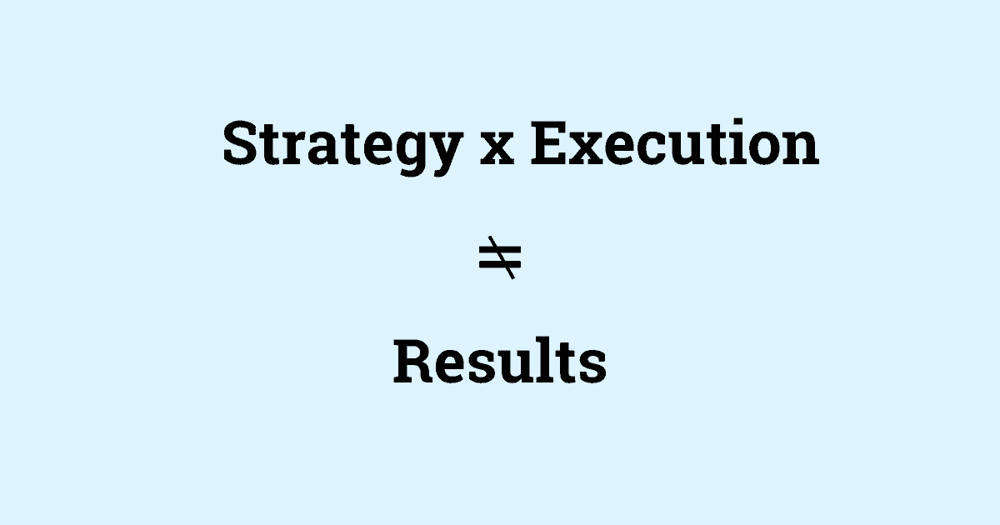

# 作为领导者建立信任的 4 种有效方法

> 原文：<https://betterprogramming.pub/4-effective-ways-to-build-trust-as-a-leader-67ab9a9e98b8>

## 发现每个团队成功公式中隐藏的元素

图片来源:作者

我们都有过建立在信任基础上的关系，也有过不信任的关系。如果你回顾这些经历，你可以清楚地说它们之间有很大的不同，不仅是在你经历的质量上，而且是在你获得的结果上。

你可以相信自己，相信自己有能力设定和实现目标，领导团队，并作为领导者推动组织发展。但是激发和赢得他人同等程度的信任是一种截然不同的技能。

让我们从理解信任以及它对有效领导的重要性开始。

当你第一次见到某人时，他们会自动把你列入朋友或敌人的类别。你说的话和你的行为是这个决定的重要标准，但最重要的因素是你给他们的感觉。他们在你身边感到安全吗？你给他们怀疑你的理由了吗？你说过或做过什么可能让你看起来像个对手的事吗？

信任始于意图。当人们信任你时，他们相信你会做正确的事情。

当你错了，他们相信你会找到正确的答案。当你犯错时，他们相信你会解决问题。当你不知道该走哪条路时，他们相信你会寻找做出决定所需的信息。

随着时间的推移，信任会自动从“信任你的意图”延伸到“信任你的事业”。信任你的人会致力于你的事业，并准备为此付出更多。他们相信你，想成为你故事的一部分。他们将自己的成功与你的成功联系在一起，这激励他们克服挑战，在斗争面前坚持不懈。

然而，当别人不信任你时，他们会怀疑你说的或做的一切。你确定的议程，你决定的方向，你提供的建议，你分享的信息，每一件事都会遇到阻力和判断。没有信任，怀疑就会渗透进来，并形成每一次互动的基础。它会影响信息交换、决策和想法执行的方式，最重要的是，它会限制你们共同取得的成果。

> “信任总是影响两种结果——速度和成本。当信任度下降时，速度也会下降，成本也会上升。信任度上升，速度也会上升，成本也会下降。传统的商业公式认为，战略乘以执行等于结果:但这个公式有一个隐藏的变量。信任——要么是低信任度的税收，让产出打折扣，要么是高信任度的股息，让产出翻倍。”斯蒂芬·m·r·科维

从战略到执行再到结果，如果没有信任的基础，没有一个领导者是有效的。信任是每个领导者效率的唯一最重要的驱动力，也是每个企业成功公式中隐藏的元素。

作为一名领导者，你能做些什么来建立信任？

解决冲突、及时向团队提供反馈、沟通优先事项和目标、保持透明、认可和欣赏好的工作以及与团队合作都是有用的行为。它们对于确立你作为领导者的有效性和实现组织的目标非常重要。

然而，这些行为并不是与团队建立高度信任的主要因素。它们是奠定基础的必要条件，但还不足以建造一座堡垒。他们可以赢得你的欣赏和尊重，但却不能赢得你推动关键变革所需的信任。

信任只能通过长期坚持实践这四种积极的行为来获得和发展。

# 作为领导者建立信任的 4 种有效方法

## **1。明确你的意图**

自己没有安全感的领导，是无法把安全感传递给团队的。考虑到自身的生存，他们变得过于自私，不愿保护自己的目标和推进自己的议程。他们筑起高墙，寻找支持他们自我的信息，避免任何可能伤害自我的东西。他们不再关注他们的人民，而开始关注他们自己。

他们的行为和行动并不植根于提升他人，因为他们更关心提升自己。实际上，他们不再信任他人。

> “当一个领导者让自己成为人们担心的主要现实，而不是现实成为主要现实时，你就有了平庸或更糟的配方。这是魅力较弱的领导者往往比魅力更强的领导者产生更好的长期结果的关键原因之一。”—吉姆·科林斯

作为一名领导者，要建立信任，你需要清楚自己的意图。你需要有明确的是非观。你首先需要对自己诚实。只有这样，你才能和别人有同样的诚实和直率。信任不是单行道。只有你先信任别人，别人才能信任你。因为信任首先来自于给予他人。人们无法信任你，除非他们知道你先信任他们。

为了实践这种行为，问问你自己:你是在花时间管理你的自我还是信任你自己和他人？

## **2。面对难以面对的事情**

任何从事有价值工作的领导者都注定会犯错:他们的战略可能会失败，他们投资的产品可能不会产生任何价值，他们可能会打错招聘电话，或者他们可能会拒绝一个潜在的好主意。

不犯这些错误是不可能的。可能的是承认你搞砸了，从这些错误中吸取教训，并为每个人树立一个榜样，那就是有时候犯错是没关系的。不可接受的是撒谎或试图通过推卸责任或推波助澜来掩盖真相。

许多领导者担心，为错误承担责任会表明错误无关紧要，或者你的期望值较低。别人不是这么看的。接受错误和承认失败只能传达这样的信息:

*   你相信错误是成长的自然部分。
*   你鼓励别人从他们的错误中学习。
*   比起正确，你更看重做正确的事。
*   你重视人们如何被公平对待，不要因为你的错误而责怪别人。
*   最重要的是，你会对他们的错误感到好奇，把它们视为解决问题的机会，而不是采取评判的态度。

作为一个领导者，要建立信任，不要掩盖事情。不要让骄傲妨碍你接受自己的错误。不要操纵他人或歪曲事实。不要歪曲事实。不要留下错误的印象。如果你承认自己的错误，你会更受周围人的尊重和信任。

> “在这个世界上，永远保持正直和诚实，即使这意味着面对难以面对的事情。要真诚。要诚实。不要伪造任何东西。真实和真实性会滋生尊重和信任。”—罗伯特·艾格

要练习这种行为，承认错误，在需要时改变路线，鼓励建设性的不同意见，并学会说“我不知道”。

## **3。说归说，做归做**

我们根据自己的意图来判断自己，根据他人的行为来判断他人。这就是为什么坚持我们的承诺是信任的重要组成部分。不一致和不可预测的行为会导致不信任。

作为一名领导者，如果你承诺每月与你的团队进行一对一的交流，那么一定要在你的日历上安排时间。如果你承诺在一个季度内将技术优势置于产品功能之上，确保所有利益相关者都认同这一方向。如果你承诺在工作中提供更多的透明度和清晰度，花时间与你的团队分享适当的信息，并听取他们的反馈以使其更好。如果你同意授权更多，有意识地优先考虑你计划自己做什么，什么活动最好留给别人。

没有什么比不履行承诺，不做你说过要做的事情更能破坏信任了。当你说一套做一套，或者许下承诺却没有兑现时，人们开始怀疑你的意图。正如我们之前讨论的，信任始于意图。别人怀疑你的意图，就不能信任你。

作为一名领导者，要建立信任，就要意识到你对他人做出了什么样的承诺。清楚别人对你的期望。确保实现你创造的期望。

为了实践这种行为，为你的团队保留一份所有承诺的工作清单。花点时间给清单上的每一项设定一个时间表，集中注意力朝着你的承诺前进。与您的团队安排定期同步，检查每个项目的状态。

## **4。展示良好的判断力**

领导者通过不让他们的自信变成过度自信，成为他们的员工和组织的负担来建立信任。他们练习自信的谦逊。自信谦逊是对领导者做出正确决定的能力的信心，同时承认他们需要其他人来做正确的决定。知道他们不知道什么，相信他们所做的。这是对他们的优势有信心，同时也意识到他们的弱点。接受他们没有所需的知识，但对自己获取知识的能力有足够的信心。

亚当·格兰特(Adam Grant)在《再思考》(Think Again)一书中将自信谦逊描述为“对我们的能力有信心，同时意识到我们可能没有正确的解决方案，甚至没有解决正确的问题。这让我们有足够的怀疑来重新审视我们的旧知识，并有足够的信心来追求新的见解。”

领导者总是需要在高风险的情况下做出艰难的决定。这个决定并不总是非黑即白的。在那些关键时刻建立信任的不是决定或结果本身，而是做出这些决定的过程。人们希望被听到。他们想知道他们的意见很重要。他们希望有异议的安全感。他们想知道你关心他们要说的话，即使它与你的结论不符。

要建立对领导者的信任，有意识地努力倾听他人的想法，不要对他们的意见不屑一顾。不要对结果不耐烦。不要让你多年的经验影响你有意识地做决定的能力。

> “第一条规则是不要伪造任何东西。你必须谦虚，你不能假装自己不是某人或者知道一些你不知道的事情。然而，你也处于领导的位置，所以你不能让谦逊阻止你去领导。这是一条细线，也是我今天要宣扬的。你必须问你需要问的问题，毫无歉意地承认你不懂的东西，并尽可能快地做好学习你需要学习的东西的工作。没有什么比一个人伪造自己并不拥有的知识更缺乏自信的了。真正的权威和真正的领导力来自于知道自己是谁，而不是假装成别的什么。”—罗伯特·艾格

为了练习这种行为，有意识地注意你对不同观点的反应。当你对某件事非常了解，而对某个领域缺乏了解时，你会如何表现？

## 摘要

1.  信任是领导有效性的基础。一个没有信任的领导者无法为他们的员工和组织创造惊人的成功故事。
2.  建立信任是一个长期的过程，需要长期致力于实践有用的行为。
3.  信任始于了解你的意图，并慢慢与你的目标一致。如果别人不能首先相信你的意图，你就不能指望他们成为你旅程的一部分。
4.  明辨是非，对自己坦诚。有了正确的价值体系来指导你的行动，你就会激励他人信任你。
5.  不要掩饰自己的错误，也不要回避难以面对的事情。即使一开始会让你不舒服，也要练习说真话。人们会尊重和信任你的坦诚。
6.  意识到你的承诺，并坚持到底。没有什么比许下虚假的承诺或说些好听的话来激励人们更能破坏信任了。
7.  不要让你的经验或职位影响你做出更好决定的能力。让人们放心地发表意见，并真诚地倾听他们的观点。

*原载于 2021 年 7 月 15 日*[*【https://www.techtello.com】*](https://www.techtello.com/leading-with-trust/)*。*