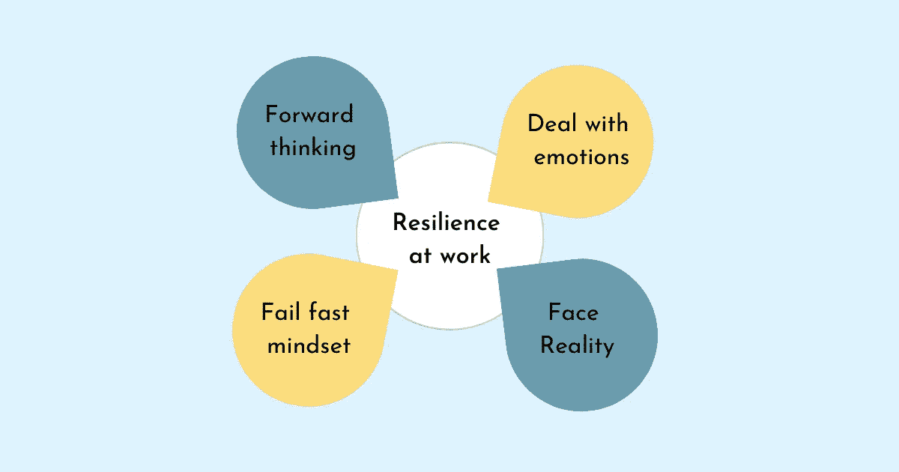

# 帮助你的团队快速失败并在工作中保持弹性的 4 种方法

> 原文：<https://betterprogramming.pub/4-methods-to-help-your-team-fail-fast-and-be-resilient-at-work-40a0f084d393>

## 建立适应力并不是忽视情绪和试图保持理性——它需要接受

鸣谢:作者

如果组织中的人不能适应变化和混乱，任何战略都不能帮助组织繁荣。挫折和挑战性的情况——错过最后期限、失去交易、失败的项目、糟糕的战略——是工作中的日常事务，只有那些学会克服它们的人才能在职业和个人方面获得成长。

有弹性的心态对于从工作中充满挑战的环境中恢复过来至关重要。

在个人层面，不同的人有不同的期望和不同水平的韧性来应对挑战和挫折。当一个人的想法没有实现时，他可能会崩溃，而另一个人可能会继续尝试新的策略。一笔失败的交易会让一个人沉浸在痛苦中，而另一个处于同样情况的人可能已经开始努力争取新客户了。与普遍的看法不同，人并非生来如此。这不是他们 DNA 的一部分。这不是一种只有少数人拥有的天生品质。任何人都可以学会适应。

"快速失败，敏捷，有弹性."我们在工作中都听说过这句话。但是简单地告诉人们要有韧性是行不通的。

不管我们告诉我们的团队多少要克服过去的失败并从错误中学习，我们知道接受失败是不容易的。对做好工作的期望让人们相信失败不是一个选项。付出努力却没有得到结果总是令人失望的。恐惧、愤怒和困惑会让人们在遭遇挫折后感到无助，并阻碍他们前进。将责任归咎于他们无法控制的外部因素的倾向也会让他们感到绝望。

但是失望的感觉和让这些情绪变成毁灭性的感觉是有很大区别的。有弹性就是要知道这种区别。这就是知道失败是生活的一部分，而不是停止尝试、避免风险或忽视挑战性环境的借口。这不是表现出有害的积极，而是有一种现实的乐观感。它是保持灵活性，适应我们周围的变化，而不是拘泥于我们的信念和期望。复原力是通过观察、调整和适应我们周围的世界，在身体和精神上建立一种凝聚力。

神经病学家和大屠杀幸存者维克多·弗兰克尔在《人类对意义的探索》中写道:

> "当我们不再能够改变现状时，我们面临着改变自己的挑战."

换句话说，我们不能控制我们的环境，但是我们可以控制我们对环境的态度。韧性就是这种态度。

通过采用以下四种技巧，你可以提高你的团队从失败中恢复过来，在困难的情况下取得成功的能力。

# 1.不要试图扳动开关。弹性=处理情绪的能力

我是一个五人小组的成员，该小组的任务是将我们一个产品的处理时间减少 80%以上。大量的处理时间影响了业务，让我们的客户对我们的产品非常不满。

作为一个团队，我们很高兴接受这个挑战。在花了几个月的时间开发这个产品并使它接近我们最初的目标后，我们遇到了一个主要的障碍。我们了解到，我们关于部署解决方案的一个核心假设是错误的，我们最初的[策略](https://www.techtello.com/strategy-vs-tactics/)可能行不通。这对整个团队来说是一个很大的失望。我们已经花了这么多时间试图让它工作。这是在一个星期二的晚上。

第二天早上，当我们把这个问题告诉我们的经理时，他只是说“我们继续吧。下一步怎么办？”

下一步是什么？难道你对所有的努力都白费了没有一点失望吗？你在乎我们投入了这么多时间和精力让它运转起来吗？

即使他的初衷是好的，他的信息也没有被整个团队很好地接受。他想提出另一个解决方案，而不是浪费时间讨论明显行不通的东西。我不怪他想得太远。他唯一的[错误](https://www.techtello.com/learning-from-mistakes/)是期望人们立刻从一种情绪状态转换到另一种状态，就像那样。

当处理失败和挫折时，建立适应力并不是忽视情绪和试图保持理性。它需要在保持理性的同时接受这些情绪。它需要给人们空间和时间来处理、调和和接受刚刚发生的事情。

“继续前进”和建立弹性的一个重要步骤是处理和分析失败或错误，并把它作为下次做得更好的机会。作为一名经理，你可能认为谈论失败会让你的团队对他们的处境感觉更糟，但这有着相反的效果。

总结:为了建立团队的弹性，给你的团队时间来处理他们的失败，然后帮助他们看到过去和未来。不要试图同时做两件事。给他们时间来思考他们的错误，然后重新组织讨论你们作为一个团队可以做出的改变，或者你们可以采取的做法，以避免他们在未来的错误。

# 2.不要试图激励他们。韧性=学会面对现实

我后来作为经理犯的一个错误是试图让我的员工不要对他们的失败“感觉糟糕”。我会试图通过淡化失败或错误来改变他们的情绪。我认为这将是一个很好的激励技术，以保持他们的生产力。但我错了。

不要说这样的话:

“没人能猜到市场的变化。我们比许多无法在变革中生存下来的人做得更好。”

“失去这个客户没什么大不了的。我们不会通过它们产生大量收入。”

有弹性需要提高标准，变得更强，而不是降低你的期望。通过将自己与那些境况比你差的人进行比较，你并没有传达出努力工作和战胜挑战的强烈愿望。

建立弹性需要面对令人不安的事实。这需要让你的团队面对现实。不要美化信息。不要试图避免失望。不要试图变得善良或仁慈。描述情况并分享他们需要听到的反馈。传达实现结果的重要性，但不要将这些结果与他们的身份联系起来。你可以关心他们，同时让他们承担责任。

最重要的是，让他们看到他们能够控制自己的处境，然后帮助他们确定下一步的行动。

> “当你学会放弃你无法控制的细节时，你将能够投入到你可以控制的事情上的时间和精力将会给你带来完成不可思议的壮举的能力。”
> —艾米·莫兰

总结:当你的团队失败时，你不需要增加他们的动力。通过帮助他们感受到对自己处境的控制来培养他们的适应能力。让他们相信，无论发生什么，他们都有勇气和力量去克服它，并从另一边走出来，变得比他们开始时更强大。

# 3.培养快速失败的心态。弹性=对承担更大的风险感到舒适

小的成功和失败比大的挫折和大的成就要好得多。是的，大项目的胜利更值得庆祝，但它们确实是一场赌博。当你全押时，结果可能是两种。不管你是成功还是失败，从这个过程中学习的机会都很少。

然而，当你鼓励你的团队朝着他们的目标迈出一小步时，他们并没有忽视[大局](https://www.techtello.com/goals-big-picture-thinking-or-nitty-gritty/)，然而他们在前进的过程中获得了进步感和调整的机会。他们不仅知道什么可行，也知道什么不可行。

一旦你的团队对小步骤感到舒服，他们会更愿意冒更大的风险，因为他们现在有了从困境中反弹的秘诀。他们知道，在任何时候，他们都可以回头重新设计一个特定的步骤，而不会被项目的整体范围所淹没。

总结:将一个大问题分解成一系列小实验的能力鼓励了一种快速失败的心态。这是在你的团队中建立弹性的一个很好的策略。

# 4.从问题转移到解决方案。弹性=具有解决方案思维的前瞻性思维

> “个人遭受的所有事情——错误归因和合理化——在团队中变得复杂，并增加了这一过程的指数级复杂性。”组织心理学家本·达特纳

当一个团队失败时，一些人可能会比其他人更受伤，因为他们在项目中可能有不同的利益。取决于他们如何看待这种情况，在这种情况下，某种程度的指责和责备游戏是常见的。花时间后悔过去的决定或确定谁该受责备只会导致无所作为。

作为经理，你有责任帮助整个团队对结果负责并继续前进。知道原因很重要，但更重要的是确定如何处理这些信息。一旦有了更好的认识，该如何反应和行动。

问这些问题来帮助你的团队一起解决问题:

*   你认为发生了什么？
*   我们能从这种情况中学到什么？
*   下次你会做什么不同的事？
*   作为一个团队，你从这个项目中最大的收获是什么？

总结:建立复原力需要从责备游戏转变为作为一个团体承担责任。当团队成员着眼于未来积极解决问题时，他们作为一个团队会变得更加强大。

# 摘要

1.  韧性不是对失败不感到失望。而是不要让这些情绪阻止你前进。
2.  建立适应力对于应对工作中的挑战和挫折至关重要。这是职业发展的一个重要组成部分。
3.  作为一名经理，你可以帮助你的团队将失败作为学习的机会，从而使他们更能适应挫折，更愿意面对困难。
4.  当你的团队对不尽如人意的事情感到情绪激动时，首先承认他们的情绪。您可以稍后尝试修复这种情况。建立适应能力不是忽视感受。
5.  不要试图示好或说一些让他们感觉良好的话。陈述事实。分享他们需要听到的反馈。建立弹性需要面对现实，而不是否认现实。人们需要感觉能控制自己的处境。
6.  鼓励快速失败的心态，帮助你的团队看到采取小步骤的价值，并以此来建立承担更大风险的勇气。
7.  不要让相互指责和责备的游戏阻碍寻找解决方案。让你的整个团队为失败负责，帮助他们找到解决方案，作为一个团队向前迈进。

在 Twitter 上关注我，了解更多故事。

*这个故事最初发表于*[*【https://www.techtello.com】*](https://www.techtello.com/how-to-build-a-resilient-team-at-work/)*。*