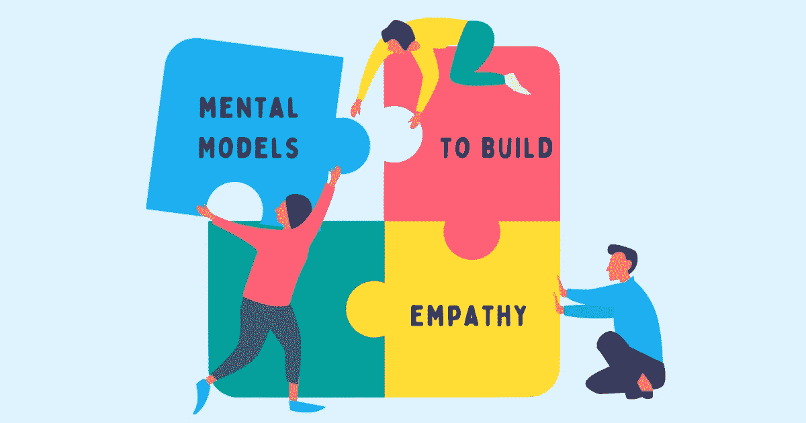

# 在工作中建立同理心的 4 个强大心智模型

> 原文：<https://betterprogramming.pub/4-powerful-mental-models-to-build-empathy-at-work-52b6ebb740fd>

## 你不能对他人感同身受，并以你的信仰和观念为主导



鸣谢:作者

我们在工作中面临的大多数问题都与人有关。我们认为我们了解他人，了解他们的想法，以及他们的驱动力。但大多数时候，我们是错的。我们以自我为中心的世界观看待他人，对他人的行为和行动做出假设。

其他人似乎是我们问题的来源，不是因为他们是我们认为的那个人，而是我们如何解读他们——我们对他们做了什么假设，我们强加了什么信念，以及我们对他们有什么期望。

你不能对他人感同身受，并以你的信仰和观念为主导。要在工作中建立同理心，你必须在判断他人的行为和行动时少犯错误。你必须停止对他们的环境和动机做出假设。你必须站在他们的角度去理解他们真正在想什么。

练习以下四种心智模式，在工作中建立同理心:

1.  第三个故事
2.  最尊重的解释(MRI)
3.  无知的面纱
4.  习得无助

# 第三个故事

当我们卷入冲突和分歧时。或者有其他个人差异，我们就加倍努力。我们坚持它，假设它是正确的。发生这种情况是因为我们没有做到不偏不倚，不带偏见，客观地考虑他人的观点。

虽然我们可以清楚地理解自己的动机、环境和信仰，但我们无法在他人身上看到同样的东西。这设定了错误的期望——我们假设其他人应该像我们一样思考，像我们一样行为，像我们一样做决定。

无法理解是什么驱动了他们的思维，以及他们所看到的我们无法理解的东西，加大了我们的感知和现实之间的差距。

第三个故事不是只考虑一个故事的两个方面，而是让你作为一个公正的观察者来看待这个情况，看到它的真实面目。它帮助你建立同理心。

## 如何将第三个故事付诸实践

每当你陷入冲突、意见不一致，或者你的观点与周围的人不同时，要看清形势的真相:

1.  把自己想象成一个可以观看或聆听整个对话的局外人。
2.  作为一个公正的观察者，他们会如何看待这种情况或对话？他们会如何讲述这个故事？
3.  他们会同意你的整个故事吗？他们看到了哪些差距？

考虑别人的参照系可以让你重新思考你的故事。它让你认识到其他人看待事情的方式与你不同的可能性——这减少了偏见思维的空间，帮助你理性地考虑其他人的观点，并看到你的现实有多接近真理。

> “关键是学会描述你的故事和其他人的故事之间的差距——或差异。不管你的想法和感受如何，你至少可以认同你和对方看待事物的方式不同。”道格拉斯·斯通

第三个故事不仅让你能够超越你的信仰和假设，而且你考虑替代解释和不同观点的意愿和态度也解除了别人的武装。它邀请并鼓励他们不要太过于自我防卫，甚至承认你的观点。

## 第三个故事的例子

假设你错过了一次晋升机会。你可能认为你的老板做出了错误的决定，因为他们有偏见或者只是不喜欢你。

当你和你的经理谈话时，他们会清楚地解释你在知识和技能上的差距，以及为什么他们认为不提拔你是正确的决定。忽视他们要说的话，坚持自己的说法，只会带来怨恨和挫败感。

这就是通过一个公正的观察者的视角来看待局势会有所帮助的地方:

1.  收集所有的数据点——你的优势在哪里，你的失败在哪里，你如何看待你的表现(以及为什么),你的老板如何看待你的表现(以及为什么)。
2.  局外人会如何看待这个案例？他们会同意你升职还是不同意你？

客观地做到这一点，一开始是很难的。但是通过练习和贴近现实的愿望，你可以做得更好。你可以更感同身受。有时，如果情况需要，任命一个外部人员来扮演这个角色也可能是有效的。

# 最恭敬的解释

当某些事情没有按照我们预期的方式进行，或者人们的行为方式与我们的预期不一致时，感到愤怒和沮丧是很自然的。然而，假设人们最坏的一面——他们懒惰、无礼、无知、无能、疏忽或吝啬——会让我们得出消极的结论。

[以这种方式判断他人](https://www.techtello.com/hanlons-razor/)而不挑战我们的本能反应——我们的默认设置是假设他人最坏的情况——不仅会增加压力和焦虑，还会导致不必要的不信任，破坏进步，影响我们如何回应他们，以及我们未来如何与他们合作。

停下来反思我们的负面情绪，将我们的思维从对他人做出负面假设转变为考虑最尊重的解释，会鼓励我们对他人更加慷慨。它使我们能够站在他们的立场上，以我们期望的方式看待他们。以这种方式思考需要努力和承诺，但也能建立同理心。

## 如何将最尊重的诠释付诸实践

假定人们是无辜的:

1.  认识到你默认做出了消极的假设。
2.  反过来问自己:“我能做出的最慷慨的假设是什么？”
3.  不要指责他们，而是表现出好奇心去了解，询问其他合理的解释，并尊重地处理这件事。
4.  想想如果你在类似的情况下，你会怎么做。什么可能会让你受到他人不公平的评判？

用最尊重的方式接近他人会让你接受不同的解释，保留判断，建立信任。

布伦·布朗谈到了 Jean Kantambu Latting，她硕士和博士项目中的教授，也是她最重要的导师之一。每当有人提出与同事的冲突时，Kantambu 就会问，

> “慷慨的假设是什么？对于这个人的意图或这个人说的话，你能做出的最慷慨的假设是什么？”

尝试做同样的事情来建立同理心。

## 最恭敬的解释的例子

假设你有一个产品要在两周内交付。为了让你的产品发挥作用，你需要依赖另一个团队成员。您需要将他们的 API 与您的产品集成，以测试输入/输出，并确保满足所有需求。

你昨天给他们发了邮件，甚至在 Slack 上 pinged 了他们，但是仍然没有他们的消息。在你最需要的时候没有得到更新会让你抓狂:

*   他们不回应是不负责任的。难道他们看不出这有多重要吗？
*   他们不称职，故意避开我。
*   他们很懒，从来不按时做任何事情。

假设其他人有目的地以某种方式行事，或者因为他们就是这样的人，而没有考虑他们的情况(基本归因错误的经典案例)可能会导致你以指责的语气跟进，向他们的经理抱怨，或者说他们的闲话。

在这种情况下，采用最尊重的解释可以帮助你建立信任，而不是破坏信任。以下是一些例子:

1.  也许他们身体不好或者正在处理生活中的个人危机？
2.  他们是否正在处理一项占用了他们所有时间和注意力的高优先级任务？
3.  有没有可能是你没有把优先级沟通好，或者是他们不理解你在他们身上受阻无法前进？
4.  这种情况还有什么其他可能的解释？

# 无知的面纱

当我们做决定时，我们是根据我们的环境和我们当前的社会地位来做的。我们对什么是正义和不正义，什么是错误和正确，什么是公平和不公平的信念受到我们自己的经历、种族、性别、民族等等的影响。

这导致了不公平的、有偏见的、有时甚至是不道德的决定，这些决定有利于某些人，而忽视了我们无法理解的问题，因为这些问题在我们的个人生活中没有任何真正的意义。这个决定很可能是基于我们的观点，什么对我们有好处，以及我们会如何受到它的影响。

无知的面纱是建立同理心的一个很好的心理模型，因为它鼓励我们把自己想象成不知道自己在世界上的位置的人，从而把我们的偏见和成见放在一边。不知道自己是谁迫使我们在选择时考虑所有国籍、性别、种族和文化的人。不知道我们在决策后的立场(优势或弱势群体)可以避免刻板印象，并导致理性思考和公平选择，使每个人受益。

无知之幕最适用于那些处于权力地位的人，或者那些负责做出影响他人的决策的人。

使用无知的面纱可以帮助他们将他们的[认知偏见](https://www.techtello.com/cognitive-distortions/)放在一边，通过考虑整个群体的利益而不是过度强调自我保护来评估决定，并寻求不同的意见而不是过度关注他们的利益。

## 如何将无知的面纱付诸实践

做决定时保持更加公平公正:

1.  想象自己是一个不知道自己是谁的人——不知道自己的角色、性别、文化、种族和职位。
2.  运用理性思维，通过考虑不同的团队成员来评估情况——你的决定会让一些人受益，让另一些人受损吗？它会对一些人有害而对另一些人有益吗？
3.  你可能遗漏了什么信息，或者你可能更加关注了什么信息，从而导致有偏见的决策？
4.  最后，问问你自己，“如果我不知道这会如何影响我，我还会支持它吗？”

换句话说,《无知的面纱》是一个非常强大的心智模型，可以假设无知并将其转化为极乐。

> “公平原则:当考虑一个道德行为时，想象你不知道自己是道德的执行者还是接受者，当有疑问时，站在他人一边。这是基于哲学家约翰·罗尔斯的“无知之幕”和“原始位置”的概念，即道德行为者在决定影响每个人的规则和法律时，不知道他们在社会中的位置，因为人类决策中的自私偏见。”—迈克尔·舍默

## 无知之幕的例子

后疫情时代，假设您的组织想要重新评估其继续远程工作或要求员工来办公室的决定。

你的工程副总裁，一个很有影响力的人，肩负着这个责任。如果没有无知的面纱，他们将偏向于支持他们对远程工作的观点的决策，他们重视什么，以及特定的决策可能如何伤害或有益于他们。

仅仅因为他们相信团队在面对面的时候表现更好，或者他们的工作要求他们大部分时间都在办公室，他们可能会决定结束允许员工远程工作的政策，并要求每个人都来办公室。

无法评估他们的决策对各级员工的影响，会妨碍他们理解某些员工或某些人群可能面临的挑战。

不知道自己在组织中的位置，戴上无知的面纱，可以鼓励他们全面地看待自己的决定——他们可以对不同的人、他们的情况更有同情心，并提出解决问题的创造性解决方案。

父母需要什么样的灵活性？有需要在家照顾人的员工吗？他们如何能让残疾人感到轻松？

# 习得无助

当面临逆境时，通常会感到犹豫不决、不安和对未来的焦虑。

乐观主义者会被这种经历短暂困扰，但很快就会恢复过来，而悲观主义者会继续被失败的恐惧所麻痹。乐观主义者冲出这个阶段，认为这只是一个艰难的阶段，而悲观主义者陷入绝望，认为他们的处境是永久性的。

> “习得性无助描述了一种倾向，即停止试图逃避困境，因为随着时间的推移，我们已经习惯了困境。有人意识到他们无力控制自己的环境，所以他们放弃了改变环境的努力。”—加布里埃尔·温伯格

这让某些人相信他们没有能力做或学习某些事情。为了提高工作中的同理心，不要把他们的困难归因于他们的无能，而是帮助他们明白他们并不是无助的，他们的行动可以有所作为。

## 如何帮助他人摆脱习得性无助

通过以下方式帮助他人从习得性无助转变为习得性乐观:

1.  挑战他们的思维和行为方式。
2.  帮助他们将消极的自我对话以永久和普遍的解释的形式重新构建为积极的自我对话，使用临时和具体的解释。
3.  支持他们设定合理的目标，并朝着他们的方向迈出[小步](https://www.techtello.com/small-wins/)。这会让他们对自己的结果有一种掌控感。
4.  分享积极的反馈，提醒他们到目前为止取得的所有好成绩。鼓励他们不要放弃，继续尝试。

## 习得性无助的例子

现代积极心理学之父马丁·塞利格曼在 1964 年进行了实验，证明了人们是如何学会感到无助的。

一只被关在笼子里的狗的后爪受到电击。冲击是随机出现的，没有任何警告。如果狗什么也不做，电击会持续五秒钟，但是如果狗用鼻子顶着笼子前面的面板，电击会提前结束。在一个单独的笼子里，另一只狗以完全相同的时间间隔接受同样的电击，但是没有面板可以推。换句话说，两只狗同时接受完全相同剂量的电击，但只有第一只狗控制每次电击持续的时间。在 64 次电击后，两只狗都回到它们的笼子里，新的狗被带来进行同样的程序。

第二天，所有的狗一只接一只地被放在一个不同的笼子里，这个笼子叫做穿梭箱。中间有一堵矮墙，高度刚好够狗试着跳过栅栏。一种高音调的声音响起，预示着即将到来的电击，这种声音通过狗站着的那一半穿梭箱的地板传来。

几乎所有在前一天控制电击的狗都学会了跨越障碍。他们听到声音，跳过墙到安全的地方。相比之下，前一天无法控制电击的狗中有三分之二躺在地上呜咽，被动地等待惩罚停止。

唐纳德·广人和马丁·塞利格曼在 1975 年的实验中公布了人类的行为倾向。在这个实验中，人们被随机分成三组。第一组的人暴露在一种令人讨厌的巨大噪音中，他们可以通过按下面前的按钮来停止。

第二组的人听到同样的噪音，但无法关闭，尽管他们很努力，而第三组的人，即控制组，什么也听不到。第二天，受试者再次面临一个全新的涉及噪音的情况。为了关掉噪音，他们必须将手移动大约 12 英寸。

第一组和第三组的人明白这一点，并很容易学会避开噪音。但是第二组的人通常什么都不做。在第一阶段，他们失败了，意识到他们无法控制，变得被动。在第二阶段，预计会有更多的失败，他们甚至不会试图逃跑。他们已经学会了无助。

然而，奇怪的是，大约三分之一的动物和人在经历不可避免的冲击或噪音时从未变得无助。是什么让他们如此？

马丁的研究得出结论，答案是乐观。他证明了不是苦难导致了绝望；这是你认为你无法控制的痛苦。悲观主义者感到无助，因为他们认为情况超出了他们的控制，并拒绝做任何事情来改变它，而乐观主义者尽一切力量来控制他们的情况。逆境不会定义他们；这是推动他们增长的引擎之一。

当别人说“公开演讲不适合我”或“我永远不会编程”或“即使我的工作让我痛苦，我也不能辞职”时，认识到这些人正在应对习得性无助，他们需要你的指导和支持，以意识到他们并不是真的无助，他们的行动可以产生很大的影响。

实践这四种心智模式——第三个故事、最尊重的解释、无知的面纱和习得性无助——以增加工作中的同理心，可以改善沟通，加强你与他人联系的能力，提高创造力，并导致更有效的合作。

如果你想联系、激励和领导，开始在日常的小互动中运用同理心。

# 摘要

1.  在工作中表现出同理心对于有效地联系、沟通和协作至关重要。
2.  不要错误判断他人的行为或对他们的行为做出假设，在工作中表现出同理心需要把他们放在一边，站在他们的角度去理解他们真正在想什么。
3.  在冲突或分歧中，通过使用第三个故事心智模型来消除你的偏见和成见，探索不同的观点，从而建立同理心。
4.  当别人不符合你的期望时，不要假设他们是坏的、刻薄的或不尊重的，而是通过思考最尊重的解释来感同身受。
5.  做决定时，我们必然会选择对我们有利的一方。这就是使用无知之幕有所帮助的地方。不知道这个决定是对你有利还是有害，会让你产生同情的观点，做出公平的决策。
6.  有些人可能会发现很难克服失败和挫折。习得性无助阻止他们学习和前进。通过向他们展示他们自己的行动如何帮助他们克服任何困难来增加工作中的同理心。

```
**Want to Connect?**Follow me on [Twitter](https://twitter.com/techtello) for more stories. This story was originally published at [https://www.techtello.com](https://www.techtello.com/how-to-build-empathy-at-work/).
```