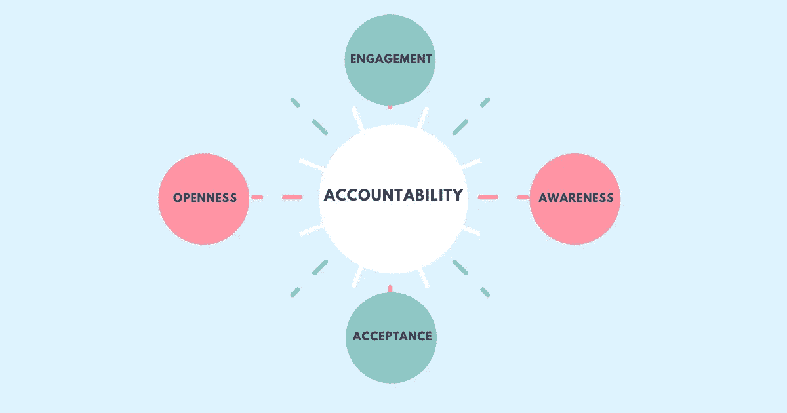

# 让员工在工作中负起责任的 4 个简单行动

> 原文：<https://betterprogramming.pub/4-simple-actions-to-hold-people-accountable-at-work-25fc1e9b4cf8>

## 在关心员工和让他们对工作负责之间有一个微妙的平衡

鸣谢:作者

从我记事起，我就是一个善于交际的人。所以当我第一次成为经理时，我想“这能有多难？”

伙计，我错了！做经理不仅艰难；这是一次情感体验。这和我想象的完全不同，也比我希望的好得多。最初的日子充满了试错、错误和学习。我做了让我后来后悔的决定。我觉得说某些话很愚蠢。我搞砸了演讲。我搞砸了反馈。每一次成功都是激动人心的，每一次失败尽管令人沮丧和失望，但最终都成为一个巨大的教训。

虽然我学到了很多东西，但我最大的教训是:关心你的员工和让他们对自己的工作负责并不相互排斥。你不需要对人很好，很友好来表达你的关心。关心他们并不意味着你不关心结果。

> “在设定期望时，不管说了什么或写了什么，如果低于标准的表现被接受，并且没有人被追究责任——如果没有后果——那么糟糕的表现就会成为新的标准。”
> 
> ― Jocko Willink，极端所有权

理论上，这听起来不错。然而，当付诸实践时，它确实需要大量的自我意识和承诺来纠正错误:

*   通过避免艰难的对话来拥抱不舒服的时刻，来对抗自然倾向于安全和容易的道路的本能。
*   根据对错做决定，而不用担心失去认可。
*   愿意在你的人的决定的影响下变得脆弱。
*   选择不通过说好话或挽救他们的感情来当场结束这场戏剧，而是实际上帮助他们看到他们处境的现实。

最重要的是，它需要帮助你的员工区分承担责任和表现出责任感。

但是你如何让人们在工作中承担责任呢？

问责制不是通过告诉人们做什么，然后假设其他人会简单地做他们的工作来建立的。工作环境中涉及到你和他人的多种因素会干扰你在团队中建立责任感的愿望。

为了在工作中建立责任感，你需要:

*   通过设定明确的期望并与这些期望保持一致，建立对问责制衡量标准的认识。
*   创造对表现责任感的行为和行动的认可。
*   坦诚地表达你的关心。
*   通过充当他们的支持结构与他们互动。

责任= fn(意识、接受、开放、参与)

# 1.意识——从定义成功开始

你的员工需要对成功有一个共同的定义，只有这样，你才能让他们对实现这些结果负责。定义成功的含义，并帮助他们想象成功后的样子。提出问题，认真倾听，提供清晰的答案，确保你的期望和他们的理解一致。

要有意识地意识到你所说的一切都有可能被解读，并采取措施缩小“你所说的”和“他们所感知的”之间的差距。请记住，良好的沟通不在于你说得有多好，而在于对方接受得有多好。

设定期望时，不要把它和任务联系起来，而是谈论他们需要达到的具体结果。特别是:

*   给他们提供背景，并帮助他们了解他们的工作如何融入全局。理解做某事的[为什么](https://www.techtello.com/goals-big-picture-thinking-or-nitty-gritty/)会很有动力。
*   根据具体结果描述“什么”。
*   委派“如何做”

当你定义“如何”时，你只能让你的人负责执行你的指令。你不能让他们对结果负责。通过[委派](https://www.techtello.com/how-to-delegate-work-effectively/)如何做，你传达出他们不仅要对他们做的事情负责，还要对他们没做的事情负责。你让他们以自己的方式进行实验、制定策略和执行，同时关注同一个最终目标。它是知道只做他们被要求做的事情和尽一切可能让事情运转起来之间的区别。

正如朱莉·卓在《经理人的形成》中所说:

> "最好的结果来自激励人们去行动，而不是告诉他们该做什么."

# 2.接受——明确谈论积极的行为

虽然每个经理都应该关心他们的员工取得的成果，但他们需要更仔细地考虑他们如何取得成果。你不希望人们玩弄[办公室政治](https://www.techtello.com/office-politics/)并使用策略和操纵策略来推进他们自己的议程。

不应该以促进组织中的不良行为为代价来取得成果。设定界限。明确地和他们谈论可接受和不可接受的行为。给他们举例，帮助他们理解真正的责任意味着什么。

讨论这些在工作中建立责任感的积极行为:

*   拥有自己的决定和结果。
*   承担责任，对他们的成功和失败都表现出同样的态度。
*   勇于承认和面对自己的错误。
*   通过把事情公开来节省时间和精力，并利用这些精力为自己和他人做得更好。

讨论这些不可接受的风险行为:

*   责怪别人没有达到某个目标。
*   制造不合情理的借口。
*   通过隐藏细节或伪造事件来掩盖错误。
*   接受不正当的荣誉。
*   有害行为，如取悦他人、欺凌他人或贬低他人。

# 3.开放——向他们展示你的关心

当你的员工知道你把他们的幸福放在心上，这给他们提供了安全感和参与建设性对话的精神空间。他们知道你没有恶意。他们知道你关心他们的成功。他们不会怀疑你的意图。

然而，当他们不信任你时，他们会怀疑你说的或做的一切。你确定的议程，你决定的方向，你提供的建议，你分享的信息，每件事都会遇到阻力和判断。

不要通过对员工友好或使用其他肤浅的技巧来表现关心。不要试图取悦他们。不真诚从来没用。人们知道什么时候你真正关心他们，什么时候这是驱动你行为的一个议程。

你不能回避向员工提供反馈，同时试图让他们承担责任。当人们不知道他们做错了什么，他们就不能采取措施去改善它。给他们他们需要听到的反馈。带有一丝关怀的强硬反馈是真正问责的基石。别人在的时候不要批评。利用私下讨论来扭转局面。

这就是金·斯科特在《彻底坦白》中所描述的个人关怀，但直接挑战。

# 4.参与——充当支持结构

最后，不要把问责误认为抛弃。你要在员工在场的时候赋予他们权力，而不是让他们感到沮丧，独自挣扎。

给他们授权是很重要的，但是他们需要清楚他们可以独立做出的决定，而不是需要你参与的决定。他们需要有清晰的目标和实现这些目标所需的能力。他们需要先培养承担责任所需的技能，然后再为自己的决定和结果负责。

作为经理，你需要在整个过程中指导他们。当你在最后期限前挣扎的时候，问问他们可以使用什么策略来回到正轨。当与其他团队成员合作有困难时，询问他们所面临的具体挑战。当他们没有达到你的期望时，和他们谈谈他们学到的东西，以及他们下次可以做出的改变。

责任感不是一回事。这是一套你和你的团队成员都需要练习一辈子的行为。如果你发现很难在你的团队中建立问责制，问问你自己这些步骤中哪些可能缺失了——你的团队是否与期望一致，他们是否理解问责制的真正含义，他们是否信任你提供反馈来帮助他们改进，以及最后你是否在场来帮助他们。

# 摘要

1.  关心他人和让他们承担责任并不相互排斥。你可以关心个人，同时期望你的团队拥有他们的决策和结果。
2.  责任= fn(意识、接受、开放、参与)。
3.  意识:对成功有一个共同的定义，并就某人的责任达成一致。
4.  接受:讨论建立责任感的积极行为，并要求他们不要参与有风险的行为。
5.  开放:用一剂强硬的反馈来加强你的关心。不要羞于告诉人们他们需要听到的。问责是通过纠正建立起来的。
6.  参与:作为一个坚实的支持结构，使您的团队能够建立所需的技能，对他们的决策充满信心，并拥有他们的成果。

*最初发表于*【https://www.techtello.com】