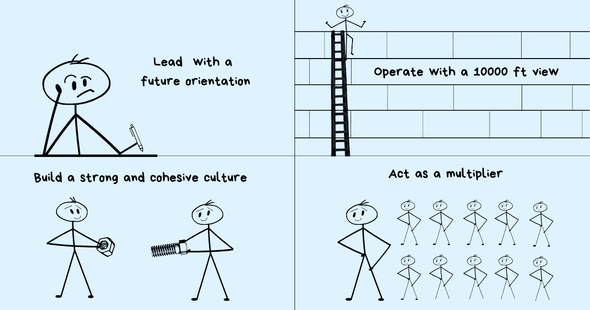

# 决定你是否准备好领导职位的 4 种方法

> 原文：<https://betterprogramming.pub/4-ways-to-determine-if-you-are-ready-for-a-leadership-position-2504412d7160>

## 3.促成强大而有凝聚力的文化

鸣谢:作者

我和一些优秀的经理共事过。那些不仅擅长自己的工作，而且有巨大领导潜力的人。遗憾的是，这些经理没有投资于自身的发展。他们忙于应付管理工作的日常需求——灭火、解决生产问题、解决客户升级、从一个交付时间表转移到另一个——以至于他们未能培养出将来成为伟大领导者所需的技能。

像许多处在他们位置上的经理一样，他们有点想当然地认为，只要工作做得相当好，干得时间长，他们就会自然而然地获得领导头衔。我也不怪他们有这种想法。多年来，我们看到一些领导者在公司的阶梯上不断晋升，而他们本不该在这些职位上。当你看到你周围到处都是糟糕的领导力的例子时，很容易假设你也能成为一名领导者——毕竟，你认为自己比他们更好。如果他们能做到这些，你也能做到。如果他们能跳火圈，你也能跳。

但是，对于有如此巨大潜力的人来说，这是正确的思维方式吗？通过将自己与他们不渴望成为的人进行比较，这些经理并没有因为他们已经接受了平庸而选择卓越。

他们没有意识到成为领导者并不是他们当前角色的延伸，而是完全不同的另一回事。它没有反映在标题中。这是他们思考、行动和领导的方式。领导者需要高度的自我意识——能够看到他们的[盲点](https://www.techtello.com/leadership-blind-spots/)，接受他们知识中的漏洞，并避免他们多年来像经理一样思考，让位于像领导者一样思考。为了变得更好，他们需要学习和实践真正伟大的领导者的技能、知识、行为和行动。正是致力于改进和变得更好的决心让一个领导者真正脱颖而出。

任何希望成长为领导者的经理都需要根据角色的要求对自己的技能进行自我评估。只有做真实的自己，你才能以开放的心态和好奇心拥抱这个角色。发展你的领导风格永远是一项进行中的工作。没有结束状态。总是有更多的东西要学。但认识到一些基本特征可以让你起步，并帮助你确定自己是否为这个角色做好了准备。

在你接近你的经理准备讲述你的故事之前，确保你有合适的故事要讲。管理技能经常被误认为是领导技能。不要犯那个错误。

# 如何知道你是否为领导职位做好准备

从以下四个方面评估你的领导能力:

## **1。以 10，000 英尺的视角操作**

经理以 10-1000 英尺的视角看待问题，并参与日常任务的执行，而领导者以 10，000 英尺的视角看待他们的组织。他们可能不会直接参与解决问题，但他们会影响正在解决的问题。他们练习有效倾听，不断提问，并鼓励他人也提问:

*   我们解决的是正确的问题吗？
*   我们的标准是什么，以确定我们的精力和努力必须花在哪里？
*   我们如何确保其他人也在问这些问题？

他们不是攻击症状的冰山一角，而是引导他们的员工透过表面寻找潜在的根本原因。虽然他们不能意识到影响他们组织的所有问题，但他们有敏锐的眼光去发现需要并值得他们关注的真正问题。

从 10，000 英尺的高度进行操作的另一个重要方面是他们在没有所有信息的情况下做出决策的能力。他们可能不知道新产品线的所有细节，但他们有经验投资一个有前途的高层次想法。他们可能不知道整个产品开发工作，但他们有能力做一个粗略的估计，以确定是否值得投资。他们可能不知道一项新技术的来龙去脉，但他们有技术能力为他们的组织找到合适的技术。

正是他们的[自信谦逊](https://www.techtello.com/confident-humility-in-leadership/)——对自己知识的自信和提出正确问题的谦逊——使他们能够做出正确的决定，或者如[亚当·格兰特](https://medium.com/u/357fe5c6b525?source=post_page-----2504412d7160--------------------------------)所描述的:

> “…对他们的能力有信心，同时意识到他们可能没有正确的解决方案，甚至没有解决正确的问题。这让他们有足够的怀疑来重新审视他们的旧知识，并有足够的信心去追求新的见解。”

问这些问题来评估自己的能力:

1.  我是否有在没有完整信息的情况下做出决策的相关经验？有我展示这种能力的项目和例子吗？
2.  如果我不参与日常运营，我如何影响我的团队解决正确的问题？我有没有尝试过任何策略来让这个工作？
3.  在培养这项技能的过程中，我面临了哪些挑战？我学到了什么？
4.  我要提高这项技能还有哪些差距？
5.  我打算如何提高这项技能？清楚地说出你需要采取的步骤。

写下你对每个问题的回答，并对你的立场做一个真实的自我分析。请记住，即使你真的很擅长这项技能，也还有更多东西需要学习。你总能做得更好。这绝不意味着你不完善这一技能就不能承担领导角色。然而，你面前的大量工作将帮助你为自己做出正确的决定。

在 1-10 分的范围内，您如何评价自己的能力？从组织中与你共事过的其他高层人员那里收集这些数据，甚至是你的经理。他们如何评价你？

## **2。以未来为导向**

虽然经理的任务是执行计划，但领导者为这些计划设定方向。

他们超越组织的界限，着眼于明天的需求，确定下一步必须做什么，以实现更美好的未来。他们首先考虑有效性(为什么做某事),然后才担心它的效率(如何做得更好)。)他们明白做正确的事比做对更重要。

> “智力、想象力和知识是必不可少的资源，但只有效率才能将它们转化为结果。它们本身只会限制所能达到的目标。为了达到合理的效率，光是个人聪明、努力工作或知识渊博是不够的。有效性是独立的，不同的东西。但是，要变得有效也不需要特殊的天赋、特殊的才能或特殊的训练。实践有效性，直到它成为一种习惯。有效性是可以学习的，也是必须学习的。”—彼得·德鲁克

面向未来的前瞻性思维指导领导者如何思考和行动——决定要启动的新计划，确定不能产生价值且必须取消的项目，培养需要新战略来执行的想法，发现必须通过创造力和创新来解决的挑战，在冲突变得难以处理之前解决冲突，以及做出需要全新视角的决策。

他们的想法不仅限于新产品计划。他们还决定了组织需要如何扩展以应对未来的需求:为了最大化运营效率，组织的结构应该是什么。他们需要雇佣什么样的人来填补知识和经验的缺口。

问这些问题来评估自己的能力:

1.  我过去做过什么样的战略决策？结果如何？
2.  我的大部分时间花在了哪里——日常执行还是思考未来？
3.  我采取了什么样的措施来促进组织的发展？
4.  我如何找到有效性(做正确的事情)和效率(做正确的事情)之间的平衡？
5.  在培养这项技能的过程中，我的学习经历是什么？
6.  我过去犯了什么错误，我可以采取什么措施来提高这项技能？

写下你对每个问题的回答，做一个真实的自我评估。再一次，用 1-10 的尺度给你自己打分，并从你组织中的其他高层人员，甚至是你的经理那里收集这些数据。他们如何评价你？

## **3。营造强大而有凝聚力的文化**

人们敬仰领导者不仅是因为他们设定了方向，也是因为他们塑造了文化。他们不仅用语言传达信息，还通过肢体语言——面部表情、手势和眼球运动来传达信息。

**当有人犯错时，他们会有什么反应？**

*   糟糕的领导会表现出沮丧、愤怒、翻白眼、责怪他人，并表达他们的失望——实际上是在传达错误是不可接受的。他们创造了一种文化，在这种文化中，员工回避挑战，谨慎行事，隐藏自己的错误。
*   优秀的领导者会把[错误](https://www.techtello.com/learning-from-mistakes/)作为变得更好的学习机会。他们公开谈论自己的错误，分享他们学到的有价值的故事和其他信息——实际上传达了错误和失败是成功的重要组成部分。他们创造了一种文化，在这种文化中，人们进行创新和试验，并将他们的失败作为实施新战略的标志。

他们如何处理分歧？

*   糟糕的领导把他们的想法和他们的身份联系在一起。他们不鼓励异议，拒绝与他们的观点相矛盾的想法和意见。他们创造了一种文化，在这种文化中，人们低着头，不觉得表达自己的观点是安全的。员工不会举手提问、分享想法或表达不同意见，这导致了群体思维。
*   优秀的领导者会接受不同意见。他们在分歧中茁壮成长，因为这给了他们所需的信息，让他们在将想法付诸实施之前对其进行检验。他们创造了一种文化，在这种文化中，人们在分享自己的观点和重视不同意见时会感到心理安全。

> “畅所欲言只是第一步。真正的考验是，当人们真的直言不讳时，领导者会作何反应。舞台设置和邀请参与确实建立了心理安全。但是，如果一有人站出来说问题，老板就用愤怒或鄙视来回应，这种安全感就会很快消失。一个富有成效的回应必须是赞赏的、尊重的，并提供一条前进的道路。”—艾米·埃德蒙森

**他们如何做决策？**

*   糟糕的领导会做出受欢迎的决定或让他们看起来不错的决定。他们依靠判断和直觉，而不是使用一个框架来做出好的决定和消除坏的决定。他们创造了一种文化，在这种文化中，专家的直觉导致了一个又一个灾难。
*   好的领导有勇气不被人喜欢。他们做出看似正确的决定，即使这些决定起初不受欢迎。他们鼓励每个人让掌握正确信息的人参与进来，帮助做出最佳决策，而不是让等级制度成为决策的瓶颈。他们没有表现得像一个万事通，而是以“我不知道”开始。这些简单的话邀请其他人对决策过程做出积极的贡献，从而打破他们组织中的孤立思维，让位于协作思维，以便更好地做出决策。

问这些问题来评估自己的能力:

1.  我对我的组织文化有什么积极的贡献？
2.  关于错误和失败，我向我的员工传达了什么信息？
3.  我鼓励别人不同意我吗？上一次有人不同意我是什么时候？我是怎么处理的？
4.  我做出更好决策的框架是什么？我如何在我的组织中鼓励协作思维？
5.  我要提高这项技能还有哪些差距？
6.  我过去犯了什么错误，我可以采取什么措施来改善它？

写下你对每个问题的回答，并做一个真实的自我评估。再一次，用 1-10 的尺度给你自己打分，并从你组织中的其他高层人员，甚至是你的经理那里收集这些数据。他们如何评价你？

## **4。充当乘数**

在“[乘数:最佳领导者如何让每个人都更聪明](https://www.amazon.com/Multipliers-Revised-Updated-Leaders-Everyone/dp/0062663070/)”中，利兹·怀斯曼描述了两种类型的领导者——乘数型和递减型。

她称乘数为天才制造者——通过参与其中来增长人们智力的领导者。这些领导者不会试图成为关注的焦点，也不会担心自己看起来有多聪明。相反，他们从每个团队成员身上汲取智慧和最大的智慧。他们在会议上少说话，通过[授权](https://www.techtello.com/empowering-teams/)他们自己找出答案，给他们的人空间。他们激发他人的智慧，并在他们的组织中创造集体的、病毒式的智慧。

她写道:“他们让周围的人变得更聪明、更有能力。乘数激发每个人独特的智慧，创造一个天才的氛围——创新、富有成效的努力和集体智慧。倍增者从他们的员工身上获得更多，因为他们是超越自己天赋的领导者，并专注于挖掘和扩展他人的天赋。他们并没有得到更多的回报。他们会得到更多。乘数效应不仅能获取人们当前的能力，还能扩展它。他们从别人那里得到的比他们知道自己必须付出的要多。”

另一种类型的领导者是天才——这种类型的领导者会思考所有的问题。他们很聪明，但也有办法让周围的人闭嘴。他们扼杀别人的想法，给出大量的反馈，并且说了大部分的话。他们自己做所有的决定，然后向组织宣布这些决定。他们对每件事都有一个答案，非常固执己见，并把所有的精力放在向他人推销自己的想法，并说服他们在细节上执行。其他人的意见对他们来说无关紧要。

他们雇佣聪明的人，但不允许他们独立思考。他们告诉其他人该做什么，做出所有重要的决定，并在某人似乎失败时介入接管。他们如此专注于自己的智慧，试图成为房间里最聪明、最有能力的人，以至于扼杀了其他人的智慧和能力。他们没有充分利用人，把创造力和才华留在桌面上。

她写道,“智力缩减者的观点是基于精英主义和稀缺性。悲观主义者似乎认为真正聪明的人是稀有品种，而且他们就是那种稀有品种。从这个假设出发，他们得出结论，他们是如此的特别，没有他们，其他人永远也不会明白。缩减者的两步逻辑似乎是，现在不“明白”的人永远也不会明白；因此，我需要继续为每个人思考。在暗淡的世界里，聪明人是没有假期的！"

问这些问题来评估自己的能力:

1.  你是哪种类型的领导者——倍增型还是递减型？
2.  你能从团队中汲取多少智慧并加以利用？
3.  你能做些什么来更好地获取其他人知道的信息？
4.  你过去犯过哪些错误，你可以采取哪些措施来提高这项技能？

写下你对每个问题的回答，并做一个真实的自我评估。再一次，用 1-10 分给自己打分，从你的团队(包括你的经理)那里收集这些数据。他们如何评价你？

通过在回答这些问题时保持真实的自我，你可以在决定承担下一级责任之前，确定自己是否准备好担任领导职位——或者还有更多工作等着你。高度的自我意识和发现技能差距的意愿将帮助你为自己做出正确的决定。

# 摘要

从以下四个方面评估你的领导能力:

1.  从 10，000 英尺的角度看你的组织做出决策的能力:即使你不参与日常执行，你能做出决策并引导你的团队解决正确的问题吗？
2.  以未来为导向:你如何运用你的战略思维技能来确定将决定你组织未来的新计划？你如何参与招聘和组织结构规划？
3.  为强大的文化做贡献:你的行为和行动如何为你组织的积极文化做贡献？你是如何看待周围其他人的行为举止的？
4.  充当倍增器:你如何在你的组织中建立批判性思维技能，并授权给你的团队，从而利用他们的才能并增加他们的智力？

*原载于 2021 年 4 月 29 日*[*【https://www.techtello.com】*](https://www.techtello.com/are-you-ready-for-leadership-position/)*。*