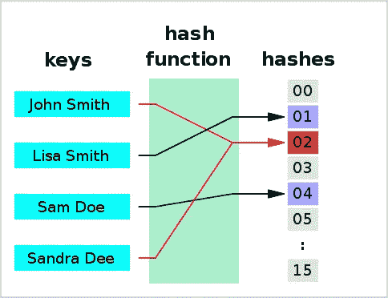

# 5 个高级 Python 概念:解释和应用

> 原文：<https://betterprogramming.pub/5-advanced-python-concepts-explanations-and-applications-99a03f6bd1bd>

## Lambda 函数、理解、生成器、装饰器和哈希能力


由 [NASA](https://unsplash.com/@nasa?utm_source=medium&utm_medium=referral) 在 [Unsplash](https://unsplash.com?utm_source=medium&utm_medium=referral) 上拍摄的照片

当您对基本数据结构及其关键功能有了很好的理解后，就该探索 Python 中的一些更高级的技术了。在本文中，我想回顾一下您可以在代码中利用的五个概念。

# 1.λ函数

Lambda 函数在 Python 中也被称为匿名函数。有些人干脆称它们为兰姆达斯。它们的语法如下:`lambda arguments: expression`。本质上，我们使用 lambda 关键字来表示 lambda 函数的声明。然后我们列出自变量，自变量的数量可以是零，也可以是更多。在冒号后面，我们列出了使用这些参数进行任何适用操作的表达式。

**Lambda 函数在我们需要短期一次性使用函数的情况下特别有用。例如，几个内置函数有 key 参数，我们可以为它设置一个 lambda 函数。**

用 Lambda 函数排序

在上面的代码中，我们想要对元组列表进行排序。默认情况下，元组将根据包含的每个项目进行排序。在这种情况下，排序基于姓名的首字母。然而，我们想通过分数来求解，分数是元组的第二项。为了实现这一点，我们利用了 lambda 函数，其中的`x`参数引用了要排序的每个元组。因为分数是每个元组中的第二项，所以我们只需要指定索引 1 来访问第二项。

# **2。理解**

可能被提到最多的例子是理解技巧。**本质上，这种技术允许我们使用现有的 iterable** 创建一个列表、字典或集合，它们分别被命名为列表理解、字典理解和集合理解。以下代码片段向您展示了这些用法。

（听力或阅读）理解测试

这些理解的语法看起来相似。这里有一个微分形式的快速突出。需要注意的是，你可以添加条件来保留你需要的物品。

```
**List Comprehension:** [expr for x in iterable]
**Dictionary Comprehension:** {key_expr: value_expr for x in iterable}
**Set Comprehension:** {expr for x in iterable}**With Optional Conditions:**
[expr for x in iterable if condition]
{key_expr: value_expr for x in iterable if condition}
{expr for x in iterable if condition}
```

这些理解可以非常方便地创建这些容器数据类型，而不是实现 for 循环。更重要的是，**它们通常比 for 循环更快，因此性能更好**，应该是这些操作的首选方式。

# 3.发电机

之前，我提到过 iterables，它指的是可以迭代的 Python 对象。在迭代过程中，iterable 被转换为迭代器，以便迭代器可以在需要时呈现元素。一种特殊的迭代器是生成器。与列表和字典等典型的可迭代对象不同，它们的所有元素都被加载到内存中，生成器以一种懒惰的方式生成元素，而不需要将所有元素都加载到内存中，因此它们是内存高效的可迭代对象。下面的代码片段显示了一个简单的例子。

简单的生成器示例

如您所见，generator 函数使用了关键字`yield`来生成一个生成器。在迭代过程中，这些元素按顺序呈现。

生成器的一个实际使用案例是处理大量数据——当所有数据都被加载时，它可能会降低计算机的速度，或者根本无法加载，因为数据量非常大。例如，一个简单的例子是计算整数 1-10，000，000，000 的和。我在电脑上试了 10 亿，发现大小在 8 GB 左右。所以，如果我尝试的话，100 亿大约是 80 GB，这可能会使程序甚至我的电脑崩溃。由于无法创建列表，我无法使用列表来计算总数。在这种情况下，我们应该考虑发电机。

生成器用例

如上所示，我们可以创建一个生成器，一次生成一个整数，这样可以节省内存。上面的代码片段向您展示了另一种称为生成器表达式的有用技术，它的格式如下:`(expr for item in iterable)`。

# 4.装修工

装饰器是高阶函数，它修改其他函数的行为，而不影响它们的核心功能。你可以把其他功能想象成普通的甜甜圈；装饰就是给甜甜圈涂上涂层的过程。不管你怎么装饰它们，它们还是甜甜圈。换句话说，decorators 只是在函数的外观或其他一些非本质方面做了一些调整，而没有改变它们的内部算法。让我们用一个简单的例子来看看装饰者。

装饰者示例

上面的例子向你展示了如何声明一个装饰函数，以及如何用它来装饰其他函数。如你所见，装饰函数`timing`将另一个函数作为参数，它记录了被装饰函数的运行时间。值得注意的是，修饰函数返回函数作为其输出。要使用 decorator，我们只需使用@符号作为前缀，将它放在另一个函数的顶部，这表明下面声明的函数是由这个指定的 decorator 函数修饰的。下面的代码向您展示了装修是什么样的。

计时功能

我发现许多关于装饰者的教程都没有提到的一件事是@wraps decorator 在装饰函数声明中的使用。我强烈推荐使用它(参见前面的代码片段的第 6 行)，原因在我之前的博客文章中已经介绍过了。

[](https://towardsdatascience.com/why-you-should-wrap-decorators-in-python-5ac3676835f9) [## 为什么应该用 Python 包装 Decorators

### 利用 functools.wraps

towardsdatascience.com](https://towardsdatascience.com/why-you-should-wrap-decorators-in-python-5ac3676835f9) 

# 5.哈希能力

当我们学习 Python 字典时，我们知道键需要是可散列的。hashable 是什么意思？Hashable 仅仅意味着一个特定的 Python 对象可以被散列，其过程被称为散列。下图显示了哈希工作原理的简化流程。



哈希的一般过程([维基百科](https://en.wikipedia.org/wiki/Hash_function)，公共领域)

从本质上来说，散列是使用散列函数(有时称为 hasher)将 Python 对象(图中称为键)转换为数字散列值(图中称为散列)的过程。判断特定 Python 对象的一个快速方法是使用内置的`hash()`函数获取哈希值。如果对象不可散列，Python 将为我们抛出一个`TypeError`异常。

哈希能力和哈希

值得注意的是，散列需要时间，可能比构建列表和元组要慢。所以问题是——我们为什么要费心使用哈希来实现字典呢？另外，您可能听说过集合中的元素也需要是可哈希的。在幕后，创建字典和集合都需要构建哈希表。下面的代码片段向您展示了特定对象的可散列性如何影响它们用作字典键的资格。

使用哈希的最大优势是在字典中获取元素的即时查找时间(即 O(1)时间复杂度)。类似地，检查一个特定的项目是否在集合中也需要一个固定的时间。换句话说，使用散列作为实现机制为各种常见的操作提供了高效率，例如项目检索、项目插入和项目检查，代价是在幕后拥有散列表的开销。

常数查找时间

为了模拟真实的情况，我们生成一些随机的整数来获得项目获取的平均查找时间。如您所见，即使字典中有 100，000 个条目，查找时间也保持不变，这突出了实现哈希表作为字典存储机制的优势。

# 结论

在本文中，我们回顾了 Python 中的五个高级概念。以下是最关键的外卖信息的快速回顾。

*   **λ函数。**你使用 lambda 函数进行简单的操作，通常是在另一个函数调用中，比如`sorted()`或者`max()`。
*   **理解。**它们是从可重复项创建列表、字典和集合的方便而有效的方法。
*   **发电机。生成器是延迟求值的迭代器，仅在被请求时才呈现项目，因此它们非常节省内存。当您按顺序处理大量数据时，应该使用它们。**
*   **装修工。当你想对当前函数进行一些非算法的修改时，Decorators 非常有用。另外，装饰者可以重复使用。一旦定义好了，它们就可以随心所欲地修饰许多功能。**
*   **具有适应性。** Hashability 是 Python 对象的必需特性，可以用作字典键或集合元素。它们提供了一种高效的项目检索和插入机制，以及成员检查机制。