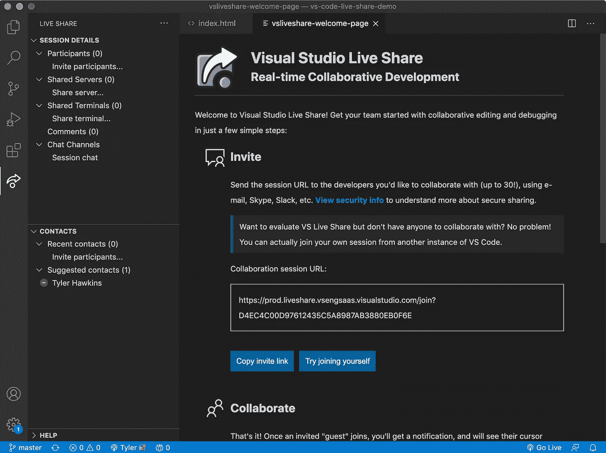
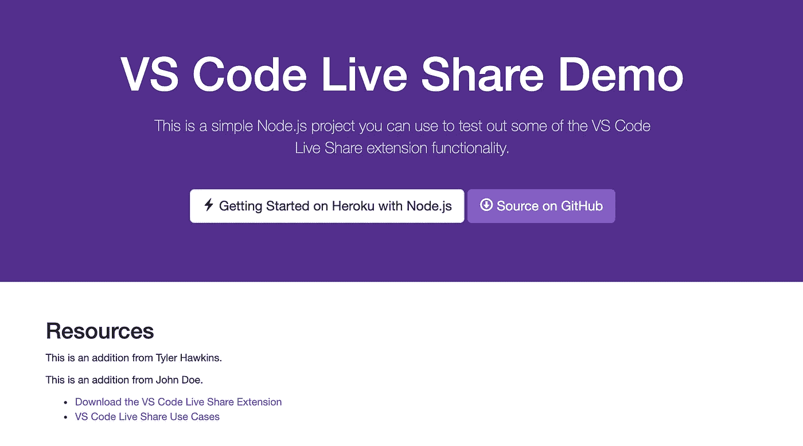
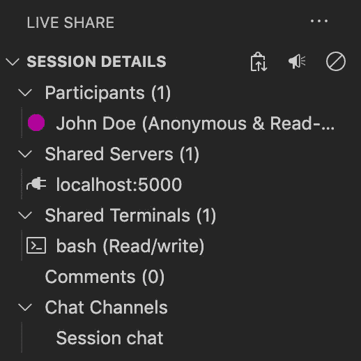
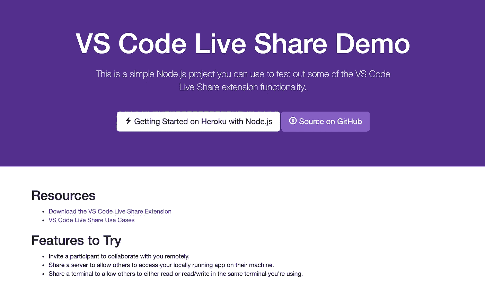

# 使用 Visual Studio 代码和实时共享进行远程结对编程

> 原文：<https://betterprogramming.pub/5-benefits-of-pair-programming-and-how-to-set-it-remotely-with-vs-code-acc2df7a6b8c>

## 使用 VS Code Live Share 扩展使远程工作更容易

阿尔瓦罗·雷耶斯在 [Unsplash](https://unsplash.com?utm_source=medium&utm_medium=referral) 上拍摄的照片

远程工作扼杀了结对编程。还是有？如果有什么不同的话，当两个相关的开发人员不再并肩坐在同一个房间时，这对结对编程来说无疑是一个有趣的挑战。但是，在这个远程工作的世界里，您还能成功地配对程序吗？

在本文中，我们将了解结对编程的一些好处，以及如何使用像[Visual Studio Code Live Share extension](https://marketplace.visualstudio.com/items?itemName=MS-vsliveshare.vsliveshare)这样的技术继续与同事远程结对编程。

# 什么是结对编程？

先来一个快速定义。我们将结对编程定义为一种开发技术，其中两个开发人员在一个工作站上编写代码。通常这意味着只有一台电脑和一个键盘。使用键盘的开发人员“驾驶”，而不使用键盘的开发人员“观察”或“导航”

驱动程序提供了编写代码的双手。观察者导航器提供了查看哪些文件和解决哪些问题的战略决策。observer-navigator 还审查正在编写的代码，并帮助实时捕捉简单的打字错误和其他错误。这两个开发人员按照约定的时间间隔交换角色，通常是每 30 分钟左右。

# 结对编程的好处

为什么会有人这么做？两个开发人员同时在做同一件事？那肯定是浪费时间。如果开发人员在他们自己的机器上独立工作，难道不能产生两倍的代码吗？

这些肯定是有效的论点，值得研究。所以让我们来看看结对编程的好处。两个开发人员一起工作对我们有什么好处？

## **教学和指导机会**

首先，结对编程提供了一个完美的教学机会。两个开发人员处于完全相同的技能水平是很少见的。取而代之的是，通常一个更资深，一个更初级。结对编程允许高级工程师指导初级工程师一起解决实际问题。初级工程师可以学习高级工程师如何分析问题，如何组织代码，如何命名变量，以及在出现问题时如何解决问题。记住指导和教学是双向的也很重要。

还有学长——不要低估你的初级工程师。他们可能对手头的问题有新的看法。谁知道呢，你们最终可能会学到彼此最喜欢的 IDE 快捷方式和技巧。

## **知识分享**

其次，结对编程允许你分享关于系统是如何构建的知识。当开发人员在单独的筒仓中工作时，一个工程师通常会从头到尾编码一个特性。尽管在整个开发过程中都要进行代码审查，但是让一个工程师成为项目的主要联系人会导致一个人对最终解决方案有最多的理解和知识。另一方面，结对编程可以让两个开发人员对他们的代码有更深的理解。

## **防误**

第三，结对编程使得用第二双眼睛更快地发现简单的错误和错别字变得容易。当有第二个人监视您键入的每个字符时，您会惊讶地发现丢失的分号或找出代码无法编译的原因的速度有多快。

## **人际沟通技巧提升**

第四，结对编程对工程师来说是一个发展人际交往技能的好机会。你能和另一个人讨论解决方案吗？你们能互相交流想法吗？你能用另一个工程师能理解的方式清楚地表达你的想法吗？当你看到一个更好的解决方案时，你能机智地引导某人离开一个糟糕的解决方案吗？也许最重要的是，你如何回应对自己想法的反馈和纠正？这些软技能对任何水平的工程师都是有价值的。

## 减少缺陷和提高生产率

最后，也可能是最有趣的是，[研究表明](https://collaboration.csc.ncsu.edu/laurie/Papers/XPSardinia.PDF)当工程师们将程序配对时，他们会写出更好的代码，错误更少。让两个人一起工作的额外开发时间成本估计为 15%。但是当你想到通过更少的客户支持问题和更少的调试时间所节省的时间时，你会发现结对编程实际上*提高了*生产率！

# 远程结对编程

所以，我们已经确定结对编程有很多好处。但是我们如何远程配对程序呢？新冠肺炎已经迫使许多公司采用远程工作政策，即使那些公司最初可能非常反对远程工作的想法。

对于我来说，我通常在办公室工作，但从 2020 年 3 月开始，我一直在远程工作，我喜欢这样！缩放会议和松弛消息已经成为我默认的沟通方式。但是结对编程呢？

一个选项可能是这样的:

1.  开发 1 和开发 2 一起进行视频通话。
2.  Dev 1 作为驱动程序启动，Dev 2 作为观察者-导航者启动。
3.  Dev 1 共享他们的屏幕，并在 Dev 2 导航时开始编写代码。
4.  到了转换角色的时候，Dev 1 提交他们所写的内容，并将其推送到远程存储库的一个分支。
5.  Dev 2 从分支下载最新的代码。
6.  Dev 2 共享他们的屏幕，并在 Dev 1 导航时开始编写代码。
7.  当再次转换角色时，Dev 2 提交他们编写的内容，并将其推送到分支。
8.  重复步骤 3–7，直到结对编程会话结束。

除了视频通话和屏幕共享之外，这些步骤看起来与面对面结对编程时看到的类似。另一个值得注意的区别是，为了让其他人拥有最新的代码，需要提交代码并将其推上来。当两个人结对编程时，你们没有同样挑战，因为你们都在同一台计算机上工作。

这就引出了一个问题，有没有什么方法可以不需要在角色转换之间提交代码就可以进行协作呢？

答案是肯定的，有！Visual Studio Code (VS Code)有一个方便的扩展，叫做 Live Share，它有助于促进远程结对编程过程。Live Share 允许你共享你的代码，而其他人在他们自己的计算机上跟随 VS 代码。但这还不是全部——您甚至可以共享您的本地主机服务器或终端实例！

# 如何使用 VS 代码直播分享

你可以在 [Visual Studio marketplace](https://marketplace.visualstudio.com/items?itemName=MS-vsliveshare.vsliveshare) 上免费找到 VS Code Live Share 扩展。单击 Install 按钮，然后重启 VS 代码应用程序，就可以开始协作了！他们有很好的安装说明和一个快速入门指南，在他们的市场列表上，和上面的链接一样，所以我强烈推荐跟随。

为了试验这个扩展，[我在](https://github.com/thawkin3/vs-code-live-share-demo) [Heroku](https://www.heroku.com/) 上创建了一个简单的 Node.js 项目。我在自己的机器上打开 VS 代码中的项目目录，单击屏幕左侧的 Live Share 图标，然后单击 Share 创建一个新的协作会话。

单击“共享”按钮开始新的协作会话

因为这是我第一次使用这个扩展，所以系统提示我登录，我是通过 GitHub 登录的。

使用您的 GitHub 或 Microsoft 帐户登录

登录后，我获得了一个协作会话 URL，然后我可以同时与多达 30 人共享。

将协作会话 URL 发送给你喜欢的任何人

我在第二台电脑上把这个网址发给了自己，并以匿名的 John Doe 用户身份登录。之后，我在第一台机器上收到一个通知，John Doe 正在尝试加入我的协作会话。这时，我可以授予他只读访问权，让他跟着我一起写代码，或者授予他读写访问权，让他和我一起写代码，或者拒绝他的请求，不让他参与会话。我点击了“接受读写”按钮。

接受或拒绝加入您的会话的请求

在我的第二台计算机上，一旦访问被授权，VS 代码就打开我机器上的项目目录。这真的很棒！我甚至不需要在本地下载代码或者克隆 GitHub repo。

一旦多人参与会话，每个人的光标都会显示出来，您可以实时协作，就像一起编辑 Google 文档一样。正如您在下面看到的，我能够从两台计算机上编写一行代码，并且我可以在屏幕上看到两个光标:

在 VS 代码中可以看到多个光标，每个参与者一个

我使用`npm start`命令在我的第一台机器上运行这个应用程序。在 localhost:5000 上运行的应用程序输出如下所示:

在本地主机上运行的演示应用程序:5000

这才是真正令人兴奋的地方。除了一起写代码，我还可以[在会话中与其他人共享我的本地主机服务器](https://docs.microsoft.com/en-us/visualstudio/liveshare/use/vscode#share-a-server)。我选择了分享 localhost:5000。然后，在我的第二台电脑上，我导航到 localhost:5000，我也可以在那里看到这个应用程序！作为合作者，我不仅不需要克隆回购，也不需要安装任何依赖项或在自己的机器上本地运行应用程序。所有这些都是由第一个用户处理的！

与他人共享会话、服务器或终端

除了共享服务器，你还可以[与合作者](https://docs.microsoft.com/en-us/visualstudio/liveshare/use/vscode#share-a-terminal)共享终端。我从我的第一台计算机上共享了一个终端，然后在我的第二台计算机上，我能够输入`npm test`命令来尝试运行项目的测试套件(但是，唉，没有测试可以运行)。

共享终端实例

在协作会议期间，我在应用程序中添加了一个新的部分，名为“可供尝试的功能”我们的实时分享协作会议非常成功！

演示应用程序的最终结果

# 结论

老实说，我对使用 Live Share 和它提供的除了简单的代码编辑协作之外的所有附加功能感到非常满意。唯一真正的挑战是，如果 VS 代码不是您的首选 IDE，或者结对编程会话中的任何人遇到了互联网连接问题。

结对编程有很多好处:更少的缺陷、更高的生产率和极好的指导机会。新冠肺炎可能迫使我们都远程工作，但这并不意味着我们不能结对编程。有了像 VS Code Live Share 这样的工具，远程结对编程可以像在办公室结对编程一样简单。

你的远程结对编程经历是怎样的？我很想在评论中听到你的意见。