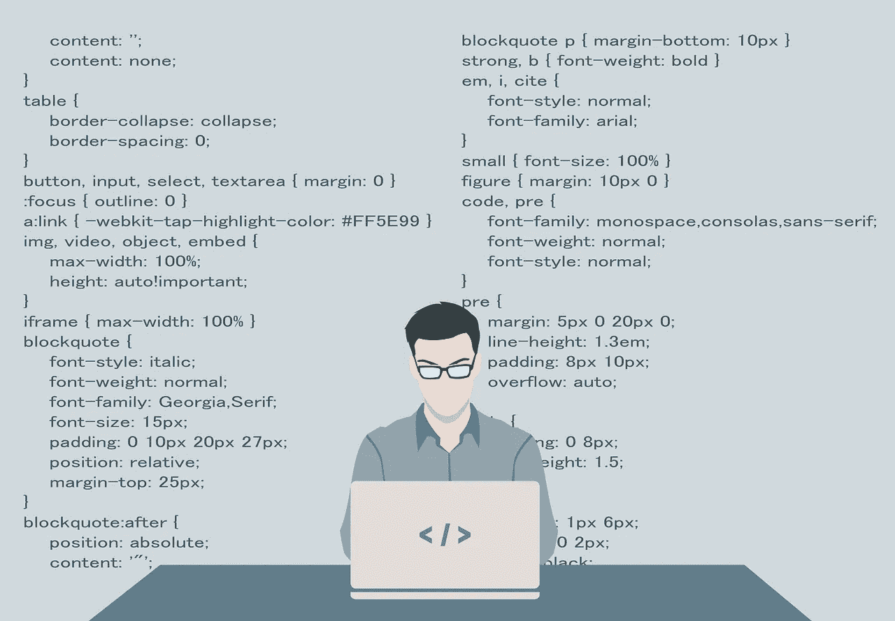

# 初级程序员被告知的 5 大谎言

> 原文：<https://betterprogramming.pub/5-big-lies-junior-programmers-are-told-840202e8ee10>

## 其他程序员和他们自己

照片由 [Fotis Fotopoulos](https://unsplash.com/@ffstop?utm_source=unsplash&utm_medium=referral&utm_content=creditCopyText) 在 [Unsplash](https://unsplash.com/s/photos/programming?utm_source=unsplash&utm_medium=referral&utm_content=creditCopyText) 上拍摄

当你还是个孩子的时候，你被告知很多事情，后来你发现这些事情完全是谎言。问题是，这个过程会不断重复:在你童年时可能是真的东西在大学里并不适用，许多在大学里可能是真的东西在你“成为职业选手”时可能会被抛弃。即便如此，还是有“人们所说的事情”，比如“*闪电不会两次击中同一个地方。*“事实上，当然是这样。

对软件行业各个方面的误解很难发现和区分。如此多的人爱上了他们，即使只是暂时的——给了他们一个不太好的开始。

我希望这篇文章，主要基于我自己的经验，提供一些有用的见解。让我们开始吧！

这是一个谎言:这是代码:)朱拉明——pixabay.com

以下是我们许多人听到或推断的一些陈述，它们都是谎言。当然，知道某事是谎言并不会自动揭示真相，所以我在这里给你我自己对这些陈述(这是谎言)的两美分。

# 1.如果有用，不要碰它

或者更通俗的说法:“如果它没坏，就不要修理它。”

当你在做一些被认为无关紧要的事情时打破了什么东西，或者当你提出了改进的建议时，这种情况就会出现。

正如你在自己的工作中可能被告知的那样，提出改进建议是一件好事。如果操作正确，它就是——我们稍后会谈到这一点。但实际上，通常情况下，你的输入一开始不会被接受。此外，你可能经常觉得自己因为好主意而受到惩罚。不要因此而气馁！

“它没有坏。”这是一个谎言，或者说是一个相当无力的借口。*一般来说*，没有代码是碰不得的。正如 Jeff Atwood [所指出的](https://blog.codinghorror.com/tending-your-software-garden/)，虽然有很多关于软件开发过程的隐喻，但它们都描述了一个*过程*。再好的节目策划，在现实生活中，都是进化变化的。从重构糟糕的设计，到移除死代码和添加或更新注释。这是它健康生活的一部分，否则这个“花园”就会变得不健康、丑陋，最终死亡。

与大学里的项目不同，没有什么是真正“完成”的

所以，不，代码工作的事实不是不做改变的借口，即使在功能方面没有用。然而，其他事情可能是。

## **问为什么**！

可能是由于某种原因缺少测试，使得一些更改有问题，或者是其他原因使得不值得冒这个风险。或者，也可能是你的代码没有那么好。拒绝任何提议都有很多好的理由，但是你应该弄清它们到底是什么。

# 2.不共享的知识是工作保障

或者:**复杂代码是工作保障。**

这个经常被当作笑话扔掉，然而，不幸的是，对一些开发者来说，这实际上是一个相当非官方的策略，为了…工作保障，我猜。(据我所知)你不会发现它是一个*实际的*建议，但是这个想法是存在的。

所以首先，是骗人的。正如人们常说的，工作保障从一开始就是一个谎言，无论如何也不一定值得去追求[。但是，就知识而言，在大多数情况下，公司不会把某人留在身边，仅仅因为他们是某个所有人都害怕的可疑巫毒遗留项目的专家。简单来说，没有人是不可替代的，说到这一点，也没有模块是不可替代的。](https://medium.com/swlh/job-security-is-a-big-lie-3458818ea2cd)

但即使这是真的，如果你走上那条路，也不是说你没有为你的“安全感”付出代价。事实上，你错过了很多。如果你想在你的公司和整个职业生涯中成长和进步，你工作中最有成效(也最有趣)的元素之一就是*分享知识*。这是让你的团队高效的原因，这通常是你如何获得关于你自己工作的有价值的输入，激励和得到激励，这是最终可能让你成为最受欢迎的人的一部分。另外，套用一句话，当你解释某事时，你也是在对自己解释。

现在回到安全点。你可能仍然会问，这就是这句话的来源:“*但是如果我把我知道的一切都传递下去，为什么还要把我留在这里？“因为你擅长你的工作，正如我刚才解释的，分享知识是变得优秀的一部分。事实上，相信我:你知道的比你想象的多，即使你远不是房间里最有经验的人。在某些时候，没有足够的时间*来分享重要的话题，即使是以最简洁的方式(就应该这样——太多也没有效果)。**

此外，你的雇主将永远重视你分享知识的主动性，因为让人们更多地分享知识是一个众所周知的难题(不仅仅是在软件领域)。这么说吧:你真正应该问的问题是:“*但是如果我把我知道的都传了，为什么不提拔我？*

# 3.你没有资格挑战 X

“你”是一个初学者，“X”是一个人，一个想法，一个政策，产品决策，等等。另一种说法是，“不要成为麻烦制造者。”剧透:是骗人的。

可能没人对你说过这句话。但是，特别是作为一个大三学生，你会对你可能提供的任何输入有一种抵触感，从小的实现细节到“事情就是这样”

值得注意的是，阻力的程度和性质在不同的组织和团队之间有很大的不同。但是，它总是在那里，*总是会是*。接受它，并学会与之共事。正如我之前所说的，不要因此而气馁。即使感觉是私人的(很可能不是)。

那种认为你没有资格挑战、质疑、提议或*领导*一个改变的想法，是*在你头脑中的谎言*。可能有人把它放在那里，但你是否接受它取决于你。通常情况下，软件研发环境对思想交流是相当开放的。如果你的投入是有价值和建设性的，你缺乏经验应该是次要的。

当然，我们都应该有适度的谦逊，正如这篇文章所强调的那样。推动变革，无论大小，首先是与人交谈。人们总是以不同的方式知道或看到一些事情，所以关于如何做有很多话要说。但是如果有一条关于说出我的想法的规则，那就是:*无所畏惧。*

接受你错的可能性，如果是这样，承认它。这也是学习的一大部分。你不必把任何事情都当成真理，通过大声说出来，你很可能说出了别人的想法。

# 4.技术并不重要

软件世界在加力推进，因此拥有多种技能——平台、语言和框架——在任何地方都非常受重视。然而，这很容易与“如果你是一个好的开发人员，技术是次要的”或者“你应该学习 20XX 年的编程语言”这样的陈述混淆

实际上，我曾在求职面试中试图用这个推销自己(很久以前……)，好像我不在乎公司使用什么技术。我确实相信这一点，认为这是“正确的”态度。

现在，我没有资格决定任何人的职业道路，但是，我建议你考虑以下几点:

*   你从专业开始的技术对你的职业发展方向有影响。要不要重点放在后端？那么 Angular(举例)此刻与你无关。大数据世界对你有意义吗？那么 Python(举例)就是一个很棒的选择。底线是:做你的研究。
*   仅仅因为 Swift 在某个时候在某项调查中超过了 Ruby，并不意味着你今天就应该转向它。另外，一下子学太多很难，也不切实际。你需要专注于某事并掌握它。对特定技术的丰富经验可能会成为你能力的一大部分——而且对于你将来想要的许多职位来说，这是必须的。这很好，也有必要去探索，但是要避免“万事通，不精通”的陷阱。
*   然而，就机会而言，并非所有技术都是平等的。让我们以编程语言作为一个简单的例子:你有像 Java 和 C++这样的老巨人，像 Rust 和 Go 这样的后起之秀，还有一些像 Perl 和 Objective C 这样的垂死之星。请记住，它是非常动态的，有点主观。但是*选择明智*。当你在 2020 年寻找拥有 7 年 Object Pascal 经验的公司时，技术不是次要的，你才是。未来几年会是什么样？

这是个人的，并不总是一个容易管理的平衡——专业知识和保持相关性。我在这里要说的是，不要忘记专业知识。在你职业生涯的某个时刻，技术*可能*在某种意义上变得次要。但首先，要掌握一些有价值的东西。

# 5.工作日是一天的工作

延误是不好的。为了你，你的团队，还有你的公司。然而，不知何故，我们从来没有看到他们的到来。是什么让看似可预测的事情变成了永恒的令人不快的惊喜？简而言之，幼稚。一种错误的心态，制造了一堆小谎言，常常掩盖了一个简单的事实:*一切都需要时间。*

一切，在这种情况下，意味着*一切。*每一个小任务，像切换分支，编译，读邮件，订午餐。每样东西都包括一堆你几乎从未考虑过的东西。

以这个微不足道的特性为例:您需要提供一个执行脚本的函数。就是这样。如果你认为这是一天的事情(我们称之为“快速取胜”)，说，没有会议和干扰，请原谅我:

*   上午 10 点:开始计算“需求”中的漏洞你怎么处理错误？还是退出值？如果我们卡住了怎么办——有超时吗？可配置的？需要截取输出吗？如果是巨大的呢？您明白我的意思了:第一个问题是获取实际需求。你可能为此需要人——所以你去寻找他们。半天过去了。午餐。
*   2 PM:在讨论需求时，发现另一个项目需要使用你的功能，所以你不能只把它放在你的项目中。另一个小时的政治辩论是关于把它放在哪里和如何放，然后实际去做。外加喝咖啡的时间。
*   下午 4 点:终于写了一些代码。你猜怎么着，你在下午 6 点前完成！所以它实际上是一个两小时的故事片，不是吗？然而，现在您需要一个测试环境。一天过去了。
*   第二天:上午 10 点你有了你的测试环境，下午 12 点你写了一些测试脚本，下午 14 点你处理并测试了一些场景，在一天结束前进行单元测试(不是 TDD，只是改变顺序)。明天:拉请求、评论、合并和一个小文档。

在连续三天不间断的、快节奏的、相当流畅的工作之后，这个特性就出现了。你可以想象*加上*的干扰和会议，对于一个所谓的一天专题节目来说，它至少是四个。为什么嗯，一切都需要时间。作为程序员，我们通常认为的工作比我们想象的要少得多，但是我们的自我意识不允许我们承认这一点。

但你还是会上当。我们都是。如果我能给你一些建议的话，那就是:*不要道歉。*如果你能解决效率低下的问题，那就去做吧，但这都是工作。此外，不要无限期延长你的工作日(不幸的是，我有时仍会这样做)。如果我再说一遍，也许你会记得:一切都需要时间。

# 额外收获:衡量你的标准是你的编码技能

正如最后一点所展示的，实际的编码远没有占用我们大部分的时间和精力。也不应该。毕竟，编码不是*的目标*，不是吗？*解题*就是。我又一次从杰夫·阿特伍德那里借用了一些智慧。当你离开一个在技术上对你进行评估的环境五分钟后，你正忙于在你职业生涯的开端提高你的技能和攀登陡峭的技术悬崖时，你可能更难看到。但那个借口应该比你老得快多了。

现在，“解决问题”作为学校里的一个术语(五分钟前你所在的地方)有点片面。这更像是一种“解决问题的训练”——这是可以预测的。另一方面，在现实生活中，解决同样的问题，一次又一次，是你最不想做的事情——这不是你的工作。

你的工作是一劳永逸地解决它们。要做到这一点，你需要识别他们，评估他们，提问，计划，合作，启动，调查，沟通，适应。所有这些都需要积极的态度，利用经验、常识、敏捷和热情。

最重要的技能，也是衡量你的标准，远远超出了技术层面。我能想到的，用*或*来描述他们的唯一表达方式，就是一个词:*专业*。但这还不是全部，因为*的目标*是解决问题。这个公式可能看起来很棒，但由于没有人真正关心的原因仍然不起作用——因为*目标*就是结果。

所以，让我们这么说吧:*衡量你的标准是你的专业性，以及你如何将其转化为结果。*

我不知道你怎么想，但对我来说，这听起来是一种解放。与其用你并不总是关心的技术细节来追逐你自己的尾巴，你实际上应该用你的技能去实现一个真正的目标。几乎就像完全没有被测量一样。

# 结论

并不缺乏基于现实的非常流行的想法。发现那些不太明显的 T2，尤其是那些需要我们改变行为或态度的，可能需要一些努力。但这是旅程的一部分——而且很有趣！

感谢阅读！