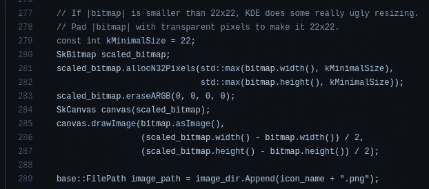
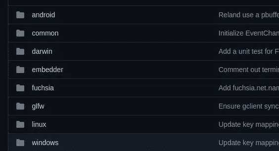

# 每个软件项目的 5 个干净代码实践

> 原文：<https://betterprogramming.pub/5-clean-code-practices-for-every-software-project-479443b31c3c>

## 提高前端、后端、CLI、桌面或移动应用程序代码库质量的想法

照片由 [Sean Lim](https://unsplash.com/@seanlimm?utm_source=unsplash&utm_medium=referral&utm_content=creditCopyText) 在 [Unsplash](https://unsplash.com/s/photos/programming?utm_source=unsplash&utm_medium=referral&utm_content=creditCopyText) 上拍摄

程序员通常使用各种软件代码库，他们经常添加、编辑和删除代码行。编程在大多数时候是一种协作的方法。一个特定的软件开发团队的经验丰富的程序员被称为架构师，他们通常创建项目的初始基础。换句话说，他们准备概念软件系统的设计文档。此外，他们定义了编码标准和架构标准。之后，其他开发人员在架构设计文档的帮助下开始开发每个组件。

几乎所有现实世界的软件系统都需要快速特性实现。因此，程序员总是试图使他们的代码库整洁有序，这样其他程序员就可以很容易地实现新功能。此外，新程序员可以很快开始使用特定的软件系统。

因此，在对代码库进行任何代码修改之前，我们应该始终考虑可维护性因素。我参与过许多闭源软件项目和开源软件项目。我总是试着用下面的实践来写干净的代码。检查完这些之后，您可能会重新思考您的编码实践。

# 始终使用不言自明的名称

任何编程语言都有几个我们不能在自定义命名中使用的预定义关键字。比如 C 编程语言有`if`、`for`、`return`等 32 个特殊关键字。软件库和框架遵循不同的命名约定。比如 C 编程语言的标准库有`printf`、`sprintf`等函数。除了特定编程语言的关键字和库 API 之外，程序员可以自由地为源代码元素选择任何名称。

程序员应该总是尝试为源代码元素选择有意义的和自我解释的命名。不仅仅是变量名的问题。我们需要为类、名称空间、自定义数据类型、函数甚至文件名选择更好的名称。如果这些源代码元素没有明确的命名，其他程序员可能不得不分析整个模块来应用简单的补丁。

除了编程语言的默认命名约定，维护我们自己的命名约定来增强代码库的可读性总是很好的。例如，我通常使用动词作为每个布尔值的前缀。例如，`hasExtraParameters`暗示它持有一个布尔值。

# 需要时进行评论，但并不总是如此

即使我们对源代码元素使用不言自明的名称，我们的源代码也可能包含复杂和不清楚的部分。此外，我们可能会在代码库中包含临时解决方案。有时，我们实现一些复杂的算法或计算。添加注释确实是给出复杂流程提示的好方法。当其他程序员对您的代码进行修改时，您的代码注释将节省他们的时间。

写评论也是暗示局限性、问题或临时工作的好方法。如果您由于框架或库的限制而实现了一个变通方法，添加代码注释总是很有帮助的——因为另一个程序员可能会再次花费时间在您已经研究过的内容上。

例如，我在 [GitHub](https://github.com/electron/electron/blob/ea69da279ffc87e63bccd6985982be4e3cf627b9/shell/browser/ui/gtk/app_indicator_icon.cc#L277) 上的电子框架代码库中找到了以下评论:

一个有用的电子源代码注释。作者截图。

但是，过多的注释可能会给源代码增加不必要的复杂性。这就是为什么许多程序员倾向于不写 [Javadoc](https://en.wikipedia.org/wiki/Javadoc) 。

# 避免重复，但不要过度设计

当代码语句在多个领域重复出现时，程序员通常会将这些语句移到一个函数或类中，以增强可重用性。例如，如果多个功能试图从 internet 下载文件，您可以创建另一个类或函数来处理与文件下载相关的工作流。提高代码的可重用性会给整个项目带来许多好处:不必要的复杂性将会降低，程序员可以通过最小的修改来实现新的功能，并且您的代码库的核心变得更加稳定。

因此，在实现任何新特性之前，最好考虑一下可重用性。一些程序员可能会认为早期的重构过程浪费了你分配给特性实现的时间。然而，早期的重构将有助于你避免完全的、耗时的重写。

然而对于可重用性增强和源代码分解应该有一个限制。过度使用可重用性原则通常会产生每个程序员都不敢接触的过度工程化的代码库。过度工程也给你的源代码增加了不必要的复杂性。因此，我们需要通过在头脑中保持过度工程化的副作用来避免重复。

# 使用一致的格式规则集

当涉及到代码格式化时，程序员通常倾向于使用不同的实践。一些程序员让代码编辑器插件自动格式化他们的代码。同时，一些程序员喜欢手动进行代码格式化。代码格式是指你的编码风格。换句话说，它指的是如何处理编程语言的语法——以及如何用空格和换行符组织源代码。代码格式规则集定义了您需要遵循的编码风格。

定义良好的代码风格指南会带来很多好处。它将提高整个源代码的可读性和质量。此外，代码审查者将能够毫无争议地审查新贡献者的代码。看看几个换行符和空格如何增加下面代码的可读性。

不带换行符和空格:

添加换行符和空格后:

此外，如果您在连续的语句之间添加一些空白行来从概念上对逻辑进行分组，其他程序员可以很容易地理解他们需要修改或研究的部分。

# 使用易于理解的项目结构

中型或大型项目的项目结构在干净代码中起着至关重要的作用。项目结构指的是代码库的目录和文件树。几乎所有的代码编辑器和 ide 都从项目的目录结构中呈现一个树形视图。因此，程序员经常使用树形视图来导航到不同的模块和组件。一个组织良好的项目结构有助于程序员简化任何有数千个源文件的复杂软件项目。

当我们将大的源文件分解成较小的文件时，我们需要使用更多的语句来导入所需的源文件。对 import 语句进行排序或分组是降低特定源文件头复杂性的一个好方法。只有当你有一个组织良好的项目结构时，清晰的分组和排序才是可能的。

检查 Flutter Engine 项目如何将特定于平台的代码隔离到不同的目录中，以获得更好的项目结构。

如上所示，颤振引擎隔离特定于平台的代码。作者截图。

# 结论

程序员需要为每个软件项目维护干净的代码实践，每种编程语言和框架都促使程序员使用定义良好的命名约定或实践。大型科技公司为他们的代码贡献者维护他们自己的代码样式指南，以确保他们代码库的质量。

*   谷歌为许多编程语言创建了[代码风格指南](https://google.github.io/styleguide/)。
*   Airbnb 为 JavaScript 创建了一个[代码风格指南](https://github.com/airbnb/javascript)。

两个不同的团体确实会阅读你的源代码:为你的项目工作的编译器和程序员。用优化的无错代码打动编译器，用干净的代码打动程序员。