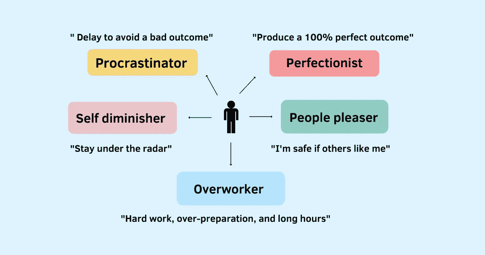

# 5 应对冒名顶替综合征的应对策略

> 原文：<https://betterprogramming.pub/5-coping-strategies-to-deal-with-imposter-syndrome-76a3ca82cfba>

## 你认同哪种类型的冒名顶替者？



鸣谢:作者

在我职业生涯的大部分时间里，我都觉得自己是个骗子。每一次晋升、每一个大项目、每一次挑战都会让我有一种沮丧的感觉——“我是个冒名顶替者，他们很快就会发现。”“我不配这样。”"他们可能犯了一个错误，把这个项目、职位或挑战托付给我."

每次我成功了，达到了那些期望，有时甚至超过了期望，我内心的批评者不是相信我的技能和能力，庆祝我的成就，而是想出另一个故事来证明我的成就——“这可能太容易了。如果我能做到，任何人都可以。”“我想这次我走运了。”“我有一个充满聪明和才华的团队。都是因为他们。”

我的感觉只有我自己看得见。我从未和任何人说过我有这种感觉。其他人都看到了我不相信存在的另一面。一个聪明、有才华、自信、技能高超的人，擅长自己的工作。他们信任的人。一个他们可以信任并承担更高责任的人。

我仍然记得我第一次去美国为客户工作。在机场等的时候，每次我的电话响了，我都以为一定是老板打电话告诉我，他犯了一个错误，我没有资格做这份工作。在客户那里，我每天醒来都有被暴露的感觉，很快就发现了。但是那些当时看起来如此真实的感觉没有一个是真的。只有更多的项目。更多的顾客。更多的旅行。随着每一次旅行，每一个新项目，每一个客户，感觉不值得的循环，生活在持续的恐惧中，一旦这一切都重复了一遍，就感觉如释重负。

持续了好几年！

虽然当时感觉很孤独，但我并不孤单。《国际行为科学杂志》的研究显示，超过 70%的人在生活中的某个时候会受到职场骗子思想的影响。这非常重要。

# 经历冒名顶替综合症

冒名顶替综合症虽然是一种普遍的感觉，但却是一种非常独特的经历。它对每个人的影响不仅表现在他们的感受上，还表现在他们之后的行为上。

比如说…

*   你内心的对话可能会告诉你保持安静，不要说出你的观点，除非你对它的正确性有 100%的信心。担心不完美的答案会暴露你。
*   当你需要帮助时，你内心的批评家可能会阻止你。如果[求助](https://www.techtello.com/how-to-ask-for-help/)让你看起来很无能，向别人传达你不配这个职位怎么办？
*   你可能会熬夜加班，努力工作以赶上你周围所有聪明的人。毕竟，你的自我判断告诉你，如果你不过度工作，你会被远远地甩在后面。
*   你总是推迟一项重要的任务，担心会搞砸。不去尝试比让自己经历失败的羞辱要容易得多。

> 阻碍你的不是恐惧，而是你对恐惧的态度。你越是坚持恐惧是不好的，在恐惧消失之前你不能做你想做的事情的态度，你就越会被卡住——Russ Harris,《信心的缺口》

就我自己而言，除了说出这种感觉，我还需要分析潜在的行为和行动，这些行为和行动是我有意识或无意识地采取的应对机制，以应对我的冒名顶替综合症的感觉。使我无法充分发挥潜力的破坏性行为。这些行为不仅损害了我自己的成长，也伤害了我周围的人。

我越是抓住这些行为不放，我就越觉得自己被困住了。我需要摆脱困境，发掘我的潜力。我需要摆脱这些行为。

我的分析和研究让我想到了 5 种不同的行为，我们可以把它们作为应对冒名顶替综合症的策略。我在人生的不同阶段展示了其中的一些行为。我也有一个占主导地位的策略，这是我应对欺骗情绪的默认策略。

你能认同哪一个？

# 拖延者

如果你倾向于把事情拖到最后一刻，你就是一个拖延者。

你可以随便找借口“我找不到时间”“我在压力下工作得很好”，但是逃避你需要做的事情的真正原因不是缺乏时间或者你在时间紧迫的情况下完成伟大工作的能力。这是你对做不好工作的恐惧，让你自己和别人都清楚你实际上是个骗子。

有时，我们都会拖延。但是，如果你正在处理的是冒名顶替综合症的感觉，拖延症就不是一次性的事情了。更像是一种习惯。

每次你以这种方式行事并最终得到一个好的结果，意想不到的成功只会加剧你的欺骗感，强化你被发现的信念。毕竟你没有付出努力，不应该得到这样的结果。你可能再次愚弄了所有人，但不会太久。

每当你发现自己因为害怕失败而推迟或拖延事情时，问问自己这些问题:

1.  我想要避免的是什么？
2.  我推迟的真正原因是什么？
3.  如果我全力以赴，最坏的结果会是什么？
4.  为什么我真的如此在意别人对我的看法，以至于我愿意破坏自己成功的机会？
5.  今天我能迈出的一小步是什么？
6.  是什么阻碍了我持续进步？我该如何摆脱它？

> 强制效率法则说，永远没有足够的时间去做所有的事情，但是总有足够的时间去做最重要的事情——布莱恩·特雷西，吃了那只青蛙

通过专注于做好重要的事情，并朝着它们迈出一小步，你可以摆脱你的拖延症，并将你的努力转化为重大贡献。

# 至善论者

如果你有一长串的错误清单，但是只有一种方式是对的——你的方式，那么你就是一个完美主义者。典范的性能、高标准和 100%完美的结果，正如您所期望的那样。事情必须按照你的方式进行，否则就是“不够好”

当一个项目进展顺利时，你不会为自己的表现感到高兴，而是总会发现有一件事你本可以做得更好——这是你不启动项目的完美借口。你害怕把自己的作品公之于众，担心别人不喜欢，你会被曝光。

作家兼诗人朱莉娅·卡梅伦对此做了精彩的总结:

> 完美主义不是追求最好。这是对自己最坏的一面的追求，这一面告诉我们，无论我们做什么都不够好，我们应该再试一次。

詹妮弗·怀特的一位作者说:

> 完美主义与做对没有关系。跟有没有高标准没关系。完美主义是拒绝让自己前进。

你的完美主义态度也会影响你与他人的合作。授权对你来说并不容易。如果这是你工作的一部分，你可能会去做，但你永远不会对你团队的工作满意，经常会感到愤怒、不满和沮丧。

你的完美主义拖了你团队的后腿。推动别人达到你的高标准会导致抵触和不愿意与你共事。你也可能会倾向于重做别人的工作，即使他们做得很好，只是为了满足你内心的完美主义。你的意图可能没有错，但它确实向他们传达了这样的信息:他们没有能力，你不信任他们。

现在，我并不是说你不应该为你的团队设定高标准，或者期望不那么优秀。但是优秀和完美主义是两回事。卓越是利用你和他人的潜力来寻求一个伟大的结果。完美主义是关于执念。

> 如果你足够努力，工作更长时间，做得更好，完美似乎是可能的，但这实际上是一个遥不可及的海市蜃楼。你可能会把自己推向这片美丽的绿洲，但当你到达那里时会发生什么呢？没什么好看的，或者原来比你想象的要远。追求完美意味着你永远不能坐以待毙，享受你现在所处的位置；它让你不再感到满足，并鼓励你低估你已经拥有的一切，认为这还不够——杰西米·希伯特——骗子疗法

每当你发现自己认为有些事情不对劲，需要纠正，或者不够好的时候，问问自己这些问题:

1.  是什么让我相信这很重要？
2.  我的观点和其他人的观点一致吗？他们同意或不同意的原因是什么？
3.  不做这种改变会有什么影响？最糟糕的情况会是什么？
4.  在这个位置上，我还能做些什么给我、我的团队和我的组织带来更多价值？

通过对你努力的地方进行选择，而不是在每一件小事上浪费时间和精力，你可以慢慢摆脱你的完美主义倾向，做出更有意义的贡献。

# 过度劳累者

如果努力工作、过度准备和长时间工作是你避免被你周围所有聪明和聪明的人吓倒的默认策略，那么你就是一个过度工作的人。

你相信你能走到今天而不被曝光的唯一原因是你比任何人都努力的能力。愚蠢、努力和成功的感觉，以及随之而来的更多愚蠢，这种永无止境的循环只是一个陷阱。在你意识到之前，它会把你变成一个工作狂。

它让你保持警觉，相信掩盖你的欺诈行为的唯一方法就是比其他人更努力地工作。超努力的工作可能会打击你的冒名顶替综合症的感觉，但你要付出的代价明显更高。花那么多时间工作会让你忽视自己的健康，导致精疲力竭和[精疲力竭。你也可能花更少的时间和家人在一起。你的职业成功真的值得所有这些牺牲吗？](https://www.techtello.com/wrong-about-burnout-at-work/)

为了区分做好任何事情所必需的努力工作和只是为了掩盖自己无能的感觉而努力工作，问这些问题:

*   我加班的理由是什么？
*   与其努力向别人证明自己的能力，不如只专注于成为最好的自己？
*   这些额外的时间能帮我赚到什么？为什么它对我很重要？
*   这些额外的时间帮助我避免了什么？为什么我避免这些事情是对的？

通过仔细花费你的时间和精力，你会更好地控制你的生活，在更少的时间里完成更多的事情，并建立必要的信心来完成任何有意义的事情，而不会在这个过程中毁掉自己。

# 取悦大众

如果你所有的行为都是出于让别人喜欢你的愿望，那么你就是一个[讨人喜欢的人。你拼命寻求他们的认可和接受，不是因为你相信他们的判断，而是作为一种手段来愚弄他们，让他们相信你是属于他们的。](https://www.techtello.com/stop-being-a-people-pleaser/)

你以为别人喜欢你就不太可能发现你是冒名顶替的。

出于真诚的关心而帮助他人对建立信任和建立更好的工作关系大有帮助。但当它源于让别人对你有好感的欲望，通过做让他们开心的事情来操纵他们对你的看法，寻求不断的认可、接受和批准来建立你自己的自我价值感时，它对你自己和你与他人的关系是完全有害的。

> 从本质上来说，友善就是通过让一切变得顺利而被别人喜欢。没有波浪，没有摩擦。它基于这个(非常不准确的)理论:如果我取悦他人，给他们他们想要的一切，保持低调，不惹怒他人或制造任何不适，那么其他人就会喜欢我，爱我，给予我认可和我想要的任何东西——阿齐兹·加济普拉，不是好

你的行为根植于对拒绝的恐惧、无助感、失败的风险、因冒犯他人而产生的不适，以及没有勇气接受他人的反对，你让你的伪装感阻碍了你实现卓越。

每当你发现自己做某事不是因为这是正确的事，而是因为你害怕被发现，问这些问题:

*   是什么驱动了我现在的行为——害怕被拒绝还是真心想要帮助？
*   通过忽悠别人喜欢我真的能建立更好的关系吗？
*   我能做些什么来增加我工作的价值？真正正确的做法是什么？
*   寻求认同和增加价值哪个更重要？

通过放弃寻求认可的倾向，依靠你自己对自我价值的衡量，你可以从一个讨人喜欢的人转变为一个得到高度认可的有价值的贡献者。

# 自减光器

如果你倾向于过分关注自己的错误，而忽视身边发生的一切好事，那么你就是一个自我贬低者。你没有为自己做得好而祝贺自己，而是纠结于一件出错的小事。

这是你头脑中的对话。"每一个错误都会影响我的能力。"“每一次的失败都在向别人发出信号，我作弊了，我完全不配这个职位。”

过度关注错误和失败，并试图不惜一切代价避免它们，会让你放弃那些需要你走出舒适区的机会。你试着安全行事，坚持你熟知的事情，避免挑战。

你的行为不仅降低了你的成就，还让你放弃了你非常适合的机会，限制了你的成就和成功。

每当你发现自己在反思自己的错误或想错过一个好机会时，问这些问题:

*   呆在我的舒适区能帮助我实现什么？
*   如果我从不犯错，我该如何学习和成长？
*   我过去的失败和错误教会了我什么？
*   新的机会能帮助我学到什么？
*   我可以采取什么样的一小步来克服自我认知的局限呢？

了解你的成长是走出舒适区的一步，把错误和失败当作超越的机会，你可以在成为一个高度成功的人的旅程中做一些精彩的事情。

隐藏你的冒名顶替的感觉只会把你推进兔子洞，而学习勇敢面对它们会打开你的心扉，迎接新的可能性。

# 摘要

1.  相信自己是冒名顶替者，是一种普遍的感觉。超过 70%的人在一生中的某个时刻会有这种感觉。
2.  虽然冒名顶替综合症与不充分的感觉和认为你做的任何事情都不够好有关，但它在你的日常生活中是如何发生的以及对你的影响因人而异。
3.  承认你的感受是重要的，但更重要的是关注这种感受所引发的潜在行为和行动。
4.  你的冒名顶替感会让你变成一个拖延者、完美主义者、过度工作者、取悦他人者或自我贬低者。
5.  如果你因为害怕产生不好的结果而推迟重要的事情，那么你就是一个拖延者，从而让别人知道你是一个骗子。
6.  如果你倾向于纠结于微小的细节，并担心任何不完美的事情会暴露你，从而产生一个 100%完美的结果，那么你就是一个完美主义者。
7.  如果长时间的努力工作是你弥补自己技能和能力不足的唯一策略，那么你就是一个过度工作的人。
8.  如果让别人喜欢你能让你感到安全，不会被揭穿是个骗子，那么你是个讨人喜欢的人。
9.  如果你努力不被发现以降低被发现的风险，你就是一个自我贬低者。

```
**Want to Connect?**This story was originally published at [https://www.techtello.com](https://www.techtello.com/what-type-of-imposter-are-you/). Follow me on [Twitter](https://twitter.com/techtello) for more stories.
```