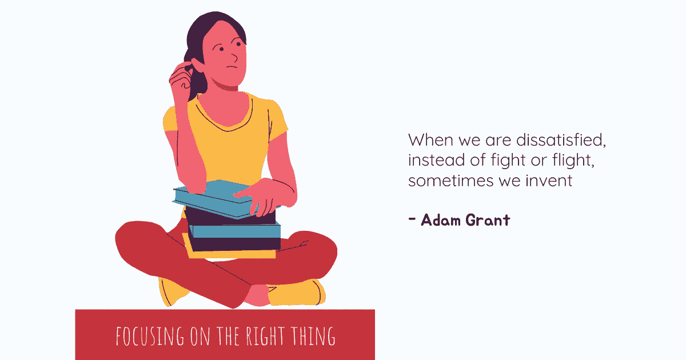

# 处理工作挫折的 5 个情商习惯

> 原文：<https://betterprogramming.pub/5-emotionally-intelligent-habits-for-handling-frustration-at-work-a27cfa4b0d1d>

## 压力和困难的互动是生活的一部分。以下是你如何超越自我的方法。

图片来源:作者

当一个同事责备你时，那种突然爆发的愤怒。当你的想法被拒绝时的失望感。对以自我为中心的老板的怨恨。满足他人期望的压力。所有这些都可能成为工作中不断受挫的根源。

就像橡皮筋一样，你觉得自己被拉伸到了极限，随时都有可能断裂。朝错误的方向轻轻一推，就会对你的大脑造成严重破坏，让你的世界分崩离析，让你无法高效工作。

每一天都有那么多不喜欢工作的事情:不在乎的老板、刻薄的同事、吹毛求疵的客户、不在乎回应的支持团队、消耗你时间和精力的会议、活在自己的世界里没有时间观念的电子邮件和信息。

这么说吧:你的挫折似乎完全合理。你完全有权利对现状感到沮丧。谁喜欢花时间解决矛盾和处理别人的烂摊子？

对你周围的事情感到恼火，是因为你想要掌控一切，你对这个世界和其中的人应该如何组织的个人偏见。渴望完美的工作体验，当一个完美的工作体验不存在时感到沮丧，这是很自然的。

但是你关注的是正确的事情吗？当你不喜欢某样东西时，你会怎么处理这种挫败感？

在陷入沮丧的漩涡后，你对现状感到恐慌，给你的生活增加了压力和焦虑。你对自己的处境感到无能为力，然后什么也不做。

因此，不要浪费时间去想那些让你在工作中受挫的情况，要知道你无法摆脱它们——但你可以学会以健康的方式应对它们。

> “我可以选择说是，也可以选择说不是，我可以忍住不说，也可以问一个挑战某人的尖锐问题。如果我亲近的人在做让我恼火的事情，我可以提出来谈论。当我真的想要某样东西，而我得到的第一个回答是不，我会问问题，看看对方是否愿意改变主意。我完全有自由选择此刻我想要怎样，基于我觉得对的事情。我是决定者。我是我生命的创造者。”
> 
> 阿齐兹·加齐普拉

# 未经处理的挫折会导致无意识的防御并损害判断力

工作中未处理的挫折导致心理 [*位移*](https://en.wikipedia.org/wiki/Displacement_(psychology)) *，*西格蒙德·弗洛伊德创造的一个术语。它描述了一种无意识的防御机制，在这种机制中，我们的大脑用一个新的目标或新的物体来代替我们觉得太危险或不能接受的目标。它通过情绪、想法和愿望在头脑中无意识地运作，作为我们实际攻击性冲动的转移。

在糟糕的一天工作后，对你的孩子或配偶发脾气就是这种防御机制的一个例子。你没有有效地管理工作中的情绪，而是通过抨击家人来处理情绪，因为对他们做出反应要比承认和处理任何让你在工作中受挫的事情容易得多。事后你可能会有罪恶感，但你在当下却不自觉地把工作中的辛酸经历转移到了家人身上。

在与关键利益相关者进行长时间的谈判后，当团队成员犯了一个小错误时，你可能很容易失去冷静。在没有意识到的情况下，当你与你的团队成员沟通时，你试图说服你的利益相关者对他们的要求现实一点的挫败感可能会表现出来，因为你的团队成员是一个容易发泄的目标。

忽略工作中让你烦恼的任何事情，你就让内心的冲突在内心滋生。这会导致反复思考——为什么这个人会有这样的行为？我做了什么要受到这样的惩罚？为什么这种事总是发生在我身上？诸如此类。

如果不表达你的感受并学会克服它，来自未处理挫折的压力和焦虑会影响你的批判性思维能力，导致你拒绝想法，变得不灵活，甚至导致你反应过度。

美国神经科学家艾米·阿恩斯滕(Amy Arnsten)解释了压力是如何损害判断力的:“在无法控制的压力下，高水平的儿茶酚胺释放会迅速将大脑从深思熟虑的反射状态转变为更无意识的反射状态。当我们处于危险之中时，这可能会挽救我们的生命，但当我们需要自上而下的控制来正确指导我们的行动和决定时，这往往是无益的。”

通过很好地处理挫折，你可以消除不健康的分心，专注于增加价值的工作，并在生活中建立更好的关系。

# 应对工作挫折的 5 个情商习惯

## 1.了解你的触发因素，这样你就可以有目的地行动，而不是对环境做出反应

“了解你自己，你将赢得所有的战斗，”中国古代哲学家孙子说。

感受到任何形式的强烈情绪都应该是一个信号，让你退后一步，暂停一下你的想法，仔细考虑一下情况，然后承认你当时的感受。以这种方式调节情绪会让你变得有弹性，对自己的处境负责，而不是让你的情绪成为自我毁灭的工具。

通过识别导致你在工作中受挫的具体诱因，你可以从情绪化的反应转变为有目的的行动。

运用大卫·洛克《你的大脑在工作》中的围巾模型是一种连接你情绪的有效方式。他说:“这是一种为可能无意识的经历开发语言的方式，这样你就可以实时捕捉到这些经历。”

当感到沮丧时，确定以下哪一项是你情绪状态的触发因素:

*   **S — Status:** 你是否将这种情况视为地位威胁？
*   **C —确定性:**你对期望和未来不清楚吗？
*   **A —** [**自主**](https://www.techtello.com/empowering-teams/) **:** 你是否感到无力自己做决定？
*   **R——关联性:**你是否发现很难与他人建立联系，因为他们看起来不真实、不可信？
*   **F——公平:**当你和别人比较自己的情况时，是不是受到了不公平的对待？

使用这五个领域的社会经验可以成为一个强大的工具，让你的经验语言化，而不是让你的潜意识对情况做出反应。

## 2.通过告诉自己正确的故事来区分事实和虚构

我们在脑海中创造故事，并在工作中的许多戏剧中占据中心位置——即使我们几乎没有角色可扮演。

> “意图是看不见的。我们从其他人的行为中推断出它们。换句话说，我们创造了他们，我们发明了他们。但是我们编造的关于他人意图的故事比我们想象的要少得多。为什么？因为人们的意图，就像困难对话中的许多其他事情一样，是复杂的。有时人们带着复杂的意图行动。有时他们的行为没有意图，或者至少与我们无关。有时他们出于善意行事，却伤害了我们。”
> 
> 道格拉斯·斯通

我们倾向于夸大每一种情况，这让我们陷入了影响我们判断的常见思维陷阱——我们假设每个人都想抓住我们，发现很难区分事实和虚构，并创建一个证实我们的信念和假设的叙事，同时忽略所有与我们的观点相矛盾的东西。

确认偏差和可用性启发让我们强调负面情绪，而把正面情绪推到一边。

组织心理学家亚当·格兰特说:“最有用的建议并没有具体说明该做什么；它有助于人们看到自己思维中的盲点，明确自己的优先事项。”

当处理工作中的挫折时，通过问自己以下问题，学会区分事实和虚构:

*   我告诉自己的故事是什么？
*   我怎么知道这个故事是不是真的？
*   其他可能的替代解释是什么？
*   我对这种情况有什么贡献？
*   其他人会如何看待它？

通过在你的挫折中融入一种探究的意识，你可以将你的情绪建立在现实情况的基础上，而不是生活在一个虚构的故事中。

## 3.通过管理自己的期望来管理在你控制之下的事情

期望滋生挫折。虽然适度的挫折有助于你推进目标，但你无法控制的事情带来的未满足的期望，以及你对寻求外部认可的痴迷，可能是工作中大量挫折的来源。

> “我们不断给自己施加压力，让自己总是做到最好，然后当我们达不到这个不切实际的标准时，就会感到筋疲力尽。当我们依赖老板的认可时，哪怕是最微小的批评性反馈都会让我们觉得是对整个自我的拒绝。”
> 
> ——莉兹·福斯莱恩

你可以控制自己如何做某些事情，但不能决定别人如何回应。付出不必要的努力去取悦他人，将认可视为一种价值感，并期望人们以特定的方式行事，这些都可能成为工作中不断失望和沮丧的来源。

通过设定在你控制之下的现实目标，而不是追逐你影响范围之外的事情，你可以把精力放在做正确的事情上，把自己从最终导致挫折的道路上拯救出来。

## 4.学会进行重要的对话——即使一开始会不舒服

当另一个人成为你沮丧的来源时——一个不断告诉你该做什么的[微观管理](https://www.techtello.com/how-to-deal-with-a-micromanager/)老板，一个行使权力的资深人士，一个似乎无法对某个功能做出决定的产品团队成员，或者一个逼迫你承诺不切实际的时间表的客户——你会怎么做？抱怨他们的行为，并舒适地避开唯一能解决你问题的东西？

毫无疑问，艰难的对话让人不舒服。我们被训练成一个避免冲突的物种，因为这需要违背我们最基本的战斗或逃跑的本能。

> “每当我们发现自己在争论、辩论、逃避或以其他无效的方式行事时，那是因为我们不知道如何分享意义。我们没有进行健康的对话，而是玩愚蠢而昂贵的游戏。”
> 
> —凯丽·帕特森

通过冷静而富有成效的讨论，我们可以管理由于意见分歧、优先事项冲突和不同的期望而渗透进来的工作挫折。凯瑞建议问自己这些问题:

*   我自己真正想要的是什么？
*   我真正想给别人的是什么？
*   我对这段关系真正想要的是什么？
*   如果我真的想要这些结果，我会怎么做？

不要表达你的沮丧，而是以一种能让你更接近你想要的结果的方式来行动。

## 5.将每一次挫折都视为学习的机会，从而编造一个积极的故事

> “心怀不满的人通常会进入‘办公室空间’模式，通过破坏工作场所来选择抗争，或者通过做最起码的事情不被解雇来选择逃离。但我们忽略了对挫折的第三种反应:当我们不满意时，我们不是战斗或逃跑，而是创造。”
> 
> — [亚当·格兰特通过纽约时报](https://www.nytimes.com/2019/03/08/smarter-living/frustrated-at-work-that-might-just-lead-to-your-next-breakthrough.html)

他接着继续说:

> “挫败感是一种无法实现目标的感觉。虽然这听起来像是一种破坏性的情绪，但它实际上可以成为创造性燃料的来源。当我们沮丧时，我们拒绝现状，质疑做事的一贯方式，并寻找新的和改进的方法。”

重新规划你的挫折是从挫折中学习的一个强有力的技巧。

了解自己的缺点可能会令人沮丧，但也可能是一个改进和成长的机会。一个糟糕的经理可能是沮丧的持续来源，或者是一个不应该成为的完美例子。日复一日地重复同样的任务可能会非常令人沮丧——或者是一个自动化的机会。一个被拒绝的提议可能是一个让步的信号，也可能是一种手段，让[胸怀大志](https://www.techtello.com/thinking-big/)更加努力。

编造一个积极的故事。不要让消极的事情耗尽你的精力。从不同的角度看待每一种情况，而不是依赖你的默认设置。

# 当有人对工作感到沮丧时该说什么

有时候，你可能是处于给别人提建议的位置上的聪明人。如果一个朋友或同事表达了他们在工作中的挫败感。

不要通过添加你自己的故事来证明他们的感受，试着通过问这些问题来帮助他们:

1.  这种情况最让人沮丧的是什么？
2.  你认为你的行为是如何导致这种挫败感的？
3.  其他人如何看待这种情况——他们有什么故事？
4.  你担心的是在你控制范围之内还是之外的事情？
5.  你认为这场冲突的结果会是什么？
6.  你做了什么来解决它？
7.  关于你自己和他人，这教会了你什么？

通过使用 [*成长心态*](https://www.techtello.com/fixed-mindset-vs-growth-mindset/)*与他们互动，你可以帮助他们从抱怨挫折转向寻找解决方案。你可以帮助他们认识到自己选择的力量——成为自己生活的创造者。*

*你可以让挫折吸走你的时间，阻止你实现你的目标，并通过给你的生活增加压力和焦虑来影响你的福祉，或者你可以通过有意识地行动，避免思维陷阱，设定正确的期望，参与健康的对话，并将每次挫折转化为学习和成长的机会，来做出小的改变并减弱这些挫折的影响。*