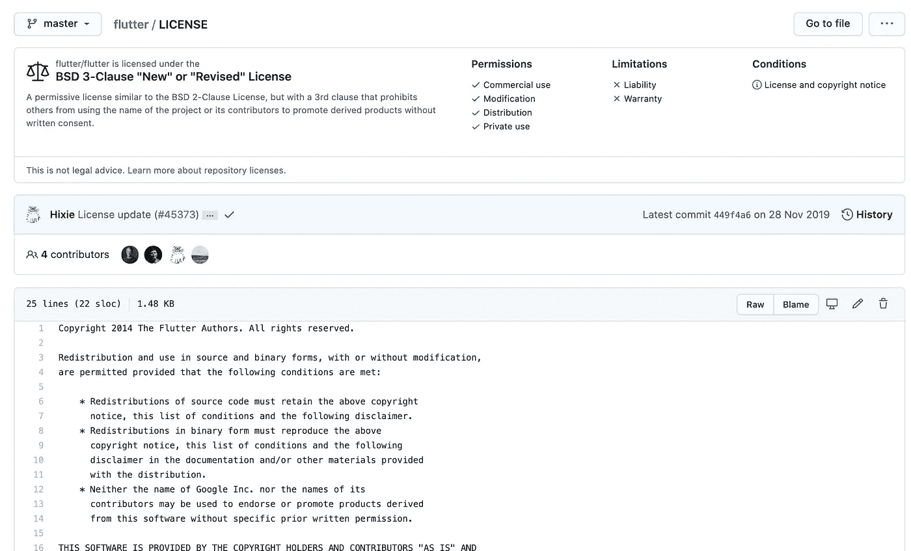
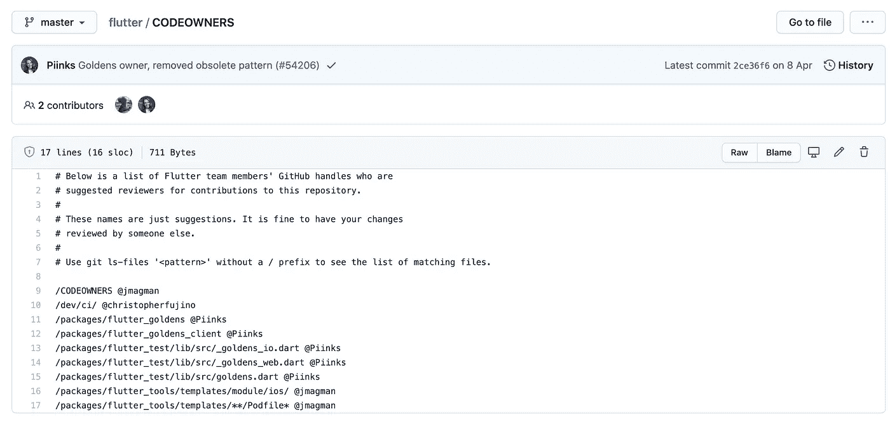
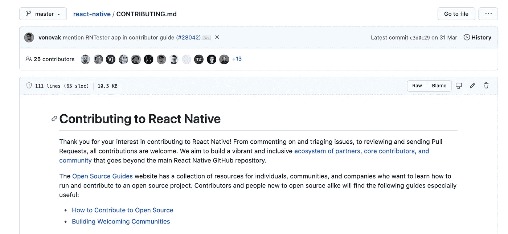
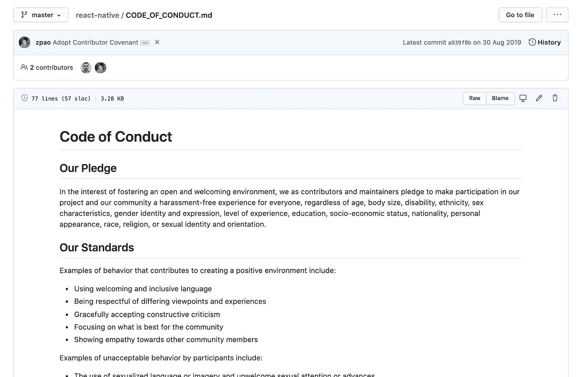
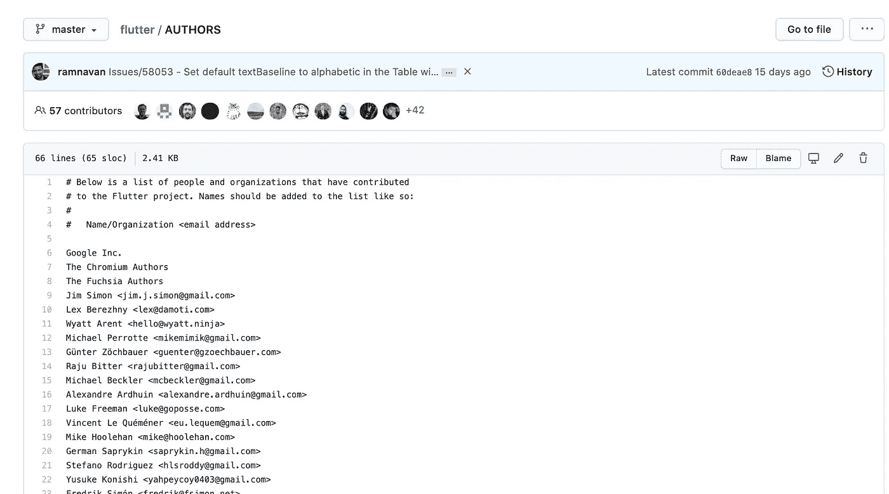

# 每个开源项目都应该拥有的 5 个文件

> 原文：<https://betterprogramming.pub/5-files-that-every-open-source-project-should-have-d75477796926>

## 从一开始，你的开源项目应该包括什么

由[哈契克·西莫尼安](https://unsplash.com/@khachiksimonian?utm_source=unsplash&utm_medium=referral&utm_content=creditCopyText)在 [Unsplash](https://unsplash.com/s/photos/open-sign?utm_source=unsplash&utm_medium=referral&utm_content=creditCopyText) 上拍摄的照片。

“开源”是现在科技行业的一个时髦词。越来越多的公司正在进入开源世界，包括像微软和谷歌这样的巨头，他们每年都在开源项目上投入大量资金。专家们最终意识到，这不是为了保护自己的代码不被他人窃取，也不是为了用有限的资源做出完美的东西。更确切地说，这是一种协作，带来更多你负担不起的头脑，反过来，加入更多的想法来创造一个完美的项目。

但是获得资金的开源项目数量仍然相对较少。最近，由于 GitHub 这样的公司，出现了许多支持社区并让更多人加入社区的项目。去年，我在我的国家参加了 GitHub 的正式发布活动，讨论的一个主要话题是如何鼓励这个由创作者和贡献者组成的社区。

在这篇文章中，我们将讨论一些你需要包含在你的开源项目中的东西，以使每个人——包括贡献者、版主、用户和赞助商——更容易帮助你发展项目。

# 1.许可证

许可证是开源项目的重要组成部分，因为它们大多是公开的，可以免费使用。对于任何忠于其名称的开源存储库，它需要有一个许可，允许其他人自由地使用、更改甚至分发项目。没有许可证是强制性的，但是没有许可证，版权法将适用于你的项目。所有的权利都将属于你，因此不允许人们重用、重新创建或共享你的项目。

创建许可证文件的最佳实践是在存储库的根目录下创建一个名为`LICENSE.txt`或`LICENSE.md`的文本文件。GitHub 官方推荐 [Choosealicense](https://choosealicense.com/) 了解哪个许可证适合你的项目。

官方 Flutter 库的许可。

# 2.自述文件

我知道在这个列表中添加一个自述文件听起来有些多余，但是这是每个开源仓库都应该拥有的最重要的文件。一个 [README](https://en.wikipedia.org/wiki/README) 文件在介绍和解释一个项目时起着重要的作用。它帮助人们理解项目是关于什么的，如何运行它，文档等等。READMEs 最常用的文件格式是 markdown `README.md`。

拥有一个好的自述文件可能是在项目海洋中获得关注与否的区别。马蒂亚斯的[页面](https://github.com/matiassingers/awesome-readme)列出了你写一个好的自述文件所需要的一切，包括例子、工具、徽章等等。

官方 Flutter 知识库上的 README。

# 3.代码所有者

定期的代码审查对于每个成功的项目都是必不可少的，但是在许多情况下，并不总是清楚谁需要审查什么。通过在项目中定义一个 CodeOwners 文件，存储库维护者可以定义负责做这件事的人。根据 [GitHub 的文档](https://docs.github.com/en/enterprise/2.15/user/articles/about-code-owners#):

> “当有人打开修改他们所拥有的代码的拉请求时，会自动要求代码所有者进行审查。”

任何拥有 admin 或 owner 权限的人都可以在存储库的根目录下创建一个名为`CODEOWNERS`的文件，同时记住被选为代码所有者的人或团队必须拥有对存储库的写权限。可以为整个存储库或特定的文件类型或文件夹定义代码所有者。例如，如果您为`*.js`文件添加了代码所有者，那么只有列在那一行的人会被要求审阅。

官方 Flutter 知识库上的代码所有者。

# 4.贡献的

开源项目都是关于贡献的。每个项目都是这样成长的。对于大多数接受积极贡献的项目来说，为贡献者制定一个指南总是好的，这样可以使他们和评审者更容易。这个文件将包含对任何想参与这个项目的人的指导。这可以包括很多东西，比如在哪里找到和跟踪问题、子项目、项目贡献的博客、编码指南等等。

要添加文件，创建一个名为`CONTRIBUTING` (不区分大小写)的文件，文件名为. md 或。txt 扩展名(可选)在根文件夹下或者`docs/`下*。*

在官方的 React 本地存储库上做贡献。

# 5.行动守则

行为准则是大多数团体或社区成员都会意识到的东西。在开源项目中，它也取字面意思。行为准则定义了如何在社区中进行互动和交流的最佳实践或指南。它将定义项目的社区标准，并包含包容所有贡献者的原则。它也可以是解决社区成员之间冲突的首选文件，有点像非官方的法律手册。它还可以定义管理项目的规则、法规和法律观点。

如果您想在项目社区中促进相互尊重、多元化和包容的文化，这是一个重要的文件。

您可以通过创建一个名为`CODE_OF_CONDUCT.md` *的文件来为项目添加行为准则。*这也可以通过使用 GitHub 中的“添加文件”选项来完成，在 GitHub 中您还可以找到行为准则的各种模板。

官方 React 本地存储库的行为准则。

# 奖金:作者

这不是必须的，但是在任何开源项目中都有它是很好的。这个文件包含了在某个时候对项目做出贡献的所有团队和人员的列表。这对任何贡献者来说都是一种额外的好处，他们的名字(org name)被列在存储库中，这使他们在技术社区中具有可见性。要添加这个文件，只需在项目中创建一个`AUTHORS`文件，并添加一种格式，以便在文件中使用注释来添加名称。

官方颤振知识库上的作者。

# 结论

您可能已经注意到，文章中提到的大多数指南都围绕着 GitHub。那是因为它是开源*发生的地方。*但是不管代码存储在什么平台，将这些文件放在存储库中都会有帮助。

如果您对存储库中包含的文件有任何建议，请在评论中提出。