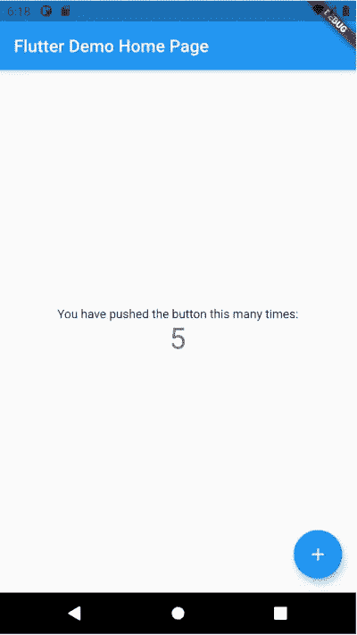
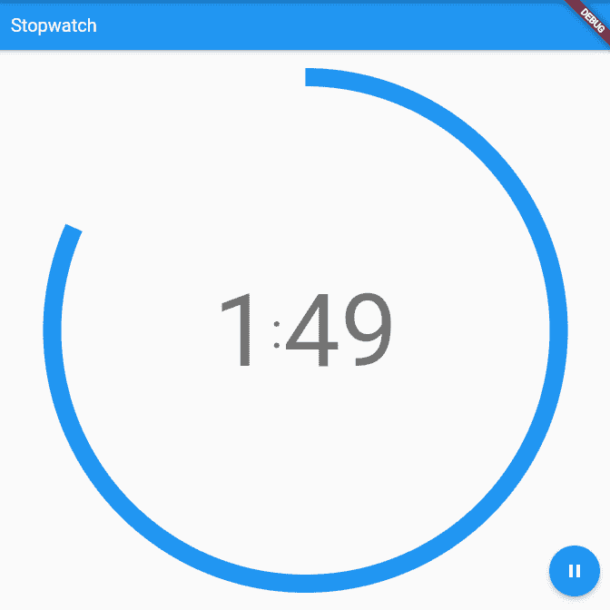
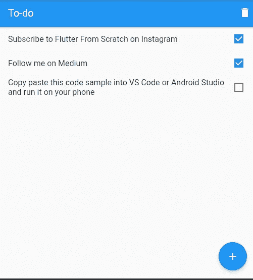

# 一个周末可以做的 5 个颤振项目

> 原文：<https://betterprogramming.pub/5-flutter-projects-you-can-do-in-a-weekend-7add10250eae>

## 带有完整的代码示例

由[真诚媒体](https://unsplash.com/@sincerelymedia?utm_source=medium&utm_medium=referral)在 [Unsplash](https://unsplash.com?utm_source=medium&utm_medium=referral) 上拍摄。

周末。这是家人和朋友聚在一起，享受社交，分享食物和欢笑的时刻。但是如果这就是你上个周末*所做的事情，那么这个周末*你可以推出一个简单的 Flutter 项目，要么开始使用这个框架，要么在其中做一些新的事情。**

我们应该做什么？让我们开始吃吧。

# 一个简单的计数器应用

*时间投入:30 秒(或运行* `*flutter create timer*` *)*

如果你以前用过 Flutter，你会觉得很熟悉。它实际上就是当你从 CLI 创建任何 Flutter 项目时得到的屏幕。尽管如此，这仍然是一个有价值的起点，最令人印象深刻的是，Flutter 演示*实际上做了一些事情*(不像其他框架只是抛出“Hello World！”冲着你)。这个简单的入门应用程序向你介绍了基本的颤振概念，比如一个`Scaffold`、`StatefulWidget`，以及颤振应用程序中的状态概念。如果您下载并设置了 Flutter SDK，您应该能够让这个示例应用程序在您的手机上运行。

当你运行这个应用程序时，一定要更改一些文本，点击“保存”，然后看着 Flutter hot 在你眼前重新加载你的应用程序。如果你决定在未来的项目中使用 Flutter，这个特性将为你节省数十个小时。

如果你想让它变得更难一点，也许你可以解决如何使用类似于`[shared_preferences](https://pub.dev/packages/shared_preferences)`的东西*保存*和*加载*计数器。

# 简单的秒表/计时圈

*时间投入:一天*

让 Flutter 成为如此棒的体验的部分原因是有大量预先存在的小部件可以帮助你创建你想要的应用程序。说真的，有很多，Flutter 团队在记录它们方面做得很好。他们甚至制作了简短的视频说明这些小工具是如何工作的。

它的美妙之处在于，你可以创建一个视觉上令人印象深刻的应用程序，而无需付出巨大的努力。例如，如果您刚开始使用像 Flutter 这样的框架，您可能会尝试创建一个秒表作为一个简单的项目。这个想法很简单——只是用户启动和停止计时器的一种方式。也许你会在屏幕上看到分钟和秒钟的显示，并对此感到高兴。

然而，使用 Flutter，因为有这么多视觉上吸引人的现成小部件，我们可以实现一个相当有吸引力的结果。例如，Flutter 提供了一个`[CircularProgressIndicator](https://api.flutter.dev/flutter/material/CircularProgressIndicator-class.html)`。这个小部件让我们在一个圆圈中显示操作的进度(顾名思义)。另一个名为`[Stack](https://api.flutter.dev/flutter/widgets/Stack-class.html)`的小部件可以让我们将小部件堆叠在一起。因此，使用这两个小部件，我们可以显示秒表和*的进度，并且*还可以通过显示我们在外面有`CircularProgressIndicator`的情况下一分钟走了多远来轻松添加一些视觉效果。像这样:

Flutter 的 API 让这种工作变得简单明了。我们计算从用户点击“Go”按钮开始已经过了多少秒，然后使用`.remainder`功能计算总秒数，计算出还剩多少部分秒。例如，如果已经过了 80 秒，那么在逻辑上就相当于写了`80.remainder(60)`，这样就给了我们 20 秒。如果我们将 20 除以 60，我们可以算出 20 秒大约是一分钟的 33%，并将其作为我们的`CircularProgressIndicator`的值。就这么简单。

我还准备了下面这个秒表应用程序的例子，向你展示我的意思:

 [## 秒表应用示例

镖靶](https://dartpad.dev/9c7d3da3ab831c7b90e43e7a04eed33f?null_safety=true) 

在这个例子中，整个应用程序有 130 行。所以你可以把它复制粘贴到 Android Studio 或 VS 代码中，它应该就可以工作了。以下是一些需要注意的事项:

1.  没有`setState`什么都不会发生。每当我们做一些改变 UI 的事情时，我们必须使用`setState`方法。因此，当我们播放或停止计时器，我们希望图标改变，我们调用`setState`。
2.  即使我们正在编写一个简单的应用程序，像`Scaffold`这样的东西给了我们一个带阴影的好看的应用程序栏。它还让我们指定一个浮动的动作按钮。

如果你正在寻找一个额外的挑战，你能想出如何添加一个*圈计时器*吗？为此，你必须使用一个持续时间列表(又名`<Duration>[]`)来存储之前的圈速，然后在主计时器下方的`Column`中显示这些时间。当我们更新持续时间列表时，我们必须在`setState`回调中这样做，以便更新 UI。

# 简单的待办事项清单

*时间投入:一天*

如今，保持有条理是很重要的，还有什么比保持一份即将到来的任务清单更好的方法呢？你将如何在 Flutter 中建立一个待办事项列表？

我们仍然使用一个`Scaffold`来处理我们应用程序根的外观，然后我们将使用一个`ListView`来显示任务列表。`ListView`接受一个参数“children ”,该参数接受一个小部件列表。这是我们将数据类映射到实际部件的地方，[就像这样](https://gist.github.com/lewcianci/f87bd3aa86d5ba14fe4321d5f1fa5425#file-main-dart-L57-L69)。更好的是，如果大量的孩子最终垂直高于设备的视口，`ListView`将自动为我们提供滚动功能。

我们还使用`showDialog`函数来激活我们的“新任务”窗口，并且我们处理该对话框的返回值以向我们的列表添加新任务。在这样做的时候，我们使用了 Flutter 自带的`AlertDialog`，有一个很好的背景阴影和合适的模态外观。它有 126 行，可以很容易地复制到您选择的编辑器中，您可以在手机上运行它来实现这一目的:

 [## 简单的待办事项列表

镖靶](https://dartpad.dev/f87bd3aa86d5ba14fe4321d5f1fa5425?null_safety=true) 

# 做出更好的选择

如果您已经到了这一步，并且已经将代码样本复制到您选择的编辑器中，并且进行了一些尝试，那么您可能会得出以下结论:

1.  做一些看起来不错，用起来感觉也不错的东西并没有你想象的那么难。简单的阴影、涟漪效果和材质工具让你的应用看起来质量很高。
2.  热装让你看起来很开心。
3.  业务逻辑(你的应用程序*做什么*)与用户界面(你的应用程序*看起来如何*)混合在一起。这使得测试变得不可能，或者非常困难。

我们应该解决第三点。这是真的:我们可以使用`setState`设计和构建一个完整的应用程序(甚至是相当复杂的应用程序),并自己管理应用程序的状态，但它迟早会变得一团糟。作为优秀的小开发人员，我们应该尝试编写可以测试的代码，这意味着我们希望将 UI 逻辑与业务逻辑分开。此外，我们希望确保我们的应用程序的依赖性可以在测试期间被模仿。

这就是为什么我们应该开始考虑使用像 bloc 模式这样的状态管理框架。

来源:[集团](https://bloclibrary.dev/#/)

老实说，你可能不会在周末学到集团模式。没关系，罗马不是一天建成的。学习如何通过使用 bloc 之类的东西来管理应用程序中的状态本身就很复杂，但这是理解如何构建可靠的 Flutter 应用程序所必需的复杂性。

如果你像我一样，你可能会回避这个提议。当你可以用 Flutter 在屏幕上画任何你想画的东西时，你到底为什么要学一些额外的*比如 bloc？你为什么要投资那个？同样，像我一样，作为一名全栈开发人员，我也从事 web 方面的工作，需要记住 API、身份验证和一整套不同的东西，将更多的信息推送到您的大脑中似乎非常没有吸引力。你在这篇文章中承诺你周末可以做的事情…现在我却要把它拖到下个周末？*

这是一种公平的感觉，但让我给你三个强有力的理由，为什么你应该在你的 Flutter 应用程序中使用 bloc。

## 远离手动 setState 调用

通常，您通过`setState`控制 UI 的更新。这没有什么错，但是每次你调用这个函数，你都是在告诉 Flutter 重画那个特定的小部件。它这样做是没有歧视的，所以它可以开始将 jank 引入你的应用程序。

Bloc 向我们介绍了页面(或视图)中*平等*的概念。某个小部件的可视层由状态表示，当小部件的状态改变时，bloc 库告诉 Flutter 重新绘制那个特定的小部件。如果状态没有改变，就不会导致重绘。这就把思维从“按下这个按钮时重绘”转变为“当屏幕上的信息改变时重绘”

当用户点击一个按钮时，一个新的事件被发送到特定小部件的块中。你可以在集团内部执行正常的业务逻辑，然后你会产生一个新的状态。在幕后，bloc 将新状态与旧状态进行比较，如果有变化，它会更新 UI。

## 测试变成了一种乐趣

如果你想开发下一个价值百万美元的手机应用，那么最终，你需要为你的应用编写测试。当那一天到来时，如果你只是在你的应用程序中使用`setState`，你可能会被迫使用完全集成测试来检查你的应用程序是否正常工作。这意味着将应用程序安装到模拟器或设备上，告诉测试驱动程序点击什么按钮，然后检查设备上拍摄的屏幕截图是否与文件上的匹配。

不要误解我的意思，这些类型的集成测试有他们的位置。但是有了 bloc，你可以测试你的 bloc*的逻辑操作，而不需要*启动并运行完整的 UI。因为您将事件发送到一个 bloc 中，并且您知道预期的状态，所以它变得像您的测试用例将事件发送到您的 bloc 中并预期某个结果一样简单。

## 这个社区太棒了

所有与集团相关的事情都有一个不和谐的渠道，甚至费利克斯(最初创造了`flutter_bloc`模式的家伙)也不时出现在那里。在这些环境中，体验会有所不同。毕竟，人们在业余时间支持这些免费的图书馆。但我对现有的支持印象深刻。为了证明这一点，有一次，我在自己编写的应用程序中遇到了一个测试问题。我在频道中询问了此事，Felix 实际上下载了我的代码，修复了问题，[并提交了一个 pull 请求](https://github.com/flutterfromscratch/sonder/pull/1)。

这种现象的严重性是巨大的。这个家伙不仅花了无数个小时*开发* `flutter_bloc`，而且他还帮助一些随机的开发者(我)免费修复了我有*的一个问题*。太不可思议了。

# 使用 flutter_bloc 的示例项目

*时间投入:3-4 个周末*

bloc 网站上提供了一些示例项目，可以帮助您在接下来的几个周末理解 bloc 模式。

你用`flutter create`得到的[无处不在的计数器应用](https://bloclibrary.dev/#/fluttercountertutorial)是用 bloc 模式创建的，令人兴奋的是增加了一个“subtract”*按钮。这些教程更深入一点(意味着你不能只是将代码复制粘贴到你的编辑器中)，但是有一个很好的理由。他们向你解释正在发生的事情，并在此过程中教会你集团模式，这很好。*

*还有一个用 bloc 模式编写的天气的[应用程序，它也展示了如何为你的 Flutter 应用程序制作一个有吸引力的 UI，以及像拉刷新和简单表单使用(用于文本框等)这样的功能。同样，应该遵循本教程，因为它向您解释了如何使用 bloc 包的一些更高级的功能。](https://bloclibrary.dev/#/flutterweathertutorial)*

# *享受你的周末*

*自 2018 年底稳定以来，Flutter 的受欢迎程度急剧上升。现在是最好的时机参与进来，开始创建一些简单的应用程序，然后将这些应用程序部署到您的手机上进行测试。还有一个从零开始的[Flutter](https://www.instagram.com/flutterfromscratch/)账号(声明:这是我的)，分享如何创建最好的 Flutter 应用程序的简单技巧。*

*希望我已经激发了你去检查 Flutter out，并且展示了一个简单的方法来开始使用这个框架。这是真的:状态管理的东西会让事情变得有点复杂，但是如果你选择长期使用 Flutter，这是一项值得的投资。*

*那么，你要建什么？*