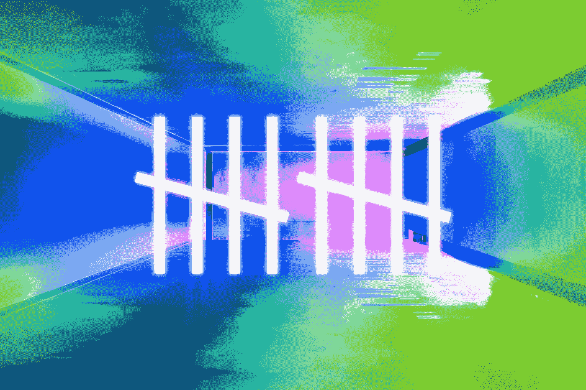

# 5(更多)代码规则

> 原文：<https://betterprogramming.pub/5-more-rules-of-code-176dda6774b4>

## 另外五件事让你的开发者生活更容易、更理智、总体上更愉快

[埃菲社库尔纳兹](https://unsplash.com/@efekurnaz?utm_source=unsplash&utm_medium=referral&utm_content=creditCopyText)在 [Unsplash](https://unsplash.com/s/photos/abstract?utm_source=unsplash&utm_medium=referral&utm_content=creditCopyText) 上的原始照片

基于第一个"[代码的 5 个规则](https://medium.com/better-programming/5-rules-of-code-6970a55a444b)"的巨大成功，这里有你应该试着遵守的另外五个规则。我的意思是，除非你喜欢做困难的事情，那么，尽一切办法，继续下去。

# 1.经常提交，总是推动

正如我们在前五条规则中提到的，您应该在存储库中使用 Git 分支。

我的首选策略是拥有短命的特性分支——把它们想象成沙箱。不管沙盒变得多么杂乱无章，只要所有的沙子都留在沙盒里，每个人都开心。

对于特性分支，只要合并回主干的代码是干净的，并且通过了代码审查，那么提交多少次、文件更改多少次、重构多少次都没有关系。

这意味着你没有借口去犯最大的错误:没有足够经常地承诺和推动你的改变。

电脑是很挑剔的东西，它们做奇怪的事情，有时这些奇怪的事情会让你丢失所有的数据。它发生了，这就是生活。

这就是为什么你应该总是备份你的数据。这就是为什么每次出现中断时，你都应该*明确地*提交并推进你的代码。

起床去喝一杯？提交和推送。去洗手间？提交和推送。死于心脏病？呼叫 9–1–1，然后提交和推送。

除非销售部的 Greg 过来把一大杯 Baja Blast Mountain Dew 直接倒进你的笔记本电脑，否则没有理由丢失未提交的代码。

即使这样，如果你看到格雷格第二次来，你最好在他到你桌子前打完字。

# 2.(对会议)说不就行了

还记得你刚到公司时，人们还不知道你是谁吗？还记得你没有因为“你可能需要出席”而不知不觉地增加到一天 17 个会议吗？

很棒，不是吗？你有*时间*。是时候坐下来敲敲键盘，敲敲功能和测试了，就像按功能付费一样。

但是，唉，自由的夏天已经让位于没完没了的会议的冬天。现在你的日历看起来就像一个喝醉的奶奶在喝了几杯桃子杜松子酒后缝起来的拼布被子。

状态会议、计划会议、为每周会议做准备的会议、一对一会议、站立会议、培训会议、回顾会议、全体会议——这变得有点可笑，不是吗？你需要学会说*不*。

对于每一次会议，每一个电话，每一次浪费时间，你都需要问自己或组织者:“我真的需要 T2 吗？”

也许你和你的经理都被安排在会议上，或者你在那里“以防万一”，或者这是一次全体会议，讨论几天前在更大的全体会议上发生的事情，结果应该是一样的:不要去。

你的时间，不管公司愿不愿意意识到，都比坐在会议上谈论*什么都不是更有价值。相反，你应该把时间花在能让你拿到薪水、表面上能让公司赚钱的事情上。*

有一天，我的一个朋友提到，会议应该有一个价格标签，显示会议在工资和收入损失方面花费了多少钱。我有一种感觉，如果是那样的话，大多数会议都不会召开。

就说*不*。

# 3.质量>数量

在软件工程中，数量并不意味着什么。只要代码是正确的，行数并不重要。存储库中工程师或文件的数量也无关紧要。

重要的是质量。事情是否每次都按照预期的方式工作，或者工程师是否产生了工作的、可测试的、文档化的代码？

你的一个工程师不是一周工作 40 小时，但仍然以某种方式达到他们所有的目标吗？数量不重要。重要的是工作、时间和代码的质量。

# 4.让你的依赖保持冷静

软件工程是一个独特的职业。工作有半衰期的人不多。冰雕师、人体蜡像师和开发者都目睹了他们的工作被熵所取代。

对于开发人员来说，很多不稳定和混乱是以依赖的形式出现的；随着时间的推移，它们会随着功能的添加和删除或者缺陷的引入而发生变化。

函数签名改变，API 中断，端点被重命名，存储库移动。一切都变了。

在我开发的早期，我主要在 Fedora Linux 上用 Node.js 编写。因为 Fedora 是一个前沿发行版，所以变化是一个常数。每当我启动我的机器时，软件包都需要更新。

过了一段时间，我的项目停止了工作，每次我更新一个依赖项或升级一个系统包，我都必须回去修复版本之间的任何重大变化。

这变得令人疲惫不堪，我的大部分时间都花在了维护我已经写好的代码上，而不是开发新功能。最终，我放弃了 Node 和 Fedora，选择了 CentOS，回到了 Python 的家。

把我当作一个警示:无论何时，你都必须冻结你的依赖。依赖冻结有两种主要方式:版本锁定和出售。

## 版本锁定

版本锁定是当你告诉你的软件包管理员(无论是`pip`或`npm`或`cargo`或其他什么)你想要安装的每个软件包的确切版本。

虽然这仍然依赖于软件包管理器能够找到并下载该软件包，但现在您可以防止发布新的软件包版本并破坏您的所有代码，如果您每次只安装最新版本，就会发生这种情况。

但是，正如我已经提到的，版本锁定依赖于外部服务来维护。

## Vendoring

第二种方法是售货。当您将依赖项(包括代码和所有内容)打包到应用程序中时，您就“出售”了它们。

在 Python 中，这可能包括将`psutil`作为源代码的一部分，这样你就不必在部署时安装它，或者在[中运行`go mod vendor`将所有依赖项复制到项目中的`vendor`目录。](https://golang.org/)

因为您将应用程序运行所需的所有代码打包在一起，所以它不再依赖于任何外部资源。

这样做的不利之处是，您的存储库变得非常臃肿，这违背了许多语言的许多“最佳实践”。

# 5.必须把他们分开

应用程序需求会随着时间而变化。数据库发生变化、被弃用、被 Oracle 收购或变得不适合使用。也许你正在迁移到 AWS，想要使用 [RDS](https://aws.amazon.com/rds/) 或者想要从 [Microsoft SQL Server](https://www.microsoft.com/en-us/sql-server/default.aspx) 跳到 [PostgreSQL](https://www.postgresql.org/) 。

无论是哪种情况，更改数据库都不是一项简单的任务。但是，通过将应用程序逻辑与数据库逻辑分离开来，创建一个从业务逻辑中抽象出特定于数据库的特性的数据访问层，可以降低复杂性。

从路由处理程序中调用数据库太容易了，尤其是在编写 HTTP API 时。现在打电话可能很容易，但将来你会后悔的。

如果您决定在生产中使用 PostgreSQL，会发生什么情况？还是`mysql`库换了个接口？

现在你必须回去在 1000 个不同的地方重构你的代码。这也违反了不必要时不重复代码的 DRY 原则。那么，你应该怎么做呢？

抽象一切。编写一个位于应用程序逻辑和数据库逻辑之间的数据库层来处理所有事情。

因此，现在，当您需要更改访问数据的方式时，您只需要更改数据访问层中的一两个地方，而不是实际的应用程序逻辑。

为数据库操作编写通用接口不仅允许您用更少的时间投资来更改数据库，而且现在您可以做诸如生成查询时间度量或创建虚拟“视图”之类的事情。

好消息是，如果你使用像 [Spring](https://spring.io/) 这样的框架，这个功能已经是内置的了。任何好的 ORM 都应该允许你切换数据库。

对于 Go，`[gorm](https://gorm.io/)`允许您在本地使用 [SQLite](https://www.sqlite.org/) 进行测试，如果您想使用“真正的”数据库，可以使用 MySQL、PostgreSQL 或 Microsoft SQL Server 之一。

Python 的`[peewee](http://peewee-orm.com)`支持 SQLite、MySQL、PostgreSQL 和 [CockroachDB](https://www.cockroachlabs.com/product/) ，这是一个非常棒的小软件包。

# 结论

我错过什么了吗？如果/当有下一期文章时，你还想看到其他的代码规则吗？不同意什么？请在评论中告诉我！