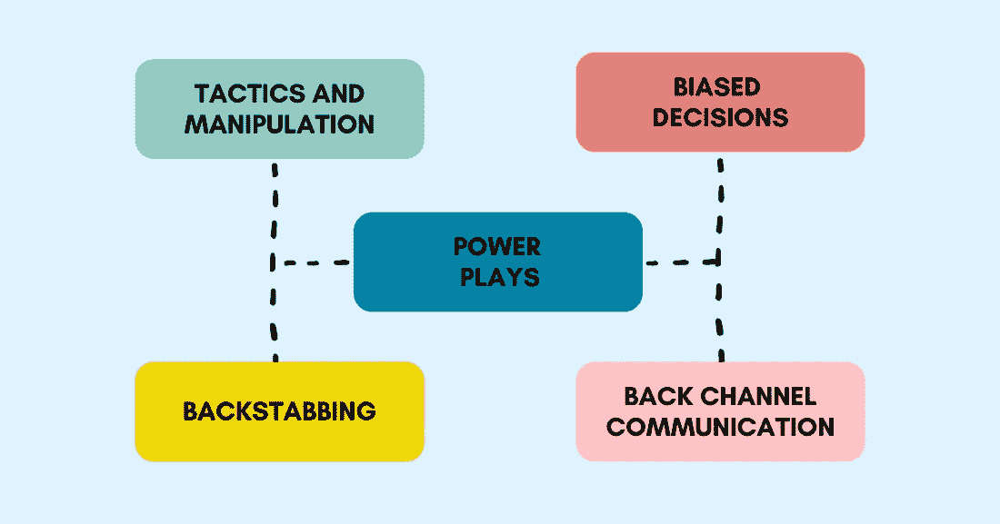

# 不耍手段在工作中取得成功的 5 个有力步骤

> 原文：<https://betterprogramming.pub/5-powerful-steps-to-get-ahead-at-work-without-playing-dirty-f0f1fda44681>

## #2 实践战争的艺术

鸣谢:作者

我艰难地认识到，取得成功的秘诀不仅仅是做好工作；它还需要驾驭办公室政治的能力，不是以不真诚或操纵的方式，而是作为一种更好地处理组织内部政治的技能。基于逻辑和理性，你根本赢不了人。

作为亲身经历过的人，我天真地忽略了这一点。有魅力的团队成员会当着我的面说一件事，而向我的老板透露另一个版本，人们会毫不犹豫地改变立场以取悦他人，老板有个人喜好，人们如此关注自己的成长，以至于他们不在乎自己的态度和行为如何影响他人。我想我的作品会说明一切。回过头来看，显然没有。

让我实话实说。对于外行和没有准备的人来说，办公室环境可能是残酷的，尤其是当人们从事一些没有成效的行为时，比如他们刻薄、[有毒、](https://www.techtello.com/contributing-to-toxic-work-environment/)以及做或说一些让他们无法专注于真正的工作和实际工作表现的事情。

工作中的个人动机会让人做出不良行为。当你周围的人花大部分时间推进他们的职业生涯或提升他们的自尊时，办公室政治对每个经历它的人来说都会变得肮脏和令人不快。

你可能正在经历的一些明显迹象是:

1.  推进自己的政治议程的策略和操纵。
2.  有利于某一群人的有偏见的决定。
3.  人们在你背后说三道四，参与制造低效率和不良情绪的流言蜚语。
4.  当事情不顺利时，背后捅刀子的人会把你推到公共汽车底下。
5.  权力是为了在某种情况下获得优势。
6.  人们选择零和游戏的心态，而不是每个人都可以从更大的馅饼中分得一杯羹的富足心态，在这种心态下，他们感到你的成功对他们构成了威胁。你的胜利是他们的损失。
7.  利用非正式的关系网来打击你。
8.  忽视和漠视你所有的好工作，而对那些工作远不及你的人着迷，这显示了你的偏见。
9.  指责你[的错误](https://www.techtello.com/learning-from-mistakes/)来保护自己的自尊。
10.  与老板意见相左或给她任何反馈都会带来麻烦。

我们大多数人都很难处理它，因为我们不知道如何玩这个游戏。当其他不太称职的人不断获得晋升，我们理由充分的建议被老板忽视，我们不断错过向领导层陈述的机会，一些不太称职的人仅仅因为接近决策者而获得项目，我们的想法遇到阻力，或者当其他人在我们背后窃窃私语时，我们会如何反应？

我们回应说“这是政治扯淡。我不玩这种无聊的游戏。我已经出局了。”我们将办公室政治描述为肮脏、操纵和邪恶。我们用愤怒和沮丧来发泄我们受伤的感觉，然后选择走捷径，完全忽略它。

政治斗争似乎是浪费时间。但是对你周围发生的事情视而不见不会让问题消失。所有的戏剧都会耗尽你的精力，耗尽你的生命。听之任之，办公室政治不仅对你的职业不利，还会损害你的个人幸福。你越是告诉自己这件事不困扰你，它就越能伤害你。把它归类为对或错，好或坏并没有真正的帮助。有用的是看看自己独特的情况，想办法处理。

下面列出的策略不会让你的问题消失，但是在实施它们之后，你将更有可能从事积极的行为，而不是让你周围的消极情绪吞噬你。

# 管理办公室政治的 5 个步骤

## **1。不要陷入狭隘的视野**

如果你认为你的想法是最好的，或者你有一个绝对值得投资的建议，但是这个决定对你不利，该怎么办？您可能会以下列方式之一做出反应:

*   有一段时间感到失望，甚至可能不同意这个决定，但最终，还是接受了。
*   批评决策者没有资格看到正确的事情。
*   宣布这是一个政治举动。

仅仅因为你不同意某事，因为事情没有按照你的方式发展，或者因为它不符合你的期望，就给它贴上政治标签，这并不意味着它是政治的。感到悲伤，表现出防御，或者沉思也没有帮助。你需要学会看清事物的本来面目。

> “当我们来自一个判断的地方，我们会陷入自己的世界观。当我们来自一个充满好奇心的地方时，我们拓展了可能性的范围。”
> 
> — Mary Abbajay，“向上管理:如何升职，如何在工作中获胜，如何在任何类型的老板面前取得成功”

如果决策者既不是政治上的，也不是不合格的，而是非常谨慎地做出这个决定的人呢？也许你缺乏背景来看清他们能看清的东西。也许你没有足够的经验来做出正确的取舍。也许你太专注于自己的想法，以至于最终忽略了其他有价值的想法。

做决定的人可能是政治人物，但假设他们是政治人物并不是一个好的起点。即使事情对你不利，看清事情的本来面目也是有价值的。有用的是提出问题来改变你的想法:

*   决定是如何做出的？考虑了哪些因素？你可能遗漏了什么信息？
*   他们的行为符合组织的最佳利益吗？即使有其他更好的选择，决策是否有利于少数人或特定利益？
*   你信任他们吗？
*   你相信他们的能力吗？

如果你信任这个人和他的能力，并且相信这个决定对公司来说是正确的，不要把这个决定看做是针对你个人的，而是继续前进。即使受伤也要支持他人，这是最好的合作方式。

相反，如果这个决定带有毒性，如果这个举动确实是政治性的，并且这种经历一遍又一遍地重复，那么是时候采取下一步行动了。

## 2.实践战争的艺术

当这是一个人或特定人群的政治行为，而不是组织的整体文化时，你就会陷入一场小战斗。

当组织的文化本身促进办公室政治时，就没有希望了。除非你是首席执行官或有权力的人，否则你无法真正抹去一家公司的文化。你会遇到越来越多的能量吸收者，他们会增加你的压力和焦虑。没有人有足够的情感带宽来应对充满政治色彩的环境中的起起落落。这根本不值得你花费时间和精力。在它开始影响你的生活之前，考虑采取行动。

然而，在与一小群人打交道时，你可以采用一些特定的策略。显而易见的是，如果有可能从你的生活中除掉这样的人，那就换个团队。但是，如果这不是一个选项呢？

观察他们一段时间，注意这是他们对其他人的行为方式，还是只有你这样？

*   他们玩办公室政治的普遍态度可能是他们缺乏自我意识，或者是一个根深蒂固的行为问题。
*   然而，如果只是你，他们可能持有个人偏见或怨恨。在后一种情况下，你能做的最好的事情就是和他们进行坦率的讨论。也许只是一个误会，可以通过公开表达你的关心来解决。告诉他们你的观察结果，并邀请他们分享他们的观点。老实说，这可能行得通，也可能行不通。他们可能对恢复关系持开放态度，也可能进一步关闭关系。你至少可以尝试，而不是希望冲突会神奇地变好。

很可能，不战而胜，或者更好的是，根本不用担心赢。当你放下戒心，当你不再对周围的消极情绪做出反应时，其他人可能不会找到参与办公室政治的好理由，尤其是如果这意味着人身伤害的话。你可以解除他们的武装。

我不是要求你对周围发生的事情视而不见，而是简单地选择让它过去一段时间，看看它是否会导致他们行为和行动的改变。

> “你选择让事情困扰你。你可以很容易地选择不去注意这个令人恼火的冒犯者，认为这件事微不足道，不值得你关注。这是强有力的举措。你没有反应的事情不会把你拖进一场徒劳的战斗。你的自尊没有被牵扯进来。你能教给一只讨厌的小昆虫的最好的一课就是忽视它，让它被遗忘。”
> 
> —罗伯特·格林，“权力的 48 条法则”

通常放手比听起来要难，尤其是当它打击到你个人的时候(下一节会有更多)。体验总是一种情感体验。但是沉思、[批评](https://www.techtello.com/how-to-deal-with-criticism/)，或者以其他方式感到失望或气馁也不会有所帮助。

你需要尝试不同的策略，从经验中学习，并在它们不起作用时实施更多的策略。学会接受和处理你的处境，或者让自己出去。

## 3.看看你的影响圈

你控制着什么？确定你还能做什么能让你前进，而不是绝望地回头看。

每当你对办公室政治感到不舒服时，问问自己这些问题:

*   为什么它让我如此困扰？
*   这对我有什么影响？
*   如果我不再担心会发生什么？

不是所有的战斗都值得去战斗，只有那些对你来说重要的战斗才值得。有些不公正太大了，不能忽视——它们会阻止你在组织中成长，或者成为你实现目标的障碍。为每个问题烦恼和争吵对你没有任何好处。

扑克里有句话说的好，知道什么时候握牌，知道什么时候弃牌。有时候，大声说出并表达你的不同意见是很重要的，而在其他时候，最好保持沉默。小心选择你的战斗。

> "因此，在你所有的战斗中去战斗和征服并不是至高无上的卓越."
> 
> —孙子《孙子兵法》

要知道什么时候该采取行动，什么时候该放手，写下他们的行为让你感到紧张会有所帮助。然后把它分解成那些一开始可能会困扰你，但对你的生活没有任何意义的事情，以及那些直接伤害你的事情。当你最需要积极的行为时，学会将这两者分开会是一个强大的动力，而不是一直被消极所困扰。

你控制着什么？你能做些什么改变？有没有一种不同的策略可以让你到达你想去的地方，或者可以让你暂时从困扰你的事情中转移一点注意力？

*   如果你因为不久前观察到的办公室政治而难以集中注意力，散散步让头脑清醒一下，喝杯咖啡，或者听听音乐，哪怕只有五分钟。
*   如果你的想法一直被拒绝，下次试着在会议开始前和其他人接触，检查你的想法。随着许多人发言支持你的想法，决策者很可能也会放弃。

## 4.掌控你的成功

大多数情况下，是你的老板为你的未来做出关键决定，并有权力影响你的职业生涯。与他们一起定义成功对他们和你意味着什么。确保你们有一个共同的定义。

有了这些，主动向上管理。不要试图取悦他们或参与任何政治行为。只需更好地准备用事实陈述你的案例:

*   围绕你的工作创造能见度。利用一切机会展示你是如何为他们的成功做出贡献的。
*   从组织中的其他高级人员那里获得书面反馈。
*   安排[一对一会议](https://www.techtello.com/one-on-one-meetings/)以寻求反馈。不要留下任何惊喜。如果可能，请他们也以书面形式发送反馈。

> “自我推销是一种领导力和政治技巧，掌握这种技巧对于驾驭职场现实、为成功做好准备至关重要。”
> 
> —邦妮·马库斯(Bonnie Marcus)，《晋升的政治:高成就女性如何获得成功并保持领先》

你没有伤害任何人，也没有试图通过更好地控制自己的成功来获取不正当的利益。

## 5.以一年为视角

大多数时候，我们为一些小问题烦恼，而这些小问题在更大范围内并不重要。当我们回顾和思考它们时，我们意识到如果我们能更好地看待我们的处境，我们可以节省多少时间、精力、压力和焦虑。

此刻看起来像座山的东西，一年后可能会变得像颗痣。是的，我们确实夸大了生活中的事件，尤其是当我们正在处理这些事件的时候。但是从一年的角度来看我们的情况可以帮助我们看清它的本质:

*   一年后这对我重要吗？
*   想想你的目标。这种情况会妨碍我实现目标吗？
*   最重要的是，我是否相信自己能在这家公司发展壮大，还是形势对我不利？

这一年的观点将帮助你决定什么时候继续战斗是有意义的，什么时候是时候最终离开。

# **总结**

1.  学会驾驭办公室政治是在任何工作场所取得成功的关键技能。做伟大的工作是不够的。
2.  对你组织中的政治视而不见是没有帮助的。如果不处理，压力和焦虑会影响你的个人健康。
3.  对你不利的分歧或决定不一定是政治举动。
4.  有时，通过不对你周围的消极情绪做出反应，你可以阻止其他人参与政治行为。
5.  选择正确的战斗去战斗。放下不太重要的小问题。
6.  与你的经理一起定义你的成功，并利用每一个机会展示你的成就，从而掌控你自己的成功。
7.  用一年的视角来确定别人的行为对你在组织的未来有多大的伤害。你应该留下还是该离开了？

在这里注册我的免费简讯。

*原载于 2021 年 6 月 10 日*[*【https://www.techtello.com】*](https://www.techtello.com/office-politics/)*。*