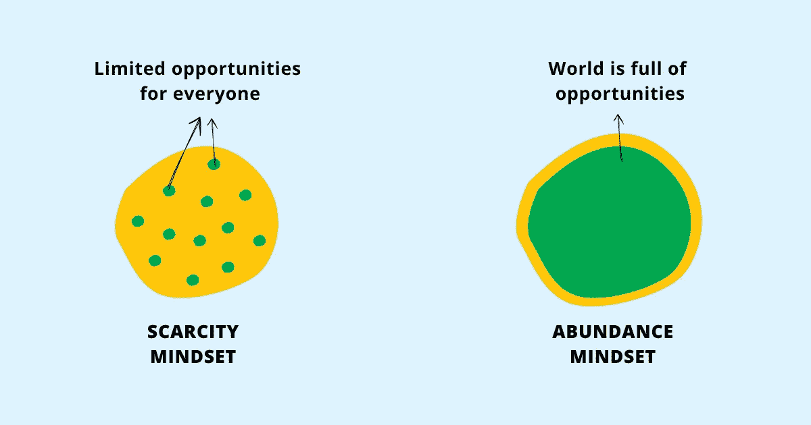

# 从匮乏到富足心态转变的 5 个实践

> 原文：<https://betterprogramming.pub/5-practices-to-shift-from-scarcity-to-abundance-mindset-d8bf717aac1c>

## 不要把世界看成一个有限的馅饼，而是把它看成一个无边无际的海洋，每个人都有足够的食物

鸣谢:作者

促销数量有限。

有限的加薪。

领导高知名度项目的机会有限。

能领奖的人数有限。

以这种方式思考会让*赢得*在公司的说法中等同于击败别人。为了让你成功，别人必须失败。为了让你得到你想要的，其他人必须得到更少的他们想要的。

当你的思维被限制在有限的范围内思考时，它就无法想象选择的广阔性。

你目前的工作很糟糕，但你发现自己一直在想，“好工作不多。”

你的薪水越来越少，但却拒绝要求加薪，并认为“只有少数人可以获得加薪，我不是其中之一。”

以这种方式思考会让一切都显得稀缺——机会、经历和资源都很有限。稀缺心态导致一种输赢心态——你觉得有必要急着去你想去的地方，同时担心其他人可能会更快到达。

在他的书《有效人士的 7 个习惯》中，斯蒂芬·R·科维将稀缺心态比作这样一种信念，即生活是一个有限的馅饼，只有这么多钱、成功和好运气，如果有人拿走了大块馅饼，留给你的就更少。相信有限的馅饼不仅限制了你的选择，也限制了你能取得的成就。

然而，并不是每个人都这样想。那些认为世界很富足的人会因为知道每个人都有足够的机会而感到安慰。他们不会匆忙做出决定，而是根据自己的价值观和想要的生活做出深思熟虑的选择。

富足的心态也促进了双赢的心态——如果每个人都有足够的东西，就没有必要去比较和竞争。你不需要推倒别人来提升自己。你可以得到你想要的，而不需要从别人那里分一杯羹。

用稀缺心态或富足心态思考不仅限于工作；它延伸到你如何对待一切——朋友、家庭和生活中的其他关系。为了在生活中取得成功并追求你渴望的东西，你需要通过用无限的可能性和无限的选择来看待这个世界，从而将打开你的思维迎接新机会的行为和实践结合起来。当你不再局限于自己的局限和约束之内时，你就不再把这个世界看作一个有限的馅饼，而是把它看作一个无边无际的海洋，每个人都有足够的食物。

# 稀缺心态和富足心态的主要区别

## 稀缺心态充满了悲观的想法

一个有稀缺心态的人:

1.  通过关注消极面来考虑一种情况的局限性。
2.  带着受害者的心态，指责他们无法控制的事情，这增加了压力、担忧和不作为。
3.  把他们的精力花在他们生活中缺少的或不起作用的东西上。
4.  认为永远都不够，这导致沮丧、无能为力、愤怒、焦虑和恐惧。
5.  消极的态度会挫伤他人的积极性，耗尽他们的精力。
6.  拒绝与他人合作或分享荣誉。
7.  目光短浅，经常规避风险。
8.  发现很难信任他人，默认为怀疑。
9.  表现得像一个索取者，总是期望从别人那里得到更多。
10.  通过与他人比较来建立自我价值感。

## 富足心态充满了乐观的想法

心态丰富的人:

1.  通过关注增长和改进领域来考虑机会。
2.  [通过承担责任来控制领导](https://www.techtello.com/how-to-take-control-of-your-life/)，这激励他们自信而清晰地行动。
3.  通过灵活地适应环境，把他们的精力花在新的可能性上，这样他们就能看到别人看不到的机会。
4.  思考挑战和成长。两者都让他们感到被授权和参与。
5.  拥有积极的态度，能够激励他人表现出色。
6.  通过分享知识和成功与他人良好合作。
7.  胸怀大志，勇于承担风险。
8.  [以信任为先导](https://www.techtello.com/leading-with-trust/)首先关注关系并建立融洽关系。
9.  作为一个给予者，为他人的幸福做出贡献。
10.  通过与自己的理想自我进行比较，建立自我价值感。

# 利用这 5 个实践，从稀缺心态转变为丰富心态

## 1.认识到可能性，而不是局限

> 你的成功取决于你的信念——大卫·施瓦茨

你认为可能的事会限制你的成就。虽然稀缺心态会阻碍你的梦想，让你满足于你的愿望不切实际的假设，但富足心态会让一切看起来触手可及。

从长远角度出发。想象自己平静而自信，过着你想要的生活。将你的渴望投射到未来:

*   你如何看待几年后的自己？
*   那个人在做什么？
*   那个人必须表现出什么样的行为和特征才能达到现在的位置？
*   你如何将这些行为和态度融入你的日常生活？

[胸怀大志的能力](https://www.techtello.com/thinking-big/)是打破自我设限的泡沫的第一步，引导你的精力去探索一个更大更好的未来，并规划出前进的道路使之成为可能。胸怀大志决定方向。要取得进步，一路上迈出微小的一步，重新评估你的策略，重新考虑你的选择，并调整和适应。

思维和行动的灵活性可以带您走得更远、更远，还可以带来更多的选择、更多的选择和更多的资源。

## 2.专注于学习，而不是证明

在我的书《提升你的心态》中，我解释了心态固定的人(那些认为智力和能力是固定的人)更关心证明自己聪明，而不是学习新的东西。他们没有培养新技能，而是努力隐藏自己的缺点。

稀缺心态利用了同样的固定心态思维。您做出决定时坚信:

*   每一个错误，每一次失败都会减少我的选择，因为一切都变少了。
*   为了得到我想要的，我需要隐藏我的不完美。
*   如果我不证明我的聪明，我就会被落下。

[专注于证明](https://www.techtello.com/leadership-is-about-growth-not-brilliance/)而非学习会让你更难掌握应对生活中的挑战和障碍所必需的技能，当它们出现时，你会更难应对。不具备驾驭复杂生活的技能会进一步强化这些负面信念。

要以丰富的心态领导，通过问以下问题来改变你的思维模式:

*   你能从这种情况中学到什么？您如何提高？
*   你需要什么新技能？您如何构建它们？
*   你的错误和失败教会了你什么？您如何运用这些知识向前推进？

以这种方式思考会让你的思维从关注你的缺点转变为承认你的优势，从你不知道的事情转变为你拥有的技能，从把挑战视为障碍转变为把它们视为新的机会。

## 3.一起成功，而不是单独

> 怨恨就像喝了毒药，然后希望它能杀死你的敌人——纳尔逊·曼德拉

生活在匮乏的心态中，就是生活在纳尔逊·曼德拉所描述的同样的怨恨和嫉妒中。当你从与他人的比较中获得自我价值感时，你永远不会感到满足。总有人比你做得更好。感觉就像一次无止境的过山车。

艾米·莫兰在她的书《精神坚强的人不做的 13 件事》中描述了怨恨他人成功的六个问题:

1.  你会停止专注于自己的成功之路。你花在别人的成就上的时间越多，你为自己的目标努力的时间就越少。
2.  你永远不会满足于你所拥有的。如果你总是试图跟上其他人，你永远不会对你所拥有的感到平静。
3.  你会忽视你的技能和天赋。你花越多的时间希望自己能做别人做的事情，你花在提升自己技能上的时间就越少。
4.  你可以放弃你的价值观。当你对拥有你所没有的东西的人充满愤怒时，你很难坚持自己的价值观。
5.  你可能会破坏关系。当你心怀怨恨的时候，你就不可能和一个人保持真实的关系。
6.  你可以开始自吹自擂了。你可能会吹嘘自己，或者干脆对自己的成就撒谎。

不要因为别人取得的成就而怨恨他们，而是用他们的成就作为鼓励和激励，告诉他们同样的成功也在你的能力范围之内。不要将他人视为你的竞争对手并试图击败他们，而是将他们视为你的团队:

*   他们有哪些你所缺乏的知识？
*   需要建立哪些技能？你需要具备什么样的品质？
*   你需要采取什么步骤来实现你的目标？

通过关注合作而不是竞争来实践富足的心态。互相帮助，一起成功，而不是试图独自完成。

## 4.做创造者，而不是受害者

行为科学家兼作家史蒂夫·马拉波利说:

> 有受害者心态的人总是在寻找一个可以责备的恶棍和一个可以遭受痛苦的处境

透过稀缺的镜头看世界会让你变成受害者。你的挣扎和你生活中发生的所有不好的事情都要归咎于他人、你的环境或你的条件。

你感到无能为力，无助，无法控制自己的处境。拒绝承担责任会让你花越来越多的时间去责怪别人，而不是去寻找解决办法。你没有采取行动去影响和激发与你的目标一致的积极变化，而是浪费时间和精力去挑剔别人和他们应该做的事情。

拥有富足心态的人有意识地从受害者变成创造者。他们对自己的经历负责，并使自己的行动与他们想要的结果一致。他们可能还不知道如何做某事，但他们相信，只要付出正确的努力，坚持不懈地完成任务，并能克服微小的失望和挫折，事情总是有可能实现的。

要从受害者转变为创造者意识，问这些问题:

*   你能控制什么？
*   你想要什么样的结果？
*   你可以采取哪些小步骤来带来积极的改变？
*   解决这个问题的其他替代方案是什么？你如何能有所贡献？

对自己的生活负责会让你的思维向新的可能性敞开，这在以前是不可能的。掌控感激发你进行创造性思考。害怕失败并不能阻止你走向未知。一旦你承担了创造者的角色，机会、选择和资源就显得无限。

## 5.主动行动，而不是被动反应

> 如果你积极主动，你会专注于准备。如果你是被动的，你最终会专注于修复——约翰·麦克斯韦

稀缺心态创造了一个反应焦点。你对环境中的事物做出反应，而不是主动去追求你想要的东西。反应不仅会导致糟糕的选择，还会限制你的选择。当你没有花时间仔细确定你想要什么时，不断改变目标、混淆优先事项和注意力不集中会损害你的表现。

你没有得到你想要的，并认为这是因为缺乏机会，而没有意识到你自己缺乏规划正在阻碍你的成长。

为了建立一个富足的心态，要清楚自己想要什么，并制定计划去实现它。知道自己想要什么给你一个远离杂念的方向，这样你就可以集中精力把梦想变成现实。要建立积极的焦点，问这些问题:

*   你如何定义成功？
*   你可以承担哪些目标，以符合你对成功的看法？
*   你能采取什么步骤来实现这些目标？
*   你的道路上有什么障碍？你能做些什么来克服这些障碍，达到你想要的结果呢？

过积极主动的生活需要知道你想要什么，并努力让你的行为和行动与你渴望的生活保持一致。

当你相信每个人都有足够的机会时，你会变得不可阻挡。你愿意从大处着眼，实施[小步骤](https://www.techtello.com/small-wins/)，专注于学习，与他人分享你的成功，承担责任，变得积极主动，从而发掘各种可能性。

# 摘要

1.  稀缺心态导致相信机会、选择和资源有限，而富足心态告诉你有足够的资源和成功供所有人分享。
2.  稀缺心态通过破坏性的选择将你拉回。富足的心态通过建设性的行动推动你前进。
3.  不要让你的想法阻碍你的梦想。无拘无束地往大处想，然后向它们迈一小步。
4.  不要浪费时间来证明你的聪明。向他人学习，建立新的技能。它们将使你能够应对挑战和障碍，而不会让它们粉碎你的梦想。
5.  不要用攀比作为衡量自己的尺度。用别人的成功作为灵感，学习新的东西，继续前进。
6.  不要因为你的结果而责怪别人、你的环境或你的条件。承担责任，感受掌控，通过行动创造奇迹。
7.  不要对生活抛给你的任何事情做出反应。对你想要的东西要积极主动，并在计划的帮助下实现它。

在 Twitter 上关注我，了解更多故事。

*这个故事最初发表于*[*【https://www.techtello.com】*](https://www.techtello.com/abundance-mindset/)*。*