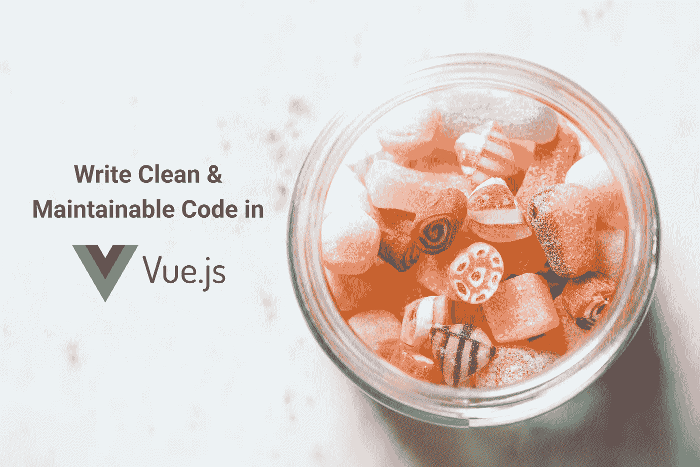

# 编写干净且可维护的 Vue.js 代码的 5 个原则

> 原文：<https://betterprogramming.pub/5-principles-for-writing-clean-and-maintainable-vue-js-code-35dfcf5ef08c>

## 编写他人能够理解和喜爱的代码



乔安娜·科辛斯卡在 [Unsplash](https://unsplash.com/s/photos/candy?utm_source=unsplash&utm_medium=referral&utm_content=creditCopyText) 上的照片

干净的代码有很大的力量。干净的代码可能不会像好酒一样随着时间的推移变得更好，但至少随着时间的推移它仍然是可以理解的。

意大利面代码则相反，时间越久越糟糕。你现在也许能够处理混乱，但是如果你在做别的事情，三个月、五个月或者 20 个月后再回来做，那会怎么样呢？

作为一名程序员，包括在 Vue.js 项目中，我喜欢坚持的一个主要原则是 DRY 原则。

DRY 代表*不要重复自己，*它的目标是减少重复。

我坚持认为这很重要的原因是湿*(每件事写两遍)*解决方案在许多情况下会带来额外的复杂性。我分享一个简单的例子帮助你理解。

假设您在代码库中的两个地方有重复的代码。如果您决定更改逻辑或某些参数，该怎么办？您必须在这两个地方重构代码。不过，这能有多糟呢？

*   换了一个地方又忘了另一个地方怎么办？
*   如果你在五个地方都有相同的代码，那该怎么办？
*   如果你不做这个项目，五个月后又回来做，那该怎么办？

保持代码的整洁可以避免很多问题，还可以节省大量时间。这在短期内可能看起来不明显，但是从长期来看，干净的代码在生产率方面是更好的选择。

# 使用混音

在 Vue 中创建可重用方法、数据属性、计算属性等的主要方法是创建 mixins。

如果您跨组件重用逻辑，那么在 mixins 中定义逻辑是有意义的，您可以在整个应用程序中使用它。

假设您的应用程序有多条路线，通过使用`vue-router`，您将每条路线与相应的组件连接起来。

```
- App.vue
-- Home.vue
-- Analytics.vue
-- Reports.vue
```

现在让我们假设您已经创建了一个定制的产品游览，您希望每当用户进入任何选项卡时就开始这个游览。

如果你没有使用 mixins，并且你希望产品之旅出现在所有页面上，你需要将相同的代码复制到每个`mounted`回调和`startProductTour`方法中。我在这里写了`Home.vue`的例子，但是在`Analytics.vue`和`Reports.vue`中你需要相同的代码。

## **Home.vue**

```
**export** **default** {
  mounted() {
    **this**.startProductTour();
  }.
  methods: {
    startProductTour() {
      // start product tour actions here
    }
  }
}
```

但是如果你把以上定义为 mixin…

`**ProductTour**` **米欣**

```
**export** **default** {
  mounted() {
    **this**.startProductTour();
  }.
  methods: {
    startProductTour() {
      // start product tour actions here
    }
  }
}
```

…然后您可以在所有组件中使用它，只要一行代码就可以在任何需要的地方使用它。而如果你换了产品，你只需要更新你的 mixin 一次，而不是编辑多个文件。

## **Home.vue**

```
import ProductTourMixin from '../mixins/ProductTourMixin';
export default {
  mixins: [ProductTourMixin]
}
```

在这种情况下，您的新项目结构将如下所示:

```
- App.vue
- mixins/ProductTourMixin
-- Home.vue
-- Analytics.vue
-- Reports.vue
```

通过使用 mixins，您节省了时间和精力，避免了头痛——只需保持物品清洁干燥。

# 不要廉价使用组件

在我的第一个 Vue 应用程序中，我的组件会增长到数百甚至数千行代码。我的 giga 组件可以在里面做任何事情，包括一个巨大的 HTML `<template>`，许多方法，以及这些方法中的大量 JavaScript。问题是:

*   我构建的所有东西都没有可重用性。如果我想重用我的 giga 组件的一部分，我需要将它复制到一个新的组件中，这会导致重复。
*   giga 组件很难阅读和维护，如果我不进行重构，它只会随着时间变得更长
*   很难在不引起冲突的情况下在人们之间划分工作，这导致部署功能代码需要更多的时间

我认为这一点很清楚——创建一个或几个大型组件而不是许多小型组件绝对是一场噩梦。

那么创建许多小组件而不是更少的大组件有什么好处呢？

1.  小组件通常是可重用的，这样可以节省您的时间，还可以避免重复代码
2.  在大多数情况下，父元素和子元素的逻辑是分离的。如果对子组件进行更改，不会影响父元素。对于父元素来说也是如此，只要您没有以任何方式改变被传递的属性。
3.  在大型 v-for 循环中，较小的组件带来了性能优势，因为 Vue 不会更新它们，除非属性改变(对于非对象属性)。

在大型应用程序中，有必要将整个应用程序分成组件，以便于开发。

这句话来自关于组件的 Vue 官方文档，它说明了将你的应用拆分成组件的重要性。

**注意:**通读你喜欢的框架和技术的全部文档，可以揭示一个信息宝库，所以我建议你经常这样做。

# 验证你的道具

验证您的 props 是使您的 Vue 应用程序可维护的一个重要部分。

首先，我们来看看在一个组件中定义道具的错误方式。

```
export default {
  props: ['myProp'],
}
```

这种定义道具的方式只在开发阶段可以接受，但是在上线之前，你应该为你的道具写完整的定义。至少，你应该为你的道具定义一个类型。

```
// quick way
export default {
  props: {
    myProp: String,
  }
}// this should be preferred
export default {
  props: {
    myProp: {
      type: String
    }
  }
}
```

但最好的方法是充分定义你的道具，并验证它们。

```
props: {
  myProp: {
    type: Number,
    required: true,
    validator: (value) => {
      return value > 0;
    }
  }
}
```

通过验证您的 props，您可以确保避免与传递意外值相关的问题，这将有助于您在开发过程中发现此类错误。

作为一个额外的优势，通过拥有定义良好的 props，您将始终能够查看您的 prop 定义和验证，以了解预期的值。可以把它看作是组件期望的小型文档。有时候，定义良好的输入，语义上正确的名称比大量的注释更好。

再一次，干净的代码战胜了马虎的代码，让你避免错误，并随时记住道具的用途。

# 使用服务与 API 交互

Vue 没有 Angular 这样的服务，可以让你创建服务与 API 交互，构建通用的应用逻辑。

根据我的经验，尽可能地将表示逻辑从应用程序逻辑中分离出来是值得的。

为了更好地说明我的想法，我将分享一个例子。假设您有一个包含三个子组件的`Reports`组件:`ReportTable`、`ReportChart`和`ReportStats`。

## **Reports.vue**

```
<!-- This example is intentionally kept simple -->
<template>
  <report-stats :stats="stats" />
  <report-chart :chartData="chartData" />
  <report-table :breakdown="breakdown" />
</template><script>
export default {
  data() {
    return {
      stats: null,
      chartData: null,
      breakdown: null
    }
  }
}
</script>
```

这是你的`Reports`组件的基础。现在，您需要一种从 API 中获取数据的方法，因此您会得到如下结果:

```
mounted() {
  this.getStats();
}
```

然后你会看到这样的东西:

```
methods: {
  getStats() {
    axios.get('/api/to-get/the-data')
      .then(response => {
        this.stats = response.data.stats
      });
  }
}
```

这绝对不错，在较小的应用程序中，这可能还不错。但是将应用程序逻辑从表示逻辑中分离出来有很多好处:

*   您可以在后端环境或不同的前端环境中使用相同的服务，而无需使用 Vue
*   你保持你的 Vue 代码清晰易懂。表示层不需要知道应用程序的全部复杂性。
*   您有一个定义良好的 API，有点像预控制器，可以帮助您和您的团队理解需要什么参数以及每个调用是如何工作的。

那么我们如何把我们的例子变成一个服务呢？

## **ReportsService.js**

```
**const** ReportsService = {
  stats: {
    index: **async** (/* params */) => {
      **const** response = **await** axios.get('/api-link');
      **return** response.data;
    }
  }
}
**export** **default** ReportsService;
```

## **Reports.vue**

```
**import** ReportsService **from** '../services/ReportsService';
**export default** {methods: {
    async getStats() {
      this.stats = **await** ReportsService.stats.index(/* params */);
    }
  }
}
```

使用简单的逻辑，我们创建了一个能够与后端 API 交互或实现应用程序逻辑的服务。然后，我们的 Vue 组件能够与我们的服务交互，获取它需要的数据，并将其传递给组件，*而不需要*知道任何关于我们的 API 或应用程序逻辑的更多细节。

# 遵循风格指南

深入研究 Vue 风格指南超出了本文的范围。一般来说，了解你正在使用的框架是如何设计的，以及它们期望你如何使用它们是很重要的。

框架的创建者有制定风格指南的经验，但是因为社区可能会遵循相同的指南，所以为了一致性，遵循它们也很重要。

一些最重要的样式指南规则如下:

## 使用 data()函数代替数据对象

这是*错误的*做事方式:

```
export default {
  data: {
    value: 1,
  }
}
```

这是正确的方式:

```
export default {
  data() {
    return {
      value: 1,
    }
  }
}
```

之所以必须使用函数而不是对象，是因为使用对象会使同一组件的所有实例都可以改变`data`属性。

## 总是键入 v-for

所有的`v-for`循环都必须有一个键传递下去，因为它有助于 Vue 更有效地呈现你的列表。

```
<my-item
  v-for="item in items"
  :key="item.id"
  :item="item" /><!-- or with HTMl elements -->
<div
  v-for="item in items"
  :key="item.id"
>
  {{ item.value }}
</div>
```

## 不要在与`v-for`相同的元素上使用`v-if`

文档很清楚为什么这是个坏主意。不这样做对性能有负面影响——因为 Vue 需要重新呈现整个列表，即使`items`数组没有改变。

我会解释你可以选择做什么，以及为什么这样更好。

而不是…

```
<div v-for="item in items" v-if="item.shouldShow()">
  {{ item.value }}
</div>
```

…您应该做到以下几点:

```
<div v-for="item in visibleItems">
    {{ item.value }}
</div>
```

并将此添加到您的`computed`属性中:

```
visibleItems() {
  return this.items.filter(item => {
    return item.shouldShow();
  });
}
```

这样做的好处如下:

1.  只有在`items`数组中发生变化时，计算属性`visibleItems`才会被重新赋值。
2.  `v-for`只需要处理`visibleItems`数组，而不是整个`items`数组，这使得渲染更加高效。
3.  您维护了一个内部逻辑更少的更整洁的模板，这总是好的。请记住，从表示层解耦逻辑可以保持事物的整洁和可维护性。

要进一步阅读风格指南，您可以查看 Vue 文档的[官方部分。即使你是一个有经验的 Vue 开发者，你也可以从阅读中学到很多东西。](https://vuejs.org/v2/style-guide/)

# 结论

编写干净且可维护的代码将使与您一起工作的人的生活更加轻松。但这也会让你自己的生活变得更好，因为你要处理的意大利面条式的代码混乱会更少。

如果你在做代码审查，你应该考虑以上的很多因素，以确保你的团队部署了高质量的代码，并长期保持高生产率。

谢谢你读到这里！