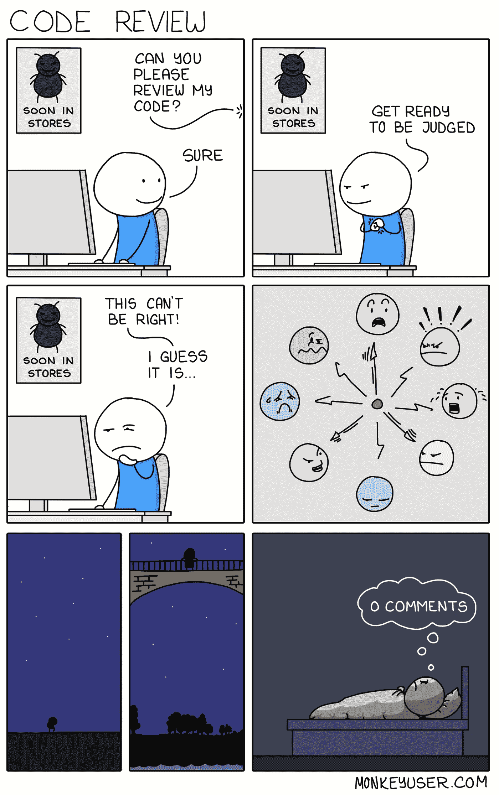

# 每次代码审查的 5 条规则

> 原文：<https://betterprogramming.pub/5-rules-for-every-code-review-98bf60dd5dbe>

## 不要只是点击“批准”

在 [Unsplash](https://unsplash.com?utm_source=medium&utm_medium=referral) 上由[海拉戈斯蒂奇](https://unsplash.com/@heylagostechie?utm_source=medium&utm_medium=referral)拍摄的照片。

代码评审是任何有效的软件工程团队的粘合剂。代码审查是工程师请求将他们的变更合并到主开发分支中的阶段。在代码审查期间，其他团队成员和高层领导可以通过版本控制系统(如 Git 和 GitLab)对您的代码进行评论并提出修改建议。

代码评审是从单个工程师的改变到整个团队对集中代码库的贡献的转折点。

代码审查最重要的部分就在这个转变中。代码评审从一两个开发人员的个人所有权开始，以团队所有权结束。一旦代码被合并，任何未来的错误或问题都不是个人的问题，而是团队的问题。

在完全远程技术团队的时代，代码审查比以往任何时候都重要。花适当的时间(额外的提示)审查队友的代码是极其重要的。拥有有效的代码审查的团队获得了遵守行业标准、更快地接纳新的开发人员以及创建持久的软件等优势。

综上所述，胜任代码审查对于成为一名熟练的软件工程师至关重要。如果你像我一样，经常点击“批准”，那么是时候让我们一起行动起来，为每一次代码审查学习五条规则了！

# 1.总是分享你的想法

听起来很明显，当你参与代码评审时，你必须严格意识到你的想法。如果你是个新手，不明白代码在做什么，你需要说出你的困惑。在这种情况下，您可能希望在对合并请求发表评论之前通过消息系统与您的队友联系。

来源: [monkeyuser](https://www.monkeyuser.com/assets/images/2019/128-code-review.png)

然而，我也看到无数的高级开发人员反复要求澄清。解决方案可以简单到为一些字节操作添加一个注释，也可以包括整个算法的重构。它需要对团队有意义。

想象一下，如果你公司的所有高级开发人员决定，如果他们不理解合并请求中的代码，他们就什么都不说。那将是一场彻头彻尾的噩梦！这就是为什么说出你的想法很重要——尤其是对于初级开发人员。如果你从来不问，你就永远学不会！

不管结果如何，表现出自己的迷茫也不是坏事。让你的困惑得不到解答是一件糟糕的事情*。*

# 2.了解验收标准(AC)

这条规则有两个方面。首先，您显然需要知道合并请求的目的和目标。第二，你需要理解这些目标是如何被所做的改变所满足的。当谈到理解 AC 时，所有的都是关于深入每个抽象层。

理解 AC 的第一步是查看与合并请求相关的票据。从这里开始，标签应该能够描述高级目标和实现细节。

如果您是 MR 的作者，您可以在您的合并请求的描述中留下进一步的细节以及任何问题。也许你甚至会在你的 MR 上为任何令人困惑的代码留下你自己的评论，让你的队友的生活更轻松！

相反，如果你在复习 MR，理解 AC 也同样重要。你想知道什么对你理解代码没有帮助吗？在 GitLab 上筛选变更列表。相反，拆掉分支本身，并修补新的变化。实验、运行测试用例，或者检查并查看构建或执行代码库是否需要异常长的时间。如果您发现任何错误或困惑，请确保在代码审查中留下评论，并遵循规则 1。

# 3.让你的改变尽可能的小

就我个人而言，我发现打开一个包含 1000 多行代码的合并请求非常令人沮丧。你的团队中没有人会检查那么多代码——就这样。理想情况下，你的 MR 应该在 10 到 100 行代码之间。

虽然这看起来令人生畏，但是有一些实用的步骤来鼓励简洁的代码评审。第一步是确保你的`.gitignore`文件是有序的。这个文件警告 Git 的版本控制系统任何应该被忽略的文件。它们可能与您的 IDE 相关，或者基于 web 框架(如 Angular)产生的依赖关系。

为了方便起见，这里有一个有用的`.gitignore`模板库:

 [## github/gitignore

### 这是 GitHub 的文件模板集合。我们使用这个列表来填充。gitignore 模板选择可用…

github.com](https://github.com/github/gitignore) 

另一个可以立即使用的技巧是促进每日代码审查。如果您使用 GitLab，您可以将 MRs 的标题改为“WIP”(工作进行中)或“草稿”这允许您的团队开始检查和评论您的代码变更，但是限制是您不能合并到期望的分支中。

每日代码评审增加了团队对每天所做变更的可见性。这允许你的团队避免庞大的代码审查，没有人真正知道发生了什么，并促进更多的团队范围的所有权和对你的代码库的理解。

# 4.明确团队标准

你知道你的团队是用 camelCase 还是下划线 _case 来表示 Angular(是 camelCase)？你知道为了更容易测试，是否有函数线限制？你的代码覆盖率最低阈值是多少？共享的功能和代码有位置吗？

假设你是团队的一员，你应该知道这些问题的答案以及更多。当谈到开发最佳实践时，如果您的团队有一个专门的位置来记录标准，这是最佳实践。如果你没有这样的文件，你可以自己制作。

如果你花时间记录你团队的标准，你将会用一份具体的文件*和*来让你的队友受益，你将会直接学到团队的最佳实践！

# 5.找到你的平衡

代码审查是一个棘手的问题。你的回答需要详细，但不能给你的队友发垃圾邮件。你需要尊重但诚实。更重要的是，你需要主动，而不是被动。代码审查是一种平衡的行为，一些队友喜欢对话，而其他人讨厌对话。

但是最终，代码评审都归结为所有权。一旦代码合并，它就是团队的代码，不应该责备或表扬某一个人。如何为代码评审过程做出最好的贡献取决于你自己，但是如果你遵循上面的任何一条规则，第一条规则总是分享你的想法应该是你的首要任务。

所以下一次你从事代码审查的时候，问一些问题。如果你没有问题要问，那么就对某人的代码提出建议，甚至是赞美。我知道任何时候有人在我的合并请求上留下反馈(好的或坏的)，这让我感觉比看不到反馈好得多。

# 结论

我希望您喜欢这篇文章，并为您自己的代码审查学到了一个新的技巧。如果你发现了什么有见地的东西，或者你自己有什么日常实践，我鼓励你在下面留下评论！

感谢阅读。