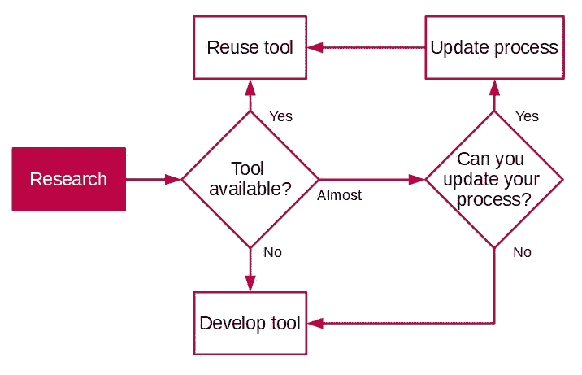
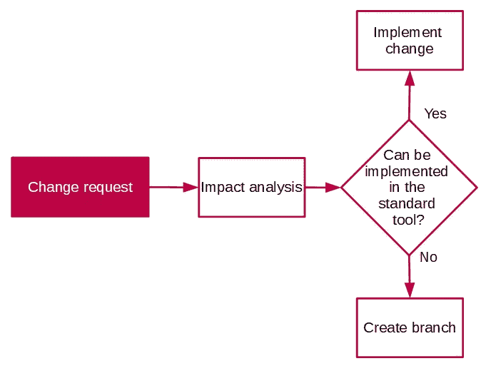

# 释放流程改进想法全部潜力的 5 个步骤

> 原文：<https://betterprogramming.pub/5-steps-to-unleash-the-full-potential-of-your-process-improvement-ideas-7f0564bbab1f>

## 你想改善你公司的流程吗？可持续地做


[活动发起人](https://unsplash.com/@campaign_creators?utm_source=medium&utm_medium=referral)在 [Unsplash](https://unsplash.com?utm_source=medium&utm_medium=referral) 上的照片

我敢肯定，您曾经鄙视过一个过程或工具的糟糕表现。

我希望你在这些鼓励员工质疑现状并改善现状的大公司中工作。如果你做到了，我为你感到高兴。

作为一名开发人员，您有能力改进现有的流程。

自动化任务对你来说很容易。每当你遇到重复的任务时，Python 脚本会在你的脑海中自动编写。

然而，如果你只考虑自己，你所有引入改进的良好意图可能都是短暂的。你可以让许多同事的生活变得更轻松，并从中受益，而不仅仅是让你的生活变得更轻松。

编写一个小脚本来自动化重复的任务是很有诱惑力的。但不要仓促行事。考虑全局，你的想法可能会对整个公司产生什么影响。

这样，你将充分利用你的提案的潜力。

# 可持续和更有利可图的解决方案

通常，你会花几个小时写一个脚本并测试它。之后，你与你的同事分享它来收集一些你的背部。

和老板绩效考核期间，你吹牛逼，挤出 2%的加薪。更多的钱，耶！

你可能没有意识到你的想法有更大的潜力。这可能为解决一个更大的、全公司范围的问题打开大门。

解决公司范围内的问题肯定会让你获得超过 2%的收益。

让我们回到你第一次想到你的想法的时候。您确定了一个导致您付出额外努力的特定用例。这很好，但不要就此打住。

# 第一步:研究以避免不必要的努力

我知道你已经想编码了，但是请忍耐一下。你不会后悔的。

在写脚本的任何一行之前，都要做好研究。查一下内网，浏览一下 QMS 系统，或者问问同事。

如果你注意到了效率低下，其他人可能也会注意到。也许，他们已经修好了。

你可能会说，这似乎微不足道。但是我不能告诉你我有多经常看到人们冗余地开发工具，尤其是在大公司。

你的研究有三种可能的结果:

*   **找到合适的工具。**恭喜你！你几乎不费吹灰之力就完成了这个烦人的任务。此外，您还节省了开发现有工具的时间。
*   你找到了一个几乎符合你需求的工具。太好了！您可以使用该工具作为您自己的基础。
    但是在对工具进行分支之前，问问你自己:我能协调我的过程来使用它吗？这样，您就可以使用它，而无需为您的分支机构进行额外的维护工作。始终争取一致性，以避免不必要的成本。
*   **你不找工具。**牛逼！你已经完成了成为发明家的第一步。



图片由作者提供。

# 第二步:发展

你没有找到合适的工具？

吃吧！这是你等待的时刻:开发你的新杰作。

# 第三步:建立所有权

一旦你对你的工作满意了，喘口气，再想想你的目标群体。如果你的脚本拥有大量的读者，我建议建立一个所有权和变更请求流程。

这是因为不同部门的人可能对您的脚本有特定的用例。这可能与他们的工作有 90%的匹配，所以他们想调整它或者让你为他们调整它。

但是，这种定制对您和公司都有风险:

*   **您的风险:**由于您是原始脚本的所有者，您可能会不断收到更新它的请求。即使请求者实现了新特性，同事们也可能会用你无法回答的问题来轰炸你。毕竟，整件事都是你发明的。
*   **公司的风险:**如果没有受控的变更管理，其他开发人员可能会拿走你的源代码，创建一个副本，并根据他们的目的进行修改。不受控制的分支越多，无意重复的概率就越高。

为了减轻这些风险，您的目标应该是通过引入变更管理过程来建立一个标准工具。不要太花哨。

它可能看起来像这样:



图片由作者提供。

1.  外部风险承担者创建变更请求。变更请求需要包含关于用例的信息，以及关于脚本需要变更的内容。
2.  所有者执行影响分析。该分析确定了与现有用例的潜在不兼容性。随着复杂性的增加，您可能无法掌握变更请求的全部影响。可能值得考虑一个小型委员会，例如，每个使用脚本的部门一个人。
3.  如果所有者批准，请求者可以实现变更请求。
    如果所有者拒绝，请求者需要创建新的分支。确保请求者理解他们将负责开发和维护他们的变体。

# 第四步:确定价值

下一步对确定你的剧本的价值至关重要。这些数字将为你下一次的薪资谈判提供坚实的基础。

在所有这些工作之后，你确实赢得了加薪。

你可以要求 6%，而不是随意提出 2%，因为这是你的想法为你的公司节省的金额。

要了解您的脚本的价值，您需要回答以下问题:

*   谁需要它？
*   节省了多少时间和成本？

首先，找出你的工具的潜在用户。看看你的同龄人。他们中有多少人执行同样的任务？一个粗略的数字将有助于你的情况。你能识别的潜在用户越多，对你越有利。

接下来，评估您的脚本将节省的时间。找出有和没有它完成任务的区别。这就是你将节省的时间——每当有人使用你的工具时。

如果你能算出任务频率，你的数字会更令人印象深刻。人们多久执行一次任务？一年一次？一周两次？

通过以下方式计算节省的总时间:

```
<Time saved per task> * <Task frequency> * <Potential users>
```

最后，将时间节约转化为成本节约。

研究一下使用你的剧本的人的平均时薪。不要把这和薪水混为一谈。一个人对公司的成本包括工资、租金、R&D 投资等。向项目经理要一个大概的数字。

将节省的总时间乘以用户的平均每小时费用，就可以知道公司节省了多少钱。你对这个数字印象深刻吗？我希望如此。

# 第五步:展开并沟通

你做到了！你创造了一个宏伟的工具，将使许多人的生活更加方便。

在你自我敬畏之前，我还有一个请求:把你的想法说出来。

即使你不以推销自己为荣，你也应该这样做。你的动机可能源于卑微，但不要对你的结果过于卑微。

向感兴趣的利益相关者介绍你的新工具，向他们展示，并强调其好处。

这样，你就把你的工具建立成了一个标准。你要确保人们了解并欣赏你。

记住，用户数量越大，节省的时间越多，你在未来薪资谈判中的地位就越有利。