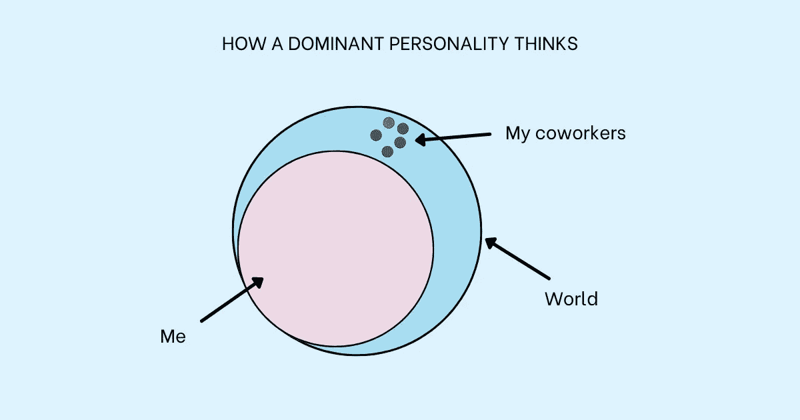

# 与主导型人格共事的 5 个策略

> 原文：<https://betterprogramming.pub/5-strategies-to-work-with-a-dominant-personality-498b30057ed7>

## # 5——不要对他们的不耐烦感到不耐烦

鸣谢:作者

那是一个星期五的早上，我非常渴望有机会在一大群人面前展示我的想法。会议在良好的氛围中开始，但仅仅几分钟后，我就不再主导对话了。我的经理机智地将我的想法置之不理，接管了讨论。

除了让我生气、沮丧甚至让我怀疑自己“如果我的想法实际上很可悲呢？”的那部分，我不记得关于那次会议的其他事情了。

这不是我第一次被边缘化，被忽视，感觉自己愚蠢透顶。组织中有许多其他人也有同样的行为。渴望控制，对别人的想法不屑一顾，快速通过判断，对结果不耐烦，自信到高度自大的地步，这样的支配型人格在我身边比比皆是。

他们的权威行为加上散发着统治气息的肢体语言最初让人相当不安，尤其是当我的老板或其他人在控制我的工作成功方面发挥了重要作用时。这很有挑战性，但我还没准备好放弃。

我热爱我的工作，我的团队，不愿意仅仅因为我周围的几个主导人物而放弃机会。我意识到，如果我想成功，我必须学会和与我不同的人一起工作，即使是那些倾向于支配和统治的人。

我决定学会和他们一起工作，而不是在他们身边感到害怕，从而掌控我自己的成长和工作上的成功。我需要一个策略，让我不再对自己的处境感到难过，并开始做一些能让我朝着目标前进的事情。

# 与强势人格共事的策略

这里有几个对我个人有用的策略，我相信如果你尝试一下，它们也可能对你有用。你只需要对这个过程有耐心，愿意去适应、调整和改变。

## **1。感觉在控制中**

我知道这听起来违反直觉，因为主导人格的行为往往会让你感到完全失控。这就是为什么第一步也是最重要的一步是夺回控制权。

虽然要真正控制你的处境还需要做更多的工作，但是如果你认为“你做到了”，你就已经成功了一半。你的心态在你如何经历生活中的事件、感受到的情绪方面起着至关重要的作用，它最终决定了你如何行动。

通过告诉你的大脑你在控制你的情况，你可以用激励你采取行动的目标来喂养它，而不是采用一个弄巧成拙的目标，你所做的只是对你的情况感到抱歉，从而将糟糕的情况变成更糟糕的情况。

> 除非你允许别人打扰你，否则别人说的或做的不会真的惹恼或激怒你。他惹恼你的唯一方式就是通过你自己的思想。比如你生气了，你的脑海里要经历四个阶段:你开始思考他说的话。你决定生气并产生愤怒的情绪。然后，你决定采取行动。也许，你会回嘴，以牙还牙。你看到思想、情感、反应和行动都发生在你的头脑中。当你在情感上变得成熟时，你不会消极地回应别人的批评和怨恨——约瑟夫·墨菲，你潜意识的力量

## **2。深入挖掘他们的主导个性**

通常情况下，拥有支配型人格的人不会意识到他们的气质以及他们对他人的影响。他们看世界的方式真的和你不一样。在某些情况下，与他们进行坦率的讨论可以解决问题，而在其他时候，这可能会适得其反。

> 当我们来自一个判断的地方，我们会陷入自己的世界观。当我们来自一个充满好奇的地方时，我们扩大了可能性的范围

多了解一点他们的个性是你找到和他们一起工作的有效方法的途径。当在他们身边时，要在场。我是真心的。在场并注意他们说话的方式和他们问的问题。记下他们的非语言暗示(语气、声音、面部表情),试着理解是什么促使他们这样做:

*   他们需要控制吗？
*   他们是否倾向于将结果置于关系之上？
*   他们通常给人的印象是果断、直接、快速地做出决定吗？
*   他们是否倾向于否决他人的意见，因为他们希望事情按自己的方式进行？
*   他们的动机是成就还是想在别人面前表现得更好？
*   这种自信会被视为傲慢吗？
*   他们是否对那些在决策时更深思熟虑的人不耐烦？
*   他们贬低别人是为了让自己好看吗？
*   他们在每一次互动中都有紧迫感并期待效率吗？

一个具有支配型人格的人可以表现出许多这些不同的行为。对你前进至关重要的是理解两件事:

1.  他们行为的哪一部分让你烦恼或不安？
2.  这种行为如何阻止你实现你的[目标](https://www.techtello.com/goal-setting/)？

第二个问题真的很重要，因为你不应该花时间去担心别人的行为，这些行为对你的生活或你希望实现的事情没有任何影响。是的，他们的行为可能会让你暂时失望，但这绝不应该成为你生活中不必要的压力和焦虑的原因。

## **3。别往心里去**

什么能让你看清事物，并围绕它们采取建设性的行动？分离他们的话语，防止他们把它附加到你的身份上。他们的行为不会影响你、你的能力或你的工作。

在我开始讲述的故事中，当我的经理从我手中接过讨论时，他确实让我在那一刻感到力不从心。但是后来当我有时间思考这个问题的时候，我意识到通过这种感觉，我放弃了我解决问题的能力。我的想法可能不是最好的，但值得一听。他打断了谈话，丝毫没有影响到我的能力。他就是这样。

通过不把事情往个人方面想，我能够管理我的情绪，引导我的行动有效地合作，而不是屈服于这种冲突往往会引发的战斗或逃跑倾向。

## **4。寻找双赢的机会**

美国心理学家和经济学家丹尼尔·卡内曼因其在判断和决策心理学以及行为经济学方面的研究而闻名，并因此获得了 2002 年诺贝尔奖。他对谈判提出了一个精辟的建议:“谈判不是试图说服对方，而是试图理解对方。这是放慢你自己的速度，不做你自然会做的事情。你能做些什么来让他们更容易接受你的方式？”

把每一次与主导人格的互动都当作一次谈判。问这些问题将有助于你找到你的想法与其目标的契合点:

*   是什么驱使他们？
*   他们寻求什么结果？
*   你的工作如何与他们心目中的大局保持一致？

了解他们的驱动力和动机有助于你以一种让他们感觉良好的方式提出你的想法，让他们处于控制之中，并处于胜利的位置。当他们有这种感觉时，他们不太可能把你撇在一边，更可能注意你要说的话。

另一个有用的策略来自扑克世界。扑克里有句话说的好，知道什么时候握牌，知道什么时候弃牌。孙子在《孙子兵法》中也表达了这一思想:“因此，在所有的战斗中，战而胜之并不是至高无上的卓越。”有时候，对你来说，大声说出并表达你对他们行为的不满是很重要的，而在其他时候，最好保持沉默，让他们为所欲为。小心选择你的战斗。

当你寻找双赢的机会时，你很可能会找到以前不可能的解决方案。

## **5。不要对他们的不耐烦不耐烦**

主导型人格可能对你的想法不屑一顾，或者很快做出判断。但是和一个不耐烦的人一起工作最糟糕的方式就是让你自己也不耐烦。

继续推动你的想法。当他们打断你或试图接管时，礼貌地指出你还没有完成。当他们试图否定你的想法时，问问他们对你想法的看法。如果他们喜欢快速做出决定，提前准备好所有的数据和分析。当他们试图把你推到公共汽车下面时，提醒他们你们是一伙的。

通过在他们周围保持冷静和沉着，并注意他们的反应，你可以调整你的互动，以符合他们的期望，而不会感到失望、伤害或失望。

# 摘要

1.  与强势性格的人一起工作并不有趣，但有时避开他们也不是一个选择。当你无法避免或退出时，你该怎么办？学会和他们一起工作。
2.  与支配型人格共事的第一步是感觉自己处于控制之中。通过感觉在控制中，你允许你的大脑采取建设性的行动，而不是采取一个弄巧成拙的目标，你所做的只是为你的处境感到遗憾。
3.  了解他们行为的哪些部分影响了你的成功，以及是什么让他们这样做。他们想按自己的方式做事吗？他们想在别人面前好看吗？了解他们的动机将使你能够解决关键问题，并设计出解决具体问题的解决方案。
4.  将他们的行为与你的身份断开。他们的行为决不会影响你的能力和价值。引导你的情绪为你服务，而不是与你作对。
5.  把每一次互动都当成谈判。寻找双赢的合作机会，让他们觉得没有必要把你晾在一边，更愿意倾听你的意见。
6.  消除他们不耐烦的最好方法是你自己也要有耐心。在他们周围保持冷静和沉着，调整你的互动来引导他们，慢慢地帮助你前进。

在 Twitter 上关注我，了解更多故事。

*这个故事最初发表于*[*【https://www.techtello.com】*](https://www.techtello.com/working-with-a-dominant-personality/)*。*