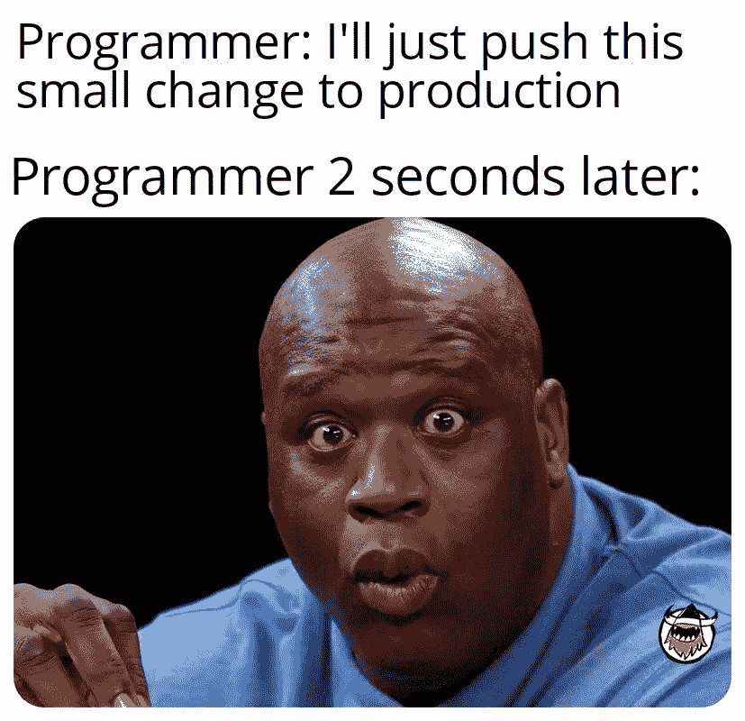

# 软件开发人员经常犯的 5 个小错误

> 原文：<https://betterprogramming.pub/5-terrible-mistakes-that-software-developer-often-make-e7f6879d9de5>

## 错误 3——试图在一个晚上掌握所有东西

约翰尼·科恩在 [Unsplash](https://unsplash.com?utm_source=medium&utm_medium=referral) 上的照片

我们看到许多关于如何成为一名成功的软件开发人员的技巧的文章。

你应该开始适应的习惯。你需要改变心态。你应该遵循的建议。

然而，对于我们需要避免的事情，并没有太多的强调。错误和时间浪费会给我们的生活带来很多伤害。很多沮丧和失望，我们没有实现任何东西。

这就是你将要在这篇文章中读到的内容。

让我们开始吧…

# 1.记住语法的每个可能的细节

你搬到一个新的城市，你不知道最近的杂货店在哪里。你不要自责——这很正常。你只要用谷歌地图就能找到。去过几次之后，很有可能就不需要用谷歌地图了。

其他地方也是一样，比如最近的餐馆，或者体育中心——起初，你需要使用谷歌地图，然后你自己学习位置，不再需要使用它。

你学习它们，但这并不是有意的*试图*记住每一条路，每一条通往某个目的地的可能路径。有时你只对去那里一次感兴趣。

当你想到它时，你可能需要在编程语言中使用的某些方法也是如此。新的软件开发人员可能会因为没有记住足够的语法而感到难过——他们仍然需要参考文档。他们认为这表明他们是糟糕的开发者。

当他们能够记住一些常用的语法时，他们可能会认为他们已经擅长编程了。他们得到的印象是，真正重要的是他们能够记住的语言数量或者编程语言和框架的数量。

使用过多种编程语言的开发人员不可能记住他们过去使用过的所有语法。他们甚至可能一开始就懒得去学它。

## 句法这么重要，要我背吗？

为了回答这个问题，我们来看看一些资深开发人员的 Twitter 帖子:

《提摩太书》领导谷歌。30 年的编码经验。需要查找如何获得 Python 字符串的长度。

我也叫蒂姆。从 1979 年开始编码。仍然需要一直查找 java.lang.String 方法。

这些承认应该给你勇气——你不必为不能记住语法的每个细节而感到羞愧。

如今，我们得到了新的语言和框架，或者对现有的语言和框架进行了相当大的改变，所以试图记住语法既困难又不重要。正如一位评论员在一篇博客文章中精辟地指出的:

> *“伟大的工程师知道如何提出好的问题。然而，面试官期待活字典。*

# 2.什么都不做，因为你不能决定从什么开始

如果你和我一样，你有很多项目放在特雷罗身上。很多你想开始和完成的产品。你买的许多书和心血来潮买的课程。

它们都有一个共同点:你只是不知道现在应该从哪一个开始。因此，你浪费了这一刻，拖延了时间。

你去那里创建多个私有的 GitHub 库，试着用最花哨的降价来准备完美的自述文件——只是把它作为未来几个月或几年的唯一承诺。

当你没有勇气继续前几天开始的事情时，你会跳到其他能给你更多快乐的事情上。

> 也许我能做更重要的事情。

你应该开始这个项目还是那个项目？如果我不断地对新的项目想法进行头脑风暴，也许以后我能以某种方式完成一个项目，那会怎么样？

等一下…

## 如果一头驴能教我们一些这方面的知识呢？

你可能听过这个[的故事](https://sivers.org/donkey):

> “布里丹的驴子正站在一堆干草和一桶水的中间。它不停地左顾右盼，试图在干草和水之间做出选择。无法决定，最终死于饥渴。”

驴子没有那么聪明，会想办法同时抓住他们两个。他无法想象他可以随机选择一个，然后继续下一个。如果他聪明一点，他可以先喝点水，然后再去吃干草。

事实是，无论你有多少创意，它们都不会自己完成。

我们不可能同时在纽约和新加坡。

我们都知道并且完全承认这一点。然而，当谈到我们的目标，以及我们生活中想要的东西时，我们很容易忘记这些。

我们喜欢幻想和计划在 ProductHunt 上推出产品的每个细节，并邀请我们的朋友投票支持该产品，以便它能够获得更多的关注。

然而，该产品在几个月前就被放弃了，我们甚至还没有合并拉动请求，而拉动请求可以让球继续滚动，并帮助我们获得一些动力。

从一个想法开始。

*这是此时此刻最完美的选择吗？*

没关系。

你对下一个计划实施的想法的选择通常不是生死攸关的事情。

选择一件事，然后继续做下去。你可以以后再想别的主意。

你不必一次注册 50 门 Udemy 课程或购买 10 本书。只从一门课程开始，不要跳到下一门，除非你真的需要。不要让铺天盖地的选项清单破坏了你的进步。

过多的分析会转化为麻痹，导致你的行动和向你完成的想法前进的麻痹。

别想太多了。开始做。

一次完成一项承诺，让世界享受你的劳动成果。

# 3.试图在一个晚上掌握一切

软件变得越来越重要，这似乎不会很快停止。

与此同时，这也增加了程序员的责任，他们应该非常仔细，非常擅长自己的工作，而不是只花一个晚上从一本书上学习几行代码，并给数百名招聘人员发电子邮件求职的程序员。

[图片来源](https://knowyourmeme.com/photos/1478576-shaqs-hot-ones-interview)

## 等等，真的有可能只用一个晚上就学会编程吗？

虽然听起来很有趣，但五年前 Quora 上也有人问过类似的问题。

不幸的是，我再也找不到那个确切的问题了，但从那以后，它一直留在我的记忆中。也许提出问题的人是在耍花招，或者第二天有考试，希望得到令人鼓舞的答案，以便在考试前通宵学习。

我不记得其他的答案了，但是我在里面读到了一个非常明智的答案。答案大致如下:

> *“带上笔记本去北极。那里的一夜持续六个月。这就是你如何增加学习编程的机会。”*

我们生活在一个我们想在几秒钟内得到一切的时代。

我们想要快餐，跑车，六天六块腹肌等等。

这是我们大多数时候的心态，我们希望在其他领域也是如此。然而，真正的精通来自大量的工作和奉献。

谷歌的研究总监 Peter Norvig 建议你在十年内学会编程，因为匆忙是不值得的:

> *“在 24 小时内，你将没有时间编写几个重要的程序，并从它们的成功和失败中学习。你不会有时间和一个有经验的程序员一起工作，也不会明白生活在 C++环境中是什么感觉。简而言之，你不会有时间学很多东西。所以，这本书只能说是表面的熟悉，而不是深入的了解。正如亚历山大·波普所说，‘一知半解是一件危险的事情’。”*

如果你向人们提及此事，他们可能不喜欢，但这就是现实。真正学好一件事需要时间。既然你已经读过了，不要因为你前面的漫长旅程而不知所措。

与其问自己是否能在一夜之间学会编程，不如问自己:

今晚我能学到的一件小事情是什么？

Twitter 帖子:人们抱怨学习成为一名开发人员需要一年时间。来吧，人们。成为一名医生需要十年*和*你必须处理体液。

# 4.试图一次完成每个目标

由[路易斯·维拉斯米尔](https://unsplash.com/@villxsmil?utm_source=medium&utm_medium=referral)在 [Unsplash](https://unsplash.com?utm_source=medium&utm_medium=referral) 拍摄的照片

我们可能希望掌握数据科学，同时，我们希望用 React Native 建立一个令人敬畏的生产力应用程序，获得 300 万次下载。在周末，我们也想掌握区块链，成为最好的开发者。

所有这些看起来都是高尚的尝试，会让我们对社会更有帮助。我们可能打算在我们认为有价值的事情上投入时间，同时掌握多种技能。

但是这是一件很难完成的事情。

我们可能已经注意到所有这些领域的质量下降。我们甚至不满足于我们的结果，也不满足于我们的生活因被分散而经历的退化。

事实是，我们可能只是在涉猎。

我们害怕去掌握真正重要的东西。

我们害怕当我们在追求过程中遭遇重大失败时，或者我们在别人面前会显得很糟糕。脆弱的并且不能达到精通的水平。

这样，我们倾向于为我们缺乏克服障碍的勇气或者我们没有达到目标的某个里程碑的原因找借口。

“很明显我失败了，我已经有太多的事情要做了，”我们告诉自己，我们用这些借口来逃避减少琐事的道路。

我们拍拍自己的背，我们已经在许多项目中展开，在许多不同的领域中，对我们来说，不能展示任何类型的有价值的结果是没关系的。我们甚至没有试图去改善它。

**承诺掌握**

我并不是说我们必须始终完全致力于一条道路，或一个目标，而忘记其他一切。在某些情况下，我们可能需要一些实验来看看什么是重要的。一些你想掌握并用来帮助他人的东西。或者简单地认为这是一种精通的方式。

但是一旦你已经下定决心，不要让闪亮的东西分散你的注意力。把你的全部精力和努力投入到你最重要的优先事项中，不要因为碰壁就满足于平庸。

我相信，我们目前拥有的许多机会可能会在未来 6-12 个月内出现。仅仅知道这一点就可以是一种巨大的解脱，因为我们可能会担心这个机会可能永远不会到来。

我们需要明确我们的优先事项，摆脱试图一次做完所有事情的诱惑。我们的生活是我们已经做出的决定的总和。

如果我们真的对繁荣和提高我们的生活质量感兴趣，那么就要靠我们来改进我们所做的决定。

# 5.因恐惧而瘫痪

[埃隆马斯克](https://thewhitonline.com/2020/11/opinion/lonsdorf-elon-musk-isnt-a-good-person-just-because-hes-rich-and-invents-stuff/)

当你听到埃隆·马斯克(Elon Musk)这个名字时，你首先想到的可能是什么？

我猜你可能会想到现代的“铁人”，他非常聪明，非常勇敢，不顾一切困难和传统智慧，追求自己的目标。

除了因为他的成就而成为一个非凡的人之外，他看似不近人情的职业道德意味着他每周工作大约 100 个小时。但是，即使有这一切，包括他使星际运输成为可能的宏伟目标，**他也感到恐惧。**

是的，我知道这听起来可能违反直觉，你只是不习惯从看起来最勇敢的人那里听到这些事情，但他在接受采访时证实了这一点。

> “嗯，首先，我要说的是，实际上我觉得我非常强烈地感到恐惧。所以，这并不是说我没有恐惧。我感觉很强烈。有些时候，事情非常重要，以至于你足够相信它，以至于你不顾恐惧去做。”

不要去从一栋大楼的六楼跳下来，做其他类似的危险事情，仅仅是因为你想在知道埃隆对此的看法后战胜你内心的恐惧。我只是想提醒你，害怕是正常的——你不应该让恐惧阻止你。

即使你可能害怕失败或在别人面前不好看，也不要让这阻止你。

*   推出你在周末开发的产品。
*   发表那篇关于你如何解决这个具有挑战性的 bug 的博文。
*   申请你一直想从事的梦想工作。
*   在您使用开源框架中打开这个拉请求。
*   不要害怕走出去，转换技术，甚至角色。

害怕自己学得不够，落后了。

尽管成功的几率很低，困难重重，但埃隆没有让失败的恐惧阻止他创办 Space X 和特斯拉。

埃隆和其他成功人士的不同寻常之处在于他们通常会有另一种恐惧:害怕错过。

他们不顾恐惧而行动，甚至可能试图将自己的恐惧指向与大多数人不同的方向。他们担心，如果不采取行动，他们可能会错过摆在面前的机会。

区别那些成功的人的是他们回应和利用恐惧的方式。

既然你已经读了这篇文章，不要浪费时间。

从这篇文章中挑选至少一个与你最相关的错误，让它成为你尽力避免的事情。