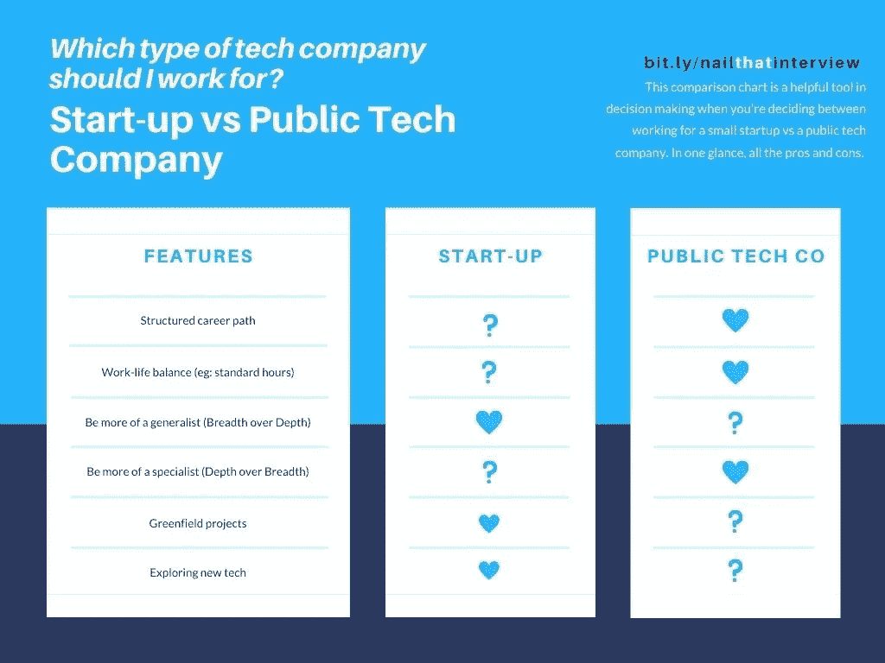

# 当你收到多份工作邀请时，做决定的 5 个技巧

> 原文：<https://betterprogramming.pub/5-tips-for-making-a-decision-when-you-have-multiple-job-offers-c4d40038c578>

## 帮助你决定是为创业公司工作还是为上市科技公司工作的建议

苏拉娅·欧文在 [Unsplash](https://unsplash.com?utm_source=medium&utm_medium=referral) 上拍摄的照片。

每一天，我们都面临着许多选择——从早餐吃什么这样的简单选择，到影响我们生活方式和职业生涯的更大更复杂的选择，例如决定是否接受一份工作而不是另一份工作。在多份工作中做出选择是一个高风险的决定，因为一个人一生中平均要花 9 万个小时在工作上。因此，能够客观地在多份工作邀请中做出选择，符合我们的最佳利益。

让我和你分享五个小技巧，当你有多份工作邀请时，如何像老板一样做决定。

# 1.对照你的职业目标进行评估

为初创公司和大型科技公司工作的利弊。作者照片。

当涉及到你的职业生涯时，做出正确选择的第一步是在撰写和比较每份工作机会的利弊之前，根据你的中期职业目标评估选项。为什么？因为每个正反都是主观的。一般来说，你的每一个选择都是好的*和坏的*。没有一个选项是由所有的专业人士组成的。

例如，你可能会面临为一家漂亮的小公司或上市科技公司工作的选择。两者各有利弊。在这种情况下，写一份利弊清单不会帮助我们做出正确的决定。但是想想你想要达到的结果或职业目标。

以下是一些思考结果或职业目标的例子。你想成为一个通才(可以身兼数职的人)是因为你有兴趣走自己的路，有一天有自己的创业公司吗？如果是这样，为一家不错的小公司工作更符合你的职业目标。然而，如果你想深入研究一种特定的技术，或者了解如何大规模编写企业软件，那么为一家上市科技公司工作是一个更好的选择。

另一个常见的考虑因素是短期财务影响与对职业生涯的长期投资——通常表现为薪酬更高的工作机会与职业前景更好的工作机会。只有一个正确或错误的决定。基于你想要达到的结果，你在职业生涯和生活中所处的阶段，以及你认为对你来说什么是重要的，你可以做出对你职业生涯来说正确的决定。

# 2.运用过去的教训和经验

默里·坎贝尔在 [Unsplash](https://unsplash.com?utm_source=medium&utm_medium=referral) 上拍摄的照片。

我们总是被鼓励从我们的经历中学习。处理多份工作邀请并需要做出选择的时候，是运用你从以往工作经验中获得的教训的最佳时机。从环境、行业、团队规模和项目类型等方面考虑你以前的工作和现在的工作之间的相似之处和不同之处。

# 3.有默认选项

照片由[卡里姆·曼吉拉](https://unsplash.com/@karim_manjra?utm_source=medium&utm_medium=referral)在 [Unsplash](https://unsplash.com?utm_source=medium&utm_medium=referral) 拍摄。

我非常相信这样一句话:“你要做的事情越少(对于不重要的事情)，你能做的事情就越多(对于重要的事情)。”这就是为什么在某些情况下有默认选项可供选择会产生奇迹。

例如，你可以说，在两家规模相同、职业轨迹相似的公司之间做出选择时，你的默认选项是选择离家更近的一家。这是客观的，需要更少的思考和混日子。

# 4.紧急执行尽职调查

[安德鲁·尼尔](https://unsplash.com/@andrewtneel?utm_source=medium&utm_medium=referral)在 [Unsplash](https://unsplash.com?utm_source=medium&utm_medium=referral) 上拍照。

紧急决定是你需要立即做出的事情。例如，当你进入电梯时，你需要马上按你想去的楼层。一个重要的决定是你需要彻底考虑的事情，通常是在分析、收集和处理事实之后。对于这种类型的决定，你可能需要考虑一下，以确保你不会仓促行事。

我认为为你的职业生涯做决定是一个紧急而重要的决定。在仔细做出选择之前，你需要紧迫地进行充分的尽职调查。

在你收到工作邀请后，留出一些时间来评估，并对公司或招聘人员设定一个预期，告诉他们你什么时候会回复他们你的决定。当你稍后需要与其中一家公司谈判薪酬或工作条件时，这种方法也对你有利，因为他们会知道你已经得到了多个机会。

# 5.创造性地思考

凯利·麦克林托克在 [Unsplash](https://unsplash.com?utm_source=medium&utm_medium=referral) 上拍照。

仅仅因为你有多个工作机会，并不意味着你必须选择其中之一。也许你可以两个都选。例如，其中一份聘书是短期合同，另一份聘书是长期永久职位。你可能会决定接受他们两个，并安排好你的开始日期。或者你可能会决定不接受任何工作机会，因为它们都不符合你的要求。

照片由[布伦丹·丘奇](https://unsplash.com/@bdchu614?utm_source=medium&utm_medium=referral)在 [Unsplash](https://unsplash.com?utm_source=medium&utm_medium=referral) 拍摄。

# 结论

现在你知道了:如何处理多重工作邀请的五个实用而有用的建议。下一次你决定接受哪份工作时，想想下面的步骤，轻松自信地做出正确的选择:

1.对照你的职业目标进行评估。

2.运用过去的教训和经验。

3.有默认选项。

4.紧急执行尽职调查。

5.跳出框框思考。