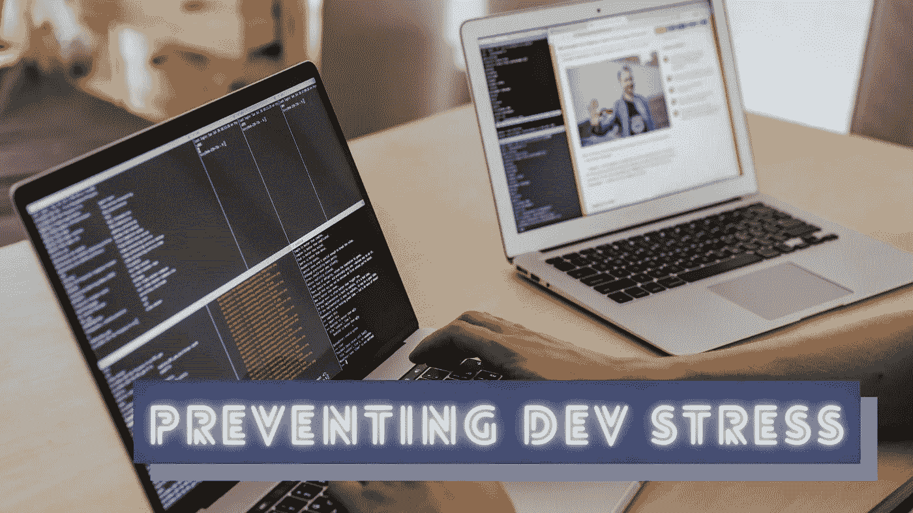

# 在你的软件开发生涯中防止压力的 5 个技巧

> 原文：<https://betterprogramming.pub/5-tips-to-prevent-stress-in-your-software-development-career-e368e8122de1>

## 在任何软件工程工作中使用这些实践，把它作为一种爱好来享受



作者用 Canva 设计的“防止开发者压力”封面。

程序员从事各种各样的软件工程工作，他们有不同的日常事务和活动。但是我们都有一些一般性的活动，例如编写代码、调试、测试、参加技术讨论和编写文档。现代软件开发需要快速的特性实现和部署来满足市场需求。因此，程序员经常不得不在更近的期限内工作。此外，程序员必须在短时间内处理难以重现的错误。

由于在他们的软件工程生涯中这些不可避免的情况，程序员经常感到压力。压力并不是什么新鲜事。这是每个人生活的一部分，但它可以得到很好的管理，也可以通过几种方式进行预防。

在这个故事中，我将解释几个实用的技巧来避免你的软件工程生涯中的压力情况。五年过去了，我仍然在享受我的软件工程生涯，这要归功于以下习惯。

# 1.不要试图写出完美的代码

你担心你昨天写的那段代码的质量吗？别担心，没关系。程序员总是倾向于通过编写更好的代码来提高他们源代码的质量。对于编译器/解释器来说，高质量的源文件易于阅读、维护、清理和优化。我们需要以高质量添加每个源代码变更，以保持整个源代码的质量。因此，高级工程师通常会在将任何源代码更改添加到主代码库之前进行代码审查。

我们可以用最合适的数据结构和算法编写足够好的代码来解决任何工程问题。但是，我们需要相信我们无法写出完美的代码。完美的代码没有 bug，可读性极佳，各方面都超级优化。如果你试图写完美的代码，你可能会面临压力——因为你永远不会对你写的代码满意。

如果您的代码是干净的、可维护的、优化的，并且用好的测试用例进行了测试，那么它就可以提交了。没有必要通过预测未来的需求和定义你不需要的需求来使它变得完美。

# 2.尝试自动化你重复做的事情

当程序员只剩下很短的时间来完成耗时的工作时，他们经常会变得紧张。你的敏捷故事点和时间估计也经常撒谎。因此，有时一个小任务会花去你一整天的时间。在每一个编程任务中，你可能还是会做一些重复性的工作。例如，您可以键入一些终端命令，复制一些文件，并编写一些测试用例。通过自动化这些重复性的手动任务，您确实可以节省大量时间。然后你就可以在没有压力的情况下，把你的时间分配给所有其他需要完成的任务。

事实上，您也可以通过元编程的概念来自动化代码的某些部分。在某些场景中，我们必须编写许多静态代码行来处理一些数据。我们可以尝试通过元编程概念编写一些动态代码。例如，如果需要访问 Go 结构的属性，可以编写以下代码，而不是静态键入所有属性。

```
val := reflect.ValueOf(yourStruct)

for i := 0; i < val.NumField(); i++ {
  fieldName := val.Type().Field(i).Name // key
  fieldValue := val.Field(i).Interface() // value
  fmt.Println(fieldName, " -> ", fieldValue) // code to process
}
```

# 3.避免在休息时思考任务

当你在处理耗时的软件开发相关工作时，休息一下总是很棒的。软件开发并不总是带来简单的任务，它经常给我们带来需要解决的挑战性问题。例如，您今天可能通过应用一个棘手的技术变通方法解决了一个 bug。此外，也许你还在为一个高度算法化的问题寻找一个更好的解决方案。

在这类任务中，我们经常会快速休息一下，让头脑清醒一下。然而，我们通常会在这些休息时间思考暂停的任务。一些程序员甚至在午休时也努力用他们的大脑作为编译器来解决他们暂停的开发任务。在休息的时候，一遍又一遍地思考给你带来压力的工作不会减轻你的压力。

因此，试着利用你的休息时间获得能量来解决让你紧张的任务。当你要休息的时候，练习暂停任何有挑战性的工作。

# 4.与你的客户或团队变得更加友好

世界上有两种类型的软件开发公司:基于产品和基于服务的公司。基于产品的公司通常也提供服务，如维护、开发人员支持、服务台服务等。这两种公司的程序员都有机会直接与客户打交道。在服务型公司工作的程序员与他们的客户有更多的互动。

如果你不直接与客户合作，你可以经常与你的团队交流。我们经常与客户和团队进行 scrum 通话、讨论和会议。当我们在调查耗时的 bug 和争取接近截止日期时，有时我们必须与他们沟通。

在这些场景中，程序员通常会感到有压力，因为他们不得不与未完成工作的人(可能是他们的上司)交谈。如果你与客户和团队保持工作关系，情况会变得更糟。试着对客户更加友好。那么如果你在忙碌的一天中需要接听他们的电话，你也不会感到有压力。

# 5.打破东西不要慌！

程序员制作软件。此外，他们经常破坏软件。一个字符的改变可能会使整个软件系统崩溃。一个新的特性实现可以包含隐藏的逻辑流程和边缘情况，即使是测试人员也不会注意到。因此，您现在编写的代码可能包含 bug。此外，您的代码也可能破坏现有的工作特性。不知何故，这些代码更改可以悄悄地进入生产系统。当程序员的代码在生产系统中表现不正常时，他们通常会感到紧张。

一些顽固的程序员经常把他们的睡眠时间或午餐时间奉献给那些没有产品用户会经历的小的产品错误。与此同时，当一些程序员注意到生产系统中的错误并通过应用快速修复引入更多错误时，他们会感到恐慌。

不要因为虫子而恐慌。人们会犯错误，即使是人工智能驱动的代码生成器也永远不会写出完美的代码。当你在生产系统中发现一个 bug 时，保持冷静，通过仔细分析根本原因来引入一个修复方法。

如果你觉得有压力，记得过去的程序员都是用汇编做游戏的。