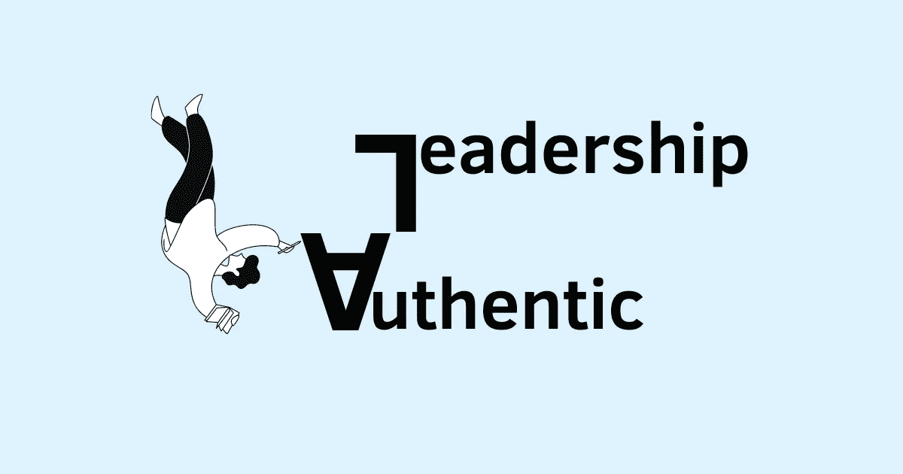

# 让领导者站在真正领导力错误一边的 5 个特征

> 原文：<https://betterprogramming.pub/5-traits-that-make-leaders-fall-on-the-wrong-side-of-authentic-leadership-294d19e4fbb5>

## 不要让你的真实性成为你的团队和组织的负担

鸣谢:作者

在我与领导的讨论中，真实性的话题一次又一次地出现。真实领导的想法实际上很吸引人。毕竟，如果一个领导者不可信，他们就不可能真正有效。

看到这些领导者努力利用真正的领导力来发展他们的员工和组织，感觉真的很棒。

然而，大多数人面临的挑战是，他们正确的意图并不一定转化为正确的行动。他们从理论上受到这个想法的启发，但发现将这些想法付诸实践很有挑战性。

我看到他们犯的最大的错误是试图活出一些伟大的形象。将他们的行为和行动与真实领导者的理想化版本相匹配，当他们未能激励团队和组织进行必要的变革时，会感到疲惫和失败。由于沉迷于成为他们最好的版本，他们无法展示他们真实的版本。

真实意味着做你自己，而不是别人。一个不完美的人。一个不知道所有答案的人。犯错误的人。既有优点又有缺点的人。一个准备好作为一个真正的人出现，并且不害怕表达自己情感的人。

> 现实是，没有人可以通过试图成为别人而变得真实。毫无疑问，你可以从他们的经历中学习，但是你不可能像他们一样成功。当你是真实可信的，而不是模仿的时候，人们会信任你——比尔·乔治，真北

我们来了解一下有哪些具体的做法让领导倒在了正宗领导的错误一边。

# 透明无边界

真实不是把一切都发泄出来，用我们根深蒂固的恐惧给别人增加负担，分享敏感信息，或者讲让别人感到不舒服的故事。

把真实的自己带到工作中并不意味着不知道健康的分享和不健康的盲目的信息倾倒之间的界限。

没有边界的脆弱会导致脱节、不信任和脱离。把一切都说出来或者无边界的揭露是我们保护自己免受真正的脆弱的一种方式——布琳·布朗，勇敢无畏

努力成为一名实践透明的领导者并没有错。但许多领导人走得太远了。他们无法区分什么是相关的，什么是不相关的。什么会让人们不知所措，什么会帮助他们做出更好的决定。哪些信息是重要的，哪些信息最好保持沉默。

当领导者跨越这一界限时，真正的领导力就成了一种负担。防止透明度成为证明滥用的借口的唯一方法是提出正确的问题:

*   为什么这些信息对我很重要？
*   对对方有什么帮助？
*   它与讨论有什么关系？
*   这个人是分享这些信息的合适人选吗？

激活你的大脑，思考在你目前的情况下什么信息是有意义的，这将帮助你实践真正的领导力，而不会有副作用。

# 不给别人留有余地

真实性需要高度的自我意识，以观察你的想法，质疑你的信仰，并愿意在面对新信息时更新你过时的思维模式。

这不仅需要了解你如何展示自己，还需要了解别人如何感受你的存在。如果走得太远，领导者可能会过于关注自己的行为和行动，以及他人对他们的看法，以至于他们完全不会注意到他人的需求或他们要说的话。

他们不愿意发现人民更深层的需求，无法以任何有意义的方式与人民沟通。他们未能建立信任，而信任是在一个组织中完成任何有意义的事情的基础。

考虑这个例子。领导者在会议上花越多时间担心如何给别人留下印象，他们就越没有时间和精力关注议程或需要他们关注的真正问题。如果太过努力地试图变得真实，他们实际上是不会有效的。

> 当一个领导人让自己成为人们担心的主要现实，而不是现实成为主要现实时，你就有了平庸或更糟的配方——吉姆·科林斯，从优秀到伟大

做真实的人需要明白你在哪里，你想去哪里，并且有意识地承认你一个人做不到。它需要“存在”在他人周围。这需要发现他们的优势并加以利用。最重要的是，它需要承认你的局限性，并告诉别人你需要它们。

# 跟上虚假的形象

工作中让员工分心的一件事是什么？这是领导者行为和行动的不一致性。当他们说一套做一套。当他们在工作中表现不一致时。

领导可能没有意识到这一点，但这种不一致性对员工的工作效率有着巨大的影响。毕竟，当面对相互矛盾的信息时，我们人类的大脑擅长编造理论和创造故事。忙碌的大脑试图把两个和两个放在一起，不能真正专注于手头的任务。缺乏适当的信息也使我们倾向于消极。我们可能会假设不良意图，[通过判断](https://www.techtello.com/hanlons-razor/)并想象最糟糕的可能结果。

当领导者试图以不符合其价值观的方式行事时，就会出现这种情况。坚持某个形象或某个信仰体系的伪装可能会奏效一两次，但冲突最终会在他们的行动中显现出来。

实践真正的领导力需要了解你的价值体系，并调整你的行动以与该价值体系保持一致。不是按照别人期望你的方式行事，而是知道什么是正确的事情，并有意识地努力去做，即使这在短期内会让一些人不开心。

# 让情绪影响判断

真正的真实需要拥抱情感。接受它们，但不要让它们影响你的判断。认为它们是做出深思熟虑的决定的有用信号。感受它们，但不要让它们成为无所作为的理由。

当拥抱情感妨碍了有效的对话时，真正的领导力就会出错。由于无法区分健康和不健康的情绪，一些领导者可能会让他们的情绪妨碍他们做正确的事情。例如，他们可能会试图避免或推迟冲突，而不是解决冲突，以避免这种对话往往会引发的强烈情绪。他们也可能害怕分享真实的反馈，担心这会伤害到其他人。

他们没有通过以正确的方式将正确的信息传递给正确的人来建立情感灵活性，而是让他们错误的真实感阻碍了他们寻找正确答案的愿望，鼓励他人敞开心扉，并激发信息的自由流动。

> 我们大多数人都认为我们的感觉是静态的，不可协商的，如果要真实地分享，就必须“照原样”分享。其实我们的感觉是基于我们的感知，而我们的感知是可以商量的。当我们以新的方式看待这个世界时，我们的感觉也会随之改变。因此，在分享感受之前，与自己协商是至关重要的

当领导者不消除他们的负面情绪或隐藏他们的感受时，真正的领导力就会显现出来。更确切地说，他们的行为是他们自己有意识地选择积极行动的产物，尽管感受到了那些感觉。

# 无法平衡人员和责任

当领导者认为关心他人和让他人承担责任是相互排斥的时候，真正的领导力就会出问题。他们可能把一个看得比另一个重要，只专注于让员工开心或者让他们负责实现业务目标。

他们没有意识到他们不需要对人友好来表示他们的关心。关心他们并不意味着他们不关心结果。

如果做得好，真正的领导者会直接表达他们的期望，但他们会感同身受。他们花时间去理解另一个人的观点，而不是做出判断或妄下结论。他们重视别人的偏好，而不是把自己的优先顺序强加给别人。他们不是只关注积极的情绪，而是给他们的人民空间来表达他们真实的情绪。通过拥抱不确定性和挖掘他们的动机，他们帮助他们的团队[在面临挑战和挫折时保持弹性](https://www.techtello.com/how-to-build-a-resilient-team-at-work/)。

平衡高期望与员工的学习和成长创造了一种卓越的文化，在这种文化中，他们的团队以及他们的组织蓬勃发展。

## 摘要

1.  真正的领导力将高效且极具价值的领导者与低效的领导者区分开来。
2.  理解真实性的反面对于避免掉进兔子洞是至关重要的。
3.  真正的领导力不是随心所欲地自由说话和做事。它要求明确区分增加价值的信息和成为负担的信息。
4.  真正的领导需要没有自我困扰的自我意识。关注你如何给别人留下印象并不意味着你不再关注他们的需求。
5.  真正的领导力不是坚持某种形象或采纳某种信仰体系。它需要了解你的价值观，并调整你的行动以符合这些价值观。
6.  真正的领导力需要拥抱情感，但不要让情感妨碍有效的对话。
7.  最后，真正的领导力需要采取一种关心他人和让他人承担责任并不相互排斥的心态。

在[推特](https://twitter.com/techtello)上关注我，了解更多故事。

*这个故事最初发表于*[*https://www.techtello.com*](https://www.techtello.com/authentic-leadership/)*。*