# 在 iPad 上使用 Python 的 5 种方法

> 原文：<https://betterprogramming.pub/5-ways-to-use-python-on-an-ipad-a6b780de64fc>

## 我把 MacBook Pro 换成了 iPad Pro。下面是我如何在 iPad 上用 Python 编码的


照片由 [Ern Gan](https://unsplash.com/@ern?utm_source=medium&utm_medium=referral) 在 [Unsplash](https://unsplash.com?utm_source=medium&utm_medium=referral) 上拍摄

当苹果在 2021 年 3 月发布 M1 iPad Pro 时，我用我的 MacBook Pro 换购了最新的平板电脑。我已经把 Mac Mini 作为我的日常工作，所以我不关心我的日常编码工作流程。但我非常好奇 iPad 上的编码是什么样子，以及一个全功能的专业编码设置是否可能。

虽然 iPadOS 仍然无法获得原生 Python IDE 体验——可能永远也不会——但事实证明，在 iPad 上用 Python 编码其实很容易，尤其是如果你愿意在 Jupyter 笔记本上工作的话。你甚至不需要 iPad Pro！

这里有五种方法可以让你在任何 iPad 上用 Python 编程。

# 1.甲壳

我在 iPad 上使用 Python 的首选应用是尼古拉斯·霍尔茨丘奇的神奇应用。在你的 iPad 或 iPhone 上给你一个 Unix 风格的终端，而且完全免费。也挺厉害的。你可以从[这里](https://apps.apple.com/us/app/a-shell/id1473805438)直接在你的 App Store 上下载。

安装并打开 *a-Shell* 后，输入`help`即可快速浏览该应用:

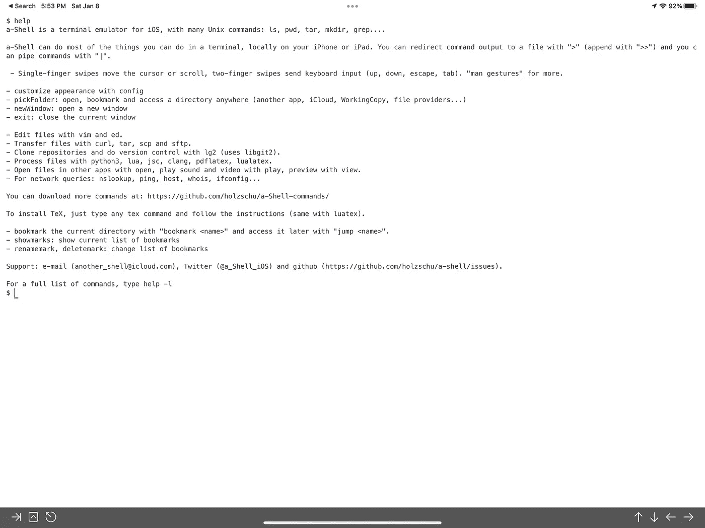

`a-Shell`自带`vim`和`ed`用于编辑文件，并且开箱即用包含 Python 3.9。下面是在`vim`中编辑 Python 文件的样子:

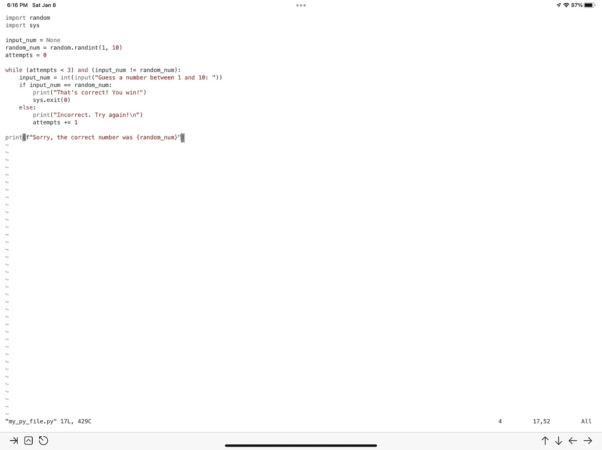

非常好！

> **提示:**如果你用的是苹果的 iPad 魔法键盘，那么你就没有实体的`Esc`键。这使得在 vim 中工作很痛苦，直到你发现`Cmd + .`像`Esc`一样工作。如果您愿意，您可以在 *a-Shell* 的设置中将`Caps Lock`更改为`Esc`。
> 
> 您还可以将 Magic Keyboard 上的 globe 键映射为 Settings 应用程序中的`Esc`。

`a-Shell`与 iPadOS 15 的多任务功能配合得很好。你可以打开新窗口，将`a-Shell`与另一个应用并排放置，并且——我的最爱——在滑动模式下使用`a-Shell`。

我在我的 iPad 上做了很多阅读。当我在 Python REPL 中遇到我想要查看的东西时，能够从我的 iPad 的右侧滑动，在 REPL 中快速查看一些东西，然后通过向右滑动关闭应用程序，这非常有用:

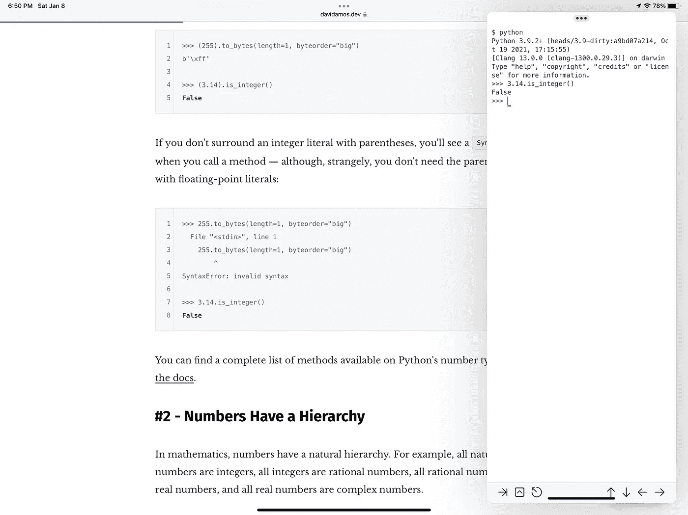

你可以在`a-Shell`中使用`pip`安装 Python 包，只要那些包是纯 Python 的。

不可否认，这对于许多人来说是一个严重的限制，但是它确实允许你安装一些非常棒的包——包括 Will McGugan 的非常棒的库:


除了是在你的 iPad 上使用 Python 的一个好方法外， *a-Shell* 还有很多其他有用的特性。您可以浏览 iPad 的文件系统，使用`curl`传输文件，生成 SSH 密钥，SSH 到远程服务器，等等。你甚至可以用 C 和 C++编写程序，在你的 iPad 上运行。

`a-Shell`的一个主要缺点是缺乏对 Python 虚拟环境的支持。这意味着 *a-Shell* 非常适合测试，或者做一些基本的纯 Python 编程，但是它不太适合专业开发。

# 2.通行证

[*Carnets*](https://holzschu.github.io/Carnets_Jupyter/) 是一款免费的独立 Jupyter 笔记本应用[，可在 iPad](https://apps.apple.com/us/app/carnets-jupyter/id1450994949) 和 iPhone 上使用。您将获得完整的 Python 和 Jupyter 实现——无需连接到外部 Jupyter 服务器——以及一些有用的 Python 包，包括 NumPy、pandas 和 Matplotlib。

您可以创建、查看和编辑笔记本文件，包括您在其他地方创建的或同事发送给您的文件。我最喜欢它的一点是它“很好用”下载应用程序，几分钟后你就可以在 iPad 上运行 Jupyter 笔记本了。

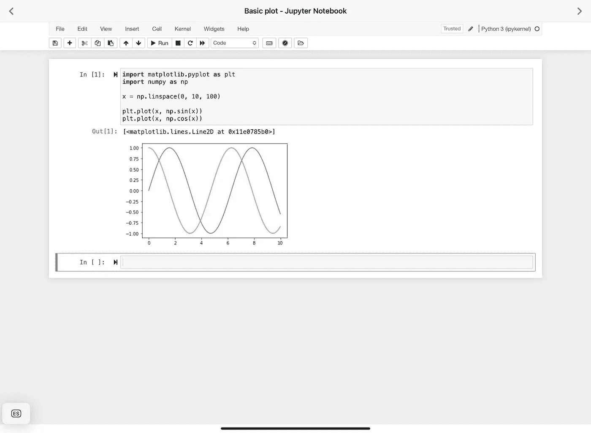

Carnet 的界面看起来就像浏览器中的 Jupyter。但所见即所得。这里没有任何花哨的东西。

如果您需要安装一个没有*通行证*的软件包，您可以使用笔记本电池内部的`%pip install`来安装该软件包:

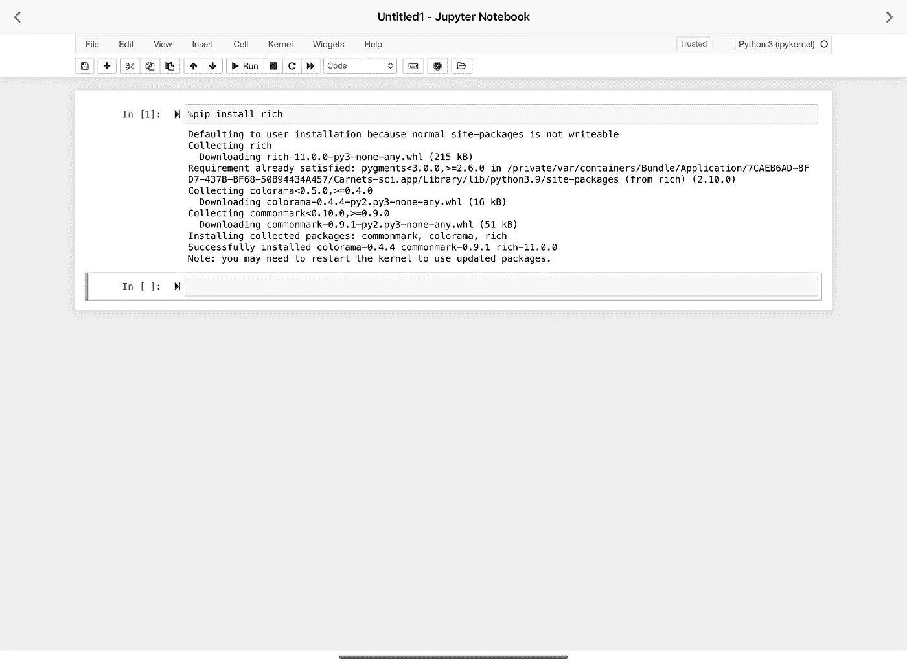

要查看您用*通行证*获得的所有 Python 包，请运行`%pip list`。有很多——尽管你在下面的列表中看到的很多都是我安装的或者是我安装的软件包的依赖项:

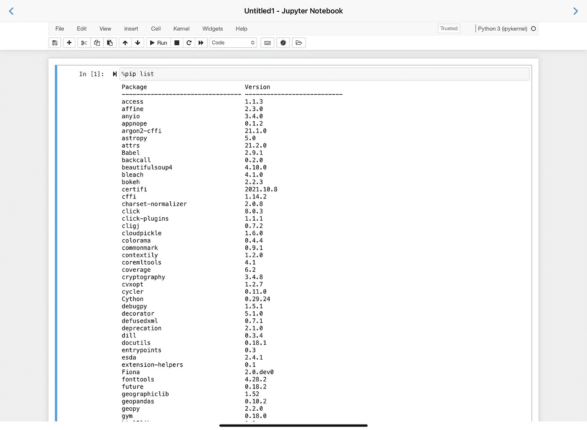

App Store 中有两个版本的*通行证*:

1.  [通行证——Jupyter](https://apps.apple.com/us/app/carnets-jupyter/id1450994949)
2.  [Carnets–Jupyter(带 scipy)](https://apps.apple.com/us/app/carnets-jupyter-with-scipy/id1559497253)

carnets-Jupyter(带`scipy`)包括几个额外的软件包，可以在你的 iPad 上进行机器学习:`scipy`、`seaborn`、`sklearn`和`coremltools`。如果你能负担得起额外的空间，我强烈推荐下载*Carnets-Jupyter(带* `scipy` *)* 而不是基础`Carnets` app。

和`a-Shell`一样，`Carnets`应用不允许你创建孤立的 Python 环境。你不得不使用全球环境和应用程序预建的任何软件包版本。

# 3.朱诺

Juno 是另一款用于 iPad 的 Jupyter 笔记本应用，自称是 Jupyter IDE。像*通行证*一样，你可以将 Python 与一些额外的包捆绑在一起。与通行证不同的是，*朱诺*售价 15 美元，并带有一些不错的额外功能。这是[链接](https://apps.apple.com/us/app/juno/id1462586500)到它的下载页面。

*Juno* 凭借其时尚现代的 iPad 界面从 *Carnets* 中脱颖而出:

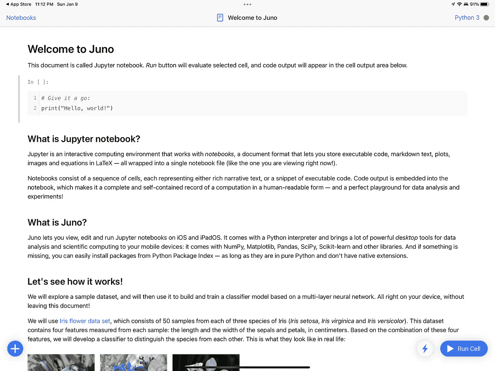

您可以通过按下单元格内的`Shift + Enter`或点击屏幕右下角的蓝色`Run Cell`按钮来运行单元格。

闪电按钮可让您快速访问一些常见任务。您可以将单元格类型从“代码”更改为“标记”,上下移动单元格，以及剪切、复制、粘贴和删除单元格:

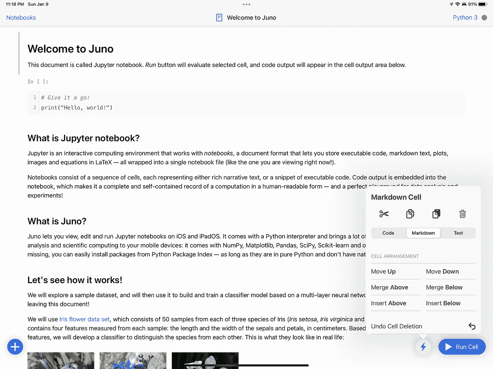

虽然 Carnets 可以在你的 iPad 上的任何地方打开 Jupyter 笔记本，但它的界面对 iPad 并不友好。相比之下，Juno 的文件拾取器在 iPad 和 iOS 设备上感觉就像在家一样:

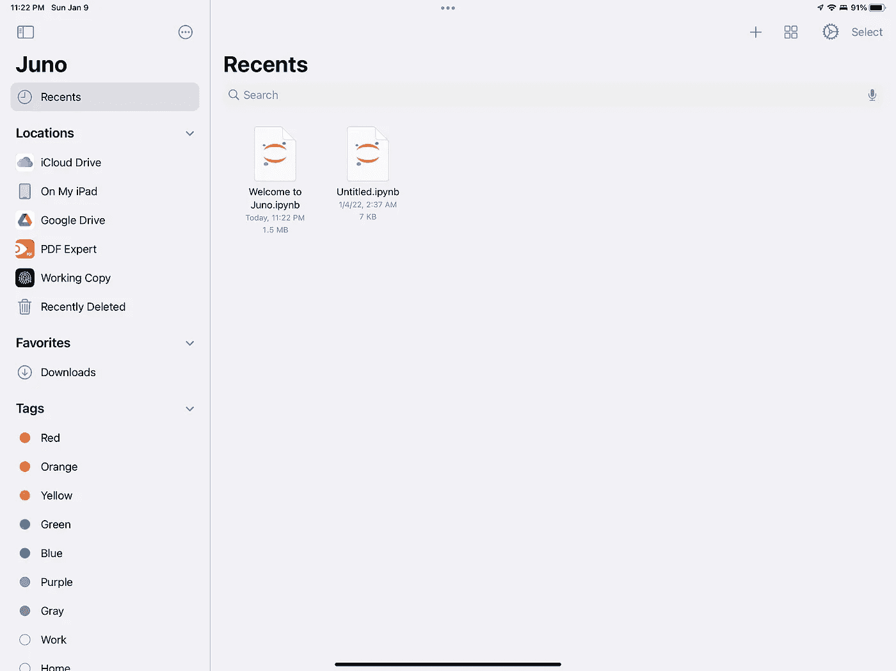

Juno 的另一个亮点是内置的类似 IDE 的标签补全和工具提示:

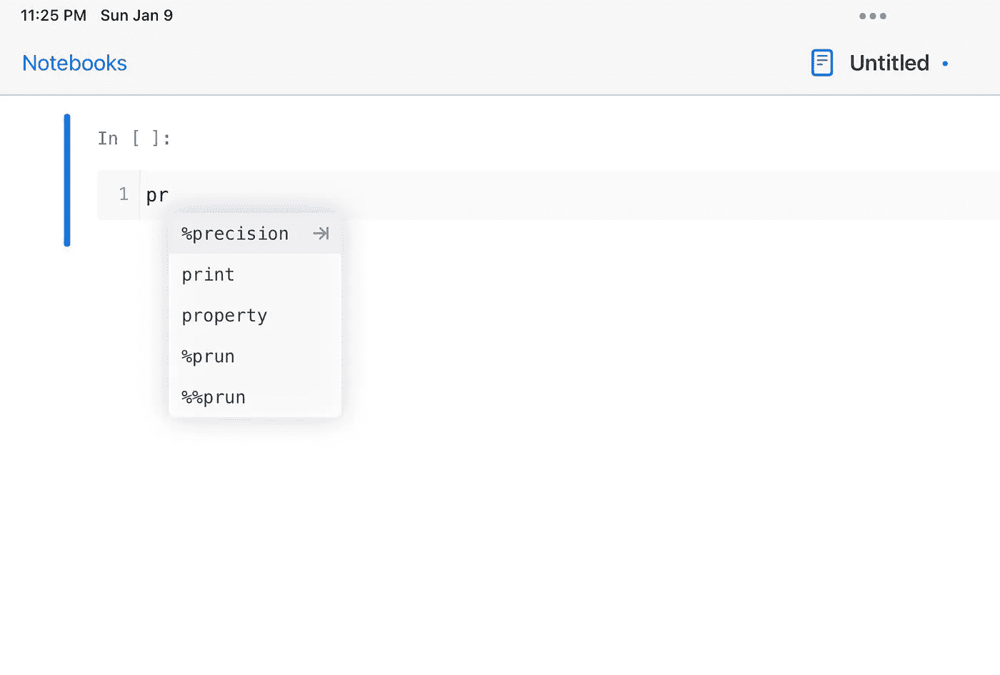

和 Carnets 一样，Juno 也有一套内置的软件包。但是你不能像在通行证中一样在牢房中运行`%pip list`来查看它们:

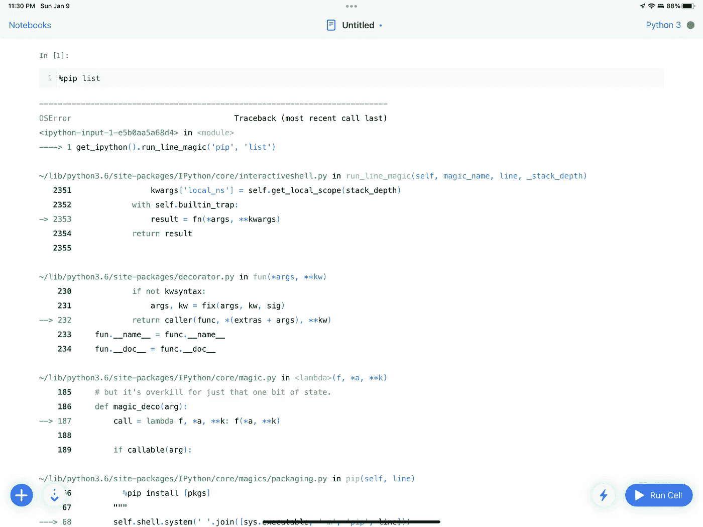

Juno 中的包管理实际上有点令人失望，尤其是对于一个付费的应用程序。

我找不到预装了 *Juno* 的软件包的完整列表，但这里有一些开箱即用的导入:

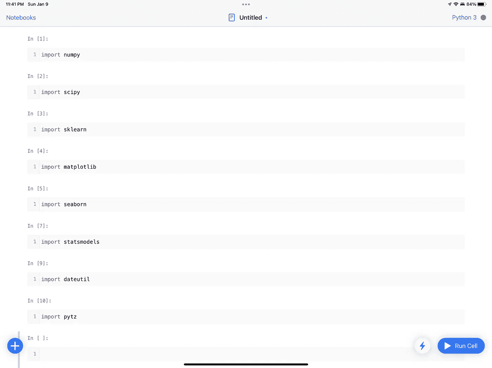

要安装软件包，单击屏幕上方中央的笔记本名称，然后选择*安装 Python 软件包。*你会看到如下对话框:

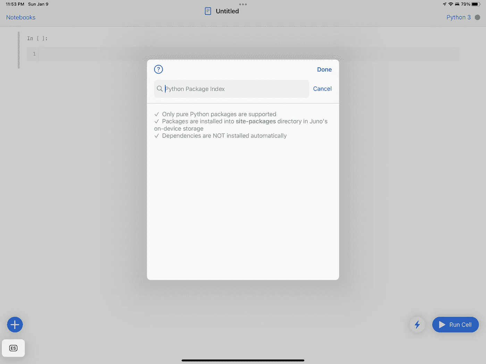

和 *Carnets* 和 *a-Shell* 一样，只能安装纯 Python 包。但是与 *Carnets* 和 *a-Shell 不同的是，*你安装的软件包的任何依赖项都不会自动安装。你需要一个接一个地手工安装它们。

Juno 的软件包管理器的一个好处是，在安装软件包之前，您有机会看到软件包的一些元数据，包括依赖项——只需按一下按钮就可以安装:


正如我之前提到的，你不能在 *Juno* 中使用`%pip list`来查看你已经安装到 *Juno* 环境中的包。事实上，*无法从 *Juno* 中查看您已安装的软件包。*

相反，你必须打开*文件*应用并导航到 *Juno* 的设备存储中的`site_packages/`文件夹:

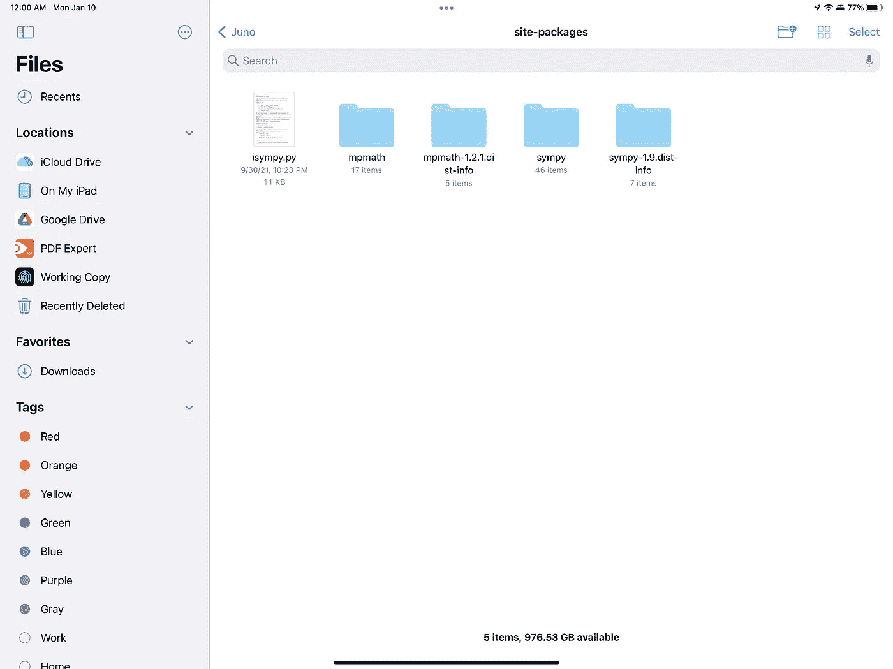

如果你想移除你已经安装的软件包，你需要从`site_packages/`中手动*移除。我觉得这是一个很大的缺点。我真的很欣赏使用由*通行证*支持的`%pip`魔法命令快速访问`pip`。*

尽管有笨重的软件包管理器， *Juno* 看起来确实比 *Carnets* 好得多，标签完成和工具提示确实提高了生产率。如果这些功能对你很重要，并且你愿意支付 15 美元，那么朱诺是一个不错的选择。

# 4.朱诺连接

*Juno Connect* 是一款 Jupyter 笔记本客户端应用，可用于访问远程服务器上的 Jupyter。所以，从技术上来说，Python 并没有在你的 iPad 上运行，但是 *Juno Connect* 为远程笔记本服务器提供了一个漂亮的界面。你可以花 10 美元从应用商店购买。

当您第一次启动 *Juno Connect* 时，您会看到一个屏幕，上面有一些准备试用的笔记本电脑，以及连接到远程笔记本电脑服务器的几个选项:


*Juno Connect* 开箱即用的 Cocalc 和 Binder 等支持服务。你也可以连接到托管在其他地方的 Jupyter 服务器，比如在[数字海洋](https://digitalocean.com/)的 droplet 上。

当您连接到笔记本服务器时，您将看到如下所示的屏幕，您可以在其中创建新的笔记本或选择要打开的笔记本:

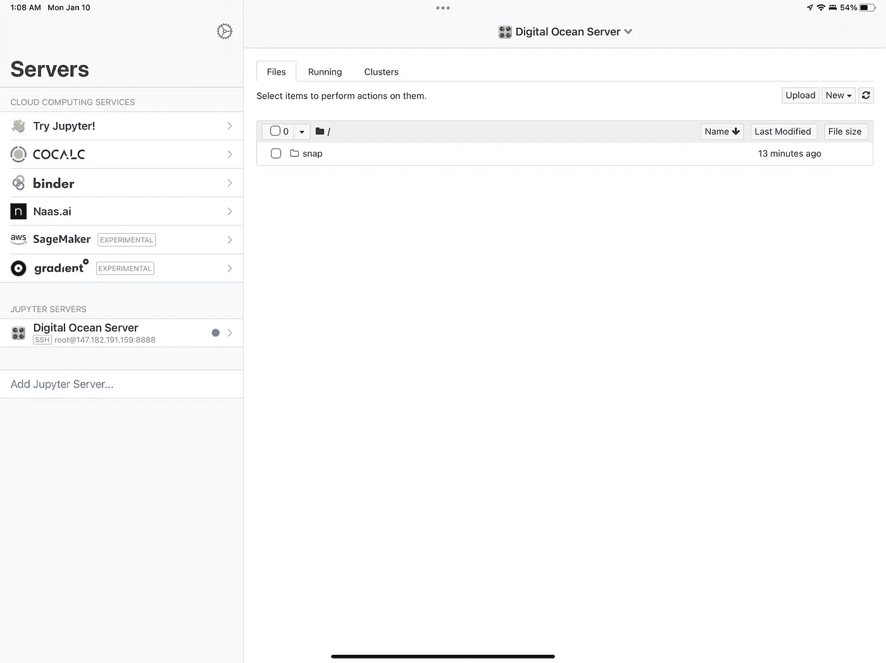

打开或创建新笔记本后，您会看到一个与典型的 *Juno* 界面一模一样的界面。由于笔记本电脑运行在外部服务器上，您可以访问所有典型的 Jupyter 功能，包括无法与本地版本的 *Juno* 一起使用的`%pip`魔法:


*Juno Connect* 的一个很好的特性是能够将远程笔记本导出到 iPad 上的本地文件:


您甚至可以将笔记本导出为新笔记本，这样您就可以保存本地副本，以便在 *Juno* 或 *Carnets* 应用程序中离线使用。

# 5.Codeanywhere 云 IDE

我列表中的最后一个选项不是 iPad 应用程序，它不能在你的 iPad 上本地运行 Python，但如果你需要访问一个成熟的开发环境，它绝对是必不可少的。这个解决方案就是[Codeanywhere Cloud IDE](https://codeanywhere.com/?ref=davidamos)——一个每月 6 美元的工具——你可以使用[我的链接](https://apps.apple.com/us/app/juno-connect/id1315744137)下载它(披露者:我将赚取佣金)。

一旦您选择了一个计划并创建了一个帐户，您将被带到您的仪表板，在那里您可以创建新的容器来处理项目:

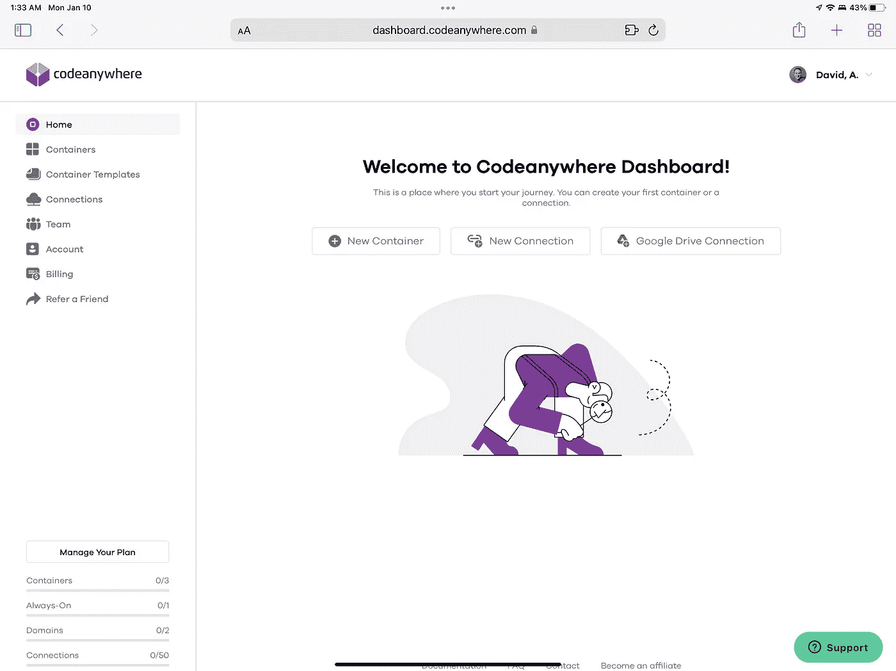

当你点击 *New Container，*你将有机会使用一个空白的 Ubuntu Linux 容器，或者从一些预定义的容器中选择预安装了各种语言的容器:

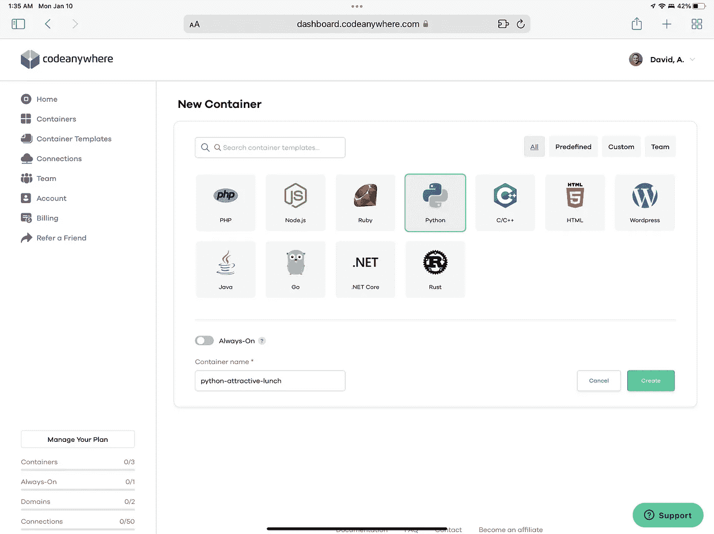

创建容器后，需要几分钟时间来启动它，并在您的控制面板中可用:

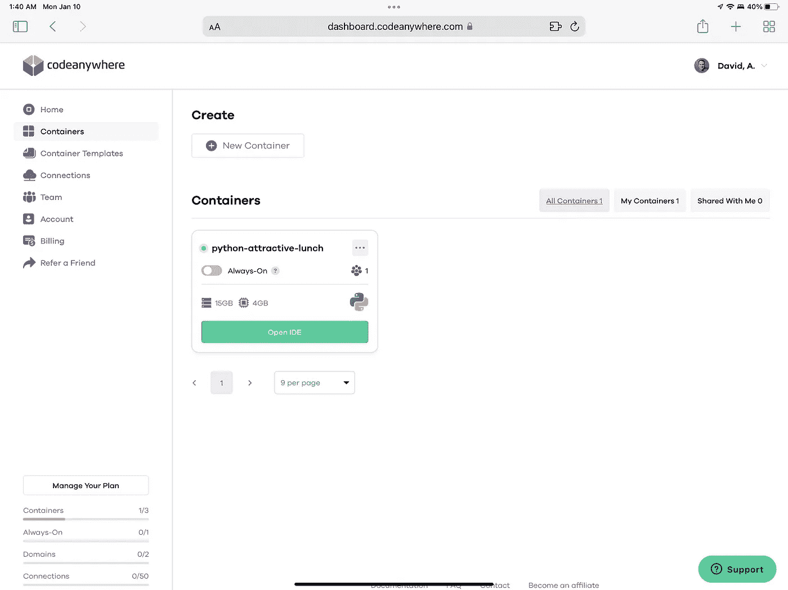

每个容器获得的资源取决于您选择的计划。我的计划给了我 15GB 的存储空间和 4GB 的内存。

单击绿色的*打开 IDE* 按钮，在新的浏览器选项卡中启动 IDE:

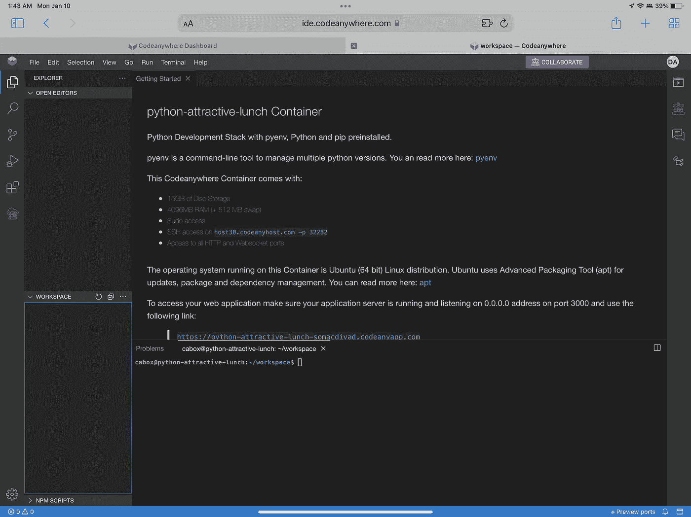

如果您熟悉 VS 代码，那么在 Codeanywhere 的 IDE 中，您会有宾至如归的感觉。它的功能非常全面，包括 linter 和调试支持:

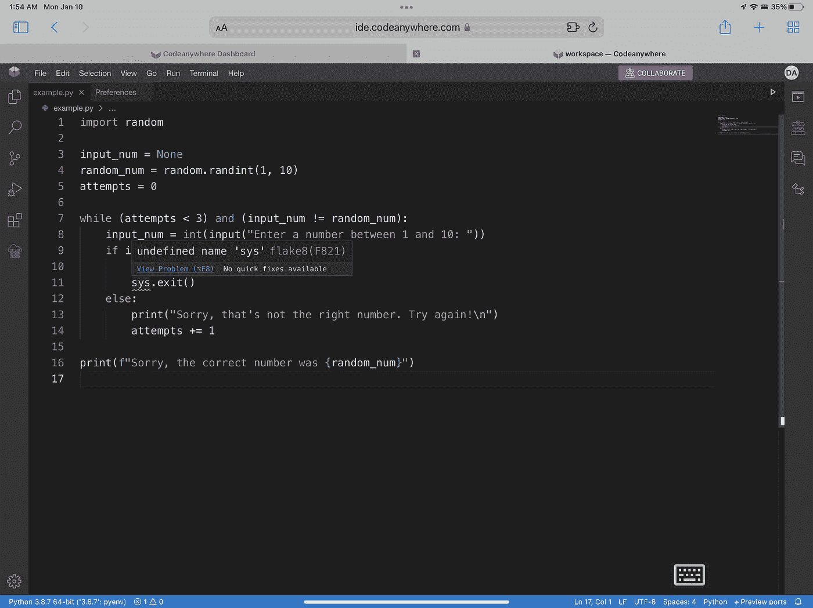

你甚至可以安装扩展！

与列表中提到的其他选项相比，Codeanywhere 价格较高。它还需要互联网连接。但是，我不能没有它。这是我发现的在我的 iPad 上做一些核心编码的最好方法。

# 在 iPad 上用 Python 编码的其他方法

我提到的五个工具是我目前每天在 iPad 上运行 Python 时使用的工具，但是还有许多其他选项值得一提。

## Pythonista3

每当我在 iPad 上提起 Python 编码，我都会得到一连串赞扬`[Pythonista3](https://apps.apple.com/us/app/pythonista-3/id1085978097)`应用的评论。曾几何时,*蟒蛇皮是一个很好的选择，但在我看来，现在不再是这样了。*

首先，`Pythonista3`似乎被彻底抛弃了。上一个版本是在一年多前发布的，当时还没有 iPadOS 14(在撰写本文时，iPadOS 的当前版本是 15)。其次， *Pythonista3* 只支持 Python 3.6，该版本[已于 2021 年 12 月达到其生命周期的终点](https://pythonspeed.com/articles/stop-using-python-3.6/)。

## PyTo

[*PyTo* 应用](https://apps.apple.com/us/app/pyto-python-3/id1436650069)是 Python-for-iPad 领域的有力竞争者。Python 3.10 可以在本地运行，具有良好的 IDE 风格的体验，支持编辑多个文件，还有几个额外的包，包括 NumPy、SciPy、Scikit-learn 和 statsmodels。完整的应用程序体验价格为 10 美元。

我目前正在测试 PyTo，看看它是否适合我的日常使用。如果它实现了它的承诺，您可能会在本文的未来更新中发现它在列表中的位置更高！

## Google Colab

谷歌的 [Colab](https://colab.research.google.com/) 是一款基于浏览器的笔记本，基于 Jupyter 笔记本。您的代码运行在私有虚拟机上，该虚拟机预装了大部分 Python 科学堆栈。你甚至可以免费使用 GPU，这使得 Colab 成为机器学习项目的一个很好的选择。如果你需要保证正常运行时间和更多的电力，请查看 [Colab Pro](https://colab.research.google.com/signup) 。

## vscode.dev

如果你不需要 Python 在本地运行，但是想要一个可靠的 IDE 体验，请查看 [vscode.dev](https://vscode.dev/) 。您可以快速克隆一个外部代码库，并直接从浏览器开始使用 Python 编码。Python 语言还没有一流的支持——坚持使用 JavaScript 和 CSS 等“webby”语言以获得最佳体验——但在必要时，它可能是一个不错的免费替代品。

## GitHub 代码空间

我从未使用过 GitHub 的[代码空间](https://github.com/features/codespaces)项目，但是如果你的团队或企业计划中有 GitHub 组织，这可能是一个不错的选择。它看起来非常类似于 Codeanywhere。

## pyodide

[pyodide 项目](https://pyodide.org/en/stable/)将 Python 和 Python 科学堆栈中超过 75 个包全部编译到 [WebAssembly](https://webassembly.org/) 中，从而将它们带到任何浏览器中。您可以在 [REPL](https://pyodide.org/en/stable/console.html) 中尝试`pyodide`，并将其加入书签，以便将来快速访问。

## iPad + RaspberryPi

另一个选择是[通过 USB 将你的 iPad 连接到 Raspberry Pi](https://www.raspberrypi.com/news/connect-your-raspberry-pi-4-to-an-ipad-pro/) ，这允许你作为以太网设备访问 Raspberry Pi。这真的很酷，但就我个人而言，我不想随身携带任何多余的设备。不过，这确实是一个有趣的小项目，并且可以让您访问完整的本地开发服务器。

# 最后的想法

我很想在 iPad 上看到像 VS Code 这样的 IDE 原生版本，但我认为这永远不会发生。然而，在 *a-Shell* 、 *Carnets* 和 Codeanywhere 之间，我已经能够在我的 iPad 上做我需要做的一切。当然，您的里程可能会有所不同。

所以，2022 年，在 iPad 上用 Python 编码不仅可行，实际上还挺好玩的！

```
**Want to Connect With the Author?***Get a curated list of five curiosity-inducing articles and resources each week from around the Python and Julia communities by subscribing to my* [*Curious About Code newsletter.*](https://davidamos.dev/curious-about-code-newsletter)
```