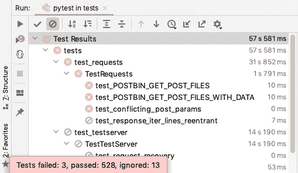
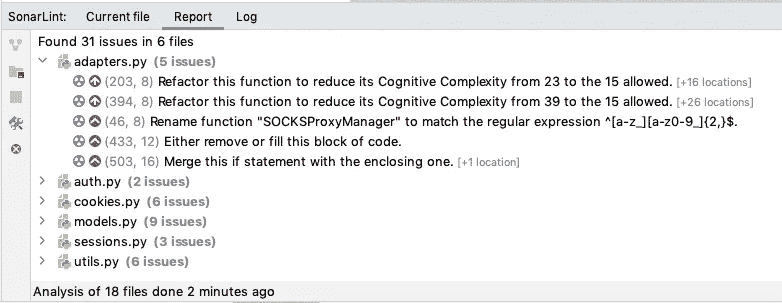

# 面向任何级别开发人员的 6 种生产力实践

> 原文：<https://betterprogramming.pub/6-productivity-practices-for-developers-at-any-level-dc840b91557>

## 如何成为更好的开发人员并完成更多工作

迈尔斯·谭在 [Unsplash](https://unsplash.com?utm_source=medium&utm_medium=referral) 上的照片

人类是复杂的生物，完成工作的动机多种多样。作为开发人员，我们的动机不完全是外在的或财务上的——有时是为了交付代码的快乐。

你可能是一个*托运人，*一个为了成就感和能够与家人共度时光而喜欢快速托运代码的人。这是开发人员调用 [Yagni](https://en.wikipedia.org/wiki/You_aren%27t_gonna_need_it) 来交付有价值的东西。

然而，你在两个城镇之外的家中工作的同事可能是一个*规划者，一个重视创造正确的抽象概念并完成设计的内在回报的人。*

你们两个可能有不同的*方式*，但是你们都想要相同的结果——生产力*。我以前的几个经理可能不同意，但我相信不管动机如何，大多数人都想变得高效。所以，无论你是发货人还是计划员，这里有六个技巧可以帮助你最大限度地提高效率，加快交货速度。*

# *1.为工作使用正确的语言*

**

**作者现在锤子多了。来源:作者**

*我曾经有一个室友把我的钳子当锤子用。他成功地挂上了他的照片，但是我的钳子坏了。锤子会干得更快。类似地，为您团队的应用程序使用正确的编码语言可以在快速有效地完成工作方面产生巨大的差异。*

*比如 [Python](https://www.python.org/) 扎根于科学计算，对于数据科学非常优秀。重视稳定性和处理问题的一致方式的开发人员会喜欢 Python。相比之下， [Ruby](https://www.ruby-lang.org/en/) 是优秀的网站表达代码，Ruby 社区容忍对同一问题的多种方法。*

*PHP 是快速服务器端应用程序的绝佳选择，可以部署在任何地方。有大量的 PHP 开发人员可以为您的项目工作，语言和生态系统已经走过了漫长的道路。 [Node.js](https://nodejs.org/en/) 允许 web 开发者在服务器端使用与客户端相同的语言，代价是增加了一些复杂性。如果您正在寻找一种高度交互式的客户端体验，您可能会选择针对 Node.js 进行优化*

*无论如何，不要让最新的时尚影响你的语言选择。使用最适合你独特项目的语言和方法。十年前，我们开始在服务器端使用一些 JavaScript 装饰来呈现页面。大约在十年中期，我们开始使用 REST 或 GraphQL APIs 在客户端呈现数据。在 2020 年初，我们强烈反对简单的应用程序，这些应用程序使用一些类型脚本装饰来呈现服务器端。*

# *2.不要滚动您的验证*

*我参与过几个项目，团队在应用程序中实现了定制的身份验证，包括将加盐密码散列保存到数据库中。我们不需要。当时，我们拥有将身份验证委托给 Active Directory 的基础架构，因此用户可以享受与其 Windows 登录相同的密码。然而，[康威定律](http://melconway.com/Home/Conways_Law.html)和利己主义者看到了这种可能性。开发经理不喜欢基础设施经理，开发发生在无法访问公司网络的地方。*

*既然 [Auth0](https://auth0.com/) 等类似产品已经存在，是否还要经历实现认证的麻烦和风险？将身份验证委托给 Auth0 可能是一个更好的工程权衡，这样您就可以获得一个 MVP，然后在扩展时考虑成本问题。您还将获得许多附加功能，并为您的应用程序提供更好的安全性。*

*很多人造船，但很少有人制造舷外马达。当你可以买一辆雅马哈回家的时候，为什么要被困在海上？*

# *3.首先编写单元测试*

**

**单元测试输出**

*我们明白了。编写单元测试就像刷牙一样。不过，刷牙总比蛀牙好。有时你只是想直接实现代码，而测试成了障碍。有那种感觉没关系。*

*不允许测试驱动你的设计就直接进入实现会让人感觉富有成效。然而，您可能最终得到的代码让[闻到了](https://refactoring.guru/refactoring/smells/bloaters)——长方法和长参数列表仅仅是个开始。最终，您的代码将更难测试和维护。当然，有时你需要探索一个想法，并粉碎代码。只是要确保进行“git 重置”,并通过单元测试再次实现它。你最终会得到一个更好的设计。*

*附加的、事后的单元测试非常容易发现。它们通常非常粗糙，因为它们需要实例化大型类并断言它们可以工作。这种方法并没有给你单元测试的真正价值。一个写得很好的单元测试将帮助你梳理出关注点，并根除或嘲笑现实世界中使事情发生的依赖性。测试与现实世界相关的代码可能会很困难。当你完成了分离关注点的工作后，事情就简单多了。*

*如果这还不足以说服你，要求更多的时间以便你可以在之后添加测试*你已经使未测试的代码工作(并通过 QA)会让你的项目经理生气。更别提“[重构](https://www.refactoring.com/)这个词了**

**

**红色，绿色，重构。来源:* [*自由 SVG*](https://freesvg.org/red-green-refactor-street-sign-vector-drawing)*

***为了成功地进行单元测试，将特性分解成“红色、绿色、重构”的小循环***

*   *红色—从编写一个失败的单元测试开始。剔除真实世界的活动，这样你就可以在任何时候运行单元测试。*
*   *绿色——编写通过单元测试的代码。*
*   *重构——如果您需要清理代码，现在是时候重构并再次运行单元测试了。*

*并重复。*

*使用这种模式，你会对你的代码更有信心，并且当你完成时，你可以对项目经理微笑。*

# *4.利用 SaaS、IaaS 和 PaaS*

*当系统管理员穿着军靴，皱着眉头，把服务器放在机架上时，很明显他们的工作与开发人员的不同。如今角色不那么明确了。团队不再像过去那样配备人员；人们期望我们拥有比以往更多的技能，并随时随地投入到需要的工作中。开发人员经常花太多时间去做*非*代码任务，比如基础设施、开发、集成等等。是的，这些任务是重要的，但它们并不构成工作软件。*

*像 [AWS](https://aws.amazon.com/) 这样的基础设施即服务(IaaS)提供商承担运行基础设施的全部工作，并让它消失。您可以通过简单的 *git 推送来部署应用程序的新版本。*无需执行子网计算或设计网络架构，也无需与数据库管理员争论；IaaS 供应商会为您解决这个问题。*

*越来越好了。有数以百计的供应商把曾经是项目杂务的东西作为服务来提供他们的软件(SaaS)。*

*例如，不需要配置 Logstash 和 ElasticSearch 复制。至少有六家公司会从你的应用程序中获取所有日志，允许你搜索它们，并在 90 天后删除它们，这样你就不会在未来受到 [GDPR 的罚款](https://www.ctrl.blog/entry/gdpr-web-server-logs.html)。许多公司也将发送电子邮件和短信，只需要一张存档的信用卡和一个 API 客户端。二十年前，那些脾气暴躁的系统管理员会同时配置 Sendmail、阅读日志、喝咖啡和咒骂。*

*当然，没有灵丹妙药。你需要有一种方法来找到所有这些服务的更可靠和谨慎的供应商。集市可能会很吵。此外，为所有这些供应商付费也让人恼火。理想情况下，你不会把经理的信用卡放在每个应用程序中，让他们每月跳舞，以获得报销发票。*

*最后，像 Heroku 这样的平台即服务(PaaS)提供商在过去十年中一直在研究如何外包应用托管和附加市场。他们负责基础设施*和*平台，并预先配置了各种技术堆栈。您可以向第三方供应商寻求帮助，在几个小时内将想法推向市场，并通过一张账单轻松支付他们的服务费用。*

# *5.听听你的想法*

**

**针对 Python 代码的 SonarLint 分析**

*在希腊神话中，卡桑德拉是阿波罗的女祭司。卡珊德拉被诅咒拥有永远不会被相信的预言。你的 IDE 就像卡珊德拉做预言——你的圈复杂度太高，或者 case 块没有最终的默认子句。如果不听 IDE 的话，可能会花很多时间调试。*

*除了 IDE 或编辑器的内置特性之外，还有一个巨大的 linters 生态系统。SonarLint 值得特别一提，因为它支持最流行的 ide(Eclipse、IntelliJ、Visual Studio、VS Code ),并为安全问题、细微错误迹象和代码气味提供一流的建议。如果你的团队使用[sonar cube](https://www.sonarqube.org/)来度量代码质量，这将是一种强大的力量。在您的 IDE 中修正这些建议意味着您将被视为提交了安全且可维护的代码。*

*让你的 IDE 成为一个*可信的*先知，就像[雅典娜](https://en.wikipedia.org/wiki/Athenais_(seer))一样。这些建议降低了代码中的风险和复杂性。*

# *6.制定一个构建过程，并且要快*

**

**Gnu Make 标志**

*一个好的构建工具是一辆看不见的火车，你的代码乘着它走向生产。作为一名单独的开发人员，您可能会选择从您的 IDE 在本地开发环境中运行您的测试和部署。这很好，因为你可能会有一个快速的反馈回路。这让你可以整天试验代码。*

*然而，当你开始与他人合作时，你会希望代码在 [CI/CD 管道](https://en.wikipedia.org/wiki/CI/CD)中运行，这在历史上不太适合桌面开发工具。一个 [Makefile](https://en.wikipedia.org/wiki/Make_(software)) ， [*build.gradle*](https://en.wikipedia.org/wiki/Gradle) ，或者另一个适合你的语言和运行时环境的构建工具将会很好地插入，并且证明你的代码和测试在你的计算机之外干净地运行。此外，您还将获得一个自动化一些部署问题的地方，比如数据库迁移、打包、分发等等。*

*此外，设计良好的构建工具和实现将减少在已经完成的任务上花费的时间。您可能想一直运行单元测试，但是当所有依赖项都没有改变时，重新编译或林挺代码还有意义吗？*

*我在任何新项目中都会发现一个痛点，我已经在代码中做了一些基本的探索，需要开始生产。然后，我将注意力从编写代码转移到探索它与外界的交互。这是实现构建过程的时候了，然后配置您的 IDE 来运行它。*

# *更轻松、更快速的交付*

*将功能软件交付给欣赏它的用户是非常令人满足的。许多因素可能会影响您的生产效率和交付时间。然而，不管你喜欢快速运输还是慢速运输，你都可以采取切实可行的措施来使运输变得更加容易和快捷。我希望我在这篇文章中提到的六种提高效率的技巧中的一种能让你的工作和生活变得更容易一些。[神速度](https://www.etymonline.com/word/godspeed)。*