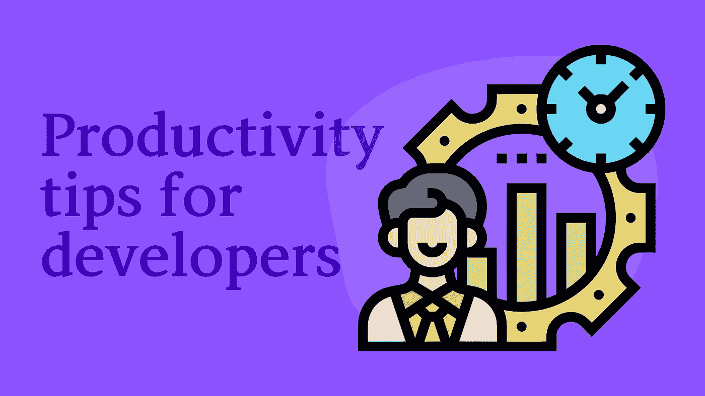

# 每个开发人员都应该知道的 6 个生产力技巧

> 原文：<https://betterprogramming.pub/6-productivity-tips-every-developer-should-know-9573ca52a1f6>

## 生产率

## 作为开发人员保持高效的技巧

作者图片

如果你是一名程序员，你很有可能无法胜任自己的工作。你会想在空闲时间从事你的激情项目。你会想为你喜欢的开源项目做贡献。成为一名程序员不仅仅是一份工作，而是一种生活方式。

即使只是工作，随着工作场所需求的增加，当你只有 24 小时的时间时，你也会努力平衡你的工作量和个人生活。当工作之外的项目也出现时，为了神奇地提高你的生产力，让你在更少的时间里做更多的工作，你不会做什么呢？

事实证明，提高程序员的生产率是一个可以实现的目标。令人惊讶的是，这种转变并不需要对你的日常生活做出重大改变。当你关心提高生产力时，你工作中的小事才是最重要的。

然而，在你采取任何提高生产率的策略之前，你必须明白，生产率并不等于你在电脑前花费的时间。有时我们让自己忙得团团转，却没有做任何真正有成效的事情。识别这样的情况会帮助你提高工作效率——用更少的时间做更多的事情——而不会消耗掉一天中的时间。

在本帖中，我们将看看六个技巧，它们将帮助你提高程序员的工作效率，更快地完成任务，从而为你生活中其他重要的事情节省更多的时间。并不是所有的方法对你们每个人都有同样的好处，但是它们总是可以根据你们的需要和习惯来定制，以提供长期的最大效果。

# 不要逃避休息

如果我说休息有助于你在工作时保持高效呢？乍一看，这似乎有悖常理。但是这是一个被[年的研究和数据](https://www.apa.org/monitor/2019/01/break)支持的事实。

当我们试图长时间专注于一项任务时，它会耗尽我们的思维，使我们的决策过程变得不那么有效。你会发现自己很容易被周围的环境分散注意力，或者花更长的时间来找出显而易见的解决方案。这种精神疲劳导致生产力不可避免的下降，最终导致你在电脑前花费数小时，却没有完成多少工作。

这些发现表明，连续工作四个小时而不休息并不是什么值得骄傲的事情。相反，至少每隔一个小时左右从工作中抽出预先计划好的休息时间，可以帮助你保持对工作的专注，从而提高工作效率。

番茄工作法是许多人用来在紧张的工作会议后让你的大脑有时间重新调整的极好方法。如果你不热衷于适应精确的番茄工作法，尝试并找出最大化你生产力的工作休息比。

你的休息时间可以很简单，比如做几个伸展运动，散散步，和同事聊聊天，或者泡杯咖啡。只要把你的注意力从工作心态上移开一小段时间。

## 休息帮助我们更有创造力

休息不仅能充实我们的大脑，还能帮助我们保持创造力。

研究发现，[一组工作时休息的人比一组不休息的人产生更多的想法。当我们长时间致力于一个单一的问题时，我们的大脑会发现很难退后一步，从不同的角度去解决我们当前正在考虑的问题。休息有助于我们脱离思考过程，让我们有机会在回去工作时用新的视角看待问题。](https://hbr.org/2014/03/how-to-have-a-eureka-moment)

休息让我们有空间看清大局，从而帮助我们更有创造力，成为更好的问题解决者。作为程序员生活中的一项日常要求，成为一名更好的问题解决者可以极大地提高我们的生产力。

如果你以前认为休息会阻碍你的工作效率，实际数据表明你应该接受休息作为提高工作效率的一种方式。所以，永远记住，在回去工作之前，给你的大脑一些休息的空间。

# 定制您的 IDE 以加快开发速度

无论您选择哪种 IDE 进行编码，定制它以最大化编码速度和准确性都是提高生产率所必须采取的措施。

毫无疑问，作为开发人员，IDE 必须是您花费大部分工作时间使用的工具。现代的 ide 有很多配置选项，可以根据每个开发人员的需求进行定制。从语法突出显示这样的简单事情开始，你可以配置它来帮助你完成单调重复的任务，这些任务会占用你大量的工作时间。

例如，您可以设置 IDE 来提供代码完成、代码建议、自动格式化和重构、代码分析和报告生成。如果您的 IDE 没有内置的配置选项来设置这些任务，请安装插件来处理它们。

这里的要点是不要把你的 IDE 当作一个比文本编辑器好一点的工具。利用 ide 这些年来的进步以及它们现在提供的一系列功能来自动完成我们以前必须手动完成的任务。适当地定制你的 IDE 甚至可以写出更干净的、可重用的代码，而不必花费太多宝贵的时间在手动重构上。

所以，继续寻找更多关于你的 IDE 配置选项和可用插件的信息，并正确设置它，这样可以立即提高你的工作效率。

# 掌握命令行

图形用户界面很酷。但它们也是我们工作时浪费时间的主要原因。每点击一次 GUI，系统就会等待一段时间来呈现新的界面。你可能认为时间可以忽略不计，但是如果把时间加起来，GUI 的使用会大大降低你的速度。

但是如果你掌握了命令行，你可以完成从[创建和编辑文件到处理大数据](https://www.nature.com/articles/d41586-021-00263-0)的任务，甚至不用离开键盘。的确，当您刚接触命令行时，掌握它可能看起来是一项艰巨的任务。在开始阶段，它确实有一个有点陡峭的学习曲线。但是一旦您通过了这个阶段，知道如何在命令行上工作就是一种奖励，可以大大提高您的生产率。

前一段时间我们写了一篇关于命令行的[介绍，这是初学者的完美起点。](https://livecodestream.dev/post/introduction-to-bash-for-beginners/)

# 自动化重复的东西

如果你学会了正确的做法，这种做法可以帮助你每周节省几个宝贵的时间。作为一名开发人员和一名简单的计算机用户，我们每天都要做许多重复的事情，这些事情最多只需要几个小时的编码就可以很容易地自动化。

运行本地项目构建和测试工作流、填写表格、做笔记和发送通用电子邮件是自动化可以让您有机会做一些更有成效的事情的一些实例。从长远来看，即使是自动化一个简单的任务，比如将下载的文件移动到正确的文件夹，也能节省大量的时间。

您可以使用像 Python、Javascript 或 Ruby 这样的脚本语言来处理自动化。虽然有些自动化任务只需几分钟就能完成，但其他任务可能需要更长时间—几个小时甚至几天。但是，如果您正在自动化的任务是乏味且耗时的，那么那些更长的自动化工作可能最终会得到回报。

然而，并不是每个可以自动化的任务都值得自动化。只有你才能判断你试图自动化的任务是否值得。对任务的资源手动执行和自动执行进行比较，并确定自动化是否有明显的好处。

# 让自己了解最新的工具和技术

作为开发人员，我们的工作是构建让我们的生活更轻松的软件。所以，每一个引入编程市场的新工具和技术都是带着这个目的而来的。保持对这些新工具的更新，以找到可以使您的编程生活更容易的工具，这是开发人员在该领域保持高效的必要条件。

始终关注最新的编程新闻和开发人员社区中的流行词汇，以确定可以让您在更短的时间内做更多事情的工具。在进行初步研究以确保它具有您正在寻找的正确功能集之后，您可以自己测试该工具，以发现它是否有提高您的生产率的潜力。

与 10 年前相比，随着像 CI/CD 和敏捷开发这样的技术的引入，程序员已经提高了他们的生产力。再过 10 年，当我们回头看现在的时候，会感觉到变化和今天一样剧烈。你必须适应这些快速变化的技术，以保持行业期望的生产力水平。

# 优先考虑你的工作

我们生产力下降的一个主要原因是没有在正确的时间做正确的事情。想想你做一个一个月后到期的任务的时候，因为你发现它很有趣，而到期的任务却越积越多。事实上，你此刻所做的是一种拖延。最终导致你的工作效率下降。

为了避免发现自己处于这种情况，总是努力做你任务清单上最重要和最紧急的任务，而不是去做你“想做”的事情。当你把紧急任务从你的盘子里拿走的时候，你的任务清单就不会像以前那样让人不知所措了。

当你专注于根据任务的紧急程度对其进行优先排序时，你就不再等待开始做某件事的合适时机了。你开始客观地看待你的任务清单，而不是依赖你的感觉。并且你开始在正确的时间以 100%的投入完成你的工作。

# 摘要

在这篇文章中，我们介绍了六个技巧和窍门，你可以遵循它们来提高你作为程序员的工作效率。生产率的提高不仅会让你的工作变得更加轻松，还会节省你与家人共度的宝贵时间，参与你的爱好，从事你热爱的项目。

如果一下子将所有这些改变应用到你的生活方式听起来很吓人，为什么不选择一个技巧，从那里开始你的转变呢？不管你打算如何在日常生活中使用这些建议，我们希望它们能以某种方式提高你的工作效率。

如果您对开发人员可以用来提高我们工作效率的技巧有什么建议，请不要犹豫，在我们的评论区分享它们。