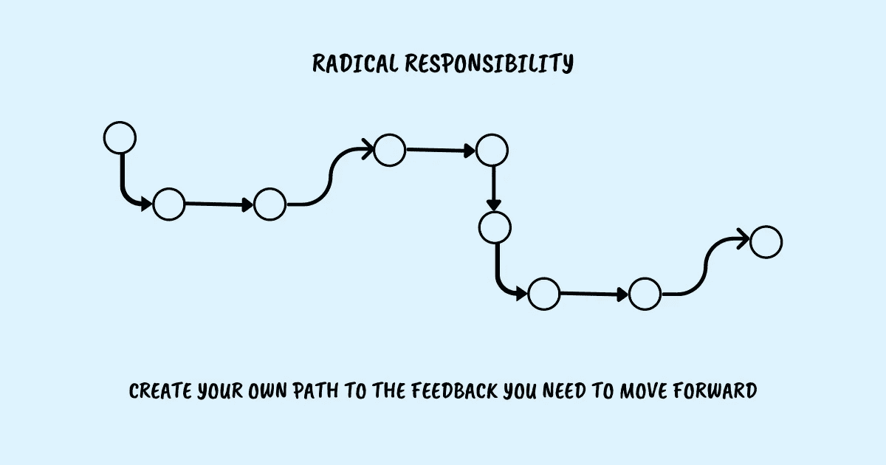

# 获得所需反馈的 6 个策略

> 原文：<https://betterprogramming.pub/6-strategies-to-get-the-feedback-you-need-e3a5b7b7885b>

## 在工作中获得成长导向反馈的技巧

鸣谢:作者

得到大量不可行的反馈和得不到反馈一样糟糕。结束反馈对话，让你感觉良好，却不知道如何改进，这可能对你的自尊有好处，但对你朝着目标前进没有任何帮助。

没有可操作的反馈，你无法改进。如果你不知道自己哪里做错了，你就无法进步。如果你不知道前进需要什么样的改变，你就无法进步。

你身边有人抱怨他们没有得到他们需要做得更好的反馈吗？你是那种人吗？

“我不知道如何才能让自己的角色更有影响力。我的经理总是告诉我，我做得很好，但她从来不告诉我如何才能做得更多。”

“我得到的反馈非常模糊。甚至都没有用。”

“上次我问的时候，我的同事告诉我一切都很好，但我能感觉到有些不对劲。”

想一想。你没有得到你需要的反馈是因为别人没有给你，还是因为你没有主动去得到你需要的反馈？

当我问这个问题时，许多人选择了一个简单的答案——问题不在我。是提供反馈的人。他们要么含糊不清、不诚实，要么不愿意分享他们的真实想法。大多数人认为给出正确反馈的全部责任在于反馈者，而忽略了他们作为反馈接受者在等式中所扮演的角色。

你得不到以成长为导向的反馈，不是因为其他人不愿意分享；那是因为你不愿意去做正确的事情。问题是你，不是他们。在《有意识领导的 15 个承诺:可持续成功的新范例》中，吉姆·德思默称之为“承担激进的责任”。

> “当我们责备别人时，我们会把生活的原因和控制力放在自己之外。当我们承担责任时，我们在自己身上找到了生活的原因和控制力。”—吉姆·德思默

获得你需要的反馈需要承担全部责任，相信你有能力在工作中推动自己的成长，而不是责怪别人没有进步。

以下是您如何获得以成长为导向的反馈，以了解您如何在工作中协作、沟通和创造价值:

# 1.做好心理准备

想要反馈和接受反馈是非常不同的。当获得反馈时，很容易只寻找那些与你自己的信念或你如何看待自己相一致的观点，而对任何与之相矛盾的事情进行辩护。那只是人类的本性。

摆脱我们的自然本能需要心智练习去接受没有判断和意见的反馈。这并不意味着你必须同意你遇到的每一条建议或批评。它仅仅意味着更开放地接受他人的观点。

如果你没有做好心理准备来摆脱这种谈话往往会引起的不适和恐惧，这种抗拒会自然地在你的声音或肢体语言中表现出来。当你真正对他们的反馈感兴趣时，当你只是重申自己的信念和观点时，其他人可以感觉到。

对建设性的反馈感到满意，会让其他人在提供反馈时感到轻松。当他们感到放松时，他们会更诚实地说出他们想说的话。道格拉斯·斯通称之为“创造拉力”

> “创造拉动是指掌握推动我们自身学习所需的技能；它是关于如何识别和管理我们的阻力，如何带着信心和好奇心参与反馈对话，甚至当反馈似乎是错误的，如何找到可能帮助我们成长的见解。这也是关于如何坚持我们是谁，我们如何看待这个世界，并要求我们需要什么。这是关于如何从反馈中学习——是的，即使它是错误的、不公平的、糟糕的，而且坦率地说，你没有心情。”道格拉斯·斯通

# 2.确定你需要什么

你可以在很多方面寻求反馈——最近的一个项目、一个演示文稿、对一个想法的反馈、一个新策略、你如何与他人沟通和协作、你是否让你的团队承担责任，或者你可能正在练习的任何其他技能。

根据你的工作领域、你在职业旅程中所处的位置以及你下一步想做什么，某些方面的反馈可能比其他方面更有价值。

例如:

如果你是一名希望成长为管理角色的团队领导，了解他人如何看待你的管理技能，并采取措施提高这些技能，将为你在下一个阶段取得成功做好准备。

如果你是一个组织的领导者，获得关于你如何向你的团队传达愿景和战略的反馈可能是非常有价值的。

如果你是一名活动演讲者，获得公众演讲和演示技巧的反馈将有助于你获得更好的演讲机会。

花些时间去询问和了解目前什么样的反馈对你最有价值。当你知道自己想要什么时，就更容易把精力放在正确的方向上。

# 3.计时正确

当你要求反馈时，和你要求什么一样重要。有些反馈是实时的，而有些反馈可以推迟到以后。

例如:

如果你需要关于你如何发表演讲的具体反馈——他们感到不参与的时刻，你的关键信息的清晰度，声音的变化——在演讲结束后马上获得是有意义的。这种反馈依赖于事件的新近性，而反馈的质量将取决于信息在接收者头脑中的新鲜程度。

如果您需要关于您最近交付的项目质量的反馈，等待几天不会影响反馈。相反，在项目上线几天后，你的经理可能会有更多的信息给你更好的反馈。

时间的另一个重要方面是从他人的角度来把握时间。他们有心情给出反馈吗？他们什么时候有空？

将这两者结合起来——在你需要反馈的时候和别人看起来最适合做反馈的时候——会让你处于获得你需要的反馈的最佳位置。

# 4.具体点

有多少次你问别人“你有什么反馈给我吗？”却被告知，“不，一切都很好！”这是对这个问题最常见的回答。我也为在职业生涯早期提出这个问题而感到内疚。直到后来我才意识到为什么这样的问题不会导致任何有意义的回应。

大多数人都试图避免不适。像这样的[封闭式](https://www.techtello.com/open-ended-questions/)问题让反馈提供者有责任努力快速地思考，提出有意义的反馈，同时为你增加价值。不那么容易，尤其是当你把他们放在现场。所以，他们选择了一条更安全的道路，那就是说不并克服它。

要获得有价值的反馈，你需要具体。通过问一个具体的问题，你可以让他们专注于一个思路，从而更容易、更安全地提供反馈。

例如，像这样的问题更有可能获得您需要的反馈:

在我与你合作的上一个项目中，我可以改进的地方是什么？

你不喜欢我今天展示的设计的哪一点？

哪一项改变会让你更愿意考虑这个想法？

> “大多数富有创造力、成功的商业领袖往往是提问专家。众所周知，他们质疑行业的传统智慧、公司的基本实践，甚至质疑自己假设的正确性。”—沃伦·伯杰，“一个更美丽的问题:探究激发突破性想法的力量”

如果你想要有价值的反馈，练习成为这个专家提问者。

# 5.扩大你舒适的边界

更容易从你的工作伙伴、你一起出去玩的人或者那些可能有积极的事情要分享的人那里得到反馈。它们就在你的舒适区内。

但你真正的成长是在它之外的一步。它需要面对那些可能对你不满的人，那些可能对你有负面看法的人，以及那些对你的工作总是开诚布公的人。

如果成长是你所追求的，对自己保持诚实，从那些有价值的人那里寻求反馈，即使他们让你不舒服。

识别这类人的一个好方法是问自己以下问题:

*   谁公开反对我的意见？
*   谁可能对我在这个项目中的表现、想法、策略有有价值的信息？
*   谁似乎真的对与他人分享反馈感兴趣？
*   谁让我不舒服？
*   我最容易与哪些人发生冲突？
*   我的作品对谁有很大的影响？

# 6.完成反馈循环

应用哪些反馈，忽略哪些反馈？决定权在你。对于什么对你自己的学习和成长有意义，你是最好的判断者。

比忽视批评更糟糕的是承认批评的价值，然后却对此无动于衷。在内心深处，你想要实现改变，但却无法付诸行动。

> “永远不要仅仅因为你无法应对一时的压力，就放弃一些具有巨大长期潜力的事情。”——塞思·戈丁，“蘸:一本教你何时放弃(以及何时坚持)的小书”

接受反馈可能很难，但实施改变可能更难，尤其是如果它违背了你所珍视的东西，如果这意味着放弃你所珍视的东西。

花时间处理反馈，做研究，问问题，收集数据。没有必要匆忙做出决定。但是，一旦你知道什么需要改变，就行动起来。这可能需要你制定新的计划，做出调整，改变你的承诺，更新你的目标——但是不这样做不应该是一种选择。

最后，不要忘记感谢给你反馈帮助你成长的人。这不仅会加强你和他们的关系，也会让他们在下次分享更多反馈时感到舒服。

一步一步来，你加强的每一种关系都会带来更多的反馈，而每一次反馈都会给你带来更多的成长和更好的学习机会。

# 摘要

1.  如果你没有得到成长所需要的反馈，向内审视自己寻求反馈的过程，而不是责怪他人。
2.  通过改变你的心态，让自己更加以成长为导向，为自己的发展负责，你将增加获得所需反馈的机会。
3.  练习坚韧的精神，接受反馈，不要自我防卫。
4.  花时间确定并列出你需要反馈的领域。当你知道自己想要什么时，就更容易让自己的行动与之一致。
5.  如果你真的想得到正确的反馈，就要把握好时机。
6.  通过突出显示您需要反馈的特定领域，让其他人更容易分享反馈。
7.  你的成长位于你舒适的边界之外。瞄准让你不舒服的人。
8.  学会从信号中分离噪音，并把有用的东西付诸行动。你不会因为得到反馈而提高。通过采取行动，你会有所提高。

在 Twitter 上关注我，了解更多故事。

*这个故事最初发表于*[*【https://www.techtello.com】*](https://www.techtello.com/getting-feedback/)*。*